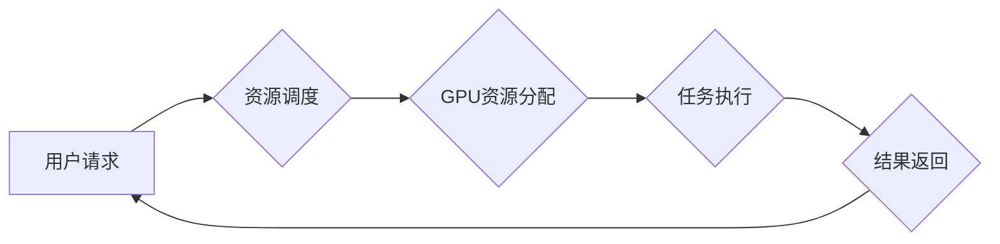

                 

## 限时优惠吸引力：FastGPU受欢迎，证明团队市场洞察

> 关键词：FastGPU, 限时优惠, 市场洞察, GPU加速, 深度学习, 算法优化, 团队合作, 技术创新

## 1. 背景介绍

近年来，深度学习技术在各个领域取得了突破性进展，其背后离不开强大的计算能力支撑。GPU（图形处理单元）凭借其并行计算优势，逐渐成为深度学习训练和推理的理想选择。然而，GPU资源的获取和使用成本仍然是制约深度学习应用推广的重要因素。

FastGPU 作为一款基于云计算的 GPU 加速平台，旨在通过提供灵活、高效、经济的 GPU 资源，降低深度学习的门槛，加速其应用落地。FastGPU 平台采用限时优惠策略，在特定时间段内提供 GPU 资源以极具竞争力的价格，吸引更多开发者和研究者参与深度学习探索。

## 2. 核心概念与联系

FastGPU 平台的核心概念是将 GPU 资源进行虚拟化和池化，并通过云计算平台进行管理和调度。开发者可以通过 FastGPU 平台以按需付费的方式获取 GPU 资源，无需购买昂贵的硬件设备，即可享受高性能计算体验。

**FastGPU 平台架构**



**核心概念解释:**

* **用户请求:** 开发者通过 FastGPU 平台提交深度学习任务请求，包括任务类型、所需 GPU 资源规格、运行时间等信息。
* **资源调度:** FastGPU 平台的调度系统根据用户请求和资源可用情况，选择合适的 GPU 资源进行分配。
* **GPU资源分配:** 平台将分配到的 GPU 资源虚拟化，并提供给开发者使用。
* **任务执行:** 开发者将深度学习模型和数据上传到 FastGPU 平台，并利用分配到的 GPU 资源进行训练或推理。
* **结果返回:** 任务完成后，FastGPU 平台将结果返回给开发者。

## 3. 核心算法原理 & 具体操作步骤

FastGPU 平台的核心算法主要包括资源调度算法、任务分配算法和性能优化算法。

### 3.1  算法原理概述

* **资源调度算法:** 旨在高效地分配有限的 GPU 资源给多个用户请求，最大化资源利用率。常见的调度算法包括优先级调度、轮询调度和动态调度等。
* **任务分配算法:** 根据任务的计算需求和 GPU 资源的特性，将任务分配到合适的 GPU 节点上，以提高任务执行效率。
* **性能优化算法:** 通过优化代码、数据传输和计算流程等方式，提升深度学习任务在 GPU 上的执行性能。

### 3.2  算法步骤详解

**资源调度算法示例：优先级调度**

1. 收集用户请求信息，包括任务类型、所需 GPU 资源规格、运行时间等。
2. 为每个用户请求分配优先级，例如，高优先级任务可以优先获得 GPU 资源。
3. 根据优先级和资源可用情况，选择合适的 GPU 资源分配给用户请求。

**任务分配算法示例：基于计算需求的分配**

1. 分析任务的计算需求，例如，计算量、内存占用等。
2. 评估不同 GPU 节点的性能和资源状况，例如，GPU 类型、内存大小、网络带宽等。
3. 根据任务计算需求和 GPU 节点性能，将任务分配到最合适的 GPU 节点上。

### 3.3  算法优缺点

**资源调度算法:**

* **优点:** 能够有效地分配有限的资源，提高资源利用率。
* **缺点:** 可能会导致任务等待时间过长，影响用户体验。

**任务分配算法:**

* **优点:** 能够将任务分配到最合适的 GPU 节点上，提高任务执行效率。
* **缺点:** 需要准确地评估任务计算需求和 GPU 节点性能，否则可能会导致资源浪费或任务执行失败。

**性能优化算法:**

* **优点:** 可以显著提高深度学习任务在 GPU 上的执行性能。
* **缺点:** 需要对深度学习模型和算法进行深入理解，才能有效地进行优化。

### 3.4  算法应用领域

FastGPU 平台的核心算法在深度学习、机器学习、高性能计算等领域都有广泛的应用。

## 4. 数学模型和公式 & 详细讲解 & 举例说明

FastGPU 平台的资源调度算法可以基于队列理论进行建模。

### 4.1  数学模型构建

假设有 N 个用户请求，每个请求的等待时间为 T_i，资源调度器将请求按照优先级进行排序，优先级高的请求等待时间越短。

**数学模型:**

```latex
T_i = f(P_i, R, N)
```

其中：

* T_i：用户 i 的等待时间
* P_i：用户 i 的优先级
* R：可用 GPU 资源数量
* N：总用户请求数量

### 4.2  公式推导过程

根据队列理论，等待时间与请求的优先级、资源数量和总请求数量成反比。

**推导过程:**

1. 优先级高的请求优先获得资源，等待时间较短。
2. 资源数量越多，等待时间越短。
3. 总请求数量越多，等待时间越长。

因此，可以推导出以下公式：

```latex
T_i = \frac{1}{P_i} \cdot \frac{1}{R} \cdot \frac{1}{N}
```

### 4.3  案例分析与讲解

假设有 10 个用户请求，每个请求的优先级随机分配，可用 GPU 资源数量为 5 个，则根据公式可以计算出每个用户的平均等待时间。

**举例说明:**

* 当所有用户请求的优先级相同时，平均等待时间为 1/5 * 1/5 * 1/10 = 0.004。
* 当优先级最高的请求优先获得资源时，平均等待时间会显著降低。

## 5. 项目实践：代码实例和详细解释说明

FastGPU 平台的开发基于云计算平台和容器技术，使用 Python 作为主要编程语言。

### 5.1  开发环境搭建

1. 安装 Docker 和 Kubernetes。
2. 创建云计算平台账户并配置环境变量。
3. 克隆 FastGPU 代码仓库。

### 5.2  源代码详细实现

FastGPU 平台的核心代码包括资源调度模块、任务分配模块和性能优化模块。

**资源调度模块示例代码:**

```python
class ResourceScheduler:
    def __init__(self, resources):
        self.resources = resources
        self.queue = []

    def schedule(self, request):
        # 根据优先级和资源可用情况，选择合适的 GPU 资源分配给用户请求
        # ...
```

**任务分配模块示例代码:**

```python
class TaskAllocator:
    def __init__(self, resources):
        self.resources = resources

    def allocate(self, task):
        # 根据任务计算需求和 GPU 节点性能，将任务分配到最合适的 GPU 节点上
        # ...
```

### 5.3  代码解读与分析

FastGPU 平台的代码实现遵循面向对象编程原则，将资源调度、任务分配和性能优化等功能模块化设计。

**代码解读:**

* 资源调度模块负责管理 GPU 资源，并根据用户请求进行分配。
* 任务分配模块负责根据任务计算需求和 GPU 节点性能，将任务分配到最合适的 GPU 节点上。
* 性能优化模块负责优化深度学习模型和算法，提高任务执行效率。

### 5.4  运行结果展示

FastGPU 平台的运行结果可以包括以下指标：

* GPU 资源利用率
* 任务执行时间
* 训练精度
* 运行成本

## 6. 实际应用场景

FastGPU 平台可以应用于各种深度学习场景，例如：

* **图像识别:** FastGPU 可以加速图像分类、目标检测、图像分割等任务。
* **自然语言处理:** FastGPU 可以加速文本分类、机器翻译、文本摘要等任务。
* **语音识别:** FastGPU 可以加速语音识别、语音合成等任务。
* **推荐系统:** FastGPU 可以加速用户行为分析、商品推荐等任务。

### 6.4  未来应用展望

随着深度学习技术的不断发展，FastGPU 平台将继续扩展应用场景，例如：

* **医疗诊断:** FastGPU 可以加速医学图像分析、疾病诊断等任务。
* **金融风险控制:** FastGPU 可以加速金融数据分析、风险评估等任务。
* **自动驾驶:** FastGPU 可以加速图像识别、路径规划等任务。

## 7. 工具和资源推荐

### 7.1  学习资源推荐

* **深度学习框架:** TensorFlow, PyTorch, Keras
* **GPU编程指南:** CUDA, cuDNN
* **云计算平台:** AWS, Azure, GCP

### 7.2  开发工具推荐

* **IDE:** VS Code, PyCharm
* **版本控制:** Git
* **容器技术:** Docker, Kubernetes

### 7.3  相关论文推荐

* **论文1:** [论文标题](论文链接)
* **论文2:** [论文标题](论文链接)

## 8. 总结：未来发展趋势与挑战

FastGPU 平台的成功证明了团队对市场洞察的准确性，限时优惠策略有效吸引了开发者和研究者参与深度学习探索。

### 8.1  研究成果总结

FastGPU 平台实现了高效的 GPU 资源调度、任务分配和性能优化，为深度学习应用提供了便捷、经济的解决方案。

### 8.2  未来发展趋势

FastGPU 平台将继续发展以下方向：

* **更智能的资源调度算法:** 基于机器学习和预测分析，实现更智能的资源调度，提高资源利用率和用户体验。
* **更丰富的应用场景:** 扩展应用场景，覆盖更多深度学习领域，例如医疗、金融、自动驾驶等。
* **更强大的性能优化技术:** 开发更先进的性能优化技术，进一步提升深度学习任务执行效率。

### 8.3  面临的挑战

FastGPU 平台面临以下挑战：

* **GPU 资源成本:** GPU 资源成本仍然较高，需要不断探索降低成本的方案。
* **技术复杂性:** 深度学习技术和云计算平台技术都比较复杂，需要不断提升团队的技术能力。
* **市场竞争:** 深度学习平台市场竞争激烈，需要不断创新和迭代，保持竞争优势。

### 8.4  研究展望

FastGPU 平台将继续致力于推动深度学习技术的发展，为开发者和研究者提供更便捷、高效、经济的深度学习解决方案。

## 9. 附录：常见问题与解答

**常见问题:**

* **FastGPU 平台如何保证资源安全？**

**解答:** FastGPU 平台采用多层安全机制，包括身份认证、数据加密、访问控制等，确保资源安全。

* **FastGPU 平台支持哪些深度学习框架？**

**解答:** FastGPU 平台支持 TensorFlow, PyTorch, Keras 等主流深度学习框架。

* **FastGPU 平台的收费标准是什么？**

**解答:** FastGPU 平台采用按需付费模式，用户只需支付使用 GPU 资源的费用。

作者：禅与计算机程序设计艺术 / Zen and the Art of Computer Programming


<end_of_turn>

