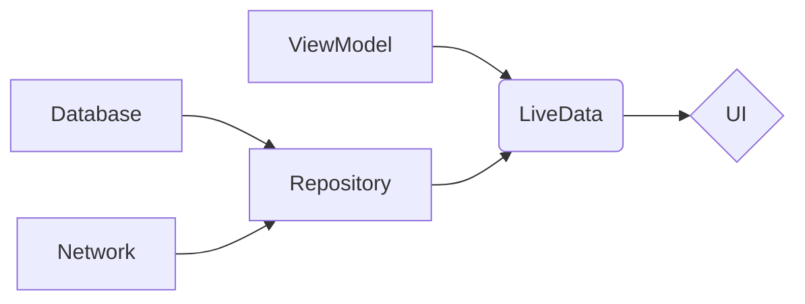

                 

## Android Jetpack 组件：提升 Android 开发效率

> 关键词：Android Jetpack, 组件化开发, Android 开发效率, MVVM, LiveData, ViewModel, Room, Coroutines, Jetpack Compose

### 1. 背景介绍

随着 Android 应用的不断发展，应用规模和复杂度也越来越高。传统的 Android 开发模式面临着代码维护、可测试性、可扩展性等方面的挑战。为了解决这些问题，Google 推出了 Jetpack，这是一个用于 Android 开发的工具包，旨在提供一系列模块化、可复用的组件，帮助开发者更高效地构建高质量的 Android 应用。

Jetpack 组件化开发模式的核心思想是将应用拆分成多个独立的模块，每个模块负责特定的功能，并通过接口进行通信。这种方式可以提高代码的可维护性、可测试性和可扩展性。

### 2. 核心概念与联系

Jetpack 组件主要包括以下几个核心部分：

* **Architecture Components:**  提供了一套用于构建应用架构的组件，包括 ViewModel、 LiveData、Room 等。
* **UI Toolkit:** 提供了用于构建用户界面的工具，包括 Jetpack Compose 等。
* **Networking:** 提供了用于网络请求的工具，包括 Retrofit 等。
* **Data Storage:** 提供了用于数据存储的工具，包括 Room 等。
* **Testing:** 提供了用于测试的工具，包括 Espresso 等。

这些组件之间相互关联，共同构成了一个完整的 Android 开发生态系统。

#### 2.1 Jetpack 组件架构



### 3. 核心算法原理 & 具体操作步骤

#### 3.1 算法原理概述

Jetpack 组件的核心算法原理主要围绕着数据绑定、生命周期管理和异步操作三个方面。

* **数据绑定:** ViewModel 和 LiveData 的结合实现了数据绑定的功能，当 ViewModel 中的数据发生变化时， LiveData 会自动通知 UI 更新，从而实现数据同步。
* **生命周期管理:** ViewModel 的生命周期与 Activity 或 Fragment 的生命周期不同，它在 Activity 或 Fragment 被销毁后仍然存在，可以保存应用状态，避免数据丢失。
* **异步操作:** Coroutines 提供了一种轻量级的异步编程方式，可以简化异步操作的编写，提高代码的读写性。

#### 3.2 算法步骤详解

1. **创建 ViewModel:** 在 Activity 或 Fragment 中创建 ViewModel 实例，并传入必要的参数。
2. **获取 LiveData:** 从 ViewModel 中获取 LiveData 对象，该对象持有需要被 UI 绑定的数据。
3. **绑定 LiveData:** 在 UI 中使用 LiveData 的观察者模式，监听 LiveData 的数据变化。
4. **处理数据变化:** 当 LiveData 的数据发生变化时，观察者会收到通知，并更新 UI。
5. **处理异步操作:** 使用 Coroutines 进行异步操作，例如网络请求或数据库操作。

#### 3.3 算法优缺点

**优点:**

* **提高代码可维护性:** 组件化开发模式可以将代码拆分成多个独立的模块，提高代码的可读性和可维护性。
* **提高代码可测试性:** 每个模块可以独立测试，提高代码的测试覆盖率。
* **提高代码可扩展性:** 组件化开发模式可以方便地添加新的功能模块，提高代码的可扩展性。

**缺点:**

* **学习成本:** Jetpack 组件的学习成本相对较高，需要开发者掌握新的概念和技术。
* **开发复杂度:** 组件化开发模式的开发复杂度相对较高，需要开发者进行更细致的模块设计和接口定义。

#### 3.4 算法应用领域

Jetpack 组件可以应用于各种 Android 应用场景，例如：

* **电商应用:** 可以使用 Jetpack 组件构建商品列表、购物车、订单管理等模块。
* **社交应用:** 可以使用 Jetpack 组件构建用户资料、消息列表、朋友圈等模块。
* **新闻应用:** 可以使用 Jetpack 组件构建新闻列表、新闻详情、评论等模块。

### 4. 数学模型和公式 & 详细讲解 & 举例说明

#### 4.1 数学模型构建

Jetpack 组件的数学模型主要围绕着数据流和状态管理。

* **数据流:** 数据流模型描述了数据在应用中的流动路径，例如从网络请求到 ViewModel 到 UI 的数据流。
* **状态管理:** 状态管理模型描述了应用状态的变更和更新机制，例如 LiveData 的观察者模式和 ViewModel 的生命周期管理。

#### 4.2 公式推导过程

由于 Jetpack 组件的数学模型主要基于数据流和状态管理的概念，其公式推导过程较为复杂，涉及到数据结构、算法和并发编程等多个方面。

#### 4.3 案例分析与讲解

以 LiveData 的观察者模式为例，我们可以分析其数学模型和公式推导过程。

* **数据流:** 当 ViewModel 中的 LiveData 对象发生变化时，其数据流会传递给所有观察者。
* **状态管理:** LiveData 的观察者模式实现了状态管理的功能，当 LiveData 的数据发生变化时，观察者会收到通知，并更新其状态。

### 5. 项目实践：代码实例和详细解释说明

#### 5.1 开发环境搭建

1. 安装 Android Studio IDE。
2. 配置 Android SDK 和相关工具。
3. 创建新的 Android 项目。

#### 5.2 源代码详细实现

```kotlin
// ViewModel
class MyViewModel : ViewModel() {
    private val _data = MutableLiveData<String>()
    val data: LiveData<String> = _data

    fun fetchData() {
        // 从网络或数据库获取数据
        _data.value = "Hello, Jetpack!"
    }
}

// Activity
class MainActivity : AppCompatActivity() {
    private lateinit var viewModel: MyViewModel

    override fun onCreate(savedInstanceState: Bundle?) {
        super.onCreate(savedInstanceState)
        setContentView(R.layout.activity_main)

        viewModel = ViewModelProvider(this).get(MyViewModel::class.java)

        // 绑定 LiveData
        viewModel.data.observe(this) {
            // 更新 UI
            textView.text = it
        }

        // 获取数据
        viewModel.fetchData()
    }
}
```

#### 5.3 代码解读与分析

* **ViewModel:** `MyViewModel` 类继承自 `ViewModel`，负责管理应用状态和数据。
* **LiveData:** `_data` 是一个 `MutableLiveData` 对象，用于持有需要被 UI 绑定的数据。`data` 是一个 `LiveData` 对象，提供了一个安全的观察者模式，用于通知 UI 更新。
* **Activity:** `MainActivity` 类继承自 `AppCompatActivity`，负责 UI 的展示和交互。
* **数据绑定:** `viewModel.data.observe(this)` 将 `data` LiveData 对象与 `MainActivity` 绑定，当 `data` 的值发生变化时，观察者 (MainActivity) 会收到通知，并更新 UI。

#### 5.4 运行结果展示

当运行该代码时，`textView` 会显示 "Hello, Jetpack!"。

### 6. 实际应用场景

Jetpack 组件在 Android 开发中有着广泛的应用场景，例如：

* **电商应用:** 可以使用 Jetpack 组件构建商品列表、购物车、订单管理等模块，提高应用的性能和稳定性。
* **社交应用:** 可以使用 Jetpack 组件构建用户资料、消息列表、朋友圈等模块，实现更流畅的用户体验。
* **新闻应用:** 可以使用 Jetpack 组件构建新闻列表、新闻详情、评论等模块，提高应用的效率和可维护性。

#### 6.4 未来应用展望

随着 Android 平台的不断发展，Jetpack 组件的应用场景将会更加广泛。例如：

* **更强大的 UI 工具:** Jetpack Compose 将会提供更强大的 UI 开发工具，帮助开发者构建更复杂的和更美观的 UI。
* **更智能的数据管理:** Jetpack 组件将会提供更智能的数据管理工具，例如自动数据同步和数据备份。
* **更安全的应用开发:** Jetpack 组件将会提供更安全的应用开发工具，例如数据加密和身份验证。

### 7. 工具和资源推荐

#### 7.1 学习资源推荐

* **官方文档:** https://developer.android.com/jetpack
* **博客文章:** https://medium.com/androiddevelopers
* **视频教程:** https://www.youtube.com/c/AndroidDevelopers

#### 7.2 开发工具推荐

* **Android Studio:** https://developer.android.com/studio
* **Kotlin:** https://kotlinlang.org/

#### 7.3 相关论文推荐

* **Jetpack Compose: A Declarative UI Toolkit for Android**
* **Android Architecture Components: A Guide to Building Robust and Maintainable Apps**

### 8. 总结：未来发展趋势与挑战

#### 8.1 研究成果总结

Jetpack 组件为 Android 开发者提供了强大的工具和框架，帮助他们构建更高效、更高质量的应用。

#### 8.2 未来发展趋势

Jetpack 组件将会继续发展，提供更强大的功能和更完善的生态系统。

#### 8.3 面临的挑战

Jetpack 组件的学习成本较高，需要开发者投入更多的时间和精力学习。

#### 8.4 研究展望

未来研究方向包括：

* **更智能的数据管理:** 开发更智能的数据管理工具，例如自动数据同步和数据备份。
* **更安全的应用开发:** 开发更安全的应用开发工具，例如数据加密和身份验证。
* **更强大的 UI 工具:** 开发更强大的 UI 开发工具，帮助开发者构建更复杂的和更美观的 UI。

### 9. 附录：常见问题与解答

#### 9.1 什么是 Jetpack Compose?

Jetpack Compose 是一个用于构建 Android UI 的声明式 UI 工具包，它允许开发者使用 Kotlin 语言描述 UI 的结构和行为，从而简化 UI 开发过程。

#### 9.2 Jetpack 组件有哪些优势?

Jetpack 组件的主要优势包括：

* **提高代码可维护性:** 组件化开发模式可以将代码拆分成多个独立的模块，提高代码的可读性和可维护性。
* **提高代码可测试性:** 每个模块可以独立测试，提高代码的测试覆盖率。
* **提高代码可扩展性:** 组件化开发模式可以方便地添加新的功能模块，提高代码的可扩展性。

#### 9.3 如何学习 Jetpack 组件?

可以参考官方文档、博客文章和视频教程等学习资源。

作者：禅与计算机程序设计艺术 / Zen and the Art of Computer Programming


<end_of_turn>

