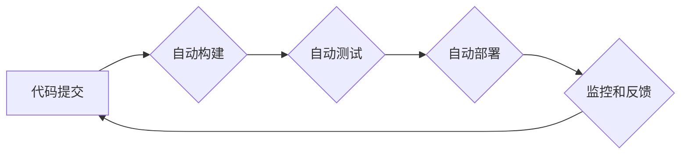

                 

## DevOps实践：自动化部署和持续集成

> 关键词：DevOps, 自动化部署, 持续集成, 持续交付, 敏捷开发, 容器化, 云计算

### 1. 背景介绍

在当今快速迭代的软件开发环境中，传统的软件开发模式已经难以满足市场对快速交付和高质量软件的需求。DevOps 作为一种新的软件开发理念和实践，应运而生。它强调了开发 (Development) 和运维 (Operations) 团队之间的紧密合作，通过自动化、持续集成和持续交付等实践，实现快速、可靠、高效的软件交付。

DevOps 的核心目标是缩短软件开发周期，提高软件质量，并增强开发团队和运维团队之间的协作。它通过打破传统开发和运维之间的壁垒，实现流程的自动化和持续改进，从而帮助企业更快地响应市场变化，提供更优质的软件产品和服务。

### 2. 核心概念与联系

DevOps 的核心概念包括：

* **持续集成 (Continuous Integration):** 开发人员频繁地将代码提交到共享代码库中，并自动构建和测试代码，确保代码质量和稳定性。
* **持续交付 (Continuous Delivery):** 将经过测试的代码自动部署到测试环境和生产环境，实现快速、可靠的软件交付。
* **自动化部署:** 使用自动化工具和脚本，将软件部署到不同的环境，减少人为操作，提高部署效率和可靠性。
* **监控和反馈:** 实时监控软件运行状态，收集用户反馈，并根据反馈进行改进和优化。

DevOps 的核心概念之间相互关联，形成一个闭环的流程：



### 3. 核心算法原理 & 具体操作步骤

DevOps 的核心算法原理是基于自动化和持续改进的理念，通过一系列的工具和流程，实现软件开发和运维的自动化和协作。

#### 3.1 算法原理概述

DevOps 的核心算法原理包括：

* **版本控制:** 使用 Git 等版本控制系统，管理代码的版本和历史记录，确保代码的完整性和可追溯性。
* **持续集成工具:** 使用 Jenkins、Travis CI 等持续集成工具，自动构建、测试和部署代码，实现代码的快速迭代和质量保证。
* **自动化部署工具:** 使用 Ansible、Puppet、Chef 等自动化部署工具，自动配置和部署软件，提高部署效率和可靠性。
* **监控和日志分析工具:** 使用 Prometheus、Grafana、ELK 等监控和日志分析工具，实时监控软件运行状态，收集用户反馈，并进行故障诊断和性能优化。

#### 3.2 算法步骤详解

DevOps 的核心算法步骤包括：

1. **代码提交:** 开发人员将代码提交到共享代码库中。
2. **自动构建:** 持续集成工具自动构建代码，生成可执行文件或软件包。
3. **自动测试:** 自动测试工具自动执行单元测试、集成测试和系统测试，确保代码质量和稳定性。
4. **自动部署:** 自动部署工具自动将经过测试的代码部署到测试环境和生产环境。
5. **监控和反馈:** 监控工具实时监控软件运行状态，收集用户反馈，并进行故障诊断和性能优化。

#### 3.3 算法优缺点

DevOps 的核心算法的优点包括：

* **提高软件开发效率:** 自动化流程可以减少人为操作，提高软件开发效率。
* **提高软件质量:** 自动测试可以确保代码质量和稳定性。
* **缩短软件交付周期:** 持续集成和持续交付可以缩短软件交付周期。
* **增强开发团队和运维团队之间的协作:** DevOps 的理念强调团队合作，可以增强开发团队和运维团队之间的协作。

DevOps 的核心算法的缺点包括：

* **需要投入时间和资源:** 建立 DevOps 流程需要投入时间和资源进行工具配置和流程优化。
* **需要团队文化转变:** DevOps 需要团队成员之间进行文化转变，打破传统开发和运维之间的壁垒。
* **需要技术人员具备一定的技能:** DevOps 需要技术人员具备一定的自动化、容器化和云计算等技能。

#### 3.4 算法应用领域

DevOps 的核心算法应用于各种软件开发领域，例如：

* **Web 应用开发:** DevOps 可以帮助企业快速开发和部署 Web 应用，提高用户体验。
* **移动应用开发:** DevOps 可以帮助企业快速开发和部署移动应用，满足用户对快速迭代的需求。
* **云计算应用开发:** DevOps 可以帮助企业快速开发和部署云计算应用，提高资源利用率和弹性。

### 4. 数学模型和公式 & 详细讲解 & 举例说明

DevOps 的核心算法可以抽象为数学模型，例如：

#### 4.1 数学模型构建

假设软件开发周期为 T，代码提交频率为 F，自动化测试覆盖率为 C，部署成功率为 S。则软件交付效率可以表示为：

```latex
效率 = S * C * F / T
```

#### 4.2 公式推导过程

该公式的推导过程如下：

* 每个代码提交都会经过自动化测试，测试覆盖率 C 表示测试覆盖的代码比例。
* 自动化测试通过率决定了代码部署的成功率 S。
* 代码提交频率 F 决定了软件迭代的速度。
* 软件开发周期 T 决定了软件交付的时间。

因此，软件交付效率可以看作是代码提交频率、自动化测试覆盖率、部署成功率和软件开发周期之间的乘积。

#### 4.3 案例分析与讲解

假设一个软件开发团队，代码提交频率为每天 10 次，自动化测试覆盖率为 90%，部署成功率为 95%，软件开发周期为 2 周。

则该团队的软件交付效率为：

```latex
效率 = 0.95 * 0.9 * 10 / 14 = 0.607
```

该团队的软件交付效率为 0.607，表示该团队每周可以交付 0.607 个软件版本。

### 5. 项目实践：代码实例和详细解释说明

#### 5.1 开发环境搭建

DevOps 项目实践需要搭建相应的开发环境，包括：

* **版本控制系统:** 使用 Git 作为版本控制系统，管理代码的版本和历史记录。
* **持续集成工具:** 使用 Jenkins 作为持续集成工具，自动构建、测试和部署代码。
* **自动化部署工具:** 使用 Ansible 作为自动化部署工具，自动配置和部署软件。
* **监控和日志分析工具:** 使用 Prometheus 和 Grafana 作为监控和日志分析工具，实时监控软件运行状态。

#### 5.2 源代码详细实现

以下是一个简单的代码实例，演示了如何使用 Jenkins 进行持续集成和部署：

```
# Jenkinsfile

pipeline {
    agent any

    stages {
        stage('Build') {
            steps {
                sh 'mvn clean package'
            }
        }
        stage('Test') {
            steps {
                sh 'mvn test'
            }
        }
        stage('Deploy') {
            steps {
                sh 'ansible-playbook deploy.yml'
            }
        }
    }
}
```

该代码定义了一个 Jenkins Pipeline，包含三个阶段：构建、测试和部署。

* 构建阶段使用 Maven 命令构建代码。
* 测试阶段使用 Maven 命令执行单元测试。
* 部署阶段使用 Ansible Playbook 自动部署软件。

#### 5.3 代码解读与分析

该代码实例演示了如何使用 Jenkins 进行持续集成和部署。

* Pipeline 定义了流水线，agent 指定了流水线运行的节点。
* Stages 定义了流水线的各个阶段，每个阶段包含一系列的步骤。
* Steps 定义了每个阶段执行的命令。

#### 5.4 运行结果展示

当代码提交到代码库后，Jenkins 会自动触发流水线运行，执行构建、测试和部署的步骤。

如果所有步骤都成功执行，则软件会被自动部署到目标环境。

### 6. 实际应用场景

DevOps 的实践应用场景广泛，例如：

#### 6.1 互联网公司

互联网公司需要快速迭代和交付软件，以满足用户不断变化的需求。DevOps 可以帮助互联网公司提高软件开发效率，缩短软件交付周期，并提供更优质的用户体验。

#### 6.2 金融机构

金融机构需要确保软件的安全性、可靠性和合规性。DevOps 可以帮助金融机构提高软件质量，降低风险，并满足监管要求。

#### 6.3 制造业

制造业需要提高生产效率和降低成本。DevOps 可以帮助制造业实现自动化生产，提高生产效率，并降低运营成本。

#### 6.4 未来应用展望

DevOps 的应用场景将不断扩展，例如：

* **人工智能和机器学习:** DevOps 可以帮助企业更快地开发和部署人工智能和机器学习模型。
* **物联网:** DevOps 可以帮助企业管理和部署物联网设备，提高设备的可靠性和安全性。
* **区块链:** DevOps 可以帮助企业开发和部署区块链应用，提高应用的安全性、透明性和可追溯性。

### 7. 工具和资源推荐

#### 7.1 学习资源推荐

* **书籍:**
    * "The Phoenix Project: A Novel About IT, DevOps, and Helping Your Business Win" by Gene Kim, Kevin Behr, and George Spafford
    * "DevOps Handbook: How to Create World-Class Agility, Reliability, and Security in Technology Organizations" by Gene Kim, Jez Humble, Patrick Debois, and John Willis
* **网站:**
    * https://www.devops.com/
    * https://www.atlassian.com/devops
    * https://www.redhat.com/en/topics/devops

#### 7.2 开发工具推荐

* **版本控制系统:** Git
* **持续集成工具:** Jenkins, Travis CI, CircleCI
* **自动化部署工具:** Ansible, Puppet, Chef
* **容器化平台:** Docker, Kubernetes
* **云计算平台:** AWS, Azure, GCP

#### 7.3 相关论文推荐

* "The DevOps Handbook: How to Create World-Class Agility, Reliability, and Security in Technology Organizations" by Gene Kim, Jez Humble, Patrick Debois, and John Willis
* "Accelerate: The Science of Lean Software and DevOps: Building and Scaling High Performing Technology Organizations" by Nicole Forsgren, Jez Humble, and Gene Kim

### 8. 总结：未来发展趋势与挑战

#### 8.1 研究成果总结

DevOps 的实践已经取得了显著的成果，例如：

* **提高软件开发效率:** DevOps 可以帮助企业缩短软件交付周期，提高软件开发效率。
* **提高软件质量:** DevOps 可以帮助企业提高软件质量，降低软件缺陷率。
* **增强开发团队和运维团队之间的协作:** DevOps 可以帮助企业打破开发和运维之间的壁垒，增强团队协作。

#### 8.2 未来发展趋势

DevOps 的未来发展趋势包括：

* **人工智能和机器学习:** DevOps 将与人工智能和机器学习技术融合，实现更智能的自动化和持续改进。
* **云原生开发:** DevOps 将更加注重云原生开发，利用云计算平台的弹性和可扩展性，实现更快速和灵活的软件交付。
* **安全DevOps:** DevOps 将更加注重软件安全的集成，实现从开发到部署的全生命周期安全保障。

#### 8.3 面临的挑战

DevOps 的实践也面临一些挑战，例如：

* **文化转变:** DevOps 需要企业进行文化转变，打破传统开发和运维之间的壁垒。
* **技能缺口:** DevOps 需要技术人员具备一定的自动化、容器化和云计算等技能，而这些技能的缺口仍然存在。
* **工具集成:** DevOps 需要集成多种工具，实现协同工作，而工具集成的难度仍然存在。

#### 8.4 研究展望

未来，DevOps 研究将继续深入，探索更智能、更安全、更有效的软件开发和运维实践。

### 9. 附录：常见问题与解答

#### 9.1 什么是DevOps？

DevOps 是一种软件开发理念和实践，强调开发 (Development) 和运维 (Operations) 团队之间的紧密合作，通过自动化、持续集成和持续交付等实践，实现快速、可靠、高效的软件交付。

#### 9.2 DevOps 的优势是什么？

DevOps 的优势包括：

* 提高软件开发效率
* 提高软件质量
* 缩短软件交付周期
* 增强开发团队和运维团队之间的协作

#### 9.3 如何实施DevOps？

实施 DevOps 需要以下步骤：

* 建立 DevOps 文化
* 选择合适的工具和技术
* 建立自动化流程
* 持续改进和优化

#### 9.4 DevOps 的挑战是什么？

DevOps 的挑战包括：

* 文化转变
* 技能缺口
* 工具集成


作者：禅与计算机程序设计艺术 / Zen and the Art of Computer Programming 
<end_of_turn>

