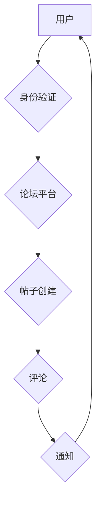

                 

## 创建开源项目的在线论坛：社区参与和盈利模式

> 关键词：开源项目、在线论坛、社区参与、盈利模式、软件开发、技术社区、协作平台、贡献机制、商业化策略

## 1. 背景介绍

开源软件已经成为现代软件开发的基石，其灵活、可定制和透明的特性吸引了无数开发者和用户。然而，开源项目的成功不仅取决于高质量的代码，更依赖于活跃的社区参与和可持续的盈利模式。在线论坛作为开源项目的核心交流平台，扮演着至关重要的角色。它不仅为开发者提供了一个分享知识、解决问题和协作开发的场所，也为项目方提供了与社区互动、收集反馈和推广项目的绝佳机会。

随着开源软件生态的蓬勃发展，越来越多的项目方开始重视在线论坛的建设和运营。然而，如何构建一个高效、活跃、且能够实现可持续发展的开源项目在线论坛仍然是一个挑战。本文将深入探讨开源项目在线论坛的建设、运营和盈利模式，为项目方提供一些有价值的参考和建议。

## 2. 核心概念与联系

### 2.1  开源项目在线论坛的核心概念

开源项目在线论坛是一个专门为开源项目服务的在线平台，其核心功能包括：

* **社区建设:** 提供一个平台，让开发者、用户和贡献者可以互相交流、分享经验和协作开发。
* **知识共享:** 存储和分享项目相关文档、代码示例、教程和最佳实践，方便开发者学习和使用。
* **问题解决:** 提供一个问答平台，让开发者可以提出问题并获得其他开发者的帮助。
* **项目管理:** 支持项目管理功能，例如任务跟踪、代码审查和版本控制。
* **贡献管理:** 提供机制，方便开发者提交代码、文档和 bug 报告，并跟踪贡献进度。

### 2.2  开源项目在线论坛的架构

开源项目在线论坛的架构通常包括以下几个关键组件：

* **论坛平台:** 提供论坛功能的基础软件，例如 Discourse、Flarum、NodeBB 等。
* **身份验证系统:** 管理用户身份和权限，例如 OAuth、LDAP 等。
* **数据库:** 存储论坛数据，例如用户信息、帖子内容、评论等。
* **搜索引擎:** 帮助用户快速查找相关信息。
* **通知系统:** 通知用户新消息、回复和活动。

**Mermaid 流程图:**



## 3. 核心算法原理 & 具体操作步骤

### 3.1  算法原理概述

开源项目在线论坛的核心算法主要围绕用户行为分析、内容推荐和社区活跃度提升展开。

* **用户行为分析:** 通过分析用户访问记录、帖子参与度、评论行为等数据，了解用户兴趣、偏好和参与模式，为个性化内容推荐和社区运营提供依据。
* **内容推荐:** 基于用户行为分析和内容相似度算法，推荐用户可能感兴趣的帖子、话题和开发者。
* **社区活跃度提升:** 通过设计激励机制、组织活动、引导讨论等方式，鼓励用户积极参与社区，提升社区活跃度和粘性。

### 3.2  算法步骤详解

* **用户行为分析:**
    1. 收集用户行为数据，例如访问记录、帖子浏览、评论点赞、关注等。
    2. 使用数据挖掘和机器学习算法，分析用户行为模式，识别用户兴趣和偏好。
    3. 建立用户画像，描述用户的基本信息、行为特征和兴趣爱好。

* **内容推荐:**
    1. 基于用户画像，推荐与用户兴趣相关的帖子、话题和开发者。
    2. 使用协同过滤算法，推荐与用户行为相似用户的帖子和话题。
    3. 使用内容相似度算法，推荐与用户浏览过的帖子内容相似的帖子。

* **社区活跃度提升:**
    1. 设计激励机制，例如积分、勋章、排名等，鼓励用户积极参与社区。
    2. 组织线上线下活动，例如技术分享会、代码竞赛、线下聚会等，增强用户互动和粘性。
    3. 引导讨论，例如设置话题标签、发起讨论主题、邀请专家参与等，促进用户交流和知识分享。

### 3.3  算法优缺点

* **优点:**
    * 可以个性化推荐内容，提升用户体验。
    * 可以提高社区活跃度，促进用户参与和互动。
    * 可以帮助项目方了解用户需求，改进项目开发方向。

* **缺点:**
    * 需要大量数据支持，才能训练出准确的算法模型。
    * 算法模型需要不断更新和优化，才能适应用户行为变化。
    * 过度依赖算法推荐，可能会导致用户缺乏探索性和自主性。

### 3.4  算法应用领域

* **开源项目社区:** 推荐相关帖子、话题和开发者，提升社区活跃度和用户体验。
* **在线学习平台:** 推荐学习资源和课程，帮助用户找到感兴趣的内容。
* **电商平台:** 推荐商品和服务，提高用户购买意愿。
* **社交媒体平台:** 推荐好友和内容，增强用户互动和粘性。

## 4. 数学模型和公式 & 详细讲解 & 举例说明

### 4.1  数学模型构建

开源项目在线论坛的社区活跃度可以采用以下数学模型进行衡量：

**活跃度指数 = (帖子数量 + 评论数量 + 用户参与度) / 总用户数**

其中：

* 帖子数量：论坛内所有帖子总数。
* 评论数量：所有帖子总评论数。
* 用户参与度：用户在论坛内进行的各种活动，例如点赞、关注、回复等，可以赋予不同的权重。
* 总用户数：论坛内所有注册用户的数量。

### 4.2  公式推导过程

该公式的推导过程基于以下假设：

* 帖子数量和评论数量反映了社区的讨论活跃度。
* 用户参与度反映了用户对社区的兴趣和投入程度。
* 总用户数反映了社区的规模和潜在活跃度。

通过将以上因素进行加权平均，可以得到一个综合的社区活跃度指数。

### 4.3  案例分析与讲解

假设一个开源项目在线论坛有以下数据：

* 帖子数量：1000
* 评论数量：5000
* 用户参与度：每个用户平均参与 5 次活动
* 总用户数：1000

则该论坛的活跃度指数为：

**活跃度指数 = (1000 + 5000 + 5000) / 1000 = 11**

该指数表明该论坛的活跃度较高。

## 5. 项目实践：代码实例和详细解释说明

### 5.1  开发环境搭建

* **操作系统:** Linux、macOS 或 Windows
* **编程语言:** Python、Node.js 或 PHP
* **数据库:** MySQL、PostgreSQL 或 MongoDB
* **论坛平台:** Discourse、Flarum 或 NodeBB

### 5.2  源代码详细实现

由于篇幅限制，这里只提供一个简单的代码示例，展示如何使用 Python 和 Flask 框架构建一个简单的论坛功能：

```python
from flask import Flask, render_template

app = Flask(__name__)

@app.route('/')
def index():
    return render_template('index.html')

if __name__ == '__main__':
    app.run(debug=True)
```

**代码解读与分析:**

* 该代码使用 Flask 框架构建了一个简单的 Web 应用程序。
* `@app.route('/')` 装饰器定义了根路径的路由，当访问根路径时，会调用 `index()` 函数。
* `index()` 函数渲染 `index.html` 模板文件。

### 5.3  代码解读与分析

* 该代码示例只是一个简单的入门级代码，实际的论坛功能需要实现更多的功能，例如用户注册、登录、帖子创建、评论、点赞等。
* 需要使用数据库来存储论坛数据，例如用户信息、帖子内容、评论等。
* 需要使用模板引擎来渲染 HTML 页面，例如 Jinja2。

### 5.4  运行结果展示

运行该代码后，访问 `http://127.0.0.1:5000/`，可以访问一个简单的 Web 页面。

## 6. 实际应用场景

开源项目在线论坛在软件开发、技术社区、教育培训等领域都有广泛的应用场景。

* **软件开发:** 
    * 提供一个平台，让开发者可以分享代码、讨论问题和协作开发。
    * 帮助项目方收集用户反馈，改进项目开发方向。
    * 促进开源软件的传播和发展。
* **技术社区:** 
    * 建立一个技术交流平台，让开发者可以分享经验、学习新知识和结识新朋友。
    * 组织技术活动，例如技术分享会、代码竞赛、线下聚会等。
    * 促进技术社区的活跃和发展。
* **教育培训:** 
    * 提供一个学习平台，让学生可以学习编程知识、参与项目实践和获得经验。
    * 帮助教师收集学生反馈，改进教学内容和方法。
    * 促进教育资源的共享和传播。

### 6.4  未来应用展望

随着互联网技术的不断发展，开源项目在线论坛的应用场景将会更加广泛。例如：

* **人工智能:** 利用人工智能技术，实现更智能的社区管理、内容推荐和用户服务。
* **虚拟现实:** 利用虚拟现实技术，构建沉浸式的社区体验，让开发者可以更直观地交流和协作。
* **区块链:** 利用区块链技术，实现社区治理的民主化和透明化，保障用户权益。

## 7. 工具和资源推荐

### 7.1  学习资源推荐

* **书籍:**
    * 《The Pragmatic Programmer》
    * 《Clean Code》
    * 《Design Patterns: Elements of Reusable Object-Oriented Software》
* **在线课程:**
    * Coursera
    * edX
    * Udemy

### 7.2  开发工具推荐

* **论坛平台:**
    * Discourse
    * Flarum
    * NodeBB
* **数据库:**
    * MySQL
    * PostgreSQL
    * MongoDB
* **编程语言:**
    * Python
    * Node.js
    * PHP

### 7.3  相关论文推荐

* **社区参与:**
    * "The Social Life of Software: A Study of Open Source Software Development"
    * "Community and Collaboration in Open Source Software Development"
* **盈利模式:**
    * "Sustainable Business Models for Open Source Software"
    * "Open Source Business Models: A Review"

## 8. 总结：未来发展趋势与挑战

### 8.1  研究成果总结

开源项目在线论坛的发展已经取得了显著的成果，为开源软件的传播和发展做出了重要贡献。

* **社区建设:** 在线论坛为开源项目提供了高效的社区建设平台，促进了开发者之间的交流和协作。
* **知识共享:** 在线论坛为开源项目提供了知识共享的平台，方便开发者学习和使用。
* **项目管理:** 在线论坛为开源项目提供了项目管理的功能，方便项目方管理项目进度和资源。

### 8.2  未来发展趋势

开源项目在线论坛的未来发展趋势主要体现在以下几个方面：

* **人工智能:** 利用人工智能技术，实现更智能的社区管理、内容推荐和用户服务。
* **虚拟现实:** 利用虚拟现实技术，构建沉浸式的社区体验，让开发者可以更直观地交流和协作。
* **区块链:** 利用区块链技术，实现社区治理的民主化和透明化，保障用户权益。

### 8.3  面临的挑战

开源项目在线论坛也面临着一些挑战：

* **社区活跃度:** 如何保持社区的活跃度和活力是一个持续的挑战。
* **内容质量:** 如何保证论坛内容的质量和可靠性是一个重要的问题。
* **盈利模式:** 如何实现开源项目在线论坛的可持续盈利是一个难题。

### 8.4  研究展望

未来，需要进一步研究开源项目在线论坛的社区治理机制、内容推荐算法和盈利模式，以更好地服务开源软件的开发和传播。


## 9. 附录：常见问题与解答

* **如何选择合适的论坛平台？**

选择论坛平台需要根据项目的具体需求和规模进行考虑。一些流行的论坛平台包括 Discourse、Flarum 和 NodeBB，它们各有优缺点，需要根据实际情况进行选择。

* **如何提高论坛的活跃度？**

提高论坛的活跃度需要采取多种措施，例如设计激励机制、组织活动、引导讨论等。

* **如何实现论坛的盈利模式？**

开源项目在线论坛的盈利模式可以包括赞助、会员制度、广告收入等。


作者：禅与计算机程序设计艺术 / Zen and the Art of Computer Programming 
<end_of_turn>

