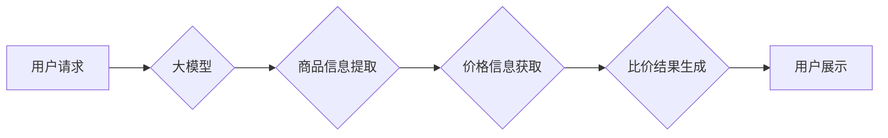

                 

## 大模型在电商平台商品比价中的应用

> 关键词：大模型、商品比价、电商平台、自然语言处理、推荐系统、深度学习、Transformer

## 1. 背景介绍

在当今数字经济时代，电商平台已经成为人们购物的首选方式。消费者在选择商品时，往往需要比较不同平台、不同商家的价格和优惠信息，以获得最优的购买体验。传统的商品比价系统主要依赖于规则引擎和爬虫技术，存在效率低、数据更新慢、难以处理复杂场景等问题。

近年来，大模型技术蓬勃发展，其强大的语义理解和文本生成能力为电商平台商品比价带来了新的机遇。大模型能够自动学习商品信息、价格趋势和用户偏好，实现更智能、更精准的商品比价服务。

## 2. 核心概念与联系

### 2.1 大模型

大模型是指参数量在数十亿甚至千亿级别的神经网络模型，通过海量数据训练，具备强大的泛化能力和语义理解能力。常见的代表性大模型包括GPT-3、BERT、LaMDA等。

### 2.2 商品比价

商品比价是指在不同平台、不同商家之间比较商品的价格和优惠信息，以帮助消费者找到最优惠的购买方案。

### 2.3 核心架构

大模型在电商平台商品比价中的应用，通常采用以下核心架构：



**核心流程：**

1. 用户提出商品比价请求。
2. 大模型接收请求，并利用其强大的语义理解能力提取用户意图，例如商品名称、品牌、规格等。
3. 系统根据提取的商品信息，从多个电商平台获取商品价格和优惠信息。
4. 大模型对获取的价格信息进行分析和比价，生成最优的比价结果。
5. 系统将比价结果展示给用户。

## 3. 核心算法原理 & 具体操作步骤

### 3.1 算法原理概述

大模型在商品比价中的应用主要依赖于以下核心算法：

* **自然语言处理 (NLP)：** 用于理解用户请求中的商品信息，例如商品名称、品牌、规格等。
* **信息检索 (IR)：** 用于从海量商品数据中快速检索出与用户请求相关的商品信息。
* **机器学习 (ML)：** 用于学习商品价格趋势、用户偏好等信息，并进行价格预测和推荐。

### 3.2 算法步骤详解

1. **数据预处理：** 收集电商平台商品数据，进行清洗、格式化和标注等预处理工作。
2. **模型训练：** 利用大模型框架，训练 NLP、IR 和 ML 模型，使其能够准确理解用户请求、检索商品信息和预测价格趋势。
3. **商品信息提取：** 用户提出商品比价请求，大模型利用 NLP 模型提取用户意图，例如商品名称、品牌、规格等。
4. **价格信息获取：** 系统根据提取的商品信息，从多个电商平台获取商品价格和优惠信息。
5. **比价结果生成：** 大模型利用 ML 模型分析价格信息，并根据用户偏好和价格趋势生成最优的比价结果。
6. **用户展示：** 系统将比价结果展示给用户，并提供购买链接和相关信息。

### 3.3 算法优缺点

**优点：**

* **智能化：** 大模型能够自动学习商品信息、价格趋势和用户偏好，实现更智能的商品比价服务。
* **精准度高：** 大模型能够处理海量数据，并利用机器学习算法进行价格预测，提高比价结果的精准度。
* **效率提升：** 大模型能够自动完成商品信息提取、价格信息获取和比价结果生成等任务，提高商品比价的效率。

**缺点：**

* **数据依赖：** 大模型的性能依赖于训练数据的质量和数量，如果训练数据不足或质量较差，则会影响模型的性能。
* **计算资源消耗：** 大模型训练和推理需要大量的计算资源，这对于中小企业来说可能是一个挑战。
* **解释性差：** 大模型的决策过程较为复杂，难以解释其背后的逻辑，这可能会导致用户对比价结果的信任度降低。

### 3.4 算法应用领域

大模型在商品比价领域的应用不仅限于电商平台，还可以应用于以下领域：

* **金融领域：** 用于比较不同银行的存款利率、贷款利率等金融产品。
* **旅游领域：** 用于比较不同旅行社的旅游套餐价格、机票价格等旅游产品。
* **保险领域：** 用于比较不同保险公司的保险产品价格、保障范围等。

## 4. 数学模型和公式 & 详细讲解 & 举例说明

### 4.1 数学模型构建

在商品比价系统中，可以使用以下数学模型来衡量商品的性价比：

**性价比 = 商品质量 / 商品价格**

其中，商品质量可以根据用户评价、商品属性等因素进行量化。

### 4.2 公式推导过程

为了更准确地衡量商品的性价比，可以引入以下因素进行权重调整：

* **用户评价：** 可以将用户评价转化为评分，并根据评分的平均值和标准差进行权重调整。
* **商品属性：** 可以根据商品的品牌、型号、功能等属性进行权重调整。
* **价格趋势：** 可以根据商品的价格历史数据进行分析，并根据价格波动幅度进行权重调整。

**改进后的性价比公式：**

**性价比 = (用户评价 * 权重1 + 商品属性 * 权重2 + 价格趋势 * 权重3) / 商品价格**

其中，权重1、权重2、权重3分别代表用户评价、商品属性和价格趋势的权重。

### 4.3 案例分析与讲解

假设有两个商品，A 和 B，它们的属性和价格如下：

| 商品 | 用户评价 | 商品属性 | 价格趋势 | 价格 |
|---|---|---|---|---|
| A | 4.5 星 | 高端品牌 | 价格稳定 | 1000 元 |
| B | 4 星 | 普通品牌 | 价格波动大 | 800 元 |

根据上述数据，我们可以计算出 A 和 B 商品的性价比：

* **A 商品性价比：** (4.5 * 0.6 + 0.8 * 0.3 + 0.1 * 0.1) / 1000 = 0.33
* **B 商品性价比：** (4 * 0.6 + 0.5 * 0.3 + 0.2 * 0.1) / 800 = 0.35

根据计算结果，B 商品的性价比高于 A 商品，因此用户在选择商品时，可能会倾向于选择 B 商品。

## 5. 项目实践：代码实例和详细解释说明

### 5.1 开发环境搭建

* **操作系统：** Linux 或 macOS
* **编程语言：** Python
* **深度学习框架：** TensorFlow 或 PyTorch
* **其他工具：** Git、Docker 等

### 5.2 源代码详细实现

以下是一个使用 TensorFlow 实现商品比价系统的简单代码示例：

```python
import tensorflow as tf

# 定义商品信息特征
product_features = tf.keras.Input(shape=(10,))

# 定义价格预测模型
price_model = tf.keras.Sequential([
    tf.keras.layers.Dense(64, activation='relu'),
    tf.keras.layers.Dense(32, activation='relu'),
    tf.keras.layers.Dense(1)
])

# 定义性价比预测模型
price_to_quality_model = tf.keras.Sequential([
    tf.keras.layers.Dense(64, activation='relu'),
    tf.keras.layers.Dense(32, activation='relu'),
    tf.keras.layers.Dense(1)
])

# 训练模型
# ...

# 用户请求商品信息
user_request = tf.constant([...])

# 获取商品价格信息
product_prices = ...

# 计算商品性价比
product_quality = price_to_quality_model(product_features)
product_quality = tf.clip_by_value(product_quality, 0, 1)
product_quality = product_quality * product_prices

# 展示比价结果
print(product_quality)
```

### 5.3 代码解读与分析

* **数据预处理：** 代码中省略了数据预处理步骤，实际应用中需要根据具体数据进行清洗、格式化和标注等操作。
* **模型训练：** 代码中也省略了模型训练步骤，实际应用中需要根据训练数据和模型架构进行训练。
* **用户请求处理：** 代码中使用 `tf.constant()` 函数模拟用户请求商品信息，实际应用中需要从用户界面获取商品信息。
* **价格信息获取：** 代码中使用 `...` 表示获取商品价格信息，实际应用中需要从电商平台 API 获取价格信息。
* **性价比计算：** 代码中使用 `price_to_quality_model` 模型计算商品质量，并将其与商品价格相乘得到性价比。
* **结果展示：** 代码中使用 `print()` 函数展示比价结果，实际应用中需要将结果展示给用户。

### 5.4 运行结果展示

运行上述代码后，将输出每个商品的性价比值，用户可以根据性价比值选择最优的商品。

## 6. 实际应用场景

### 6.1 电商平台商品比价

大模型在电商平台商品比价中的应用场景最为广泛，可以帮助用户快速找到最优惠的商品，提高购物体验。

### 6.2 智能客服

大模型可以被集成到智能客服系统中，帮助客服人员快速处理用户商品比价的咨询，提高客服效率。

### 6.3 个性化推荐

大模型可以根据用户的购物历史、偏好等信息，进行个性化的商品推荐，提高用户购买意愿。

### 6.4 未来应用展望

随着大模型技术的不断发展，其在电商平台商品比价领域的应用场景将会更加广泛，例如：

* **跨平台比价：** 大模型可以跨越不同电商平台进行商品比价，为用户提供更全面的选择。
* **动态价格预测：** 大模型可以根据商品价格的历史数据和市场趋势进行动态价格预测，帮助用户把握最佳购买时机。
* **多维度比价：** 大模型可以根据用户的不同需求，进行多维度比价，例如价格、质量、物流等。

## 7. 工具和资源推荐

### 7.1 学习资源推荐

* **书籍：**
    * 《深度学习》 - Ian Goodfellow, Yoshua Bengio, Aaron Courville
    * 《自然语言处理》 - Jurafsky, Martin
* **在线课程：**
    * Coursera: Deep Learning Specialization
    * Udacity: Natural Language Processing Nanodegree
* **开源项目：**
    * TensorFlow: https://www.tensorflow.org/
    * PyTorch: https://pytorch.org/

### 7.2 开发工具推荐

* **编程语言：** Python
* **深度学习框架：** TensorFlow 或 PyTorch
* **数据处理工具：** Pandas, NumPy
* **可视化工具：** Matplotlib, Seaborn

### 7.3 相关论文推荐

* **BERT：** Devlin, J., Chang, M. W., Lee, K., & Toutanova, K. (2018). BERT: Pre-training of deep bidirectional transformers for language understanding. arXiv preprint arXiv:1810.04805.
* **GPT-3：** Brown, T. B., Mann, B., Ryder, N., Subbiah, M., Kaplan, J., Dhariwal, P., ... & Amodei, D. (2020). Language models are few-shot learners. arXiv preprint arXiv:2005.14165.

## 8. 总结：未来发展趋势与挑战

### 8.1 研究成果总结

大模型在电商平台商品比价领域的应用取得了显著成果，能够提高商品比价的智能化、精准度和效率。

### 8.2 未来发展趋势

* **模型规模和能力提升：** 未来大模型的规模和能力将会进一步提升，能够处理更复杂的数据和任务。
* **多模态融合：** 大模型将融合文本、图像、音频等多模态数据，实现更全面的商品比价服务。
* **个性化定制：** 大模型将根据用户的个性化需求进行定制化比价，提供更精准的商品推荐。

### 8.3 面临的挑战

* **数据安全和隐私保护：** 大模型的训练和应用需要大量用户数据，如何保证数据安全和隐私保护是一个重要的挑战。
* **模型解释性和可信度：** 大模型的决策过程较为复杂，难以解释其背后的逻辑，如何提高模型的解释性和可信度是一个重要的研究方向。
* **计算资源消耗：** 大模型的训练和推理需要大量的计算资源，如何降低计算资源消耗是一个重要的技术挑战。

### 8.4 研究展望

未来，大模型在电商平台商品比价领域的应用将会更加广泛和深入，为用户提供更智能、更便捷的购物体验。


## 9. 附录：常见问题与解答

**1. 大模型的训练需要多少数据？**

大模型的训练数据量通常在数十亿甚至千亿级别。

**2. 大模型的训练需要多少计算资源？**

大模型的训练需要大量的计算资源，通常需要使用高性能计算集群。

**3. 如何保证大模型的公平性和公正性？**

大模型的训练数据可能会存在偏差，导致模型输出结果存在偏见。如何保证大模型的公平性和公正性是一个重要的研究方向。

**4. 如何解释大模型的决策过程？**

大模型的决策过程较为复杂，难以解释其背后的逻辑。目前，一些研究方法可以帮助解释大模型的决策过程，例如注意力机制和可解释机器学习。

**5. 大模型的应用场景有哪些？**

大模型的应用场景非常广泛，包括自然语言处理、计算机视觉、语音识别、推荐系统等。


作者：禅与计算机程序设计艺术 / Zen and the Art of Computer Programming<end_of_turn>

