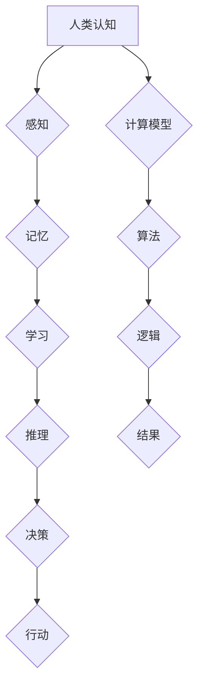

                 

## 推动科技进步的引擎：人类计算的创新力量

> 关键词：人类计算、计算模型、认知计算、人工智能、深度学习、神经网络、算法优化、数据驱动

## 1. 背景介绍

科技进步的引擎从未停止运转，而人类计算作为其核心力量，正以惊人的速度演进。从古老的算盘到现代的超级计算机，人类始终在探索更有效、更智能的计算方式。近年来，人工智能（AI）的蓬勃发展，特别是深度学习技术的突破，为人类计算注入了一股强劲动力，催生了一系列颠覆性的应用，深刻改变着我们的生活和工作方式。

然而，人类计算不仅仅局限于算法和硬件的演进，更重要的是要探索人类认知的本质，将人类的智慧和创造力融入计算模型中。这需要跨越学科的融合，将计算机科学、认知科学、心理学、神经科学等领域的研究成果有机结合，构建更接近人类思维方式的计算系统。

## 2. 核心概念与联系

### 2.1 人类计算的本质

人类计算是指利用人类的认知能力进行计算和推理的过程。它不仅包括传统的数学运算，更涵盖了语言理解、图像识别、决策分析等复杂认知任务。人类的优势在于其灵活的思维、创新的能力和对环境的深刻理解。

### 2.2 计算模型与认知模型

计算模型是模拟计算过程的抽象框架，而认知模型则试图模拟人类的认知过程。传统的计算模型主要基于逻辑和算法，而认知模型则更加注重模拟人类的感知、记忆、学习和推理等功能。

**Mermaid 流程图**



### 2.3 人工智能与人类计算

人工智能旨在构建能够模拟或超越人类智能的机器。深度学习作为人工智能的重要分支，通过构建多层神经网络，学习从数据中提取特征和模式，从而实现对复杂问题的理解和解决。深度学习的成功应用证明了人类计算在人工智能领域的重要作用。

## 3. 核心算法原理 & 具体操作步骤

### 3.1 算法原理概述

深度学习算法的核心是神经网络，它由多个相互连接的神经元组成，每个神经元接收输入信号，对其进行处理，并输出处理后的信号。神经网络通过训练，学习调整神经元之间的连接权重，从而实现对数据的学习和预测。

### 3.2 算法步骤详解

1. **数据预处理:** 将原始数据转换为深度学习算法可以理解的格式，例如归一化、编码等。
2. **网络结构设计:** 根据任务需求，设计神经网络的层数、神经元数量、激活函数等参数。
3. **参数初始化:** 为神经网络中的连接权重赋予初始值。
4. **前向传播:** 将输入数据通过神经网络传递，计算输出结果。
5. **反向传播:** 计算输出结果与真实值的误差，并根据误差调整神经网络的连接权重。
6. **优化算法:** 使用优化算法，例如梯度下降，更新神经网络的连接权重。
7. **训练与评估:** 循环进行前向传播、反向传播和权重更新，直到模型达到预期的性能。

### 3.3 算法优缺点

**优点:**

* 能够学习复杂的数据模式。
* 具有强大的泛化能力，可以应用于不同的任务。
* 不需要人工特征工程，可以自动从数据中提取特征。

**缺点:**

* 需要大量的训练数据。
* 训练过程耗时且计算资源消耗大。
* 模型解释性较差，难以理解模型的决策过程。

### 3.4 算法应用领域

深度学习算法已广泛应用于图像识别、自然语言处理、语音识别、机器翻译、推荐系统等领域。

## 4. 数学模型和公式 & 详细讲解 & 举例说明

### 4.1 数学模型构建

深度学习算法的核心是神经网络，其数学模型可以表示为多层感知机（MLP）。MLP由输入层、隐藏层和输出层组成，每个层的神经元之间通过权重连接。

### 4.2 公式推导过程

**激活函数:**

神经网络中的激活函数用于引入非线性，使模型能够学习复杂的数据模式。常用的激活函数包括 sigmoid 函数、ReLU 函数等。

**损失函数:**

损失函数用于衡量模型预测结果与真实值的差异。常用的损失函数包括均方误差（MSE）、交叉熵损失等。

**梯度下降:**

梯度下降算法用于更新神经网络的连接权重，使其朝着最小化损失函数的方向进行调整。

### 4.3 案例分析与讲解

**举例说明:**

假设我们有一个简单的图像分类任务，目标是将猫和狗的图像进行分类。我们可以使用一个包含两层隐藏层的 MLP 模型，输入层接收图像的像素值，输出层输出猫和狗的概率。

训练过程中，我们会使用大量的猫和狗的图像数据，通过前向传播、反向传播和梯度下降算法，不断调整模型的连接权重，使其能够准确地将猫和狗的图像进行分类。

## 5. 项目实践：代码实例和详细解释说明

### 5.1 开发环境搭建

* Python 3.x
* TensorFlow 或 PyTorch 深度学习框架
* Jupyter Notebook 或 VS Code 开发环境

### 5.2 源代码详细实现

```python
import tensorflow as tf

# 定义模型结构
model = tf.keras.models.Sequential([
    tf.keras.layers.Flatten(input_shape=(28, 28)),
    tf.keras.layers.Dense(128, activation='relu'),
    tf.keras.layers.Dense(10, activation='softmax')
])

# 编译模型
model.compile(optimizer='adam',
              loss='sparse_categorical_crossentropy',
              metrics=['accuracy'])

# 加载 MNIST 数据集
(x_train, y_train), (x_test, y_test) = tf.keras.datasets.mnist.load_data()

# 训练模型
model.fit(x_train, y_train, epochs=5)

# 评估模型
loss, accuracy = model.evaluate(x_test, y_test)
print('Test loss:', loss)
print('Test accuracy:', accuracy)
```

### 5.3 代码解读与分析

* **模型结构:** 该代码定义了一个简单的深度学习模型，包含两层全连接层和一个 softmax 输出层。
* **编译模型:** 使用 Adam 优化器、交叉熵损失函数和准确率作为评估指标编译模型。
* **数据加载:** 使用 MNIST 数据集进行训练和评估。
* **训练模型:** 使用 `fit` 方法训练模型，训练 5 个 epochs。
* **评估模型:** 使用 `evaluate` 方法评估模型在测试集上的性能。

### 5.4 运行结果展示

训练完成后，模型将输出测试集上的损失值和准确率。

## 6. 实际应用场景

### 6.1 医疗诊断

深度学习算法可以用于分析医学图像，辅助医生进行疾病诊断。例如，可以用于识别肿瘤、骨折、眼底病变等。

### 6.2 金融风险评估

深度学习算法可以用于分析金融数据，识别潜在的风险。例如，可以用于检测欺诈交易、评估贷款风险等。

### 6.3 自动驾驶

深度学习算法可以用于训练自动驾驶汽车的感知系统，识别道路上的障碍物、交通信号灯等。

### 6.4 未来应用展望

随着人工智能技术的不断发展，人类计算将在更多领域发挥重要作用，例如：

* **个性化教育:** 根据学生的学习情况，提供个性化的学习方案。
* **智能客服:** 利用自然语言处理技术，提供更智能、更人性化的客服服务。
* **科学研究:** 加速科学研究的进程，例如药物研发、材料科学等。

## 7. 工具和资源推荐

### 7.1 学习资源推荐

* **书籍:**
    * 深度学习
    * 人工智能：一种现代方法
* **在线课程:**
    * Coursera 深度学习课程
    * Udacity 人工智能工程师 Nanodegree

### 7.2 开发工具推荐

* **TensorFlow:** 开源深度学习框架
* **PyTorch:** 开源深度学习框架
* **Jupyter Notebook:** 用于深度学习开发的交互式笔记本

### 7.3 相关论文推荐

* **ImageNet Classification with Deep Convolutional Neural Networks**
* **Attention Is All You Need**

## 8. 总结：未来发展趋势与挑战

### 8.1 研究成果总结

人类计算在人工智能领域取得了显著的成果，例如图像识别、自然语言处理等领域取得了突破性的进展。

### 8.2 未来发展趋势

* **更强大的计算能力:** 随着硬件技术的进步，深度学习模型将变得更加强大，能够处理更复杂的数据。
* **更有效的算法:** 研究人员将继续探索更有效的深度学习算法，提高模型的效率和准确率。
* **更广泛的应用场景:** 人类计算将应用于更多领域，例如医疗、金融、教育等。

### 8.3 面临的挑战

* **数据隐私和安全:** 深度学习算法需要大量的训练数据，如何保护数据隐私和安全是一个重要的挑战。
* **模型解释性:** 深度学习模型的决策过程难以理解，如何提高模型的解释性是一个重要的研究方向。
* **伦理问题:** 人工智能技术的快速发展引发了伦理问题，例如算法偏见、工作岗位替代等，需要社会各界共同探讨和解决。

### 8.4 研究展望

未来，人类计算将继续朝着更智能、更安全、更可解释的方向发展，为人类社会带来更多福祉。

## 9. 附录：常见问题与解答

* **什么是深度学习？**

深度学习是一种机器学习的子领域，它使用多层神经网络来学习数据中的复杂模式。

* **深度学习的优势是什么？**

深度学习能够学习复杂的数据模式，具有强大的泛化能力，可以应用于不同的任务。

* **深度学习的应用场景有哪些？**

深度学习已广泛应用于图像识别、自然语言处理、语音识别、机器翻译、推荐系统等领域。


作者：禅与计算机程序设计艺术 / Zen and the Art of Computer Programming 
<end_of_turn>

