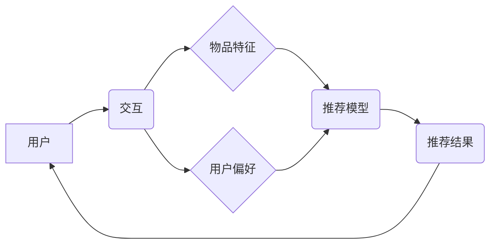

                 

## 推荐系统：个性化用户体验的AI技术

> 关键词：推荐系统、协同过滤、内容过滤、深度学习、个性化推荐、用户行为分析、矩阵分解、模型评估

## 1. 背景介绍

在信息爆炸的时代，海量数据和信息涌现，用户面临着选择困难和信息过载的挑战。推荐系统应运而生，旨在通过分析用户行为、偏好和历史数据，为用户提供个性化的内容推荐，从而提升用户体验，提高用户满意度和留存率。

推荐系统已广泛应用于各个领域，例如电商平台、视频网站、音乐平台、社交媒体等。它可以帮助用户发现感兴趣的内容，提高用户参与度，促进商业交易。

## 2. 核心概念与联系

推荐系统的核心是理解用户需求并预测用户对特定内容的兴趣。它通常基于以下核心概念：

* **用户:** 推荐系统的目标用户群体。
* **物品:** 需要被推荐的内容，例如商品、视频、音乐等。
* **交互:** 用户与物品之间的行为，例如点击、购买、评分等。
* **预测:** 根据用户历史交互和物品特征，预测用户对特定物品的兴趣程度。

推荐系统通常采用以下两种主要方法：

* **协同过滤:** 基于用户的相似性或物品的相似性进行推荐。
* **内容过滤:** 基于物品的特征和用户偏好进行推荐。

**推荐系统架构**



## 3. 核心算法原理 & 具体操作步骤

### 3.1  算法原理概述

协同过滤算法是推荐系统中常用的算法之一，它基于用户的相似性或物品的相似性进行推荐。

**用户-基于协同过滤:**

* 找到与当前用户兴趣相似的其他用户。
* 从这些相似用户的历史交互中，推荐他们喜欢的物品，但当前用户尚未交互过的物品。

**物品-基于协同过滤:**

* 找到与当前用户感兴趣的物品相似的其他物品。
* 从这些相似物品中，推荐当前用户尚未交互过的物品。

### 3.2  算法步骤详解

**用户-基于协同过滤算法步骤:**

1. **收集用户交互数据:** 收集用户对物品的交互数据，例如评分、购买记录、浏览记录等。
2. **计算用户相似度:** 使用距离度量或相似度度量方法，计算用户之间的相似度。常用的方法包括余弦相似度、皮尔逊相关系数等。
3. **找到相似用户:** 根据用户相似度，找到与当前用户兴趣相似的其他用户。
4. **生成推荐列表:** 从相似用户的历史交互中，推荐他们喜欢的物品，但当前用户尚未交互过的物品。

**物品-基于协同过滤算法步骤:**

1. **收集用户交互数据:** 收集用户对物品的交互数据，例如评分、购买记录、浏览记录等。
2. **计算物品相似度:** 使用距离度量或相似度度量方法，计算物品之间的相似度。常用的方法包括余弦相似度、皮尔逊相关系数等。
3. **找到相似物品:** 根据物品相似度，找到与当前用户感兴趣的物品相似的其他物品。
4. **生成推荐列表:** 从相似物品中，推荐当前用户尚未交互过的物品。

### 3.3  算法优缺点

**优点:**

* 能够发现用户隐含的兴趣，推荐个性化的内容。
* 不需要明确的物品特征，可以从用户交互数据中学习。

**缺点:**

* 数据稀疏性问题: 当用户交互数据较少时，难以计算出准确的相似度。
* 冷启动问题: 新用户或新物品难以获得推荐。
* 算法复杂度高: 计算用户或物品相似度需要消耗大量计算资源。

### 3.4  算法应用领域

协同过滤算法广泛应用于以下领域:

* 电子商务平台: 推荐商品、优惠券、促销活动等。
* 视频网站: 推荐视频、电视剧、电影等。
* 音乐平台: 推荐歌曲、专辑、音乐人等。
* 社交媒体: 推荐好友、群组、话题等。

## 4. 数学模型和公式 & 详细讲解 & 举例说明

### 4.1  数学模型构建

协同过滤算法通常使用矩阵分解模型来构建数学模型。用户-物品交互数据可以表示为一个用户-物品交互矩阵，其中每个元素表示用户对物品的评分或交互行为。

**用户-物品交互矩阵:**

```
用户1  物品1  物品2  物品3
用户2  评分1  评分2  评分3
用户3  评分4  评分5  评分6
```

### 4.2  公式推导过程

矩阵分解模型的目标是将用户-物品交互矩阵分解成两个低维矩阵，分别表示用户特征矩阵和物品特征矩阵。

**用户特征矩阵:**

```
用户1  特征1  特征2
用户2  特征3  特征4
用户3  特征5  特征6
```

**物品特征矩阵:**

```
物品1  特征1  特征2
物品2  特征3  特征4
物品3  特征5  特征6
```

通过矩阵乘法，可以得到预测的用户对物品的评分。

**预测评分 = 用户特征矩阵 * 物品特征矩阵**

### 4.3  案例分析与讲解

假设用户1对物品1评分为5，对物品2评分为3，对物品3评分为4。

通过矩阵分解模型，可以得到用户1的特征向量和物品的特征向量。

**用户1特征向量:** [0.8, 0.2]

**物品1特征向量:** [0.6, 0.4]

**物品2特征向量:** [0.2, 0.8]

**物品3特征向量:** [0.4, 0.6]

通过矩阵乘法，可以预测用户1对物品4的评分。

**预测评分 = [0.8, 0.2] * [0.3, 0.5] = 0.4**

## 5. 项目实践：代码实例和详细解释说明

### 5.1  开发环境搭建

推荐系统开发环境通常包括以下软件：

* Python 语言环境
* 数据处理库 (例如 Pandas, NumPy)
* 机器学习库 (例如 Scikit-learn, TensorFlow)
* 数据库 (例如 MySQL, MongoDB)

### 5.2  源代码详细实现

以下是一个使用 Python 和 Scikit-learn 库实现用户-基于协同过滤算法的推荐系统的代码示例:

```python
import pandas as pd
from sklearn.metrics.pairwise import cosine_similarity

# 加载用户-物品交互数据
data = pd.read_csv('user_item_data.csv')

# 计算用户相似度
user_similarity = cosine_similarity(data.T)

# 获取当前用户的ID
user_id = 1

# 找到与当前用户兴趣相似的其他用户
similar_users = user_similarity[user_id].argsort()[:-10:-1]

# 生成推荐列表
recommendations = data.iloc[similar_users].mean().sort_values(ascending=False)

# 打印推荐结果
print(recommendations)
```

### 5.3  代码解读与分析

* **加载用户-物品交互数据:** 使用 Pandas 库读取用户-物品交互数据，并将数据存储在 DataFrame 对象中。
* **计算用户相似度:** 使用 Scikit-learn 库的 `cosine_similarity` 函数计算用户之间的余弦相似度。
* **获取当前用户的ID:** 设置当前用户的ID。
* **找到与当前用户兴趣相似的其他用户:** 根据用户相似度，找到与当前用户兴趣相似的其他用户。
* **生成推荐列表:** 从相似用户的历史交互中，计算每个物品的平均评分，并根据评分排序生成推荐列表。
* **打印推荐结果:** 打印推荐结果。

### 5.4  运行结果展示

运行代码后，将输出一个包含推荐物品及其平均评分的列表。

## 6. 实际应用场景

推荐系统已广泛应用于以下实际场景:

* **电商平台:** 推荐商品、优惠券、促销活动等。
* **视频网站:** 推荐视频、电视剧、电影等。
* **音乐平台:** 推荐歌曲、专辑、音乐人等。
* **社交媒体:** 推荐好友、群组、话题等。

### 6.4  未来应用展望

未来，推荐系统将朝着以下方向发展:

* **更个性化:** 基于用户的细粒度特征和行为，提供更精准的个性化推荐。
* **更智能化:** 利用深度学习等人工智能技术，提升推荐系统的智能化水平。
* **更交互式:** 与用户进行更自然的交互，例如语音交互、图像交互等。
* **更透明化:** 明确推荐算法的运作机制，提高用户对推荐结果的信任度。

## 7. 工具和资源推荐

### 7.1  学习资源推荐

* **书籍:**
    * 推荐系统: 个性化用户体验的AI技术
    * The Netflix Recommender System: Algorithms, Business Value, and Innovation
* **在线课程:**
    * Coursera: Machine Learning
    * Udacity: Deep Learning Nanodegree
* **博客:**
    * Recommender Systems Blog
    * KDnuggets

### 7.2  开发工具推荐

* **Python:** 广泛用于推荐系统开发，拥有丰富的机器学习库和数据处理库。
* **Scikit-learn:** Python 的机器学习库，提供各种推荐算法的实现。
* **TensorFlow:** 深度学习框架，可以用于构建更复杂的推荐模型。
* **Spark:** 大数据处理框架，可以用于处理海量用户交互数据。

### 7.3  相关论文推荐

* **Collaborative Filtering for Implicit Feedback Datasets**
* **Matrix Factorization Techniques for Recommender Systems**
* **Deep Learning for Recommender Systems**

## 8. 总结：未来发展趋势与挑战

### 8.1  研究成果总结

推荐系统研究取得了显著成果，从传统的协同过滤算法到基于深度学习的模型，推荐系统的准确性和个性化程度不断提升。

### 8.2  未来发展趋势

未来，推荐系统将朝着更智能化、更个性化、更透明化的方向发展。

### 8.3  面临的挑战

推荐系统面临着以下挑战:

* 数据稀疏性问题
* 冷启动问题
* 算法解释性问题
* 隐私保护问题

### 8.4  研究展望

未来，需要进一步研究解决推荐系统面临的挑战，例如开发新的算法，提高算法的效率和准确性，并探索更有效的隐私保护机制。

## 9. 附录：常见问题与解答

* **什么是推荐系统？**

推荐系统是一种利用数据分析技术，为用户提供个性化内容推荐的系统。

* **推荐系统有哪些类型？**

常见的推荐系统类型包括协同过滤、内容过滤、混合推荐等。

* **如何评估推荐系统的性能？**

常用的推荐系统性能指标包括准确率、召回率、覆盖率等。

* **如何解决推荐系统的数据稀疏性问题？**

可以使用矩阵分解、深度学习等技术来解决数据稀疏性问题。

* **如何保护用户隐私？**

可以使用差分隐私、联邦学习等技术来保护用户隐私。


作者：禅与计算机程序设计艺术 / Zen and the Art of Computer Programming 
<end_of_turn>

