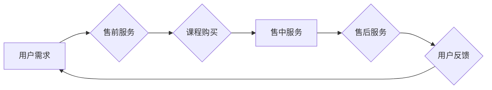

                 

## 知识付费要建立完善的客户服务体系

> 关键词：知识付费、客户服务、体系建设、用户体验、售后服务、社区建设、数据分析

### 1. 背景介绍

知识付费行业近年来发展迅速，从线上课程、付费咨询到会员体系，各种模式层出不穷。然而，随着市场竞争的加剧，单纯依靠优质内容难以保证长远发展。越来越多的企业和个人意识到，建立完善的客户服务体系是知识付费行业的核心竞争力之一。

传统电商模式下，客户服务主要集中在售前咨询和售后处理，而知识付费的本质是提供持续价值和陪伴。因此，知识付费的客户服务需要更加注重用户体验、互动性和长期关系的建立。

### 2. 核心概念与联系

#### 2.1 知识付费的核心价值

知识付费的核心价值在于提供有价值的知识和技能，帮助用户提升自身能力和解决实际问题。

#### 2.2 客户服务体系的构建

客户服务体系的构建需要从用户需求出发，围绕用户生命周期，提供全方位的服务，包括：

* **售前服务:** 
    * 内容介绍和咨询
    * 学习方案推荐
    * 课程试听和体验
* **售中服务:** 
    * 学习指导和答疑
    * 学习进度跟踪和反馈
    * 社区互动和交流
* **售后服务:** 
    * 学习成果评估和反馈
    * 知识更新和补充
    * 持续陪伴和支持

#### 2.3  客户服务体系的架构



### 3. 核心算法原理 & 具体操作步骤

#### 3.1 算法原理概述

知识付费客户服务体系的构建需要结合数据分析和人工智能技术，实现个性化服务和智能化运营。

* **数据分析:** 收集用户行为数据，分析用户学习习惯、偏好和需求，为个性化服务提供依据。
* **人工智能:** 利用机器学习算法，实现智能问答、学习推荐和用户画像等功能，提升服务效率和用户体验。

#### 3.2 算法步骤详解

1. **数据采集:** 收集用户注册信息、学习记录、互动行为、反馈意见等数据。
2. **数据清洗:** 对采集到的数据进行清洗和预处理，去除无效数据和噪声。
3. **数据分析:** 利用数据挖掘和统计分析技术，分析用户行为模式、学习偏好和需求特征。
4. **模型构建:** 基于数据分析结果，构建用户画像模型、学习推荐模型和智能问答模型等。
5. **服务应用:** 将构建的模型应用于售前咨询、课程推荐、学习指导、答疑解答等环节，提供个性化和智能化的服务。

#### 3.3 算法优缺点

* **优点:** 
    * 个性化服务: 根据用户需求提供定制化的学习方案和服务。
    * 智能化运营: 自动化处理常见问题，提升服务效率。
    * 数据驱动: 基于数据分析，优化服务策略和内容更新。
* **缺点:** 
    * 数据安全: 需要妥善处理用户隐私数据，保障数据安全。
    * 模型准确性: 模型的准确性依赖于数据质量和算法设计，需要不断优化和改进。
    * 人工智能伦理: 需要关注人工智能技术在客户服务中的伦理问题，避免算法偏见和歧视。

#### 3.4 算法应用领域

* **在线教育:** 个性化学习推荐、智能答疑、学习进度跟踪等。
* **咨询服务:** 智能问答、预约管理、客户关系管理等。
* **会员体系:** 会员专属服务、个性化内容推荐、会员权益管理等。

### 4. 数学模型和公式 & 详细讲解 & 举例说明

#### 4.1 数学模型构建

用户画像模型可以利用机器学习算法，构建基于用户行为和特征的数学模型，例如：

* **K-Means聚类算法:** 将用户分为不同的群体，根据群体的特征进行个性化服务。
* **决策树算法:** 根据用户特征和行为，构建决策树模型，预测用户的学习意愿和学习效果。

#### 4.2 公式推导过程

K-Means聚类算法的目标是将数据点划分为K个簇，使得每个簇内的点尽可能接近，而簇间尽可能远离。

* **距离度量:** 使用欧氏距离或马氏距离等度量用户特征之间的相似度。
* **聚类中心:** 随机选择K个数据点作为初始聚类中心。
* **分配簇:** 将每个数据点分配到距离其最近的聚类中心所属的簇。
* **更新中心:** 计算每个簇的中心点，并将其作为新的聚类中心。
* **迭代:** 重复上述步骤，直到聚类中心不再变化或达到最大迭代次数。

#### 4.3 案例分析与讲解

假设我们有100个用户，根据他们的学习时间、学习内容和学习成绩等特征，使用K-Means聚类算法将用户分为3个簇。

* **簇1:** 高学习时间、学习内容广泛、学习成绩优秀的用户。
* **簇2:** 中等学习时间、学习内容集中、学习成绩中等的用户。
* **簇3:** 低学习时间、学习内容有限、学习成绩较差的用户。

我们可以根据每个簇的用户特征，提供不同的学习方案和服务。例如，簇1的用户可以推荐更高级的课程，簇2的用户可以提供更针对性的学习指导，簇3的用户可以提供基础知识的学习资源。

### 5. 项目实践：代码实例和详细解释说明

#### 5.1 开发环境搭建

* **操作系统:** Linux/macOS/Windows
* **编程语言:** Python
* **库依赖:** scikit-learn、pandas、numpy等

#### 5.2 源代码详细实现

```python
from sklearn.cluster import KMeans
import pandas as pd

# 加载用户数据
data = pd.read_csv('user_data.csv')

# 选择特征变量
features = ['学习时间', '学习内容', '学习成绩']
X = data[features]

# 使用K-Means算法进行聚类
kmeans = KMeans(n_clusters=3, random_state=0)
kmeans.fit(X)

# 获取聚类结果
labels = kmeans.labels_
data['簇'] = labels

# 查看聚类结果
print(data)
```

#### 5.3 代码解读与分析

* **数据加载:** 使用pandas库加载用户数据。
* **特征选择:** 选择用户学习时间、学习内容和学习成绩作为聚类特征。
* **K-Means算法:** 使用scikit-learn库中的K-Means算法进行聚类，指定聚类数量为3。
* **聚类结果:** 获取聚类结果，并将聚类标签添加到用户数据中。
* **结果展示:** 打印用户数据，查看每个用户的聚类标签。

#### 5.4 运行结果展示

运行代码后，会输出用户数据，其中包含每个用户的聚类标签。

### 6. 实际应用场景

#### 6.1 在线教育平台

* **个性化学习推荐:** 根据用户的学习历史、兴趣和能力水平，推荐合适的课程和学习资源。
* **智能答疑:** 利用机器学习算法，构建智能问答系统，自动回答用户的学习问题。
* **学习进度跟踪:** 跟踪用户的学习进度，及时提醒用户学习任务和提供学习指导。

#### 6.2 知识付费社区

* **用户画像分析:** 分析用户的兴趣爱好、学习习惯和社交行为，构建用户画像，为社区运营提供数据支持。
* **内容推荐:** 根据用户的兴趣和学习需求，推荐相关的知识付费内容。
* **社区互动:** 利用人工智能技术，促进用户之间的互动和交流，构建活跃的知识付费社区。

#### 6.3 付费咨询服务

* **智能预约:** 利用聊天机器人，实现用户预约咨询的自动化处理。
* **客户关系管理:** 建立客户关系管理系统，记录用户的咨询历史和服务需求，提供个性化的服务。
* **知识库构建:** 收集专家咨询的知识和经验，构建知识库，方便用户查找和学习。

#### 6.4 未来应用展望

随着人工智能技术的不断发展，知识付费客户服务体系将更加智能化、个性化和自动化。

* **虚拟助手:** 利用自然语言处理技术，构建虚拟助手，为用户提供全天候的学习支持和服务。
* **个性化学习路径:** 根据用户的学习目标和能力水平，自动生成个性化的学习路径，帮助用户更高效地学习。
* **沉浸式学习体验:** 利用虚拟现实和增强现实技术，打造沉浸式的学习体验，提升用户的学习兴趣和效果。

### 7. 工具和资源推荐

#### 7.1 学习资源推荐

* **在线课程:** Coursera、edX、Udemy等平台提供丰富的机器学习和人工智能课程。
* **书籍:** 《机器学习》、《深度学习》、《人工智能导论》等书籍可以帮助你深入了解人工智能技术。
* **开源项目:** TensorFlow、PyTorch等开源项目可以帮助你实践人工智能算法。

#### 7.2 开发工具推荐

* **Python:** Python是机器学习和人工智能开发的常用语言，拥有丰富的库和工具。
* **Jupyter Notebook:** Jupyter Notebook是一个交互式编程环境，方便进行数据分析和模型开发。
* **云计算平台:** AWS、Azure、GCP等云计算平台提供强大的计算资源和机器学习服务。

#### 7.3 相关论文推荐

* **《机器学习》:** Tom Mitchell
* **《深度学习》:** Ian Goodfellow, Yoshua Bengio, Aaron Courville
* **《人工智能：现代方法》:** Stuart Russell, Peter Norvig

### 8. 总结：未来发展趋势与挑战

#### 8.1 研究成果总结

知识付费客户服务体系的构建是知识付费行业发展的重要方向，结合数据分析和人工智能技术，可以实现个性化服务、智能化运营和用户体验的提升。

#### 8.2 未来发展趋势

* **更智能化的服务:** 利用更先进的人工智能算法，实现更智能化的服务，例如自动生成学习计划、个性化答疑和情感识别。
* **更丰富的服务内容:** 提供更丰富的服务内容，例如虚拟现实学习、个性化辅导和社区互动。
* **更完善的生态系统:** 建立更完善的知识付费生态系统，连接用户、内容提供者、服务商和平台，形成良性循环。

#### 8.3 面临的挑战

* **数据安全和隐私保护:** 需要妥善处理用户隐私数据，保障数据安全和用户隐私。
* **算法偏见和歧视:** 需要关注人工智能算法的公平性和公正性，避免算法偏见和歧视。
* **技术成本和人才缺口:** 需要投入大量的技术成本和人才资源，才能构建完善的知识付费客户服务体系。

#### 8.4 研究展望

未来，知识付费客户服务体系将朝着更智能化、个性化、自动化和生态化的方向发展，为用户提供更优质的学习体验和服务。


### 9. 附录：常见问题与解答

#### 9.1 如何选择合适的聚类算法？

选择合适的聚类算法需要根据数据的特点和业务需求进行选择。

* **K-Means算法:** 适合数据分布较为均匀、数据维度较少的场景。
* **DBSCAN算法:** 适合数据分布不均匀、存在噪声数据的场景。
* **层次聚类算法:** 可以生成不同层次的聚类结果，方便用户理解数据结构。

#### 9.2 如何评估聚类结果的质量？

可以使用以下指标评估聚类结果的质量：

* **Silhouette score:** 衡量每个数据点与其所属簇的相似度，值越大表示聚类效果越好。
* **Dunn index:** 衡量簇间距离与簇内距离的比值，值越大表示聚类效果越好。
* **Calinski-Harabasz index:** 衡量簇内方差与簇间方差的比值，值越大表示聚类效果越好。

#### 9.3 如何处理用户数据中的缺失值？

可以采用以下方法处理用户数据中的缺失值：

* **删除缺失值:** 如果缺失值较少，可以删除包含缺失值的记录。
* **填充缺失值:** 使用均值、中位数或其他填充方法填充缺失值。
* **使用机器学习算法:** 使用机器学习算法预测缺失值。


作者：禅与计算机程序设计艺术 / Zen and the Art of Computer Programming 
<end_of_turn>

