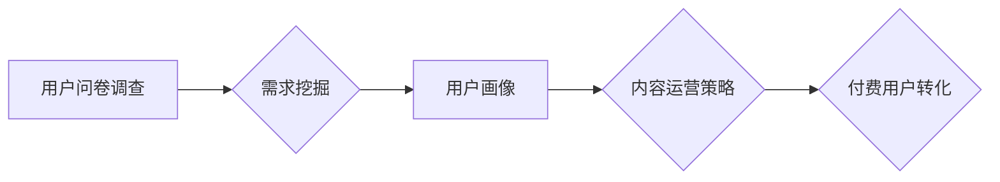

                 

## 知识付费赚钱的用户问卷调查与需求挖掘策略

> 关键词：知识付费、用户问卷、需求挖掘、市场调研、数据分析、用户画像、付费用户

## 1. 背景介绍

知识付费行业近年来发展迅速，成为互联网经济的重要组成部分。从在线课程、直播带货到付费咨询，各种知识付费模式层出不穷。然而，在激烈的市场竞争中，如何精准定位目标用户，满足用户需求，并有效转化付费用户，成为知识付费平台和创作者面临的共同挑战。

用户问卷调查作为一种有效的市场调研工具，可以帮助知识付费平台和创作者深入了解用户的需求、痛点和付费意愿，从而制定更精准的营销策略和内容运营方案。

## 2. 核心概念与联系

### 2.1 用户问卷调查

用户问卷调查是指通过设计一系列问题，向目标用户收集信息的一种市场调研方法。问卷调查可以采用线上或线下方式进行，并根据不同的调查目的和目标用户群体，选择不同的问卷设计方式和问卷题目。

### 2.2 需求挖掘

需求挖掘是指从用户反馈、市场数据等信息中，识别和分析用户潜在需求的过程。通过对用户需求的深入挖掘，可以帮助知识付费平台和创作者开发更符合用户需求的产品和服务，提高用户满意度和付费转化率。

### 2.3 用户画像

用户画像是指对目标用户进行细致的描述和分析，包括用户的年龄、性别、职业、兴趣爱好、消费习惯、学习方式等方面。通过构建用户画像，可以帮助知识付费平台和创作者更精准地定位目标用户，制定针对性的营销策略和内容运营方案。

**Mermaid 流程图**



## 3. 核心算法原理 & 具体操作步骤

### 3.1 算法原理概述

用户问卷调查和需求挖掘的核心算法原理主要基于统计分析和机器学习技术。

* **统计分析:** 通过对问卷调查数据进行统计分析，可以了解用户特征、偏好和行为模式。例如，可以使用频率统计、交叉分析等方法，分析用户对不同课程类型的兴趣程度、付费意愿等。
* **机器学习:** 通过训练机器学习模型，可以从用户问卷数据中挖掘更深层次的潜在需求。例如，可以使用聚类算法将用户分为不同的用户群体，并根据每个群体的特征，制定个性化的营销策略。

### 3.2 算法步骤详解

1. **问卷设计:** 根据调查目标和用户群体，设计一系列问题，涵盖用户基本信息、学习需求、付费意愿等方面。
2. **数据收集:** 通过线上或线下方式，收集用户问卷数据。
3. **数据清洗:** 对收集到的数据进行清洗和处理，去除无效数据和重复数据。
4. **数据分析:** 使用统计分析和机器学习算法，对数据进行分析，挖掘用户需求和行为模式。
5. **用户画像构建:** 根据分析结果，构建用户画像，描述目标用户的特征和需求。
6. **策略制定:** 根据用户画像和需求分析结果，制定针对性的内容运营策略和营销策略。

### 3.3 算法优缺点

**优点:**

* 可以深入了解用户需求和行为模式。
* 可以帮助精准定位目标用户，制定针对性的策略。
* 可以提高用户满意度和付费转化率。

**缺点:**

* 需要投入时间和资源进行问卷设计、数据收集和分析。
* 调查结果可能受到样本偏差的影响。
* 用户回答可能存在主观性。

### 3.4 算法应用领域

用户问卷调查和需求挖掘算法广泛应用于知识付费行业，例如：

* 在线课程平台：了解用户对不同课程类型的需求，制定课程开发和营销策略。
* 直播带货平台：分析用户对商品的兴趣和购买意愿，优化直播内容和推广策略。
* 付费咨询平台：挖掘用户对咨询服务的需求，提供个性化的咨询服务。

## 4. 数学模型和公式 & 详细讲解 & 举例说明

### 4.1 数学模型构建

用户需求挖掘可以构建数学模型来量化用户需求的强度和重要性。例如，可以使用以下模型来衡量用户对特定课程类型的需求：

**需求强度 = 课程相关性 * 用户兴趣 * 学习意愿**

其中：

* 课程相关性：用户对课程主题的兴趣程度。
* 用户兴趣：用户对课程内容的兴趣程度。
* 学习意愿：用户学习课程的意愿。

### 4.2 公式推导过程

该模型的推导过程基于用户行为分析和心理学研究。

* 课程相关性：可以通过用户搜索历史、浏览记录等数据来衡量。
* 用户兴趣：可以通过用户对课程内容的点赞、评论等行为来衡量。
* 学习意愿：可以通过用户对课程的报名、购买等行为来衡量。

### 4.3 案例分析与讲解

假设有一个在线课程平台，想要了解用户对人工智能课程的需求。

* 通过用户搜索历史和浏览记录，发现用户对人工智能相关的搜索量和浏览量较高，因此课程相关性较高。
* 通过用户对人工智能课程内容的点赞和评论，发现用户对人工智能课程内容的兴趣较高，因此用户兴趣较高。
* 通过用户对人工智能课程的报名和购买，发现用户对学习人工智能课程的意愿较高，因此学习意愿较高。

根据上述分析，可以推断出用户对人工智能课程的需求强度较高。

## 5. 项目实践：代码实例和详细解释说明

### 5.1 开发环境搭建

* Python 3.x
* Jupyter Notebook
* pandas
* numpy
* scikit-learn

### 5.2 源代码详细实现

```python
import pandas as pd
from sklearn.cluster import KMeans

# 加载用户问卷数据
data = pd.read_csv('user_survey_data.csv')

# 数据预处理
# ...

# 使用KMeans算法进行聚类
kmeans = KMeans(n_clusters=5)
data['cluster'] = kmeans.fit_predict(data[['age', 'income', 'education', 'interest_in_ai']])

# 分析每个聚类的特征
for i in range(5):
    cluster_data = data[data['cluster'] == i]
    print(f'Cluster {i} characteristics:')
    print(cluster_data.describe())
```

### 5.3 代码解读与分析

* 该代码首先加载用户问卷数据，并进行数据预处理。
* 然后使用KMeans算法进行聚类，将用户分为5个不同的用户群体。
* 最后，对每个聚类的特征进行分析，了解每个用户群体的特点。

### 5.4 运行结果展示

运行结果将显示每个用户群体的特征描述，例如年龄、收入、教育程度、对人工智能的兴趣等。

## 6. 实际应用场景

### 6.1 在线课程平台

* 针对不同用户群体的需求，开发个性化的课程内容。
* 推送个性化的课程推荐，提高用户学习兴趣和付费转化率。

### 6.2 直播带货平台

* 分析用户对不同商品的兴趣和购买意愿，优化直播内容和推广策略。
* 推送个性化的商品推荐，提高用户购买转化率。

### 6.3 付费咨询平台

* 挖掘用户对咨询服务的具体需求，提供更精准的咨询服务。
* 根据用户需求，制定个性化的咨询方案，提高用户满意度。

### 6.4 未来应用展望

随着人工智能技术的不断发展，用户问卷调查和需求挖掘将更加智能化和精准化。

* 利用自然语言处理技术，自动分析用户问卷文本数据，挖掘更深层次的需求。
* 利用机器学习算法，预测用户未来的需求和行为，提供更个性化的服务。

## 7. 工具和资源推荐

### 7.1 学习资源推荐

* **书籍:**
    * 《数据挖掘：概念与技术》
    * 《机器学习》
* **在线课程:**
    * Coursera: 数据挖掘与机器学习
    * edX: 人工智能导论

### 7.2 开发工具推荐

* **Python:** 强大的数据分析和机器学习编程语言。
* **pandas:** 用于数据分析和处理的Python库。
* **scikit-learn:** 用于机器学习的Python库。

### 7.3 相关论文推荐

* **《基于用户行为分析的知识付费需求挖掘》**
* **《深度学习在用户需求挖掘中的应用》**

## 8. 总结：未来发展趋势与挑战

### 8.1 研究成果总结

用户问卷调查和需求挖掘技术在知识付费行业得到了广泛应用，并取得了显著的成果。

* 帮助知识付费平台和创作者更精准地定位目标用户，制定针对性的策略。
* 提高用户满意度和付费转化率。

### 8.2 未来发展趋势

* **智能化:** 利用人工智能技术，自动分析用户问卷数据，挖掘更深层次的需求。
* **个性化:** 根据用户需求，提供更个性化的服务和内容。
* **跨平台:** 将用户问卷调查和需求挖掘技术应用于多个平台，实现数据共享和协同分析。

### 8.3 面临的挑战

* **数据质量:** 用户问卷数据可能存在偏差和噪声，需要进行有效的数据清洗和处理。
* **隐私保护:** 用户问卷数据包含个人隐私信息，需要采取措施保护用户隐私。
* **技术复杂性:** 构建和应用用户需求挖掘模型需要一定的技术门槛。

### 8.4 研究展望

未来，用户问卷调查和需求挖掘技术将继续发展，并应用于更多领域。

* 研究更先进的机器学习算法，提高需求挖掘的准确性和效率。
* 开发更易于使用的工具和平台，降低技术门槛。
* 探索用户问卷调查和需求挖掘技术在其他领域的应用，例如市场营销、产品设计等。

## 9. 附录：常见问题与解答

**Q1: 如何设计有效的用户问卷？**

A1: 用户问卷设计需要考虑以下因素：

* 调查目标
* 用户群体
* 问题类型
* 问题顺序
* 问卷长度

**Q2: 如何进行用户问卷数据分析？**

A2: 用户问卷数据分析可以使用统计分析和机器学习算法。

* 统计分析可以用来了解用户特征、偏好和行为模式。
* 机器学习算法可以用来挖掘更深层次的潜在需求。

**Q3: 如何保护用户隐私？**

A3: 在收集和使用用户问卷数据时，需要采取以下措施保护用户隐私：

* 获取用户同意
* 匿名化数据
* 加密数据
* 限制数据访问权限


作者：禅与计算机程序设计艺术 / Zen and the Art of Computer Programming 
<end_of_turn>

