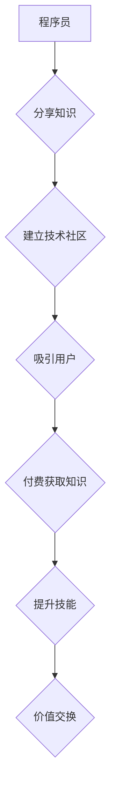

                 

## 知识付费：程序员的社群营销策略

> 关键词：知识付费、程序员、社群营销、内容创作、技术社区、品牌建设、商业模式

### 1. 背景介绍

在当今数字化时代，技术人才的需求日益增长，程序员作为科技发展的重要力量，也面临着新的机遇和挑战。传统的求职模式逐渐被打破，程序员们开始寻求更灵活、更自主的职业发展路径。知识付费作为一种新型的商业模式，为程序员提供了新的收入来源和自我价值实现的机会。

知识付费是指通过线上平台或线下活动，将个人知识、技能或经验以付费的形式提供给有需求的用户。对于程序员来说，知识付费可以涵盖以下几个方面：

* **技术课程:** 分享编程语言、框架、工具、算法等技术知识，帮助其他程序员提升技能水平。
* **项目案例:** 展示个人开发的项目案例，分享项目经验和最佳实践，为其他程序员提供学习和借鉴。
* **技术博客:** 定期发布技术文章，分享技术见解和行业动态，建立个人品牌和影响力。
* **在线咨询:** 为其他程序员提供技术咨询服务，解答技术难题，提供个性化指导。

### 2. 核心概念与联系

知识付费的核心在于价值交换。程序员通过分享自己的知识和经验，为用户提供有价值的内容，用户则通过付费的方式获得这些知识和经验。

**社群营销**是知识付费的重要推动力。程序员可以通过建立技术社区，与其他程序员进行互动交流，分享技术资源，共同学习和进步。社群营销可以帮助程序员扩大影响力，建立信任关系，更容易吸引用户付费。

**Mermaid 流程图:**



### 3. 核心算法原理 & 具体操作步骤

**3.1 算法原理概述**

知识付费的成功取决于以下几个核心算法原理：

* **内容算法:**  根据用户的兴趣和需求，推荐相关的内容，提高用户粘性和付费意愿。
* **社区算法:**  根据用户的活跃度、贡献度和关系，推荐合适的社区和用户，促进用户互动和交流。
* **营销算法:**  根据用户的行为数据，精准推送广告和营销信息，提高用户转化率。

**3.2 算法步骤详解**

1. **数据采集:** 收集用户行为数据，包括浏览记录、搜索记录、点赞记录、评论记录、购买记录等。
2. **数据分析:** 利用机器学习算法对用户数据进行分析，挖掘用户兴趣、需求和行为模式。
3. **内容推荐:** 根据用户分析结果，推荐相关的内容，包括技术课程、项目案例、技术博客等。
4. **社区匹配:** 根据用户的兴趣和技能，推荐合适的社区和用户，促进用户互动和交流。
5. **营销精准:** 根据用户的行为数据，精准推送广告和营销信息，提高用户转化率。

**3.3 算法优缺点**

* **优点:** 能够提高用户体验，提升内容推荐精准度，促进用户互动和付费转化。
* **缺点:** 需要大量的用户数据进行训练，算法模型需要不断更新和优化，存在数据隐私和算法偏见等问题。

**3.4 算法应用领域**

* **在线教育平台:** 推荐课程、学习资源和学习伙伴。
* **技术社区:** 推荐话题、用户和活动。
* **社交媒体平台:** 推荐内容、好友和兴趣小组。

### 4. 数学模型和公式 & 详细讲解 & 举例说明

**4.1 数学模型构建**

知识付费的商业模式可以抽象为一个供需模型，其中：

* **供给方:** 程序员，提供知识和服务。
* **需求方:** 用户，需要学习和提升技能。

**4.2 公式推导过程**

我们可以用以下公式来描述知识付费的价值交换：

* **价值 = 知识价值 * 用户需求 * 知识获取成本**

其中：

* **知识价值:** 指知识对用户提升技能和解决问题带来的价值。
* **用户需求:** 指用户对该知识的学习意愿和付费能力。
* **知识获取成本:** 指用户获取该知识的成本，包括时间、金钱和精力。

**4.3 案例分析与讲解**

假设一个程序员发布了一门关于人工智能的在线课程，课程内容价值高，用户需求大，但课程价格较高，则用户获取知识的成本较高，最终导致课程销量不高。

如果程序员降低课程价格，或者提供免费的课程预习内容，可以降低用户获取知识的成本，从而提高课程销量。

### 5. 项目实践：代码实例和详细解释说明

**5.1 开发环境搭建**

* **操作系统:** Linux/macOS/Windows
* **编程语言:** Python
* **框架:** Flask/Django
* **数据库:** MySQL/PostgreSQL

**5.2 源代码详细实现**

以下是一个简单的知识付费平台的代码示例，使用 Flask 框架实现：

```python
from flask import Flask, render_template, request

app = Flask(__name__)

# 模拟课程数据
courses = [
    {'id': 1, 'title': 'Python 基础教程', 'price': 99},
    {'id': 2, 'title': '机器学习入门', 'price': 199},
]

@app.route('/')
def index():
    return render_template('index.html', courses=courses)

@app.route('/course/<int:course_id>')
def course_detail(course_id):
    course = next((c for c in courses if c['id'] == course_id), None)
    return render_template('course_detail.html', course=course)

if __name__ == '__main__':
    app.run(debug=True)
```

**5.3 代码解读与分析**

* 首先，我们使用 Flask 框架创建了一个简单的 web 应用。
* 然后，我们模拟了一些课程数据，包括课程 ID、标题和价格。
* 在 `index()` 函数中，我们渲染了一个课程列表页面，展示所有课程信息。
* 在 `course_detail()` 函数中，我们根据课程 ID 获取课程详细信息，并渲染一个课程详情页面。

**5.4 运行结果展示**

运行上述代码后，我们可以访问 http://127.0.0.1:5000/，看到一个简单的课程列表页面。点击课程标题，可以进入课程详情页面。

### 6. 实际应用场景

知识付费在程序员领域有着广泛的应用场景：

* **在线教育平台:** Udemy、Coursera、Codecademy 等平台提供各种编程课程，帮助程序员学习新技能和提升现有技能。
* **技术博客:** 许多程序员通过博客分享技术文章，并提供付费订阅服务，为用户提供更深入的技术内容和社区支持。
* **技术社区:** Stack Overflow、GitHub 等社区提供技术问答和代码分享服务，一些社区也提供付费会员服务，提供更优质的社区体验和资源。

**6.4 未来应用展望**

随着人工智能、虚拟现实等技术的不断发展，知识付费的应用场景将更加丰富多样。例如：

* **个性化学习:** 基于用户的学习风格和需求，提供个性化的学习路径和内容。
* **沉浸式学习:** 利用虚拟现实技术，打造沉浸式的学习环境，提高学习体验。
* **元宇宙学习:** 在元宇宙平台上，提供虚拟的学习空间和互动体验，打破时间和空间的限制。

### 7. 工具和资源推荐

**7.1 学习资源推荐**

* **在线学习平台:** Udemy、Coursera、Codecademy、Khan Academy
* **技术博客:** Hacker News、Medium、Dev.to
* **技术社区:** Stack Overflow、GitHub、Reddit

**7.2 开发工具推荐**

* **编程语言:** Python、JavaScript、Java、C++
* **框架:** Flask、Django、React、Vue.js
* **数据库:** MySQL、PostgreSQL、MongoDB

**7.3 相关论文推荐**

* **The Economics of Online Education**
* **The Impact of Online Learning on Student Outcomes**
* **The Future of Work: How Technology Will Transform the Workplace**

### 8. 总结：未来发展趋势与挑战

**8.1 研究成果总结**

知识付费为程序员提供了新的收入来源和自我价值实现的机会，同时也为用户提供了更便捷、更灵活的学习方式。

**8.2 未来发展趋势**

未来，知识付费将更加个性化、沉浸式和元宇宙化，技术进步将推动知识付费模式的创新发展。

**8.3 面临的挑战**

知识付费行业面临着内容质量、用户信任、商业模式等挑战，需要不断探索新的解决方案。

**8.4 研究展望**

未来研究方向包括：

* **个性化推荐算法:** 更加精准地推荐用户感兴趣的内容。
* **沉浸式学习体验:** 利用虚拟现实等技术，打造更具吸引力的学习环境。
* **元宇宙学习平台:** 在元宇宙平台上构建虚拟的学习空间和社区。

### 9. 附录：常见问题与解答

* **如何选择合适的知识付费平台？**

选择平台时，需要考虑平台的口碑、用户规模、课程质量、收费标准等因素。

* **如何提高知识付费的转化率？**

需要注重内容质量、用户体验、营销推广等方面。

* **如何保护知识产权？**

可以通过版权声明、水印技术、加密技术等方式保护知识产权。


作者：禅与计算机程序设计艺术 / Zen and the Art of Computer Programming 
<end_of_turn>

