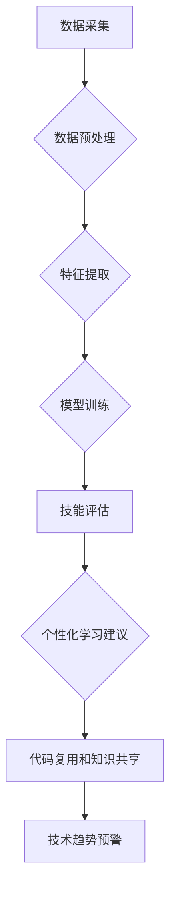

                 

## 知识发现引擎助力程序员技能迭代升级

> 关键词：知识发现引擎、程序员技能迭代、代码分析、机器学习、深度学习、软件工程、持续学习

### 1. 背景介绍

在软件开发领域，程序员的技能迭代升级至关重要。随着技术日新月异，新的编程语言、框架和工具不断涌现，程序员需要不断学习和提升自身技能才能保持竞争力。传统的学习方式，例如阅读书籍、参加培训课程，虽然有效，但效率相对较低，难以满足快速变化的技术环境的需求。

知识发现引擎 (Knowledge Discovery Engine，KDE) 作为一种新兴的技术，为程序员技能迭代升级提供了新的可能性。KDE 通过对海量代码数据进行分析和挖掘，可以自动识别程序员的技能强项和薄弱环节，并提供个性化的学习建议和资源推荐。

### 2. 核心概念与联系

**2.1 知识发现引擎 (KDE)**

知识发现引擎是一种利用机器学习和数据挖掘技术，从海量数据中发现隐藏的知识和模式的系统。在软件开发领域，KDE 可以对代码库、文档、论坛等数据进行分析，识别代码风格、编程模式、技术趋势等信息。

**2.2 程序员技能迭代**

程序员技能迭代是指程序员不断学习新知识、掌握新技能，提升自身编程能力的过程。

**2.3 KDE助力程序员技能迭代**

KDE 可以通过以下方式助力程序员技能迭代：

* **技能评估:** KDE 可以分析程序员的代码风格、编程模式等信息，评估其在不同编程语言、框架和技术领域的技能水平。
* **个性化学习建议:** 基于技能评估结果，KDE 可以推荐个性化的学习资源，例如书籍、课程、在线教程等，帮助程序员提升其薄弱环节的技能。
* **代码复用和知识共享:** KDE 可以识别代码中的重复片段，并将其归档为可复用的组件，促进代码复用和知识共享。
* **技术趋势预警:** KDE 可以分析代码库中的技术趋势，预警程序员潜在的技能缺口，帮助其提前学习新技术。

**2.4 KDE 架构**



### 3. 核心算法原理 & 具体操作步骤

**3.1 算法原理概述**

KDE 的核心算法主要包括数据预处理、特征提取、模型训练、技能评估等环节。

* **数据预处理:** 对采集到的代码数据进行清洗、格式化、标注等操作，使其适合模型训练。
* **特征提取:** 从代码数据中提取有价值的特征，例如代码结构、语法、函数调用等，这些特征可以反映程序员的编程风格和技能水平。
* **模型训练:** 利用机器学习算法，例如深度学习、支持向量机等，对提取的特征进行训练，构建技能评估模型。
* **技能评估:** 将程序员的代码数据输入到训练好的模型中，得到其在不同编程语言、框架和技术领域的技能水平评估结果。

**3.2 算法步骤详解**

1. **数据采集:** 从代码库、文档、论坛等平台收集程序员的代码数据、文档、评论等信息。
2. **数据预处理:** 对收集到的数据进行清洗、格式化、标注等操作。例如，去除代码中的注释、空格、换行符等无关信息，将代码转换为统一的格式，对代码中的变量、函数等进行标注。
3. **特征提取:** 利用自然语言处理 (NLP) 技术和代码分析工具，从预处理后的代码数据中提取有价值的特征。例如，可以使用词嵌入技术对代码中的单词进行向量化表示，可以使用语法分析工具识别代码中的代码结构和控制流。
4. **模型训练:** 选择合适的机器学习算法，例如深度学习、支持向量机等，对提取的特征进行训练，构建技能评估模型。
5. **技能评估:** 将程序员的代码数据输入到训练好的模型中，得到其在不同编程语言、框架和技术领域的技能水平评估结果。

**3.3 算法优缺点**

**优点:**

* 自动化: KDE 可以自动分析代码数据，无需人工干预。
* 效率高: KDE 可以快速评估程序员的技能水平，并提供个性化的学习建议。
* 数据驱动: KDE 基于海量代码数据进行训练，评估结果更加客观和准确。

**缺点:**

* 数据依赖: KDE 的性能取决于训练数据的质量和数量。
* 算法复杂: KDE 的算法模型相对复杂，需要专业的技术人员进行开发和维护。
* 隐私问题: KDE 需要处理程序员的代码数据，需要妥善处理数据隐私问题。

**3.4 算法应用领域**

* **程序员技能评估:** KDE 可以用于评估程序员的技能水平，帮助招聘人员筛选人才。
* **个性化学习推荐:** KDE 可以根据程序员的技能评估结果，推荐个性化的学习资源。
* **代码复用和知识共享:** KDE 可以识别代码中的重复片段，促进代码复用和知识共享。
* **技术趋势预警:** KDE 可以分析代码库中的技术趋势，预警程序员潜在的技能缺口。

### 4. 数学模型和公式 & 详细讲解 & 举例说明

**4.1 数学模型构建**

KDE 的数学模型通常基于机器学习算法，例如深度学习、支持向量机等。这些算法可以将代码数据映射到一个高维特征空间，并学习出不同编程语言、框架和技术领域的技能特征。

**4.2 公式推导过程**

具体的公式推导过程取决于选择的机器学习算法。例如，深度学习模型的训练过程涉及到损失函数、梯度下降等数学公式。

**4.3 案例分析与讲解**

假设我们使用深度学习模型来评估程序员的 Java 技能水平。我们可以将 Java 代码片段作为输入，并使用预训练的词嵌入模型将代码中的单词向量化表示。然后，我们可以使用多层感知机 (MLP) 或循环神经网络 (RNN) 等深度学习模型，学习出 Java 代码的特征表示，并将其映射到 Java 技能水平的评分。

### 5. 项目实践：代码实例和详细解释说明

**5.1 开发环境搭建**

KDE 的开发环境通常包括以下软件：

* Python 编程语言
* TensorFlow 或 PyTorch 深度学习框架
* NLTK 或 SpaCy 自然语言处理库
* Git 版本控制系统

**5.2 源代码详细实现**

```python
import tensorflow as tf

# 定义模型结构
model = tf.keras.Sequential([
    tf.keras.layers.Embedding(input_dim=vocab_size, output_dim=embedding_dim),
    tf.keras.layers.LSTM(units=128),
    tf.keras.layers.Dense(units=1, activation='sigmoid')
])

# 编译模型
model.compile(optimizer='adam', loss='binary_crossentropy', metrics=['accuracy'])

# 训练模型
model.fit(x_train, y_train, epochs=10)

# 评估模型
loss, accuracy = model.evaluate(x_test, y_test)
print('Loss:', loss)
print('Accuracy:', accuracy)
```

**5.3 代码解读与分析**

这段代码定义了一个简单的深度学习模型，用于评估程序员的 Java 技能水平。

* `Embedding` 层将代码中的单词向量化表示。
* `LSTM` 层用于学习代码的上下文信息。
* `Dense` 层将代码的特征表示映射到 Java 技能水平的评分。

**5.4 运行结果展示**

训练完成后，我们可以使用模型对新的 Java 代码片段进行评估，得到其 Java 技能水平的评分。

### 6. 实际应用场景

KDE 可以应用于以下实际场景：

* **在线编程平台:** 在线编程平台可以利用 KDE 来评估用户编程能力，并提供个性化的学习建议。
* **招聘平台:** 招聘平台可以利用 KDE 来筛选编程人才，评估候选人的技能水平。
* **企业内部培训:** 企业可以利用 KDE 来评估员工的编程技能，并制定个性化的培训计划。

**6.4 未来应用展望**

未来，KDE 将会更加智能化和个性化。例如，KDE 可以根据程序员的学习进度和反馈，动态调整学习建议，并提供更精准的技能评估结果。

### 7. 工具和资源推荐

**7.1 学习资源推荐**

* **书籍:**
    * 《深度学习》
    * 《自然语言处理》
* **在线课程:**
    * Coursera
    * edX
* **开源项目:**
    * TensorFlow
    * PyTorch

**7.2 开发工具推荐**

* **IDE:**
    * IntelliJ IDEA
    * Visual Studio Code
* **代码分析工具:**
    * SonarQube
    * Code Climate

**7.3 相关论文推荐**

* **论文:**
    * "A Survey of Knowledge Discovery in Software Engineering"
    * "Deep Learning for Code Understanding"

### 8. 总结：未来发展趋势与挑战

**8.1 研究成果总结**

KDE 作为一种新兴的技术，在程序员技能迭代升级方面展现出巨大的潜力。通过对代码数据的分析和挖掘，KDE 可以帮助程序员更有效地学习新知识、提升编程能力。

**8.2 未来发展趋势**

未来，KDE 将会更加智能化、个性化和自动化。例如，KDE 将会能够根据程序员的学习进度和反馈，动态调整学习建议，并提供更精准的技能评估结果。

**8.3 面临的挑战**

KDE 的发展也面临着一些挑战，例如：

* 数据质量: KDE 的性能取决于训练数据的质量和数量。
* 算法复杂度: KDE 的算法模型相对复杂，需要专业的技术人员进行开发和维护。
* 隐私问题: KDE 需要处理程序员的代码数据，需要妥善处理数据隐私问题。

**8.4 研究展望**

未来，我们需要继续研究如何提高 KDE 的准确性和效率，并解决其面临的挑战。例如，我们可以探索新的数据采集和预处理方法，开发更有效的机器学习算法，并制定更完善的数据隐私保护机制。

### 9. 附录：常见问题与解答

**常见问题:**

* KDE 是否可以评估所有编程语言的技能水平？
* KDE 是否可以替代传统的学习方式？
* KDE 是否会泄露程序员的代码隐私？

**解答:**

* KDE 目前主要针对一些主流编程语言，例如 Java、Python、C++ 等。
* KDE 应该作为一种辅助学习工具，而不是替代传统的学习方式。
* KDE 的开发团队会采取措施保护程序员的代码隐私，例如数据加密、匿名化等。


作者：禅与计算机程序设计艺术 / Zen and the Art of Computer Programming 
<end_of_turn>

