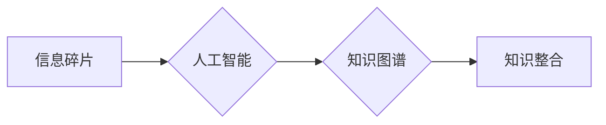

                 

## 知识的碎片化与整合：信息时代的矛盾

> 关键词：知识碎片化、信息整合、人工智能、深度学习、知识图谱、数据可视化、信息检索

### 1. 背景介绍

我们生活在一个信息爆炸的时代。互联网的普及和移动互联网的兴起，使得信息以前所未有的速度和规模涌入我们的生活。然而，这种信息泛滥也带来了一个新的挑战：知识的碎片化。

传统的学习模式依赖于书籍、课程等相对完整的知识体系。而如今，信息以碎片化的形式呈现，例如社交媒体上的短视频、新闻网站上的简短文章、在线论坛上的讨论等。这些碎片化的信息虽然丰富多彩，但缺乏上下文和关联性，难以形成完整的知识体系。

这种知识碎片化现象对个人学习、科研工作、企业决策等各个方面都产生了深远的影响。

* **个人学习:**  碎片化的信息难以帮助人们建立系统性的知识结构，导致学习效率低下，难以形成深入的理解。
* **科研工作:**  科研工作需要对大量信息进行整合和分析，而碎片化的信息难以满足这种需求，阻碍了科研进展。
* **企业决策:**  企业决策需要基于全面而准确的信息，而碎片化的信息难以提供完整的决策依据，可能导致决策失误。

### 2. 核心概念与联系

**2.1 知识的碎片化**

知识的碎片化是指知识以零散、孤立、缺乏关联性的形式存在。这些碎片化的知识单元可能包含事实、概念、观点等，但缺乏上下文和逻辑连接，难以形成完整的知识体系。

**2.2 信息整合**

信息整合是指将分散、零散的信息进行收集、整理、分析和组合，形成一个完整的、有意义的知识体系。信息整合的目标是消除信息之间的孤立性，建立知识之间的联系，从而提高信息的利用效率和价值。

**2.3 人工智能与知识整合**

人工智能技术，特别是深度学习技术，为信息整合提供了强大的工具。深度学习模型能够从海量数据中自动学习知识的结构和关系，并进行知识推理和推导，从而实现对知识的有效整合。

**2.4 知识图谱**

知识图谱是一种用于表示和组织知识的结构化数据模型。它将知识表示为实体和关系，并通过图结构连接这些实体和关系。知识图谱能够有效地存储和检索知识，并支持知识推理和查询。

**Mermaid 流程图**



### 3. 核心算法原理 & 具体操作步骤

**3.1 算法原理概述**

信息整合的核心算法原理是基于机器学习和知识表示技术的结合。

* **机器学习:**  利用机器学习算法从海量数据中学习知识的结构和关系。常见的机器学习算法包括：
    * **自然语言处理 (NLP):**  用于处理文本数据，提取关键词、实体、关系等信息。
    * **图神经网络 (GNN):**  用于学习图结构数据中的知识关系。
* **知识表示:**  将学习到的知识表示为结构化的知识图谱，以便于存储、检索和推理。

**3.2 算法步骤详解**

1. **数据收集:**  从各种来源收集相关信息，例如文本、图像、视频等。
2. **数据预处理:**  对收集到的数据进行清洗、格式化、标注等预处理工作。
3. **特征提取:**  利用 NLP 和 GNN 等算法从数据中提取关键词、实体、关系等特征。
4. **知识图谱构建:**  将提取的特征构建成知识图谱，其中实体和关系之间通过链接连接。
5. **知识推理:**  利用知识图谱进行知识推理，例如回答问题、预测关系等。
6. **知识整合:**  将来自不同来源的知识图谱进行整合，形成一个完整的知识体系。

**3.3 算法优缺点**

**优点:**

* **自动化:**  能够自动从海量数据中学习知识，提高效率。
* **智能化:**  能够进行知识推理和推导，提供更深入的理解。
* **可扩展性:**  能够处理海量数据和复杂知识关系。

**缺点:**

* **数据依赖:**  算法性能依赖于数据质量和数量。
* **解释性:**  深度学习模型的决策过程难以解释，缺乏透明度。
* **伦理问题:**  知识整合可能存在偏见和误导性问题，需要谨慎处理。

**3.4 算法应用领域**

* **教育:**  个性化学习、知识发现、智能问答。
* **科研:**  文献综述、知识挖掘、科学发现。
* **医疗:**  疾病诊断、药物研发、个性化治疗。
* **金融:**  风险评估、欺诈检测、投资决策。

### 4. 数学模型和公式 & 详细讲解 & 举例说明

**4.1 数学模型构建**

知识图谱可以表示为一个三元组 (实体, 关系, 实体) 的集合。

* 实体 (Entity):  知识图谱中的基本单元，代表现实世界中的事物或概念。
* 关系 (Relation):  实体之间的连接，描述实体之间的属性或联系。

**4.2 公式推导过程**

知识推理可以使用逻辑规则和语义网络进行。

* **逻辑规则:**  基于逻辑推理，从已知知识推导出新的知识。
* **语义网络:**  将知识表示为网络结构，通过网络路径进行知识推理。

**4.3 案例分析与讲解**

例如，假设我们有一个知识图谱，其中包含以下实体和关系：

* 实体：张三、李四、北京、上海
* 关系：居住在、工作在

我们可以使用逻辑规则进行知识推理：

* 如果张三居住在北京，并且李四工作在北京，则可以推导出张三和李四在同一个城市。

**4.4 举例说明**

知识图谱可以用于解决各种问题，例如：

* 查找与特定实体相关的知识。
* 预测实体之间的关系。
* 回答开放式问题。

### 5. 项目实践：代码实例和详细解释说明

**5.1 开发环境搭建**

* Python 3.x
* TensorFlow 或 PyTorch
* NetworkX 或 DGL

**5.2 源代码详细实现**

```python
import networkx as nx

# 创建知识图谱
graph = nx.Graph()

# 添加实体和关系
graph.add_node("张三")
graph.add_node("李四")
graph.add_node("北京")
graph.add_node("上海")

graph.add_edge("张三", "北京", relation="居住在")
graph.add_edge("李四", "北京", relation="工作在")

# 查找与特定实体相关的知识
neighbors = graph.neighbors("张三")
print(f"张三的邻居节点: {neighbors}")

# 预测实体之间的关系
path = nx.shortest_path(graph, source="张三", target="李四")
print(f"张三到李四的路径: {path}")
```

**5.3 代码解读与分析**

* 使用 NetworkX 库创建知识图谱。
* 添加实体和关系，并使用 `add_edge` 方法指定关系类型。
* 使用 `neighbors` 方法查找与特定实体相关的邻居节点。
* 使用 `shortest_path` 方法查找实体之间的最短路径。

**5.4 运行结果展示**

```
张三的邻居节点: ['北京']
张三到李四的路径: ['张三', '北京', '李四']
```

### 6. 实际应用场景

**6.1 个性化学习**

根据学生的学习习惯和知识掌握情况，推荐个性化的学习内容和学习路径。

**6.2 智能问答**

利用知识图谱和自然语言处理技术，构建智能问答系统，能够回答用户提出的各种问题。

**6.3 知识发现**

从海量数据中发现隐藏的知识和模式，为科研工作和决策提供支持。

**6.4 未来应用展望**

随着人工智能技术的不断发展，信息整合将应用于更广泛的领域，例如：

* **医疗诊断:**  利用知识图谱辅助医生进行疾病诊断，提高诊断准确率。
* **金融风险管理:**  利用知识图谱识别金融风险，降低金融风险。
* **智能城市:**  利用知识图谱构建智能城市，提高城市管理效率。

### 7. 工具和资源推荐

**7.1 学习资源推荐**

* **书籍:**  《知识图谱》 (张晓东)、《深度学习》 (Ian Goodfellow)
* **在线课程:**  Coursera、edX、Udacity

**7.2 开发工具推荐**

* **知识图谱构建工具:**  Protégé、GraphDB
* **机器学习框架:**  TensorFlow、PyTorch

**7.3 相关论文推荐**

* **知识图谱构建:**  "A Survey on Knowledge Graph Construction" (Wang et al., 2019)
* **知识推理:**  "Commonsense Reasoning with Knowledge Graphs" (Bordes et al., 2018)

### 8. 总结：未来发展趋势与挑战

**8.1 研究成果总结**

信息整合技术取得了显著进展，能够有效地处理海量数据，构建知识图谱，并进行知识推理。

**8.2 未来发展趋势**

* **更强大的机器学习算法:**  开发更强大的机器学习算法，能够从更复杂的数据中学习更丰富的知识。
* **更灵活的知识表示:**  探索更灵活的知识表示方法，能够更好地表达复杂的关系和概念。
* **更广泛的应用场景:**  将信息整合技术应用于更多领域，例如医疗、金融、教育等。

**8.3 面临的挑战**

* **数据质量:**  信息整合算法依赖于高质量的数据，而现实世界的数据往往存在噪声、不完整等问题。
* **解释性:**  深度学习模型的决策过程难以解释，缺乏透明度。
* **伦理问题:**  信息整合可能存在偏见和误导性问题，需要谨慎处理。

**8.4 研究展望**

未来研究将重点关注以下几个方面：

* 开发更鲁棒的算法，能够处理不完整和噪声数据。
* 提高模型的解释性，使模型的决策过程更加透明。
* 探索新的知识表示方法，能够更好地表达复杂的关系和概念。
* 研究信息整合的伦理问题，确保信息整合技术能够安全、公平地应用。


### 9. 附录：常见问题与解答

**9.1 如何构建知识图谱？**

知识图谱的构建过程包括数据收集、数据预处理、特征提取、知识表示等步骤。可以使用现有的知识图谱构建工具，也可以使用编程语言自行构建。

**9.2 如何进行知识推理？**

知识推理可以使用逻辑规则和语义网络进行。逻辑规则基于逻辑推理，从已知知识推导出新的知识。语义网络将知识表示为网络结构，通过网络路径进行知识推理。

**9.3 信息整合技术有哪些应用场景？**

信息整合技术应用于各个领域，例如个性化学习、智能问答、知识发现、医疗诊断、金融风险管理等。

**9.4 信息整合技术面临哪些挑战？**

信息整合技术面临数据质量、解释性、伦理问题等挑战。

**9.5 未来信息整合技术的发展趋势是什么？**

未来信息整合技术将朝着更强大的机器学习算法、更灵活的知识表示、更广泛的应用场景等方向发展。


作者：禅与计算机程序设计艺术 / Zen and the Art of Computer Programming 
<end_of_turn>

