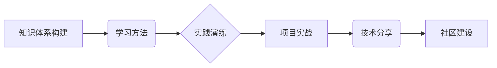

                 

## 程序员如何打造专业的技术培训体系

> 关键词：技术培训体系、程序员成长、知识体系构建、学习方法、实践演练、项目实战、技术分享、社区建设

## 1. 背景介绍

在当今科技日新月异的时代，程序员的职业发展面临着前所未有的挑战和机遇。随着技术的不断演进，新技术、新框架、新语言层出不穷，程序员需要不断学习和提升自身技能，才能保持竞争力。而专业的技术培训体系，正是程序员持续学习和成长的关键保障。

传统的技术培训模式往往以课堂授课为主，缺乏实践操作和项目实战的机会，难以满足程序员对实际应用场景的学习需求。此外，学习内容的更新速度也难以跟上技术发展趋势，导致学习效果不佳。

因此，打造专业的技术培训体系，对于程序员个人成长和企业技术发展都至关重要。

## 2. 核心概念与联系

专业的技术培训体系应包含以下核心概念：

* **知识体系构建:**  将技术知识按照逻辑关系和层次结构进行组织，形成完整的知识体系，方便程序员循序渐进地学习和掌握。
* **学习方法:**  提供多种学习方法，例如视频课程、在线文档、实践练习、项目实战等，满足不同学习风格和需求。
* **实践演练:**  注重实践操作，通过代码编写、项目开发等方式，帮助程序员将理论知识应用到实际场景中。
* **项目实战:**  以真实项目为载体，模拟实际工作环境，让程序员在项目中锻炼能力、积累经验。
* **技术分享:**  鼓励程序员之间互相学习、分享经验，构建技术交流平台，促进技术进步。
* **社区建设:**  建立线上线下技术社区，为程序员提供学习、交流、合作的平台，增强归属感和凝聚力。

**核心概念关系流程图:**

## 3. 核心算法原理 & 具体操作步骤

### 3.1  算法原理概述

算法是解决特定问题的一系列步骤或规则，是程序员编程的基础。掌握算法原理，能够帮助程序员更高效地编写代码，解决复杂问题。

### 3.2  算法步骤详解

算法的步骤详解通常包括以下几个方面：

* **输入:**  算法接受的初始数据。
* **处理:**  对输入数据进行一系列操作，例如排序、查找、计算等。
* **输出:**  算法最终产生的结果。

具体算法步骤的详解需要根据具体的算法类型进行描述。

### 3.3  算法优缺点

不同的算法具有不同的优缺点，需要根据实际问题选择合适的算法。

* **时间复杂度:**  算法执行所需的时间，通常用大O符号表示。
* **空间复杂度:**  算法执行所需的空间，通常用大O符号表示。
* **易读性:**  算法的代码是否易于理解和维护。

### 3.4  算法应用领域

算法广泛应用于各个领域，例如：

* **搜索引擎:**  用于网页排名、搜索结果排序等。
* **图像处理:**  用于图像识别、压缩、增强等。
* **机器学习:**  用于数据分析、预测、分类等。

## 4. 数学模型和公式 & 详细讲解 & 举例说明

数学模型和公式是描述算法和数据关系的重要工具，能够帮助程序员理解算法原理，优化算法性能。

### 4.1  数学模型构建

数学模型的构建需要根据实际问题进行抽象和概括，将问题中的关键要素用数学语言进行表达。

### 4.2  公式推导过程

公式推导过程需要遵循一定的逻辑规则，从已知条件出发，通过一系列数学运算，最终得到目标公式。

### 4.3  案例分析与讲解

通过具体的案例分析，可以更好地理解数学模型和公式的应用。

**举例说明:**

**线性回归模型:**

$$
y = mx + c
$$

其中：

* $y$ 是预测值
* $x$ 是输入变量
* $m$ 是斜率
* $c$ 是截距

**解释:**

线性回归模型是一种用于预测连续变量的回归模型。该模型假设输入变量和输出变量之间存在线性关系。通过最小二乘法，可以求解出斜率 $m$ 和截距 $c$ 的值，从而建立预测模型。

## 5. 项目实践：代码实例和详细解释说明

### 5.1  开发环境搭建

项目实践需要搭建相应的开发环境，例如安装编程语言、框架、工具等。

### 5.2  源代码详细实现

提供具体的代码实例，并进行详细的解释说明。

### 5.3  代码解读与分析

对代码进行解读和分析，讲解代码的逻辑结构、算法实现、数据处理等。

### 5.4  运行结果展示

展示代码运行的结果，并进行分析和解释。

## 6. 实际应用场景

### 6.1  行业应用

介绍该技术在不同行业中的应用场景。

### 6.2  案例分析

通过具体的案例分析，展示该技术的实际应用效果。

### 6.3  未来应用展望

展望该技术的未来发展趋势和应用前景。

## 7. 工具和资源推荐

### 7.1  学习资源推荐

推荐相关的学习资源，例如书籍、在线课程、博客等。

### 7.2  开发工具推荐

推荐相关的开发工具，例如IDE、版本控制系统、测试工具等。

### 7.3  相关论文推荐

推荐相关的学术论文，帮助程序员深入了解该技术的理论基础。

## 8. 总结：未来发展趋势与挑战

### 8.1  研究成果总结

总结该技术的研究成果，并进行展望。

### 8.2  未来发展趋势

展望该技术的未来发展趋势，例如新技术、新应用场景等。

### 8.3  面临的挑战

分析该技术面临的挑战，例如技术瓶颈、应用场景限制等。

### 8.4  研究展望

提出未来的研究方向和展望。

## 9. 附录：常见问题与解答

解答程序员在学习和应用该技术过程中可能遇到的常见问题。

作者：禅与计算机程序设计艺术 / Zen and the Art of Computer Programming 
<end_of_turn>

