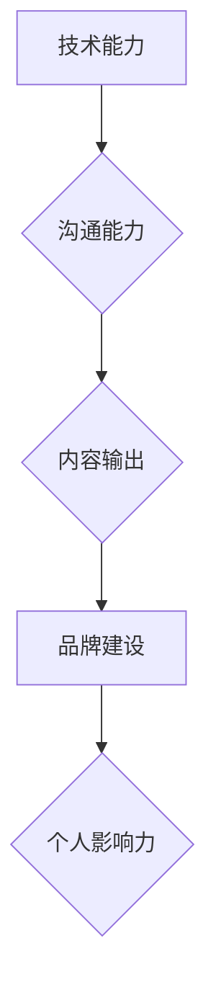

                 

## 程序员如何打造个人影响力

> 关键词：个人影响力、程序员、技术博客、开源贡献、社区参与、演讲分享、品牌建设、网络平台

### 1. 背景介绍

在当今科技日新月异的时代，程序员作为数字世界的构建者，肩负着塑造未来世界的责任。然而，在激烈的竞争环境中，仅仅拥有扎实的技术能力已不足以立于不败之地。如何提升个人价值，在技术领域树立影响力，成为众多程序员共同关注的话题。

个人影响力是指个人在特定领域或群体中所拥有的声望、认可度和影响力。对于程序员而言，个人影响力可以带来诸多好处，例如：

* **提升职业发展机会:** 拥有良好个人影响力的程序员更容易获得心仪的工作机会，并获得更高的薪资待遇。
* **拓展人脉资源:** 个人影响力可以帮助程序员建立广泛的人脉关系，与行业内其他优秀人才进行交流合作。
* **提升个人品牌价值:** 个人影响力可以帮助程序员打造个人品牌，提升个人价值和市场竞争力。
* **推动技术进步:** 个人影响力可以帮助程序员传播技术知识，推动技术进步和创新。

### 2. 核心概念与联系

打造个人影响力是一个系统工程，需要程序员从多个方面进行努力，包括技术能力、沟通能力、内容输出、品牌建设等。

**Mermaid 流程图：**



**核心概念原理和架构：**

* **技术能力:** 扎实的技术基础是个人影响力的基石。程序员需要不断学习新技术，提升自身技能，才能在竞争激烈的行业中脱颖而出。
* **沟通能力:** 优秀的沟通能力可以帮助程序员将自己的技术知识和见解有效地传达给他人，建立良好的个人形象。
* **内容输出:** 通过撰写技术博客、参与开源项目、录制视频教程等方式，程序员可以输出高质量的技术内容，吸引关注，建立个人品牌。
* **品牌建设:** 个人品牌是程序员在特定领域或群体中的独特标识。通过塑造个人形象、建立个人网站、参与行业活动等方式，程序员可以打造个人品牌，提升个人影响力。

### 3. 核心算法原理 & 具体操作步骤

打造个人影响力并非一蹴而就，需要程序员制定合理的策略，并逐步执行。以下是一些核心操作步骤：

**3.1 算法原理概述:**

打造个人影响力的核心算法可以概括为“内容+互动+传播”三要素。

* **内容:**  高质量的技术内容是吸引关注的关键。程序员需要根据自身专业领域和兴趣爱好，创作原创文章、视频、代码库等内容，并不断更新发布。
* **互动:**  积极参与技术社区，与其他程序员交流互动，分享经验，解答问题，建立人脉关系。
* **传播:**  利用社交媒体平台、技术论坛、邮件列表等渠道，推广自己的内容，扩大影响力。

**3.2 算法步骤详解:**

1. **明确目标受众:**  程序员需要确定自己想要影响的目标群体，例如初学者、经验丰富的开发人员、特定行业的用户等。
2. **选择合适的平台:**  根据目标受众的特点，选择合适的平台进行内容输出和互动，例如技术博客、GitHub、Stack Overflow、Twitter、LinkedIn等。
3. **创作高质量内容:**  程序员需要创作原创、有价值、易于理解的内容，并定期更新发布。
4. **积极参与社区:**  程序员需要积极参与技术社区，回答问题、分享经验、参与讨论，建立人脉关系。
5. **推广内容:**  程序员可以利用社交媒体平台、技术论坛、邮件列表等渠道，推广自己的内容，扩大影响力。
6. **持续学习和改进:**  程序员需要不断学习新技术、提升写作能力、掌握社交媒体运营技巧，不断改进自己的内容和互动方式。

**3.3 算法优缺点:**

* **优点:**  该算法简单易行，成本低，可以帮助程序员快速提升个人影响力。
* **缺点:**  需要程序员付出持续的努力，才能获得良好的效果。

**3.4 算法应用领域:**

该算法适用于所有希望提升个人影响力的程序员，无论其技术领域、经验水平或目标受众。

### 4. 数学模型和公式 & 详细讲解 & 举例说明

打造个人影响力是一个复杂的过程，可以抽象为一个数学模型，其中影响力可以看作是一个函数，取决于内容质量、互动频率、传播范围等多个因素。

**4.1 数学模型构建:**

```
影响力 = f(内容质量, 互动频率, 传播范围)
```

其中：

* **内容质量:**  指内容的原创性、价值、易读性等方面。
* **互动频率:**  指程序员与社区成员的互动频率，例如回复评论、参与讨论等。
* **传播范围:**  指程序员内容的传播范围，例如阅读量、转发量等。

**4.2 公式推导过程:**

该模型的具体公式推导过程较为复杂，需要考虑多个因素之间的相互影响关系。

**4.3 案例分析与讲解:**

假设有两个程序员A和B，他们都拥有相同的技术能力，但A更注重内容质量，B更注重互动频率。

* A的博客文章原创性高，价值丰富，但更新频率较低。
* B的博客文章质量一般，但更新频率高，并积极参与社区讨论。

根据上述模型，A的个人影响力可能在短期内较低，但随着时间的推移，其高质量的内容会积累更多关注和认可，最终获得更高的影响力。而B的个人影响力可能在短期内较高，但由于内容质量较低，其影响力可能难以持续增长。

### 5. 项目实践：代码实例和详细解释说明

为了更好地理解打造个人影响力的过程，我们可以通过一个实际项目来进行实践。

**5.1 开发环境搭建:**

* 选择一个合适的博客平台，例如WordPress、Medium、GitHub Pages等。
* 安装必要的开发工具，例如文本编辑器、版本控制系统等。

**5.2 源代码详细实现:**

* 编写高质量的技术博客文章，涵盖自身专业领域或兴趣爱好。
* 创建开源项目，并积极参与社区讨论。
* 利用社交媒体平台推广自己的内容和项目。

**5.3 代码解读与分析:**

* 博客文章的代码实现主要涉及HTML、CSS、JavaScript等前端技术，以及博客平台的API接口。
* 开源项目的代码实现则涉及到具体的编程语言和框架，例如Python、Java、React等。

**5.4 运行结果展示:**

* 博客文章的运行结果是展示在博客平台上的文章内容，可以吸引读者阅读和评论。
* 开源项目的运行结果是项目的功能实现，可以被其他开发者使用和改进。

### 6. 实际应用场景

打造个人影响力可以应用于各种实际场景，例如：

* **求职面试:**  拥有良好个人影响力的程序员更容易获得心仪的工作机会。
* **技术交流:**  个人影响力可以帮助程序员建立广泛的人脉关系，与其他技术人员进行交流合作。
* **创业项目:**  个人影响力可以帮助程序员推广自己的创业项目，吸引投资和用户。

**6.4 未来应用展望:**

随着人工智能、虚拟现实等技术的不断发展，个人影响力的打造方式也将更加多样化和智能化。

### 7. 工具和资源推荐

**7.1 学习资源推荐:**

* **书籍:**  《程序员如何打造个人影响力》、《技术博客写作指南》、《社交媒体营销实战》等。
* **在线课程:**  Coursera、Udemy、edX等平台提供各种技术博客写作、社交媒体营销等方面的在线课程。
* **博客和网站:**  Hacker News、Medium、GitHub等平台上有许多优秀的程序员分享他们的经验和见解。

**7.2 开发工具推荐:**

* **博客平台:**  WordPress、Medium、Ghost、Jekyll等。
* **版本控制系统:**  Git、GitHub、Bitbucket等。
* **协作工具:**  Slack、Discord、Trello等。

**7.3 相关论文推荐:**

* **影响力传播模型研究:**  Diffusion of Innovations by Everett Rogers
* **社交网络分析:**  Social Network Analysis by Mark Newman
* **内容营销策略:**  Content Marketing Institute

### 8. 总结：未来发展趋势与挑战

**8.1 研究成果总结:**

打造个人影响力是一个持续发展的过程，需要程序员不断学习和实践。通过内容输出、互动交流、品牌建设等方式，程序员可以提升自身价值，在技术领域树立影响力。

**8.2 未来发展趋势:**

* **人工智能:**  人工智能技术将进一步改变个人影响力的打造方式，例如自动生成内容、智能推荐等。
* **虚拟现实:**  虚拟现实技术将为程序员提供更沉浸式的互动体验，例如虚拟会议、在线培训等。
* **元宇宙:**  元宇宙将为程序员提供一个全新的平台，可以打造虚拟形象、参与虚拟活动，并建立虚拟社区。

**8.3 面临的挑战:**

* **信息爆炸:**  随着互联网信息量的不断增长，程序员需要更加努力地打造高质量的内容，才能脱颖而出。
* **竞争加剧:**  随着越来越多的程序员开始关注个人影响力，竞争将更加激烈。
* **技术更新:**  技术发展日新月异，程序员需要不断学习新技术，才能保持竞争力。

**8.4 研究展望:**

未来，研究人员将继续探索打造个人影响力的更有效的方法，例如利用大数据分析、个性化推荐等技术，帮助程序员更精准地定位目标受众，并提供更个性化的内容和服务。

### 9. 附录：常见问题与解答

**常见问题:**

* 如何提高内容质量？
* 如何建立人脉关系？
* 如何推广自己的内容？

**解答:**

* **提高内容质量:**  

   * 撰写原创、有价值、易于理解的内容。
   * 关注读者需求，提供有帮助的信息。
   * 优化内容格式，提高阅读体验。

* **建立人脉关系:**  

   * 积极参与技术社区，例如Stack Overflow、GitHub等。
   * 参加行业活动，例如技术会议、研讨会等。
   * 与其他程序员进行线上线下交流。

* **推广自己的内容:**  

   * 利用社交媒体平台，例如Twitter、LinkedIn等，推广自己的博客文章和开源项目。
   * 撰写技术博客文章，并提交给技术网站和期刊。
   * 参加技术论坛，分享自己的经验和见解。


作者：禅与计算机程序设计艺术 / Zen and the Art of Computer Programming 
<end_of_turn>

