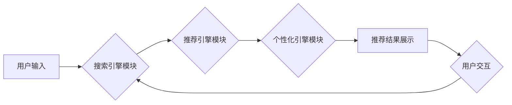

                 

## AI 大模型在电商搜索推荐中的用户体验优化：以用户需求为中心的设计

> 关键词：电商搜索推荐、大模型、用户体验、需求驱动、个性化推荐、算法优化、深度学习、自然语言处理

## 1. 背景介绍

电子商务的蓬勃发展催生了对高效、精准的搜索推荐系统的巨大需求。传统的基于关键词匹配的搜索引擎难以满足用户日益复杂的搜索需求，尤其是在海量商品信息面前。近年来，大模型技术在自然语言处理、计算机视觉等领域取得了突破性进展，为电商搜索推荐带来了新的机遇。

大模型，指的是参数规模庞大、训练数据海量的人工智能模型。其强大的学习能力和泛化能力使其能够理解用户意图、挖掘商品特征，并提供更精准、个性化的推荐结果。

然而，将大模型应用于电商搜索推荐并非易事。需要考虑用户体验、数据隐私、模型可解释性等诸多因素。本文将深入探讨大模型在电商搜索推荐中的应用，重点关注以用户需求为中心的优化设计，旨在提升用户体验，打造更智能、更人性化的电商搜索推荐系统。

## 2. 核心概念与联系

### 2.1  电商搜索推荐系统

电商搜索推荐系统是帮助用户快速找到所需商品的系统，它通常由以下几个模块组成：

* **搜索引擎模块:** 处理用户输入的搜索词，并根据关键词匹配、语义理解等算法返回相关商品列表。
* **推荐引擎模块:** 基于用户历史行为、商品特征、实时数据等信息，为用户推荐个性化的商品列表。
* **个性化引擎模块:** 根据用户的兴趣偏好、购买习惯等信息，对搜索结果和推荐结果进行个性化排序和展示。
* **用户交互模块:** 收集用户点击、浏览、购买等行为数据，并反馈给推荐引擎模块，用于模型训练和优化。

### 2.2  大模型在电商搜索推荐中的应用

大模型可以应用于电商搜索推荐系统的各个模块，提升系统的整体性能。

* **搜索引擎模块:** 利用大模型的语义理解能力，可以更准确地理解用户的搜索意图，并返回更相关的商品结果。
* **推荐引擎模块:** 大模型可以学习用户和商品之间的复杂关系，并根据用户的历史行为、兴趣偏好等信息，提供更精准、更个性化的商品推荐。
* **个性化引擎模块:** 大模型可以学习用户的个性化特征，并根据用户的不同场景和需求，对搜索结果和推荐结果进行个性化排序和展示。

### 2.3  大模型架构



## 3. 核心算法原理 & 具体操作步骤

### 3.1  算法原理概述

大模型在电商搜索推荐中的应用主要基于深度学习算法，例如Transformer、BERT等。这些算法能够学习用户和商品之间的复杂关系，并根据用户的历史行为、兴趣偏好等信息，提供更精准、更个性化的推荐结果。

### 3.2  算法步骤详解

1. **数据预处理:** 收集用户行为数据、商品信息数据等，并进行清洗、转换、编码等预处理操作。
2. **模型训练:** 使用深度学习算法训练大模型，输入预处理后的数据，并输出推荐结果。
3. **模型评估:** 使用测试数据评估模型的性能，例如准确率、召回率、点击率等指标。
4. **模型优化:** 根据评估结果，调整模型参数、训练策略等，不断优化模型性能。
5. **部署上线:** 将训练好的模型部署到生产环境，并实时提供推荐服务。

### 3.3  算法优缺点

**优点:**

* **精准度高:** 大模型能够学习用户和商品之间的复杂关系，提供更精准的推荐结果。
* **个性化强:** 大模型可以根据用户的历史行为、兴趣偏好等信息，提供个性化的推荐服务。
* **泛化能力强:** 大模型在训练数据上取得了良好的性能，能够应用于不同的电商平台和场景。

**缺点:**

* **训练成本高:** 大模型的参数规模庞大，训练数据海量，需要大量的计算资源和时间。
* **可解释性低:** 大模型的决策过程较为复杂，难以解释其推荐结果背后的逻辑。
* **数据依赖性强:** 大模型的性能依赖于训练数据的质量和数量，如果训练数据不足或质量低，模型性能会受到影响。

### 3.4  算法应用领域

大模型在电商搜索推荐领域的应用非常广泛，例如：

* **商品推荐:** 根据用户的历史购买记录、浏览记录等信息，推荐相关的商品。
* **搜索结果排序:** 根据用户的搜索意图和商品特征，对搜索结果进行排序，提升用户体验。
* **个性化广告推荐:** 根据用户的兴趣偏好和行为特征，推荐个性化的广告。
* **新品推荐:** 根据用户的购买习惯和市场趋势，推荐新品。

## 4. 数学模型和公式 & 详细讲解 & 举例说明

### 4.1  数学模型构建

在电商搜索推荐系统中，常用的数学模型包括协同过滤模型、内容推荐模型、混合推荐模型等。

* **协同过滤模型:** 基于用户的历史行为数据，预测用户对商品的评分或购买意愿。
* **内容推荐模型:** 基于商品的特征信息，预测用户对商品的兴趣。
* **混合推荐模型:** 将协同过滤模型和内容推荐模型相结合，提升推荐效果。

### 4.2  公式推导过程

协同过滤模型中常用的公式包括：

* **用户-商品评分预测:**

$$
\hat{r}_{u,i} = \mu + b_u + b_i + \epsilon_{u,i}
$$

其中：

* $\hat{r}_{u,i}$ 是预测用户 $u$ 对商品 $i$ 的评分。
* $\mu$ 是全局平均评分。
* $b_u$ 是用户 $u$ 的偏差。
* $b_i$ 是商品 $i$ 的偏差。
* $\epsilon_{u,i}$ 是预测误差。

### 4.3  案例分析与讲解

假设用户 $A$ 购买了商品 $X$ 和 $Y$，评分分别为 5 和 4。用户 $B$ 购买了商品 $Y$ 和 $Z$，评分分别为 4 和 3。如果想要预测用户 $A$ 对商品 $Z$ 的评分，可以使用协同过滤模型进行预测。

首先，需要计算全局平均评分 $\mu$、用户 $A$ 的偏差 $b_A$、商品 $Z$ 的偏差 $b_Z$。然后，将这些值代入公式，即可得到用户 $A$ 对商品 $Z$ 的评分预测值。

## 5. 项目实践：代码实例和详细解释说明

### 5.1  开发环境搭建

* **操作系统:** Ubuntu 20.04
* **编程语言:** Python 3.8
* **深度学习框架:** TensorFlow 2.0
* **其他工具:** Jupyter Notebook、Git

### 5.2  源代码详细实现

```python
import tensorflow as tf

# 定义模型结构
model = tf.keras.Sequential([
    tf.keras.layers.Embedding(input_dim=vocab_size, output_dim=embedding_dim),
    tf.keras.layers.LSTM(units=128),
    tf.keras.layers.Dense(units=1, activation='sigmoid')
])

# 编译模型
model.compile(optimizer='adam', loss='binary_crossentropy', metrics=['accuracy'])

# 训练模型
model.fit(x_train, y_train, epochs=10, batch_size=32)

# 评估模型
loss, accuracy = model.evaluate(x_test, y_test)
print('Loss:', loss)
print('Accuracy:', accuracy)
```

### 5.3  代码解读与分析

* **Embedding层:** 将用户和商品的ID转换为稠密的向量表示，用于捕捉用户和商品之间的语义关系。
* **LSTM层:** 利用长短期记忆网络，学习用户历史行为的序列信息，并预测用户对商品的兴趣。
* **Dense层:** 将LSTM层的输出映射到一个0-1之间的值，表示用户对商品的购买概率。
* **编译模型:** 使用Adam优化器、二元交叉熵损失函数和准确率作为评估指标。
* **训练模型:** 使用训练数据训练模型，并设置训练轮数和批处理大小。
* **评估模型:** 使用测试数据评估模型的性能，并打印损失和准确率。

### 5.4  运行结果展示

训练完成后，可以将模型部署到生产环境，并实时提供推荐服务。

## 6. 实际应用场景

### 6.1  个性化商品推荐

根据用户的历史购买记录、浏览记录、收藏记录等信息，为用户推荐个性化的商品。例如，如果用户经常购买运动鞋，系统可以推荐相关的运动服、运动配件等商品。

### 6.2  搜索结果排序

根据用户的搜索意图和商品特征，对搜索结果进行排序，提升用户体验。例如，如果用户搜索“手机”，系统可以优先推荐用户感兴趣的手机品牌、型号等信息。

### 6.3  新品推荐

根据用户的购买习惯和市场趋势，推荐新品。例如，如果用户购买了某款品牌的手机，系统可以推荐该品牌的最新款手机。

### 6.4  未来应用展望

随着大模型技术的不断发展，其在电商搜索推荐领域的应用将更加广泛和深入。例如：

* **多模态推荐:** 将文本、图像、视频等多模态数据融合，提供更丰富的推荐结果。
* **实时推荐:** 基于用户的实时行为数据，提供更精准、更及时地推荐服务。
* **个性化营销:** 基于用户的兴趣偏好和购买习惯，提供个性化的营销服务。

## 7. 工具和资源推荐

### 7.1  学习资源推荐

* **书籍:**

    * 《深度学习》
    * 《自然语言处理》
    * 《推荐系统》

* **在线课程:**

    * Coursera: 深度学习
    * Udacity: 自然语言处理
    * edX: 推荐系统

### 7.2  开发工具推荐

* **深度学习框架:** TensorFlow, PyTorch, Keras
* **数据处理工具:** Pandas, NumPy
* **云计算平台:** AWS, Azure, Google Cloud

### 7.3  相关论文推荐

* **BERT: Pre-training of Deep Bidirectional Transformers for Language Understanding**
* **Transformer: Attention Is All You Need**
* **Collaborative Filtering for Recommender Systems**

## 8. 总结：未来发展趋势与挑战

### 8.1  研究成果总结

大模型在电商搜索推荐领域取得了显著的成果，能够提供更精准、更个性化的推荐服务，提升用户体验。

### 8.2  未来发展趋势

* **模型规模和能力的提升:** 大模型的参数规模和训练数据量将继续增加，模型的学习能力和泛化能力将得到进一步提升。
* **多模态融合:** 将文本、图像、视频等多模态数据融合，提供更丰富的推荐结果。
* **实时推荐:** 基于用户的实时行为数据，提供更精准、更及时地推荐服务。
* **可解释性增强:** 研究大模型的决策过程，提高模型的可解释性，增强用户对推荐结果的信任。

### 8.3  面临的挑战

* **训练成本高:** 大模型的训练成本非常高，需要大量的计算资源和时间。
* **数据隐私问题:** 大模型的训练需要大量用户数据，如何保护用户隐私是一个重要的挑战。
* **模型可解释性低:** 大模型的决策过程较为复杂，难以解释其推荐结果背后的逻辑。

### 8.4  研究展望

未来，需要继续研究大模型在电商搜索推荐领域的应用，探索更有效的模型架构、训练策略和评估指标，并解决模型训练成本高、数据隐私问题和模型可解释性低等挑战。


## 9. 附录：常见问题与解答

**Q1: 大模型的训练需要多少数据？**

A1: 大模型的训练数据量通常非常庞大，需要数百万甚至数十亿条数据。

**Q2: 如何保护用户隐私？**

A2: 在训练大模型时，需要采取措施保护用户隐私，例如数据脱敏、联邦学习等。

**Q3: 如何评估大模型的性能？**

A3: 大模型的性能可以评估指标包括准确率、召回率、点击率等。

**作者：禅与计算机程序设计艺术 / Zen and the Art of Computer Programming**<end_of_turn>

