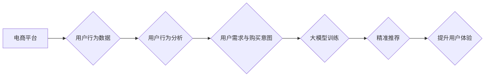

                 

## AI 大模型在电商搜索推荐中的用户行为分析：理解用户需求与购买意图

> 关键词：电商搜索推荐、用户行为分析、大模型、自然语言处理、推荐系统、购买意图、需求理解

## 1. 背景介绍

在当今数字经济时代，电商平台已成为人们获取商品和服务的首选方式。搜索推荐作为电商平台的核心功能之一，直接影响着用户体验和商业转化率。传统的搜索推荐系统主要依赖于商品特征和用户历史行为数据，但这些方法往往难以捕捉用户复杂的需求和潜在的购买意图。

近年来，大模型技术在自然语言处理领域取得了突破性进展，其强大的语义理解和文本生成能力为电商搜索推荐带来了新的机遇。大模型能够从海量用户行为数据中学习用户需求和偏好，并生成更精准、更个性化的推荐结果。

## 2. 核心概念与联系

### 2.1  电商搜索推荐

电商搜索推荐是指根据用户搜索关键词和历史行为数据，为用户推荐相关商品的系统。其目标是提高用户搜索结果的准确性和相关性，引导用户找到所需商品并完成购买。

### 2.2  用户行为分析

用户行为分析是指通过收集和分析用户在电商平台上的行为数据，例如搜索记录、浏览历史、购买记录、评价等，以了解用户需求、偏好和购物习惯。

### 2.3  大模型

大模型是指在海量数据上训练的深度学习模型，其参数数量巨大，能够学习复杂的语义关系和模式。

**核心概念与联系流程图**



## 3. 核心算法原理 & 具体操作步骤

### 3.1  算法原理概述

大模型在电商搜索推荐中的核心算法主要包括：

* **Transformer模型**: Transformer模型是一种基于注意力机制的深度学习模型，能够有效捕捉文本序列中的长距离依赖关系，在自然语言理解和生成任务中表现出色。
* **BERT模型**: BERT模型是一种预训练的Transformer模型，通过在大量的文本数据上进行自监督学习，学习了丰富的语言表示。
* **推荐算法**: 常见的推荐算法包括协同过滤、内容过滤和基于知识图谱的推荐等。大模型可以结合这些算法，提升推荐的准确性和个性化程度。

### 3.2  算法步骤详解

1. **数据收集与预处理**: 收集用户行为数据，包括搜索记录、浏览历史、购买记录、评价等，并进行清洗、格式化和特征提取。
2. **模型训练**: 使用Transformer模型或BERT模型对用户行为数据进行训练，学习用户需求和偏好。
3. **特征融合**: 将大模型学习到的用户特征与商品特征进行融合，构建更全面的商品描述。
4. **推荐排序**: 使用推荐算法对融合后的特征进行排序，生成个性化的商品推荐列表。
5. **结果展示**: 将推荐结果展示给用户，并根据用户反馈进行模型优化。

### 3.3  算法优缺点

**优点**:

* 能够捕捉用户复杂的需求和潜在的购买意图。
* 推荐结果更精准、更个性化。
* 提升用户体验和商业转化率。

**缺点**:

* 数据需求量大，训练成本高。
* 模型解释性较差，难以理解推荐结果背后的逻辑。
* 存在数据偏差和公平性问题。

### 3.4  算法应用领域

大模型在电商搜索推荐领域的应用不仅限于商品推荐，还可以应用于：

* **搜索结果排序**: 根据用户搜索意图，对搜索结果进行排序，提升搜索效率。
* **个性化商品展示**: 根据用户的兴趣爱好和购买历史，展示个性化的商品推荐。
* **用户画像构建**: 通过分析用户行为数据，构建用户画像，为用户提供更精准的服务。
* **营销活动推荐**: 根据用户的行为特征，推荐相关的营销活动，提升营销效果。

## 4. 数学模型和公式 & 详细讲解 & 举例说明

### 4.1  数学模型构建

大模型在电商搜索推荐中的数学模型通常基于深度学习框架，例如TensorFlow或PyTorch。模型结构通常包括多个Transformer层或BERT层，以及一个输出层，用于生成推荐结果。

### 4.2  公式推导过程

由于大模型的复杂性，其公式推导过程通常涉及大量的数学和统计知识，难以在本文中详细阐述。

### 4.3  案例分析与讲解

假设我们有一个电商平台，用户搜索关键词为“运动鞋”。大模型可以根据用户的搜索历史、浏览记录和购买记录，学习到用户对运动鞋的偏好，例如品牌、款式、颜色等。

然后，大模型可以根据这些偏好，从平台上所有运动鞋商品中筛选出最符合用户需求的商品，并生成一个推荐列表。

## 5. 项目实践：代码实例和详细解释说明

### 5.1  开发环境搭建

* Python 3.7+
* TensorFlow 2.0+
* PyTorch 1.0+
* CUDA Toolkit 10.2+

### 5.2  源代码详细实现

```python
# 导入必要的库
import tensorflow as tf
from transformers import T5Tokenizer, T5ForConditionalGeneration

# 加载预训练模型
tokenizer = T5Tokenizer.from_pretrained("t5-base")
model = T5ForConditionalGeneration.from_pretrained("t5-base")

# 定义输入数据
input_text = "运动鞋"

# 对输入文本进行编码
input_ids = tokenizer.encode(input_text, return_tensors="tf")

# 使用模型生成推荐结果
output = model.generate(input_ids=input_ids)

# 将输出结果解码
recommended_items = tokenizer.decode(output[0], skip_special_tokens=True)

# 打印推荐结果
print(recommended_items)
```

### 5.3  代码解读与分析

* 该代码示例使用预训练的T5模型进行商品推荐。
* 首先，加载预训练的T5模型和Tokenizer。
* 然后，对用户输入的关键词进行编码。
* 最后，使用模型生成推荐结果，并解码成可读文本。

### 5.4  运行结果展示

运行该代码后，将输出一个包含推荐商品的文本列表。例如：

```
运动鞋推荐：Nike Air Max 90、Adidas Ultraboost、Puma Suede Classic
```

## 6. 实际应用场景

大模型在电商搜索推荐中的应用场景非常广泛，例如：

* **个性化商品推荐**: 根据用户的兴趣爱好和购买历史，推荐个性化的商品。
* **搜索结果优化**: 根据用户的搜索意图，优化搜索结果排序，提升搜索效率。
* **新品推荐**: 根据用户的购买偏好，推荐平台上的新品。
* **跨界推荐**: 根据用户的兴趣爱好，推荐与电商商品相关的其他服务，例如旅游、餐饮等。

### 6.4  未来应用展望

随着大模型技术的不断发展，其在电商搜索推荐领域的应用将更加广泛和深入。未来，大模型可能能够：

* 更精准地理解用户的需求和意图。
* 生成更个性化、更符合用户偏好的推荐结果。
* 与其他人工智能技术结合，例如计算机视觉和语音识别，提供更全面的用户体验。

## 7. 工具和资源推荐

### 7.1  学习资源推荐

* **论文**:
    * Vaswani, A., Shazeer, N., Parmar, N., Uszkoreit, J., Jones, L., Gomez, A. N., ... & Polosukhin, I. (2017). Attention is all you need. Advances in neural information processing systems, 30.
    * Devlin, J., Chang, M. W., Lee, K., & Toutanova, K. (2018). BERT: Pre-training of deep bidirectional transformers for language understanding. arXiv preprint arXiv:1810.04805.
* **在线课程**:
    * deeplearning.ai
    * fast.ai
* **书籍**:
    * Deep Learning by Ian Goodfellow, Yoshua Bengio, and Aaron Courville
    * Natural Language Processing with Python by Steven Bird, Ewan Klein, and Edward Loper

### 7.2  开发工具推荐

* **TensorFlow**: https://www.tensorflow.org/
* **PyTorch**: https://pytorch.org/
* **Hugging Face Transformers**: https://huggingface.co/transformers/

### 7.3  相关论文推荐

* **BERT**: Devlin et al. (2018)
* **T5**: Raffel et al. (2019)
* **XLNet**: Yang et al. (2019)
* **RoBERTa**: Liu et al. (2019)

## 8. 总结：未来发展趋势与挑战

### 8.1  研究成果总结

大模型在电商搜索推荐领域取得了显著的成果，能够提升推荐的精准度和个性化程度，为用户提供更优质的购物体验。

### 8.2  未来发展趋势

* **模型规模和能力的提升**: 未来，大模型的规模和能力将继续提升，能够更好地理解用户需求和生成更精准的推荐结果。
* **多模态融合**: 大模型将与其他模态数据，例如图像、视频和音频，进行融合，提供更全面的用户体验。
* **可解释性增强**: 研究者将致力于提高大模型的可解释性，使推荐结果更加透明和可理解。

### 8.3  面临的挑战

* **数据隐私和安全**: 大模型训练需要海量用户数据，如何保护用户隐私和数据安全是一个重要的挑战。
* **算法公平性和偏见**: 大模型可能存在算法公平性和偏见问题，需要进行充分的测试和评估，确保推荐结果公平公正。
* **模型部署和维护**: 大模型的部署和维护成本较高，需要开发更有效的部署和维护方案。

### 8.4  研究展望

未来，大模型在电商搜索推荐领域的应用将更加广泛和深入，为用户提供更智能、更个性化的购物体验。


## 9. 附录：常见问题与解答

**Q1: 大模型的训练成本很高吗？**

A1: 确实，大模型的训练成本较高，需要大量的计算资源和时间。

**Q2: 如何保证大模型的推荐结果公平公正？**

A2: 这个问题是一个重要的研究方向，需要进行充分的测试和评估，并采取措施 mitigating 算法偏见。

**Q3: 大模型的推荐结果是否可解释？**

A3: 目前，大模型的推荐结果解释性较差，这是一个需要进一步研究的课题。


作者：禅与计算机程序设计艺术 / Zen and the Art of Computer Programming 
<end_of_turn>

