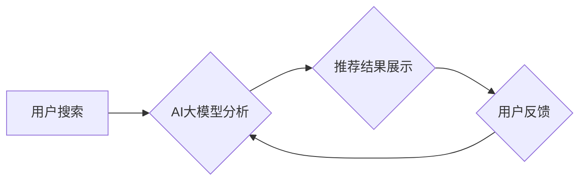

                 

## AI大模型赋能电商搜索推荐的业务创新流程优化工具选型

> 关键词：AI大模型、电商搜索推荐、业务流程优化、工具选型、推荐算法、深度学习、自然语言处理

## 1. 背景介绍

随着电商行业的蓬勃发展，用户对商品搜索和推荐的需求日益增长。传统的基于关键词匹配和协同过滤的推荐算法已难以满足用户个性化、精准化的需求。而近年来，深度学习技术的发展为电商搜索推荐带来了新的机遇。

AI大模型，作为深度学习技术的代表，凭借其强大的语义理解、知识表示和泛化能力，能够有效提升电商搜索推荐的精准度、个性化程度和用户体验。

然而，在实际应用中，选择合适的AI大模型和工具对于电商搜索推荐的业务创新流程优化至关重要。

## 2. 核心概念与联系

### 2.1  电商搜索推荐

电商搜索推荐是指在电商平台上，根据用户的搜索行为、浏览历史、购买记录等信息，为用户推荐相关商品的过程。其目的是提高用户购物体验，促进商品销售。

### 2.2  AI大模型

AI大模型是指在海量数据上训练的深度学习模型，具有强大的泛化能力和学习能力。常见的AI大模型包括：

* **Transformer模型**: 擅长处理自然语言文本，例如BERT、GPT-3等。
* **图神经网络**: 擅长处理关系数据，例如知识图谱嵌入。
* **多模态模型**: 能够处理多种数据类型，例如文本、图像、音频等。

### 2.3  业务流程优化

业务流程优化是指通过分析和改进现有业务流程，提高效率、降低成本、提升用户体验的过程。

**AI大模型赋能电商搜索推荐的业务流程优化流程图:**



## 3. 核心算法原理 & 具体操作步骤

### 3.1  算法原理概述

AI大模型赋能电商搜索推荐的核心算法原理主要包括：

* **语义理解**: 利用自然语言处理技术，理解用户的搜索意图和商品描述的语义。
* **知识表示**: 将商品信息、用户偏好等信息表示为知识图谱，以便模型进行推理和分析。
* **推荐模型**: 利用深度学习算法，构建推荐模型，预测用户对商品的兴趣和点击概率。

### 3.2  算法步骤详解

1. **数据预处理**: 收集用户搜索、浏览、购买等数据，并进行清洗、转换、特征提取等预处理操作。
2. **模型训练**: 利用预处理后的数据，训练AI大模型，例如BERT、GPT-3等，使其能够理解用户搜索意图和商品语义。
3. **推荐结果生成**: 根据用户的搜索词和历史行为，利用训练好的AI大模型，生成推荐结果列表。
4. **结果排序**: 对推荐结果进行排序，将用户最感兴趣的商品排在前面。
5. **结果展示**: 将排序后的推荐结果展示给用户。

### 3.3  算法优缺点

**优点**:

* **精准度提升**: AI大模型能够理解用户搜索的深层意图，提高推荐的精准度。
* **个性化程度增强**: AI大模型能够根据用户的历史行为和偏好，提供个性化的推荐。
* **用户体验提升**: AI大模型能够提供更丰富的推荐结果，提升用户购物体验。

**缺点**:

* **数据依赖**: AI大模型需要海量数据进行训练，数据质量直接影响模型性能。
* **计算资源消耗**: 训练和部署AI大模型需要大量的计算资源。
* **模型解释性**: AI大模型的决策过程较为复杂，难以解释其推荐结果背后的逻辑。

### 3.4  算法应用领域

AI大模型赋能电商搜索推荐的算法应用领域广泛，包括：

* **商品推荐**: 根据用户的搜索历史、浏览记录、购买记录等信息，推荐相关的商品。
* **个性化营销**: 根据用户的兴趣爱好、消费习惯等信息，进行个性化的营销推广。
* **内容推荐**: 根据用户的阅读习惯、观看记录等信息，推荐相关的文章、视频等内容。

## 4. 数学模型和公式 & 详细讲解 & 举例说明

### 4.1  数学模型构建

在电商搜索推荐中，常用的数学模型包括：

* **协同过滤**: 基于用户的历史行为和商品的相似度进行推荐。
* **基于内容的推荐**: 基于商品的特征和用户的兴趣偏好进行推荐。
* **深度学习模型**: 利用深度神经网络，学习用户和商品之间的复杂关系进行推荐。

### 4.2  公式推导过程

**协同过滤模型**:

假设用户u对商品i的评分为r(u, i)，则协同过滤模型的目标是预测用户u对商品j的评分r(u, j)。

常用的协同过滤算法包括：

* **基于用户的协同过滤**: 寻找与用户u兴趣相似的用户，并推荐他们喜欢的商品。
* **基于物品的协同过滤**: 寻找与商品j相似的商品，并推荐用户喜欢的这些商品。

**基于内容的推荐模型**:

假设商品i的特征向量为x(i)，用户的兴趣偏好向量为y(u)，则基于内容的推荐模型的目标是计算用户u对商品i的兴趣评分。

常用的基于内容的推荐算法包括：

* **余弦相似度**: 计算商品特征向量和用户兴趣偏好向量的余弦相似度，作为推荐评分。
* **点积**: 计算商品特征向量和用户兴趣偏好向量的点积，作为推荐评分。

### 4.3  案例分析与讲解

**案例**: 假设用户A喜欢购买运动鞋，用户B喜欢购买篮球。

* **协同过滤**: 如果用户A和用户B都购买了同一款篮球鞋，则协同过滤模型会预测用户A也喜欢购买篮球。
* **基于内容**: 如果运动鞋和篮球的特征向量相似，则基于内容的推荐模型会推荐用户A购买篮球。

## 5. 项目实践：代码实例和详细解释说明

### 5.1  开发环境搭建

* **操作系统**: Linux/macOS
* **编程语言**: Python
* **深度学习框架**: TensorFlow/PyTorch
* **数据存储**: MySQL/MongoDB

### 5.2  源代码详细实现

```python
# 使用BERT模型进行商品推荐
from transformers import AutoTokenizer, AutoModel

# 加载预训练模型
tokenizer = AutoTokenizer.from_pretrained("bert-base-uncased")
model = AutoModel.from_pretrained("bert-base-uncased")

# 用户搜索词
query = "运动鞋"

# 将搜索词转换为BERT输入格式
input_ids = tokenizer.encode(query, add_special_tokens=True)

# 将输入数据送入模型进行推理
outputs = model(input_ids)

# 从模型输出中提取特征向量
embedding = outputs.last_hidden_state[:, 0, :]

# 计算商品与用户搜索词的相似度
# ...

# 根据相似度排序推荐商品
# ...
```

### 5.3  代码解读与分析

* **加载预训练模型**: 使用transformers库加载预训练的BERT模型和词典。
* **文本预处理**: 将用户搜索词转换为BERT模型可以理解的格式。
* **模型推理**: 将预处理后的文本输入BERT模型，获取商品的特征向量。
* **相似度计算**: 使用余弦相似度等方法计算商品与用户搜索词的相似度。
* **结果排序**: 根据相似度排序推荐商品。

### 5.4  运行结果展示

运行代码后，将展示与用户搜索词相关的商品推荐列表。

## 6. 实际应用场景

### 6.1  电商平台搜索推荐

AI大模型可以用于电商平台的商品搜索推荐，提高用户购物体验和转化率。

### 6.2  个性化营销

AI大模型可以根据用户的兴趣爱好和消费习惯，进行个性化的营销推广，提高营销效果。

### 6.3  内容推荐

AI大模型可以根据用户的阅读习惯和观看记录，推荐相关的文章、视频等内容，提升用户粘性和活跃度。

### 6.4  未来应用展望

AI大模型在电商搜索推荐领域的应用前景广阔，未来将朝着以下方向发展：

* **多模态推荐**: 将文本、图像、音频等多种数据类型融合，提供更丰富的推荐结果。
* **实时推荐**: 利用实时数据流，进行动态的推荐更新，提升推荐的时效性。
* **解释性推荐**: 提高AI大模型的解释性，让用户能够理解推荐结果背后的逻辑。

## 7. 工具和资源推荐

### 7.1  学习资源推荐

* **书籍**:
    * 深度学习
    * 自然语言处理
* **在线课程**:
    * Coursera
    * edX
    * fast.ai

### 7.2  开发工具推荐

* **深度学习框架**: TensorFlow, PyTorch
* **自然语言处理库**: NLTK, spaCy
* **数据可视化工具**: Matplotlib, Seaborn

### 7.3  相关论文推荐

* BERT: Pre-training of Deep Bidirectional Transformers for Language Understanding
* GPT-3: Language Models are Few-Shot Learners
* Transformer: Attention Is All You Need

## 8. 总结：未来发展趋势与挑战

### 8.1  研究成果总结

AI大模型赋能电商搜索推荐取得了显著成果，提升了推荐的精准度、个性化程度和用户体验。

### 8.2  未来发展趋势

未来，AI大模型在电商搜索推荐领域将朝着多模态、实时、解释性等方向发展。

### 8.3  面临的挑战

* **数据质量**: AI大模型需要海量高质量数据进行训练，数据质量直接影响模型性能。
* **计算资源**: 训练和部署AI大模型需要大量的计算资源，成本较高。
* **模型解释性**: AI大模型的决策过程较为复杂，难以解释其推荐结果背后的逻辑。

### 8.4  研究展望

未来研究将重点关注解决上述挑战，提高AI大模型在电商搜索推荐领域的应用效果。

## 9. 附录：常见问题与解答

### 9.1  Q1: 如何选择合适的AI大模型？

**A1**: 选择合适的AI大模型需要根据具体业务场景和数据特点进行评估。

### 9.2  Q2: 如何评估AI大模型的性能？

**A2**: 可以使用准确率、召回率、F1-score等指标评估AI大模型的性能。

### 9.3  Q3: 如何解决AI大模型的解释性问题？

**A3**: 可以使用可解释AI技术，例如LIME、SHAP等，解释AI大模型的决策过程。


作者：禅与计算机程序设计艺术 / Zen and the Art of Computer Programming 
<end_of_turn>

