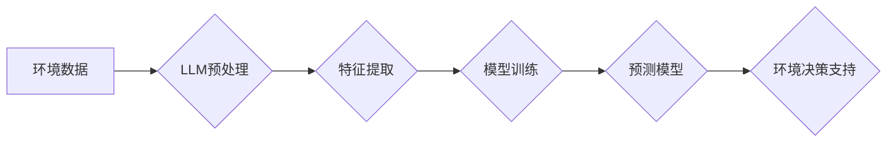

                 

## LLM在环境保护中的应用：数据分析与预测

> 关键词：LLM、环境保护、数据分析、预测模型、气候变化、污染监测、可持续发展

## 1. 背景介绍

全球环境问题日益严峻，气候变化、资源枯竭、污染加剧等挑战对人类社会和生态系统构成重大威胁。传统环境监测和管理方法往往面临数据获取困难、分析效率低、预测精度不足等问题。近年来，大语言模型（LLM）作为人工智能领域的一项突破性技术，凭借其强大的文本处理能力、知识表示和学习能力，为环境保护领域提供了新的解决方案。

LLM能够从海量环境数据中提取关键信息，识别模式和趋势，并构建预测模型，为环境监测、污染控制、资源管理、气候变化应对等方面提供数据驱动的决策支持。

## 2. 核心概念与联系

### 2.1  LLM概述

大语言模型（LLM）是一种基于深度学习的强大人工智能模型，能够理解和生成人类语言。它通过训练大量的文本数据，学习语言的语法、语义和上下文关系，从而具备强大的文本处理能力，例如文本分类、文本摘要、机器翻译、问答系统等。

### 2.2  环境保护与数据分析

环境保护领域需要处理大量来自不同来源的数据，例如气象数据、水质数据、土壤数据、生物多样性数据等。这些数据蕴含着丰富的环境信息，但往往分散、复杂、难以分析。数据分析技术能够帮助我们从海量环境数据中提取关键信息，识别模式和趋势，从而更好地理解环境变化和问题。

### 2.3  LLM与环境保护的结合

LLM能够将强大的文本处理能力与环境保护领域的知识和数据相结合，为环境监测、污染控制、资源管理、气候变化应对等方面提供新的解决方案。

**Mermaid 流程图**



## 3. 核心算法原理 & 具体操作步骤

### 3.1  算法原理概述

LLM在环境保护中的应用主要基于以下核心算法：

* **自然语言处理（NLP）算法：** 用于处理环境数据中的文本信息，例如提取关键词、识别实体、分析文本语义等。
* **机器学习（ML）算法：** 用于从环境数据中学习模式和趋势，构建预测模型。常见的ML算法包括线性回归、逻辑回归、支持向量机、决策树、随机森林等。
* **深度学习（DL）算法：** 用于处理复杂的环境数据，例如图像、音频、传感器数据等。常见的DL算法包括卷积神经网络（CNN）、循环神经网络（RNN）、Transformer等。

### 3.2  算法步骤详解

LLM在环境保护中的应用通常遵循以下步骤：

1. **数据收集和预处理：** 收集来自不同来源的环境数据，并进行清洗、格式化、转换等预处理操作，使其适合LLM的训练和应用。
2. **特征提取：** 从环境数据中提取关键特征，例如气温、湿度、降雨量、污染物浓度、生物多样性指数等。
3. **模型训练：** 使用ML或DL算法训练LLM模型，使其能够从环境数据中学习模式和趋势，并构建预测模型。
4. **模型评估和优化：** 使用测试数据评估模型的性能，并根据评估结果对模型进行优化，提高其预测精度和鲁棒性。
5. **环境决策支持：** 将训练好的LLM模型应用于实际环境问题，例如预测污染物扩散、评估气候变化风险、优化资源利用等，为环境决策提供数据驱动的支持。

### 3.3  算法优缺点

**优点：**

* **强大的数据处理能力：** LLM能够处理海量文本数据，提取关键信息，识别模式和趋势。
* **灵活的应用场景：** LLM能够应用于环境监测、污染控制、资源管理、气候变化应对等多个领域。
* **不断提升的预测精度：** 随着训练数据的增加和算法的改进，LLM的预测精度不断提升。

**缺点：**

* **数据依赖性强：** LLM的性能取决于训练数据的质量和数量。
* **解释性不足：** LLM的决策过程往往是黑盒，难以解释其预测结果。
* **计算资源需求高：** 训练大型LLM模型需要大量的计算资源。

### 3.4  算法应用领域

LLM在环境保护领域的应用领域广泛，包括：

* **环境监测：** 利用LLM分析卫星遥感数据、气象数据、水质数据等，监测环境变化趋势，预警环境风险。
* **污染控制：** 利用LLM分析污染物排放数据、环境监测数据等，识别污染源，优化污染控制措施。
* **资源管理：** 利用LLM分析资源利用数据、土地利用数据等，优化资源配置，促进可持续发展。
* **气候变化应对：** 利用LLM分析气候变化数据、社会经济数据等，预测气候变化影响，制定应对策略。

## 4. 数学模型和公式 & 详细讲解 & 举例说明

### 4.1  数学模型构建

LLM的训练过程本质上是一个优化问题，目标是找到一个模型参数集，使得模型在训练数据上的预测性能达到最佳。常用的数学模型包括线性回归、逻辑回归、支持向量机、神经网络等。

**线性回归模型：**

$$
y = \theta_0 + \theta_1x_1 + \theta_2x_2 + ... + \theta_nx_n + \epsilon
$$

其中：

* $y$ 是预测值
* $\theta_0, \theta_1, ..., \theta_n$ 是模型参数
* $x_1, x_2, ..., x_n$ 是输入特征
* $\epsilon$ 是误差项

**逻辑回归模型：**

$$
P(y=1|x) = \frac{1}{1 + e^{-( \theta_0 + \theta_1x_1 + \theta_2x_2 + ... + \theta_nx_n )}}
$$

其中：

* $P(y=1|x)$ 是给定输入特征 $x$ 时，预测输出为 1 的概率
* $\theta_0, \theta_1, ..., \theta_n$ 是模型参数
* $x_1, x_2, ..., x_n$ 是输入特征

### 4.2  公式推导过程

LLM的训练过程通常使用梯度下降算法，通过不断调整模型参数，使得模型在训练数据上的损失函数最小化。

**损失函数：**

$$
L(\theta) = \frac{1}{n} \sum_{i=1}^{n} loss(y_i, \hat{y}_i)
$$

其中：

* $L(\theta)$ 是损失函数
* $n$ 是训练样本数量
* $loss(y_i, \hat{y}_i)$ 是第 $i$ 个样本的损失值，例如均方误差或交叉熵损失

**梯度下降算法：**

$$
\theta = \theta - \alpha \nabla L(\theta)
$$

其中：

* $\theta$ 是模型参数
* $\alpha$ 是学习率
* $\nabla L(\theta)$ 是损失函数的梯度

### 4.3  案例分析与讲解

例如，利用LLM预测空气污染浓度，可以将历史空气质量数据、气象数据、交通数据等作为输入特征，训练一个预测模型。模型训练完成后，可以输入最新的气象数据和交通数据，预测未来24小时的空气污染浓度。

## 5. 项目实践：代码实例和详细解释说明

### 5.1  开发环境搭建

LLM的开发环境通常需要包含以下软件：

* Python 编程语言
* TensorFlow 或 PyTorch 深度学习框架
* Jupyter Notebook 或 VS Code 代码编辑器
* CUDA 和 cuDNN GPU加速库

### 5.2  源代码详细实现

以下是一个使用PyTorch训练一个简单的线性回归模型的代码示例：

```python
import torch
import torch.nn as nn
import torch.optim as optim

# 定义线性回归模型
class LinearRegression(nn.Module):
    def __init__(self, input_size, output_size):
        super(LinearRegression, self).__init__()
        self.linear = nn.Linear(input_size, output_size)

    def forward(self, x):
        return self.linear(x)

# 创建模型实例
model = LinearRegression(input_size=1, output_size=1)

# 定义损失函数和优化器
criterion = nn.MSELoss()
optimizer = optim.SGD(model.parameters(), lr=0.01)

# 训练数据
x_train = torch.randn(100, 1)
y_train = 2 * x_train + 1 + torch.randn(100, 1)

# 训练模型
for epoch in range(100):
    # 前向传播
    outputs = model(x_train)
    # 计算损失
    loss = criterion(outputs, y_train)
    # 反向传播
    optimizer.zero_grad()
    loss.backward()
    # 更新参数
    optimizer.step()

    if (epoch+1) % 10 == 0:
        print(f'Epoch [{epoch+1}/{100}], Loss: {loss.item():.4f}')

# 测试模型
x_test = torch.randn(10, 1)
y_pred = model(x_test)
print(f'Predictions: {y_pred}')
```

### 5.3  代码解读与分析

这段代码定义了一个简单的线性回归模型，并使用梯度下降算法进行训练。

* `LinearRegression` 类定义了模型结构，包含一个线性层 `nn.Linear`。
* `criterion` 定义了损失函数，这里使用均方误差损失 `nn.MSELoss`。
* `optimizer` 定义了优化器，这里使用随机梯度下降 `optim.SGD`。
* 训练循环迭代100次，每次迭代计算损失，并更新模型参数。
* 训练完成后，使用测试数据预测输出值。

### 5.4  运行结果展示

运行这段代码后，会输出训练过程中的损失值，以及测试数据预测的输出值。

## 6. 实际应用场景

LLM在环境保护领域的实际应用场景非常广泛，例如：

### 6.1  环境监测

* **空气质量监测：** 利用LLM分析卫星遥感数据、气象数据、交通数据等，预测空气污染浓度，预警空气质量恶化。
* **水质监测：** 利用LLM分析水质监测数据、水文数据、地质数据等，监测水质变化趋势，预警水污染事件。
* **土壤监测：** 利用LLM分析土壤监测数据、农业数据、气候数据等，监测土壤质量变化趋势，评估土壤退化风险。

### 6.2  污染控制

* **污染源识别：** 利用LLM分析污染物排放数据、环境监测数据等，识别污染源，制定污染控制措施。
* **污染扩散预测：** 利用LLM分析污染物排放数据、气象数据、地形数据等，预测污染物扩散范围和时间，制定污染防治方案。
* **污染治理效果评估：** 利用LLM分析污染治理措施实施前后环境监测数据，评估污染治理效果，优化治理方案。

### 6.3  资源管理

* **资源利用优化：** 利用LLM分析资源利用数据、经济数据、社会数据等，优化资源配置，促进资源节约和可持续利用。
* **土地利用规划：** 利用LLM分析土地利用数据、人口数据、经济数据等，制定土地利用规划，促进土地资源的合理开发和利用。
* **水资源管理：** 利用LLM分析水资源数据、气候数据、农业数据等，优化水资源分配，保障水资源安全。

### 6.4  未来应用展望

随着LLM技术的不断发展，其在环境保护领域的应用将更加广泛和深入。例如：

* **环境风险评估：** 利用LLM分析环境数据、社会经济数据、气候变化数据等，评估环境风险，制定应对策略。
* **环境政策制定：** 利用LLM分析环境政策数据、社会公众数据、经济数据等，为环境政策制定提供数据支持。
* **环境教育和宣传：** 利用LLM开发环境教育和宣传平台，提高公众环境意识，促进环境保护行动。

## 7. 工具和资源推荐

### 7.1  学习资源推荐

* **书籍：**
    * 《深度学习》 by Ian Goodfellow, Yoshua Bengio, Aaron Courville
    * 《自然语言处理》 by Dan Jurafsky, James H. Martin
* **在线课程：**
    * Coursera: Deep Learning Specialization
    * Stanford CS224N: Natural Language Processing with Deep Learning
* **博客和网站：**
    * Towards Data Science
    * Machine Learning Mastery
    * OpenAI Blog

### 7.2  开发工具推荐

* **Python 编程语言：** https://www.python.org/
* **TensorFlow 深度学习框架：** https://www.tensorflow.org/
* **PyTorch 深度学习框架：** https://pytorch.org/
* **Jupyter Notebook 代码编辑器：** https://jupyter.org/
* **VS Code 代码编辑器：** https://code.visualstudio.com/

### 7.3  相关论文推荐

* **BERT: Pre-training of Deep Bidirectional Transformers for Language Understanding**
* **GPT-3: Language Models are Few-Shot Learners**
* **XLNet: Generalized Autoregressive Pretraining for Language Understanding**

## 8. 总结：未来发展趋势与挑战

### 8.1  研究成果总结

LLM在环境保护领域的应用取得了显著成果，例如：

* **提高环境监测精度：** LLM能够从海量环境数据中提取关键信息，识别模式和趋势，提高环境监测精度。
* **优化污染控制措施：** LLM能够分析污染物排放数据、环境监测数据等，识别污染源，优化污染控制措施。
* **促进资源管理可持续性：** LLM能够分析资源利用数据、经济数据、社会数据等，优化资源配置，促进资源管理可持续性。

### 8.2  未来发展趋势

LLM在环境保护领域的应用未来将朝着以下趋势发展：

* **模型规模和能力提升：** 随着计算资源的不断发展，LLM模型规模和能力将不断提升，能够处理更复杂的环境问题。
* **多模态数据融合：** LLM将与其他人工智能技术融合，例如计算机视觉、传感器数据分析等，实现多模态数据融合，提升环境分析和预测能力。
* **解释性增强：** 研究者将致力于提高LLM的解释性，使得其决策过程更加透明，更容易被理解和信任。

### 8.3  面临的挑战

LLM在环境保护领域的应用也面临一些挑战：

* **数据质量和可用性：** LLM的性能取决于训练数据的质量和数量，环境数据往往分散、不完整、难以获取。
* **模型解释性：** LLM的决策过程往往是黑盒，难以解释其预测结果，这可能会影响其在环境决策中的应用。
* **计算资源需求：** 训练大型LLM模型需要大量的计算资源，这可能会限制其在资源有限的地区应用。

### 8.4  研究展望

未来，LLM在环境保护领域的应用将继续深入发展，为环境监测、污染控制、资源管理、气候变化应对等方面提供更强大的数据驱动决策支持。

## 9. 附录：常见问题与解答

**Q1：LLM如何处理环境数据的噪声和不完整性？**

**A1：** 

LLM训练过程中可以使用数据清洗和预处理技术来减少噪声和不完整性。例如，可以使用缺失值填充、异常值剔除、数据标准化等方法处理环境数据。

**Q2：LLM的预测结果是否可靠？**

**A2：** 

LLM的预测结果的可靠性取决于训练数据的质量、模型的复杂度和训练方法。

**Q3：LLM的应用成本高吗？**

**A3：** 

LLM的应用成本取决于模型规模、训练时间和硬件资源等因素。

**Q4：LLM是否可以替代传统环境监测方法？**

**A4：** 

LLM可以作为传统环境监测方法的补充，提供更深入的数据分析和预测能力，但不能完全替代传统方法。

**Q5：LLM在环境保护领域的应用前景如何？**

**A5：** 

LLM在环境保护领域的应用前景广阔，随着技术发展和应用实践的积累，LLM将为环境保护提供更强大的数据驱动决策支持。


作者：禅与计算机程序设计艺术 / Zen and the Art of Computer Programming<end_of_turn>


