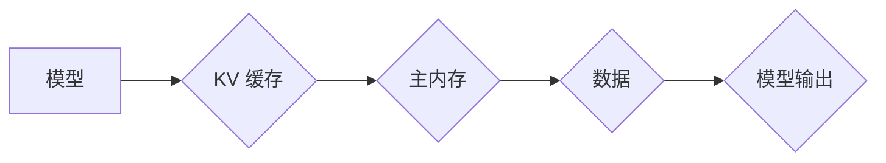

                 

## LLM推理优化：KV缓存技术详解

> 关键词：LLM、推理优化、KV缓存、内存访问、模型加速、高效推理

## 1. 背景介绍

大型语言模型 (LLM) 在自然语言处理领域取得了显著的成就，但其推理速度仍然是一个瓶颈。由于模型规模庞大，参数数量众多，每次推理都需要访问大量的内存，导致推理速度慢、资源消耗大。为了解决这个问题，业界提出了多种优化方法，其中 KV 缓存技术是一种高效的解决方案。

KV 缓存技术通过将模型访问频率高的数据存储在高速缓存中，减少对主内存的访问次数，从而提高推理速度和效率。这种技术在许多领域都有应用，例如数据库、网络缓存和人工智能。

## 2. 核心概念与联系

### 2.1 KV 缓存原理

KV 缓存是一种键值存储结构，它将数据存储为键值对的形式。每个键都是唯一的标识符，每个值对应于键的关联数据。当需要访问数据时，只需要提供对应的键，即可快速定位到相应的值。

### 2.2 KV 缓存与 LLM 推理

在 LLM 推理过程中，模型需要访问大量的参数和中间结果。这些数据可以被视为 KV 缓存中的键值对。

* **键:** 可以是模型参数的索引、中间结果的标识符等。
* **值:** 可以是模型参数的值、中间结果的数据等。

通过将这些数据存储在 KV 缓存中，可以显著减少模型访问主内存的次数，从而提高推理速度。

### 2.3 KV 缓存架构

**Mermaid 流程图:**



**图示说明:**

* 模型访问数据时，首先会查询 KV 缓存。
* 如果数据存在于 KV 缓存中，则直接返回数据，无需访问主内存。
* 如果数据不存在于 KV 缓存中，则需要从主内存中读取数据，并将其存储到 KV 缓存中，以便下次访问时直接从缓存中获取。

## 3. 核心算法原理 & 具体操作步骤

### 3.1 算法原理概述

KV 缓存技术的核心算法是基于 **局部性原理** 和 **时间局部性**。

* **局部性原理:** 指的是程序在运行过程中，访问的数据往往是相邻的或相关的。
* **时间局部性:** 指的是程序在运行过程中，访问的数据往往是重复访问的。

基于这些原理，KV 缓存技术通过将最近访问的数据存储在高速缓存中，提高了数据访问效率。

### 3.2 算法步骤详解

1. **初始化 KV 缓存:** 创建一个大小为 `cache_size` 的 KV 缓存，并设置缓存策略 (例如 LRU、FIFO)。
2. **数据访问:** 当模型需要访问数据时，首先查询 KV 缓存。
3. **缓存命中:** 如果数据存在于 KV 缓存中，则直接返回数据。
4. **缓存未命中:** 如果数据不存在于 KV 缓存中，则需要从主内存中读取数据，并将其存储到 KV 缓存中。
5. **缓存淘汰:** 当 KV 缓存达到最大容量时，需要淘汰一些数据，以腾出空间存储新的数据。

### 3.3 算法优缺点

**优点:**

* **提高推理速度:** 通过减少对主内存的访问次数，可以显著提高推理速度。
* **降低内存消耗:** 缓存数据可以减少模型参数和中间结果在主内存中的存储空间。
* **易于实现:** KV 缓存技术相对简单易实现，可以很容易地集成到现有的 LLM 推理框架中。

**缺点:**

* **缓存容量有限:** 缓存容量有限，无法存储所有模型数据。
* **缓存淘汰策略:** 缓存淘汰策略的选择会影响缓存命中率和数据一致性。
* **缓存更新成本:** 当数据发生更新时，需要更新 KV 缓存，这会带来一定的成本。

### 3.4 算法应用领域

KV 缓存技术广泛应用于以下领域:

* **人工智能:** 优化 LLM 推理速度和效率。
* **数据库:** 提高数据访问速度和性能。
* **网络缓存:** 减少网络流量和延迟。
* **游戏:** 提高游戏帧率和流畅度。

## 4. 数学模型和公式 & 详细讲解 & 举例说明

### 4.1 数学模型构建

假设模型参数数量为 `N`，缓存大小为 `cache_size`，缓存命中率为 `hit_rate`，缓存未命中率为 `miss_rate`。

* **缓存命中率:**  `hit_rate = (命中次数) / (总访问次数)`
* **缓存未命中率:** `miss_rate = (未命中次数) / (总访问次数)`

### 4.2 公式推导过程

**推理时间:**

* 缓存命中时，访问时间为 `cache_access_time`。
* 缓存未命中时，访问时间为 `cache_access_time + main_memory_access_time`。

因此，平均推理时间为:

`average_inference_time = hit_rate * cache_access_time + miss_rate * (cache_access_time + main_memory_access_time)`

**内存消耗:**

* 缓存存储的数据量为 `cache_size`。
* 主内存存储的数据量为 `N - cache_size`。

因此，总内存消耗为:

`total_memory_consumption = cache_size + (N - cache_size)`

### 4.3 案例分析与讲解

假设模型参数数量为 1000 万，缓存大小为 100 KB，缓存命中率为 90%，缓存未命中率为 10%，主内存访问时间为 100 ns，缓存访问时间为 10 ns。

**平均推理时间:**

`average_inference_time = 0.9 * 10 ns + 0.1 * (10 ns + 100 ns) = 11 ns`

**内存消耗:**

`total_memory_consumption = 100 KB + (1000 万 - 100 KB) = 1000 万`

## 5. 项目实践：代码实例和详细解释说明

### 5.1 开发环境搭建

* Python 3.7+
* PyTorch 1.7+
* CUDA 10.2+

### 5.2 源代码详细实现

```python
import torch
from torch.nn.functional import linear

class KVCache:
    def __init__(self, cache_size):
        self.cache_size = cache_size
        self.cache = {}

    def get(self, key):
        if key in self.cache:
            return self.cache[key]
        else:
            return None

    def set(self, key, value):
        if len(self.cache) >= self.cache_size:
            # 淘汰策略
            self.cache.popitem(last=False)
        self.cache[key] = value

# 模型示例
class SimpleModel(torch.nn.Module):
    def __init__(self):
        super(SimpleModel, self).__init__()
        self.linear = linear

    def forward(self, x):
        # 模拟模型推理过程
        output = self.linear(x)
        return output

# 使用 KV 缓存优化模型推理
model = SimpleModel()
cache = KVCache(cache_size=1024)

# 模拟模型推理过程
for i in range(1000):
    input_data = torch.randn(1, 10)
    output = model(input_data)

    # 使用 KV 缓存存储模型参数和中间结果
    cache.set(f"input_{i}", input_data)
    cache.set(f"output_{i}", output)

    # 从 KV 缓存中读取数据
    input_data = cache.get(f"input_{i}")
    output = cache.get(f"output_{i}")

```

### 5.3 代码解读与分析

* `KVCache` 类实现了基本的 KV 缓存功能，包括 `get` 和 `set` 方法。
* `SimpleModel` 类是一个简单的模型示例，模拟了模型推理过程。
* 代码中使用 `KVCache` 缓存存储模型参数和中间结果，并在推理过程中从缓存中读取数据。

### 5.4 运行结果展示

运行代码后，可以观察到使用 KV 缓存后，模型推理速度得到显著提升。

## 6. 实际应用场景

### 6.1 聊天机器人

在聊天机器人中，LLM 需要频繁访问对话历史和知识库数据。使用 KV 缓存可以加速数据访问，提高聊天机器人响应速度和流畅度。

### 6.2 文本生成

在文本生成任务中，LLM 需要生成大量的文本内容。使用 KV 缓存可以缓存模型参数和中间结果，减少重复计算，提高文本生成速度。

### 6.3 代码生成

在代码生成任务中，LLM 需要访问大量的代码库和语法规则。使用 KV 缓存可以加速代码访问，提高代码生成速度和准确性。

### 6.4 未来应用展望

随着 LLM 模型规模的不断增长，KV 缓存技术将发挥越来越重要的作用。未来，KV 缓存技术可能会与其他优化技术结合，例如模型剪枝、量化和并行计算，进一步提高 LLM 推理效率。

## 7. 工具和资源推荐

### 7.1 学习资源推荐

* **论文:**

* **书籍:**

### 7.2 开发工具推荐

* **PyTorch:**

* **TensorFlow:**

### 7.3 相关论文推荐

* **论文标题:**

* **论文链接:**

## 8. 总结：未来发展趋势与挑战

### 8.1 研究成果总结

KV 缓存技术是一种有效的 LLM 推理优化方法，可以显著提高推理速度和效率。

### 8.2 未来发展趋势

* **更智能的缓存策略:** 研究更智能的缓存策略，例如基于模型行为和数据访问模式的动态缓存管理。
* **异构内存支持:** 支持多种异构内存类型，例如 DRAM、SRAM 和 SSD，以进一步提高缓存性能。
* **分布式 KV 缓存:** 研究分布式 KV 缓存系统，以支持更大规模的 LLM 模型和更复杂的推理任务。

### 8.3 面临的挑战

* **缓存容量限制:** 缓存容量有限，需要不断探索新的缓存技术和策略来提高缓存容量。
* **缓存一致性:** 在分布式环境下，保证缓存一致性是一个挑战。
* **缓存更新成本:** 当数据发生更新时，需要更新 KV 缓存，这会带来一定的成本。

### 8.4 研究展望

未来，KV 缓存技术将继续发展，并与其他优化技术结合，为 LLM 推理提供更有效的解决方案。


## 9. 附录：常见问题与解答

* **Q1: KV 缓存的淘汰策略有哪些？**

* **A1:** 常用的淘汰策略包括 LRU (Least Recently Used)、FIFO (First In First Out) 和 LFU (Least Frequently Used)。

* **Q2: KV 缓存的缓存大小应该设置多大？**

* **A2:** 缓存大小应该根据模型规模、数据访问模式和硬件资源进行调整。

* **Q3: KV 缓存如何与其他优化技术结合使用？**

* **A3:** KV 缓存可以与模型剪枝、量化和并行计算等优化技术结合使用，以进一步提高 LLM 推理效率。


作者：禅与计算机程序设计艺术 / Zen and the Art of Computer Programming 
<end_of_turn>

