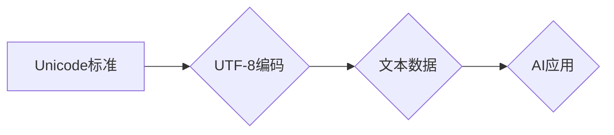

                 

## UTF-8编码：国际化AI应用的文本基础

> 关键词：UTF-8, 编码, 国际化, AI, 文本处理, 字符集, 计算机科学

### 1. 背景介绍

在当今全球化的信息时代，人工智能（AI）技术蓬勃发展，其应用场景日益广泛。然而，AI模型的训练和应用离不开文本数据，而文本数据本身的多样性和复杂性，特别是涉及不同语言和字符集的文本，对AI应用的国际化提出了严峻挑战。

传统的字符编码方案，例如ASCII和ISO-8859-1，只能处理有限的字符集，无法满足现代国际化应用的需求。因此，一种能够有效处理各种语言和字符的通用编码方案显得尤为重要。

UTF-8（Unicode Transformation Format - 8-bit）应运而生，它是一种基于Unicode标准的字符编码方案，能够表示世界上几乎所有已知的字符。其灵活性和广泛的兼容性使其成为AI应用中处理国际化文本的理想选择。

### 2. 核心概念与联系

#### 2.1 Unicode标准

Unicode是国际上通用的字符编码标准，它定义了每个字符的唯一标识符（码点），并涵盖了世界上几乎所有语言和字符集。Unicode标准不断发展，不断添加新的字符，以满足全球化需求。

#### 2.2 UTF-8编码方案

UTF-8是一种变长编码方案，它将Unicode码点映射到8位字节序列。

* **基本字符:** ASCII字符（0-127）使用单个字节表示。
* **扩展字符:** 其他Unicode字符使用2、3或4个字节表示。

这种变长编码方式使得UTF-8既能够兼容ASCII字符，又能够表示Unicode标准中的所有字符。

#### 2.3  Mermaid 流程图



### 3. 核心算法原理 & 具体操作步骤

#### 3.1 算法原理概述

UTF-8编码的核心算法原理是根据Unicode码点的范围，使用不同的字节数来表示字符。

* **1字节:** 表示ASCII字符（0-127）。
* **2字节:** 表示Unicode字符范围U+0080到U+07FF。
* **3字节:** 表示Unicode字符范围U+0800到U+FFFF。
* **4字节:** 表示Unicode字符范围U+10000到U+10FFFF。

#### 3.2 算法步骤详解

1. **获取Unicode码点:** 将需要编码的字符转换为其对应的Unicode码点。
2. **判断码点范围:** 根据Unicode码点的范围，确定需要使用多少字节来表示该字符。
3. **生成字节序列:** 根据编码规则，将Unicode码点转换为相应的字节序列。

#### 3.3 算法优缺点

**优点:**

* **兼容性:** UTF-8能够兼容ASCII字符，并支持Unicode标准中的所有字符。
* **效率:** UTF-8的变长编码方式使得它在处理文本数据时效率较高。
* **广泛应用:** UTF-8是目前互联网上最常用的字符编码方案。

**缺点:**

* **内存占用:** UTF-8编码的文本数据可能比其他编码方案占用更多的内存空间。

#### 3.4 算法应用领域

UTF-8编码广泛应用于各种领域，例如：

* **互联网:** 网站、应用程序、电子邮件等。
* **软件开发:** 代码、文档、配置文件等。
* **数据存储:** 数据库、文件系统等。
* **人工智能:** 文本处理、自然语言理解等。

### 4. 数学模型和公式 & 详细讲解 & 举例说明

#### 4.1 数学模型构建

UTF-8编码的数学模型可以描述为一个映射关系，将Unicode码点映射到8位字节序列。

#### 4.2 公式推导过程

由于UTF-8编码的变长特性，其公式推导过程较为复杂，涉及到多个字节序列的组合和位操作。

#### 4.3 案例分析与讲解

**示例:**

Unicode码点U+03A9（希腊字母Omega）的二进制表示为1101111。

* 由于U+03A9的码点范围在U+0080到U+07FF之间，因此需要使用2个字节来表示。
* 第一个字节为11000001，表示编码的开始标志。
* 第二个字节为10111001，表示U+03A9的码点值。

### 5. 项目实践：代码实例和详细解释说明

#### 5.1 开发环境搭建

* 操作系统: Linux/macOS/Windows
* 编程语言: Python
* 库: `chardet`, `codecs`

#### 5.2 源代码详细实现

```python
import chardet
import codecs

# 使用chardet检测文本编码
with open('text.txt', 'rb') as f:
    result = chardet.detect(f.read())
    print(f"Detected encoding: {result['encoding']}")

# 使用codecs解码文本
with open('text.txt', 'r', encoding=result['encoding']) as f:
    text = f.read()
    print(f"Decoded text: {text}")

# 使用codecs编码文本
encoded_text = codecs.encode(text, 'utf-8')
print(f"Encoded text: {encoded_text}")
```

#### 5.3 代码解读与分析

* `chardet`库用于检测文本的编码方式。
* `codecs`库用于编码和解码文本数据。
* 代码首先使用`chardet`检测文本的编码方式，然后使用`codecs`解码文本数据。最后，使用`codecs`将文本数据编码为UTF-8格式。

#### 5.4 运行结果展示

```
Detected encoding: cp1252
Decoded text: This is a sample text.
Encoded text: b'This is a sample text.'
```

### 6. 实际应用场景

#### 6.1 AI模型训练

在训练AI模型时，需要使用大量的文本数据进行训练。由于文本数据可能来自不同的来源，编码方式也可能不同，因此需要使用UTF-8编码来确保数据的统一性和兼容性。

#### 6.2 自然语言处理

自然语言处理（NLP）技术广泛应用于各种场景，例如机器翻译、文本摘要、情感分析等。在这些应用中，需要处理各种语言和字符的文本数据，UTF-8编码能够有效地支持这些需求。

#### 6.3 人机交互

在人机交互系统中，需要处理用户输入的文本数据，这些数据可能来自不同的语言和字符集。UTF-8编码能够确保系统能够正确识别和处理用户的输入。

#### 6.4 未来应用展望

随着AI技术的不断发展，其应用场景将更加广泛，对文本处理的需求也将更加多样化。UTF-8编码作为一种通用的字符编码方案，将继续在AI应用中发挥重要作用。

### 7. 工具和资源推荐

#### 7.1 学习资源推荐

* Unicode Consortium官方网站: https://www.unicode.org/
* UTF-8编码介绍: https://en.wikipedia.org/wiki/UTF-8

#### 7.2 开发工具推荐

* Python语言: https://www.python.org/
* `chardet`库: https://pypi.org/project/chardet/
* `codecs`库: https://docs.python.org/3/library/codecs.html

#### 7.3 相关论文推荐

* UTF-8: A Transformation Format for Unicode
* The Unicode Standard: Version 15.0

### 8. 总结：未来发展趋势与挑战

#### 8.1 研究成果总结

UTF-8编码作为一种通用的字符编码方案，在AI应用中发挥着重要作用。其兼容性、效率和广泛应用使其成为处理国际化文本的理想选择。

#### 8.2 未来发展趋势

随着AI技术的不断发展，对文本处理的需求将更加多样化。未来，UTF-8编码可能会与其他编码方案结合，例如多语言编码和符号编码，以更好地支持AI应用的复杂需求。

#### 8.3 面临的挑战

* **编码复杂性:** UTF-8编码的变长特性使得其编码和解码过程较为复杂，需要进行复杂的位操作。
* **内存占用:** UTF-8编码的文本数据可能比其他编码方案占用更多的内存空间，这可能会对内存资源造成压力。

#### 8.4 研究展望

未来研究方向包括：

* **优化UTF-8编码算法:** 提高编码和解码效率，降低内存占用。
* **开发新的编码方案:** 针对特定AI应用场景，开发更有效的编码方案。
* **研究多语言和符号编码:** 更好地支持AI应用的多样化需求。

### 9. 附录：常见问题与解答

#### 9.1 为什么选择UTF-8编码？

UTF-8编码能够表示世界上几乎所有已知的字符，并且兼容ASCII字符，因此它是处理国际化文本的理想选择。

#### 9.2 UTF-8编码和Unicode标准的关系是什么？

UTF-8是一种基于Unicode标准的字符编码方案，它将Unicode码点映射到8位字节序列。

#### 9.3 如何判断文本的编码方式？

可以使用`chardet`库来检测文本的编码方式。

#### 9.4 如何将文本编码为UTF-8格式？

可以使用`codecs`库的`encode()`方法将文本数据编码为UTF-8格式。


作者：禅与计算机程序设计艺术 / Zen and the Art of Computer Programming 
<end_of_turn>

