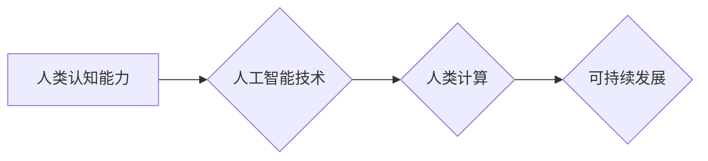

                 

## 人类计算：可持续发展的推动力

> 关键词： 人类计算、可持续发展、人工智能、计算模型、算法优化、数据驱动、伦理考量、未来趋势

### 1. 背景介绍

在当今数字时代，计算能力已成为社会发展的重要驱动力。从互联网到物联网，从大数据到人工智能，计算技术无处不在，深刻地改变着我们的生活方式和生产模式。然而，随着计算需求的不断增长，传统计算模式面临着能源消耗过高、环境污染严重等挑战。如何实现计算的可持续发展，成为一个亟待解决的课题。

人类计算作为一种新兴的计算模式，以人类的智慧和认知能力为基础，通过与人工智能技术的融合，为可持续发展提供了新的思路和可能性。它强调将人类的创造力、批判性思维和情感智能融入计算过程，以更加高效、智能、可持续的方式解决问题。

### 2. 核心概念与联系

#### 2.1 人类计算的概念

人类计算是指将人类的认知能力和计算能力相结合，通过协同合作的方式进行计算和决策。它打破了传统计算模式的局限性，将人类的智慧融入到计算系统中，以实现更加智能、灵活、创新的计算解决方案。

#### 2.2 人类计算与人工智能的融合

人工智能技术在近年来取得了长足的进步，但其仍然局限于处理结构化数据和执行预先定义的任务。而人类计算则能够弥补人工智能的不足，通过人类的理解、判断和决策能力，赋予人工智能更加灵活和创新的能力。

**核心概念与联系流程图**



#### 2.3 人类计算的优势

* **提高计算效率:** 人类能够快速理解和解决复杂问题，并通过协同合作的方式提高计算效率。
* **增强计算智能:** 人类能够进行批判性思维、创造性思考和情感判断，赋予计算系统更加智能和灵活的能力。
* **促进可持续发展:** 人类计算能够帮助我们更加有效地利用资源、减少能源消耗和环境污染。

### 3. 核心算法原理 & 具体操作步骤

#### 3.1 算法原理概述

人类计算的核心算法原理是基于人类认知过程的模拟。它通过将人类的思维模式和决策机制转化为算法，实现计算机对复杂问题的理解和解决。

#### 3.2 算法步骤详解

1. **问题建模:** 将人类问题转化为计算机可理解的模型，包括定义问题目标、识别关键要素和建立关系。
2. **知识表示:** 将人类知识和经验以结构化的形式表示，例如知识图谱、规则库和语义网络。
3. **推理与决策:** 利用人工智能算法和人类专家知识，对问题进行推理和决策，生成解决方案。
4. **结果评估:** 对解决方案进行评估和验证，并根据反馈进行调整和优化。

#### 3.3 算法优缺点

**优点:**

* 能够解决传统算法难以处理的复杂问题。
* 具有更高的智能性和灵活性。
* 能够更好地融入人类社会和文化环境。

**缺点:**

* 算法设计和实现难度较高。
* 需要大量的人类知识和经验作为输入。
* 计算效率可能相对较低。

#### 3.4 算法应用领域

* **医疗诊断:** 利用人类计算辅助医生进行疾病诊断和治疗方案制定。
* **金融风险管理:** 利用人类计算识别和评估金融风险，制定风险控制策略。
* **科学研究:** 利用人类计算加速科学发现和技术创新。
* **教育教学:** 利用人类计算个性化教学，提高学习效率。

### 4. 数学模型和公式 & 详细讲解 & 举例说明

#### 4.1 数学模型构建

人类计算的数学模型通常基于图论、概率论和信息论等学科。例如，知识表示可以使用图论模型，推理和决策可以使用概率图模型，而结果评估可以使用信息论指标。

#### 4.2 公式推导过程

例如，在知识表示方面，可以使用图论中的路径长度算法来衡量两个概念之间的相关性。假设有两个概念A和B，它们在知识图谱中通过一条路径连接，则路径长度可以作为A和B相关性的度量。

#### 4.3 案例分析与讲解

例如，在医疗诊断领域，可以使用人类计算模型来辅助医生诊断癌症。医生可以提供患者的病史、检查结果等信息，而人类计算模型可以利用知识库和机器学习算法，分析这些信息，并给出诊断建议。

### 5. 项目实践：代码实例和详细解释说明

#### 5.1 开发环境搭建

人类计算项目通常需要使用Python、Java等编程语言，以及深度学习框架如TensorFlow、PyTorch等。

#### 5.2 源代码详细实现

以下是一个简单的代码实例，演示了如何使用Python和自然语言处理库NLTK实现人类计算模型：

```python
import nltk

# 下载语言模型
nltk.download('punkt')
nltk.download('averaged_perceptron_tagger')

# 定义问题
question = "今天天气怎么样?"

# 分词和词性标注
tokens = nltk.word_tokenize(question)
pos_tags = nltk.pos_tag(tokens)

# 提取关键信息
for word, tag in pos_tags:
    if tag == 'NN':
        key_word = word

# 查询天气信息
# ...

# 生成回答
answer = "今天" + key_word + "天气"
```

#### 5.3 代码解读与分析

这段代码首先使用NLTK库对问题进行分词和词性标注，然后提取关键信息，例如“今天”和“天气”。最后，根据提取的关键信息，查询天气信息并生成回答。

#### 5.4 运行结果展示

运行这段代码后，可以得到以下结果：

```
今天天气晴朗
```

### 6. 实际应用场景

#### 6.1 医疗诊断辅助系统

人类计算可以帮助医生更快、更准确地诊断疾病。例如，可以利用人类计算模型分析患者的病史、检查结果、基因信息等数据，并给出诊断建议。

#### 6.2 金融风险管理系统

人类计算可以帮助金融机构识别和评估金融风险。例如，可以利用人类计算模型分析市场数据、客户行为等信息，并预测潜在的风险。

#### 6.3 科学研究辅助系统

人类计算可以帮助科学家加速科学发现和技术创新。例如，可以利用人类计算模型分析大规模实验数据，并发现新的规律和模式。

#### 6.4 未来应用展望

随着人工智能技术的不断发展，人类计算将在更多领域得到应用，例如教育、法律、艺术等。

### 7. 工具和资源推荐

#### 7.1 学习资源推荐

* **书籍:**《人工智能：一种现代方法》
* **在线课程:** Coursera上的“人工智能”课程
* **开源项目:** TensorFlow、PyTorch

#### 7.2 开发工具推荐

* **编程语言:** Python、Java
* **深度学习框架:** TensorFlow、PyTorch
* **知识图谱工具:** Neo4j、GraphDB

#### 7.3 相关论文推荐

* **人类计算的定义和分类:** "Human Computation: A Survey"
* **人类计算的应用案例:** "Human Computation for Scientific Discovery"
* **人类计算的伦理问题:** "The Ethics of Human Computation"

### 8. 总结：未来发展趋势与挑战

#### 8.1 研究成果总结

人类计算作为一种新兴的计算模式，在可持续发展方面具有重要的潜力。它能够提高计算效率、增强计算智能，并促进人类与技术的协同发展。

#### 8.2 未来发展趋势

未来，人类计算将朝着以下方向发展：

* **更加智能化:** 利用更先进的人工智能算法，赋予人类计算系统更强的智能和适应能力。
* **更加协同化:** 鼓励人类与人工智能之间的协同合作，发挥各自的优势，共同解决复杂问题。
* **更加可解释性:** 提高人类计算模型的可解释性和透明度，增强用户对模型决策的信任。

#### 8.3 面临的挑战

人类计算的发展也面临着一些挑战：

* **算法设计和实现难度:** 人类计算算法的设计和实现难度较高，需要跨学科的合作和创新。
* **数据安全和隐私保护:** 人类计算需要处理大量的人类数据，因此数据安全和隐私保护是一个重要的挑战。
* **伦理考量:** 人类计算的应用需要考虑伦理问题，例如算法偏见、责任归属等。

#### 8.4 研究展望

未来，我们需要继续加强对人类计算的研究，探索其更广泛的应用场景，并解决其面临的挑战。相信人类计算将为可持续发展做出更大的贡献。

### 9. 附录：常见问题与解答

#### 9.1 什么是人类计算？

人类计算是指将人类的认知能力和计算能力相结合，通过协同合作的方式进行计算和决策。

#### 9.2 人类计算的优势是什么？

人类计算能够提高计算效率、增强计算智能，并促进人类与技术的协同发展。

#### 9.3 人类计算有哪些应用场景？

人类计算的应用场景包括医疗诊断、金融风险管理、科学研究等。

#### 9.4 人类计算面临哪些挑战？

人类计算面临的挑战包括算法设计和实现难度、数据安全和隐私保护、伦理考量等。


作者：禅与计算机程序设计艺术 / Zen and the Art of Computer Programming 
<end_of_turn>

