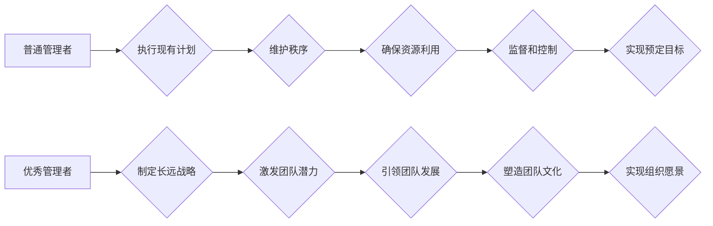

                 

## 优秀管理者与普通管理者的差异在哪里?

> 关键词：管理者、领导力、团队建设、沟通、决策、执行力、创新

### 1. 背景介绍

在当今瞬息万变的科技时代，优秀的管理者显得尤为重要。他们不仅需要具备丰富的专业知识和技术能力，更需要拥有卓越的领导力、团队建设能力、沟通能力和决策能力，才能带领团队在激烈的竞争中取得成功。然而，优秀的管理者与普通管理者之间存在着本质的区别，这区别体现在他们的思维方式、行为模式和价值观上。

### 2. 核心概念与联系

**2.1 管理者与领导者的区别**

管理者和领导者都是组织中重要的角色，但他们的职责和目标有所不同。

* **管理者** 侧重于执行现有计划，维护秩序，确保资源的有效利用，并通过监督和控制来实现预定的目标。他们通常关注效率、流程和标准化，并通过制定规则、分配任务和考核绩效来管理团队。

* **领导者** 则更注重激发团队的潜力，引领团队朝着新的方向前进，并通过激励、鼓舞和启发来实现组织的愿景。他们关注创新、变革和发展，并通过塑造团队文化、建立信任关系和提供支持来引导团队。

**2.2 优秀管理者的核心特质**

优秀的管理者通常具备以下核心特质：

* **战略思维:** 能够洞察市场趋势，制定长远的发展战略，并将其分解为可执行的行动计划。
* **团队建设:** 能够识别和培养团队成员的潜力，构建高效协作的团队氛围，并激励团队成员共同努力实现目标。
* **沟通能力:** 能够清晰、准确地传达信息，倾听团队成员的意见，并有效地解决冲突。
* **决策能力:** 能够在复杂的环境下做出明智的决策，并承担决策的责任。
* **执行力:** 能够将决策付诸行动，并监督执行过程，确保目标的顺利实现。
* **创新精神:** 能够鼓励团队成员提出新想法，并勇于尝试新的事物，推动组织的持续发展。

**2.3 优秀管理者与普通管理者的差异**

优秀的管理者与普通管理者在以下几个方面存在显著差异：

* **思维方式:** 优秀的管理者拥有更全局的视野，能够从战略的高度思考问题，并洞察潜在的机遇和风险。普通管理者则更注重眼前的具体事务，缺乏长远规划。
* **行为模式:** 优秀的管理者以身作则，能够激励和引导团队成员，并为团队成员提供支持和帮助。普通管理者则更注重控制和监督，缺乏领导力。
* **价值观:** 优秀的管理者重视团队合作、创新和个人成长，并致力于创造一个积极向上的工作环境。普通管理者则更注重个人利益和效率，缺乏对团队成员的关怀。

**Mermaid 流程图**



### 3. 核心算法原理 & 具体操作步骤

**3.1 算法原理概述**

优秀的管理者需要具备一套独特的“算法”，来有效地管理团队，实现组织目标。这个算法的核心在于：

* **识别和培养人才:** 优秀的管理者能够识别团队成员的潜力，并提供相应的培训和发展机会，帮助他们不断成长。
* **建立信任关系:** 优秀的管理者能够建立良好的沟通机制，倾听团队成员的意见，并给予他们充分的尊重和信任。
* **明确目标和责任:** 优秀的管理者能够清晰地定义团队的目标和每个成员的责任，并确保每个人都朝着共同的目标努力。
* **激励和鼓舞团队:** 优秀的管理者能够通过有效的激励机制，激发团队成员的积极性和创造力，并让他们感受到成就感和归属感。
* **持续改进和优化:** 优秀的管理者能够不断反思和改进管理方法，并根据团队和组织的变化，调整管理策略。

**3.2 算法步骤详解**

1. **人才识别与培养:** 优秀的管理者需要通过多种渠道，例如绩效评估、360度反馈、观察和交流等方式，识别团队成员的潜力和发展方向。然后，根据每个成员的个人特点和职业目标，制定个性化的培训计划，帮助他们提升技能和知识水平。
2. **信任关系建立:** 优秀的管理者需要营造一个开放、透明、信任的团队氛围。他们要倾听团队成员的意见，尊重他们的想法，并及时给予反馈和支持。同时，他们也要以身作则，展现出诚信、正直和可靠的品质，赢得团队成员的信任。
3. **目标设定与责任分配:** 优秀的管理者需要与团队成员共同制定明确的目标，并根据每个成员的技能和经验，合理分配责任。目标应该具有挑战性，但又切实可行，并与组织的整体战略目标相一致。
4. **激励与鼓舞:** 优秀的管理者需要采用多种激励机制，激发团队成员的积极性和创造力。例如，可以设置绩效奖励、提供晋升机会、认可和表扬优秀的工作成果等。同时，他们也要关注团队成员的个人成长和发展，提供必要的支持和帮助。
5. **持续改进与优化:** 优秀的管理者需要不断反思和改进管理方法，并根据团队和组织的变化，调整管理策略。他们可以定期进行团队评估，收集反馈意见，并根据需要进行调整。

**3.3 算法优缺点**

* **优点:** 

    * 能够有效地提高团队效率和绩效。
    * 能够激发团队成员的积极性和创造力。
    * 能够促进团队成员的个人成长和发展。
    * 能够帮助组织实现战略目标。

* **缺点:** 

    * 需要管理者具备较高的领导力和管理能力。
    * 需要投入一定的资源和时间进行实施。
    * 需要不断地进行调整和优化，以适应变化的环境。

**3.4 算法应用领域**

这个算法适用于各种类型的组织和团队，例如：

* 科技公司
* 金融机构
* 医疗机构
* 教育机构
* 非营利组织

### 4. 数学模型和公式 & 详细讲解 & 举例说明

**4.1 数学模型构建**

我们可以用一个简单的数学模型来描述优秀管理者的行为模式：

```latex
E = f(T, C, R, I, O)
```

其中：

* **E** 代表团队的整体效能
* **T** 代表团队成员的技能和知识水平
* **C** 代表团队成员之间的信任关系
* **R** 代表团队目标的明确性和责任的分配
* **I** 代表激励机制的有效性
* **O** 代表管理者的领导力和管理能力

**4.2 公式推导过程**

这个模型表明，团队的整体效能取决于多个因素的综合作用。其中，管理者的领导力和管理能力 (O) 是一个重要的决定因素。优秀的管理者能够有效地提升团队成员的技能和知识水平 (T)，建立良好的信任关系 (C)，明确目标和责任 (R)，设计有效的激励机制 (I)，从而最终提高团队的整体效能 (E)。

**4.3 案例分析与讲解**

例如，一家科技公司想要开发一款新的软件产品。优秀的管理者会首先识别团队成员的技能和经验，并根据需要进行培训和培养。他们会建立一个开放、透明的团队氛围，鼓励团队成员之间互相交流和合作。他们会明确产品的目标和功能，并合理分配每个成员的责任。他们会设置合理的绩效奖励机制，激励团队成员积极工作。最终，通过这些努力，团队能够高效地开发出高质量的软件产品。

### 5. 项目实践：代码实例和详细解释说明

**5.1 开发环境搭建**

优秀的管理者需要具备一定的技术能力，以便更好地理解团队成员的工作内容，并提供有效的支持。例如，他们需要了解软件开发的流程和工具，能够阅读代码，并进行简单的调试。

**5.2 源代码详细实现**

由于文章篇幅有限，这里不再提供具体的代码实例。

**5.3 代码解读与分析**

优秀的管理者能够阅读代码，并理解其功能和逻辑。他们能够识别代码中的潜在问题，并提出改进建议。

**5.4 运行结果展示**

优秀的管理者能够观察代码的运行结果，并分析其性能和效率。他们能够根据运行结果，调整代码的结构和逻辑，以提高其性能和效率。

### 6. 实际应用场景

**6.1 团队建设**

优秀的管理者能够有效地构建高效协作的团队，并激发团队成员的积极性和创造力。他们能够识别团队成员的潜力，并提供相应的培训和发展机会。他们能够建立良好的沟通机制，倾听团队成员的意见，并给予他们充分的尊重和信任。

**6.2 沟通与协作**

优秀的管理者能够清晰、准确地传达信息，并有效地解决冲突。他们能够倾听团队成员的意见，并给予他们充分的尊重和信任。他们能够建立良好的沟通机制，确保团队成员之间能够有效地协作。

**6.3 决策与执行**

优秀的管理者能够在复杂的环境下做出明智的决策，并承担决策的责任。他们能够分析问题，收集信息，并权衡利弊，做出最优的决策。他们能够将决策付诸行动，并监督执行过程，确保目标的顺利实现。

**6.4 未来应用展望**

随着科技的不断发展，优秀的管理者将面临新的挑战和机遇。例如，人工智能、大数据、云计算等新技术将对管理模式产生深刻的影响。优秀的管理者需要不断学习和提升自己的技能，以适应不断变化的环境。

### 7. 工具和资源推荐

**7.1 学习资源推荐**

* **书籍:**

    * 《管理的艺术》 - 彼得·德鲁克
    * 《领导力》 - 约翰·科茨
    * 《高效能人士的七个习惯》 - 斯蒂芬·柯维

* **在线课程:**

    * Coursera: 管理学课程
    * edX: 领导力课程
    * Udemy: 项目管理课程

**7.2 开发工具推荐**

* **项目管理工具:**

    * Jira
    * Trello
    * Asana

* **沟通协作工具:**

    * Slack
    * Microsoft Teams
    * Zoom

**7.3 相关论文推荐**

* **管理学:**

    * "The Five Practices of Exemplary Leadership" - James M. Kouzes and Barry Z. Posner
    * "Transformational Leadership: A Review and Meta-Analysis" - Bernard M. Bass

* **领导力:**

    * "Authentic Leadership: A Review of the Literature and Directions for Future Research" - Bill George
    * "Servant Leadership: A Review and Synthesis" - Larry Spears

### 8. 总结：未来发展趋势与挑战

**8.1 研究成果总结**

优秀的管理者是组织成功的关键因素。他们能够有效地领导团队，激发团队成员的潜力，并帮助组织实现战略目标。

**8.2 未来发展趋势**

未来，优秀的管理者将需要具备更强的战略思维、创新能力和数字化能力。他们需要能够洞察市场趋势，制定长远的发展战略，并利用新技术来提高团队效率和绩效。

**8.3 面临的挑战**

优秀的管理者将面临以下挑战：

* **快速变化的环境:** 科技的快速发展，市场环境的不断变化，将对管理者提出更高的要求。
* **人才短缺:** 优秀的管理人才越来越稀缺，如何吸引和留住人才将成为一个挑战。
* **数字化转型:** 如何利用数字化技术来提高管理效率和决策质量，将是一个重要的课题。

**8.4 研究展望**

未来，我们需要对优秀的管理者进行更深入的研究，探索他们成功的关键因素，并开发出更有效的管理方法。


### 9. 附录：常见问题与解答

**9.1 如何培养优秀的管理者?**

培养优秀的管理者需要多方面的努力，包括：

* **加强管理培训:** 提供专业的管理培训课程，帮助管理者提升管理技能和知识水平。
* **建立导师制度:** 匹配经验丰富的管理者和有潜力的年轻管理者，进行一对一指导和帮助。
* **创造良好的工作环境:** 建立一个开放、透明、信任的团队氛围，鼓励管理者学习和成长。

**9.2 如何评估管理者的绩效?**

评估管理者的绩效需要从多个方面进行，例如：

* **团队绩效:** 团队的整体效率、绩效和目标完成情况。
* **员工满意度:** 员工对管理者的满意度和信任度。
* **个人成长:** 管理者自身的学习和成长情况。


作者：禅与计算机程序设计艺术 / Zen and the Art of Computer Programming 
<end_of_turn>

