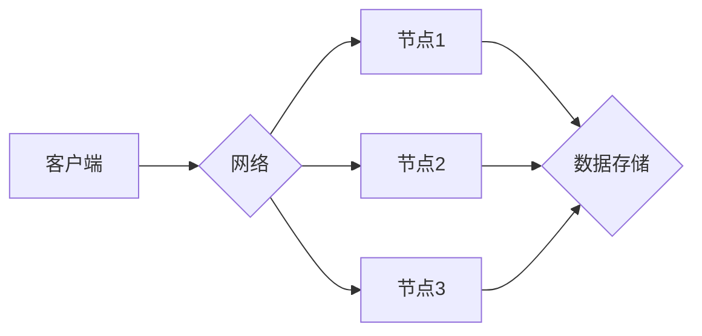

                 

## 分布式系统设计：理论与实践

> 关键词：分布式系统、一致性、容错、网络通信、数据存储、微服务、CAP定理

### 1. 背景介绍

随着互联网和云计算的蓬勃发展，分布式系统已经成为现代软件架构的基石。分布式系统由多个独立的计算节点组成，通过网络进行通信和协作，共同完成任务。相比于传统的单机系统，分布式系统具有更高的可用性、可扩展性和容错性，能够更好地应对海量数据和用户访问的挑战。

然而，分布式系统也带来了许多新的挑战，例如数据一致性、网络延迟、节点故障等。设计和构建可靠、高效的分布式系统需要深入理解其核心原理和设计模式，并掌握相应的技术手段。

### 2. 核心概念与联系

**2.1 核心概念**

* **节点:** 分布式系统中的基本单元，每个节点都是一个独立的计算资源，拥有自己的内存、CPU和存储空间。
* **网络:** 节点之间通过网络进行通信，网络可以是局域网、广域网或互联网。
* **进程:** 节点上运行的程序实例，每个进程负责执行特定的任务。
* **消息:** 节点之间通信的载体，消息可以包含数据、命令或事件。
* **一致性:** 所有节点上的数据保持一致，即使节点发生故障或网络出现问题。
* **容错:** 系统能够应对节点故障或网络问题，保证服务正常运行。
* **可用性:** 系统能够在大多数情况下提供服务，即使部分节点发生故障。

**2.2 架构图**



**2.3 联系**

分布式系统通过网络将多个节点连接起来，每个节点负责执行特定的任务，并通过消息进行通信。数据存储在分布式存储系统中，多个节点共享数据，保证数据一致性和容错性。

### 3. 核心算法原理 & 具体操作步骤

**3.1 算法原理概述**

分布式系统中常用的算法包括：

* **一致性算法:** 保证数据在所有节点上保持一致，例如 Paxos、Raft。
* **容错算法:** 应对节点故障，保证系统正常运行，例如 Byzantine Fault Tolerance (BFT)。
* **负载均衡算法:** 将请求分配到不同的节点，提高系统性能，例如 Round Robin、Least Connections。

**3.2 算法步骤详解**

以 Paxos 算法为例，其步骤如下：

1. **提案阶段:** 一个节点提出一个提案，并将其广播到所有节点。
2. **承诺阶段:** 节点收到提案后，如果满足一定的条件，则承诺接受该提案。
3. **接受阶段:** 节点收到多数节点的承诺后，则接受该提案，并将其写入本地存储。
4. **确认阶段:** 节点将接受的提案广播到所有节点，其他节点收到确认后，则将该提案写入本地存储。

**3.3 算法优缺点**

* **Paxos:** 优点：高一致性，能够应对节点故障。缺点：复杂性高，性能较低。
* **Raft:** 优点：相对 Paxos 更简单，性能更高。缺点：一致性略低于 Paxos。

**3.4 算法应用领域**

一致性算法广泛应用于分布式数据库、分布式缓存、分布式锁等场景。容错算法应用于分布式系统中的关键组件，例如分布式领导选举、分布式事务处理等。负载均衡算法应用于 Web 服务器、数据库服务器等场景，提高系统性能和可用性。

### 4. 数学模型和公式 & 详细讲解 & 举例说明

**4.1 数学模型构建**

分布式系统中的许多问题可以用数学模型来描述，例如一致性问题可以用状态机模型来描述。状态机模型将系统看作一个状态机，每个状态机都有一个状态集合和一个状态转换函数。

**4.2 公式推导过程**

Paxos 算法的正确性可以用数学公式来证明，例如：

* **提案接受条件:** 提案被接受的条件是，至少有 f+1 个节点承诺接受该提案，其中 f 是节点故障的个数。
* **数据一致性:** 如果所有节点都接受了同一个提案，则所有节点的数据都一致。

**4.3 案例分析与讲解**

假设一个分布式系统中有 5 个节点，其中 2 个节点发生故障。如果一个节点提出一个提案，则需要至少有 3 个节点承诺接受该提案才能保证提案被接受。

### 5. 项目实践：代码实例和详细解释说明

**5.1 开发环境搭建**

* 操作系统: Linux
* 编程语言: Go
* 工具: Docker, Kubernetes

**5.2 源代码详细实现**

```go
// 节点结构体
type Node struct {
    ID int
    // ... 其他属性
}

// 提案结构体
type Proposal struct {
    Value string
    // ... 其他属性
}

// 承诺结构体
type Promise struct {
    ProposalID int
    // ... 其他属性
}

// 接受结构体
type Accept struct {
    ProposalID int
    // ... 其他属性
}

// 节点方法
func (n *Node) Propose(value string) {
    // 创建提案
    proposal := Proposal{Value: value}
    // 将提案广播到所有节点
    // ...
}

func (n *Node) Promise(proposalID int) {
    // 承诺接受提案
    // ...
}

func (n *Node) Accept(proposalID int) {
    // 接受提案
    // ...
}
```

**5.3 代码解读与分析**

* 节点结构体定义了节点的基本属性，例如 ID。
* 提案、承诺和接受结构体定义了分布式系统中消息的类型。
* 节点方法定义了节点的行为，例如提出提案、承诺接受提案和接受提案。

**5.4 运行结果展示**

通过运行代码，可以观察到节点之间的通信和协作，以及数据在节点之间的传播。

### 6. 实际应用场景

分布式系统广泛应用于各种场景，例如：

* **电商平台:** 分布式系统可以处理海量用户访问和商品数据，保证电商平台的高可用性和性能。
* **社交网络:** 分布式系统可以处理用户数据、消息和好友关系，保证社交网络的实时性和可靠性。
* **金融系统:** 分布式系统可以处理金融交易、账户管理和风险控制，保证金融系统的安全性、可靠性和合规性。

### 7. 工具和资源推荐

**7.1 学习资源推荐**

* **书籍:**
    * 《分布式系统设计：理论与实践》
    * 《Designing Data-Intensive Applications》
* **在线课程:**
    * Coursera: Distributed Systems
    * edX: Introduction to Distributed Systems

**7.2 开发工具推荐**

* **Docker:** 用于容器化应用程序和部署分布式系统。
* **Kubernetes:** 用于容器编排和管理分布式系统。
* **Apache Kafka:** 用于消息队列和流式数据处理。

**7.3 相关论文推荐**

* **The CAP Theorem**
* **Paxos Made Live: An Engineering Perspective**
* **Raft: In Search of an Understandable Consensus Algorithm**

### 8. 总结：未来发展趋势与挑战

**8.1 研究成果总结**

分布式系统设计领域取得了长足的进步，出现了许多成熟的算法和框架，例如 Paxos、Raft、Docker、Kubernetes 等。这些成果使得分布式系统的设计和开发更加容易和高效。

**8.2 未来发展趋势**

* **微服务架构:** 将大型应用程序拆分成多个小型、独立的服务，提高系统的可扩展性和容错性。
* **Serverless 架构:** 将应用程序的运行逻辑抽象为函数，由云平台自动管理资源和调度函数执行，降低开发和运维成本。
* **人工智能与分布式系统:** 将人工智能技术应用于分布式系统的设计和管理，例如自动故障检测、自动负载均衡等。

**8.3 面临的挑战**

* **一致性与可用性:** 在分布式系统中，保证数据一致性和可用性仍然是一个挑战。
* **网络延迟:** 网络延迟会影响分布式系统的性能和可靠性。
* **安全性和隐私:** 分布式系统面临着新的安全和隐私挑战，例如数据泄露、攻击和滥用。

**8.4 研究展望**

未来，分布式系统设计领域将继续朝着更可靠、更高效、更安全的方向发展。研究者将继续探索新的算法和框架，以应对分布式系统带来的挑战，并推动分布式技术的应用和创新。

### 9. 附录：常见问题与解答

* **什么是分布式系统？**

分布式系统是由多个独立的计算节点组成，通过网络进行通信和协作，共同完成任务的系统。

* **分布式系统有哪些优点？**

分布式系统具有更高的可用性、可扩展性和容错性，能够更好地应对海量数据和用户访问的挑战。

* **分布式系统有哪些挑战？**

分布式系统面临着数据一致性、网络延迟、节点故障等挑战。

* **如何设计一个可靠的分布式系统？**

设计可靠的分布式系统需要深入理解其核心原理和设计模式，并掌握相应的技术手段。


作者：禅与计算机程序设计艺术 / Zen and the Art of Computer Programming 
<end_of_turn>

