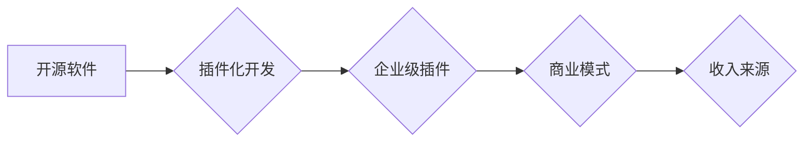

                 

## 创建开源项目的企业级插件：扩展收入来源

> 关键词：开源软件、企业级插件、商业模式、收入来源、技术生态、社区发展、软件架构、API接口、插件化开发

## 1. 背景介绍

开源软件在现代软件开发生态系统中扮演着越来越重要的角色。其灵活、可定制、成本效益高等特点吸引了越来越多的开发者和企业。然而，开源项目往往面临着资金和资源的短缺，难以持续发展。

企业级插件的出现为开源项目提供了新的商业模式和收入来源。企业级插件是指针对特定行业或企业需求开发的，基于开源软件的扩展功能模块。它们可以增强开源软件的功能，提供更专业的解决方案，并为开发者和企业带来新的价值。

## 2. 核心概念与联系

### 2.1 开源软件与企业级插件

开源软件是指源代码公开可供他人修改和使用的软件。其核心价值在于社区协作、透明度和可定制性。企业级插件则是在开源软件的基础上，针对特定企业需求进行开发的定制化功能模块。它们通常提供更专业的解决方案，并集成企业内部的系统和数据。

### 2.2 插件化开发模式

插件化开发模式是一种将软件功能模块化，并通过插件机制进行扩展的开发模式。它允许开发者独立开发功能模块，并将其集成到主应用程序中。这种模式具有以下优点：

* **提高软件可扩展性:** 通过添加新的插件，可以轻松扩展软件的功能。
* **降低开发成本:** 开发者可以专注于开发特定功能模块，而无需关心整个应用程序的开发。
* **促进社区协作:** 开发者可以共享和贡献自己的插件，促进开源社区的发展。

### 2.3 企业级插件的商业模式

企业级插件的商业模式主要包括以下几种：

* **付费插件:** 企业为使用特定功能模块支付费用。
* **订阅服务:** 企业为使用插件服务支付定期费用。
* **开源贡献:** 企业为开源项目提供资金支持，并获得插件开发和维护服务。

**Mermaid 流程图**



## 3. 核心算法原理 & 具体操作步骤

### 3.1 算法原理概述

企业级插件的开发通常涉及到以下核心算法：

* **插件加载机制:**  负责识别、加载和管理插件模块。
* **插件通信机制:**  允许插件与主应用程序进行通信和数据交换。
* **权限控制机制:**  确保插件只能访问其授权范围内的资源。
* **数据处理机制:**  处理插件需要访问和操作的数据。

### 3.2 算法步骤详解

1. **插件开发:** 开发者根据企业需求，开发特定的插件功能模块。
2. **插件打包:** 将插件代码、配置文件和依赖库打包成一个独立的插件包。
3. **插件注册:** 将插件包上传到插件仓库或平台，并进行注册。
4. **插件加载:** 主应用程序根据配置信息，加载所需的插件模块。
5. **插件通信:** 主应用程序和插件通过预定义的接口进行通信和数据交换。
6. **权限验证:** 主应用程序验证插件的权限，确保其只能访问授权范围内的资源。
7. **数据处理:** 插件处理需要访问和操作的数据，并返回结果给主应用程序。

### 3.3 算法优缺点

**优点:**

* **提高软件可扩展性:** 通过添加新的插件，可以轻松扩展软件的功能。
* **降低开发成本:** 开发者可以专注于开发特定功能模块，而无需关心整个应用程序的开发。
* **促进社区协作:** 开发者可以共享和贡献自己的插件，促进开源社区的发展。

**缺点:**

* **插件兼容性问题:** 不同的插件可能存在兼容性问题，需要进行测试和维护。
* **安全风险:**  插件可能存在安全漏洞，需要进行安全评估和防护。
* **性能问题:**  过多的插件可能会降低应用程序的性能。

### 3.4 算法应用领域

插件化开发模式广泛应用于以下领域：

* **企业级软件:**  例如CRM、ERP、协同办公软件等。
* **网站和博客:**  例如WordPress、Drupal等平台。
* **移动应用:**  例如Android和iOS应用商店。

## 4. 数学模型和公式 & 详细讲解 & 举例说明

### 4.1 数学模型构建

企业级插件的商业模式可以抽象为一个数学模型，其中涉及到以下变量：

* **P:** 插件开发成本
* **R:** 插件使用收入
* **N:** 插件用户数量
* **C:** 每位用户支付的费用

**收入模型:** R = N * C

**利润模型:**  利润 = R - P

### 4.2 公式推导过程

* **用户增长模型:** N(t) = N0 * e^(rt)  (其中N0为初始用户数量，r为用户增长率，t为时间)
* **收入增长模型:** R(t) = N(t) * C

### 4.3 案例分析与讲解

假设一个开源项目开发了一个企业级插件，其开发成本为10000美元，每位用户支付的费用为100美元，初始用户数量为100人，用户增长率为10%。

* **用户数量增长:**  N(1) = 100 * e^(0.1 * 1) = 110人
* **收入增长:** R(1) = 110 * 100 = 11000美元
* **利润:** 利润 = 11000 - 10000 = 1000美元

## 5. 项目实践：代码实例和详细解释说明

### 5.1 开发环境搭建

* **操作系统:** Linux/macOS/Windows
* **编程语言:** Python/Java/Go等
* **开发工具:**  IDE、文本编辑器、版本控制系统等

### 5.2 源代码详细实现

```python
# 插件入口文件
def main():
    # 加载插件配置
    config = load_config()
    # 注册插件功能
    register_plugin_function(config)

# 加载插件配置
def load_config():
    # 从配置文件中加载配置信息
    # ...

# 注册插件功能
def register_plugin_function(config):
    # 根据配置信息注册插件功能
    # ...
```

### 5.3 代码解读与分析

* **插件入口文件:**  插件的入口文件，负责加载配置信息和注册插件功能。
* **加载插件配置:**  从配置文件中加载插件的配置信息，例如插件名称、功能描述、依赖库等。
* **注册插件功能:**  根据配置信息，向主应用程序注册插件的功能模块。

### 5.4 运行结果展示

* 插件成功加载并注册到主应用程序中。
* 主应用程序可以调用插件的功能模块，实现扩展功能。

## 6. 实际应用场景

### 6.1  电商平台

* **商品推荐插件:**  根据用户浏览历史和购买记录，推荐相关的商品。
* **营销活动插件:**  支持商家进行促销活动，例如优惠券、满减等。

### 6.2  企业协同办公平台

* **项目管理插件:**  帮助团队进行项目管理，例如任务分配、进度跟踪等。
* **文档协作插件:**  支持多人协同编辑文档，提高工作效率。

### 6.3  教育平台

* **在线考试插件:**  支持在线考试和成绩管理。
* **学习资源插件:**  提供丰富的学习资源，例如视频课程、练习题等。

### 6.4  未来应用展望

随着开源软件和插件化开发模式的不断发展，企业级插件将有更广泛的应用场景，例如：

* **人工智能插件:**  集成人工智能算法，提供智能化功能。
* **区块链插件:**  利用区块链技术，实现数据安全和透明。
* **物联网插件:**  连接物联网设备，实现数据采集和分析。

## 7. 工具和资源推荐

### 7.1 学习资源推荐

* **开源软件开发教程:**  GitHub、GitLab、Bitbucket等平台提供丰富的开源软件开发教程。
* **插件化开发文档:**  许多开源软件项目提供插件化开发文档，例如WordPress、Drupal等。
* **在线课程:**  Coursera、Udemy等平台提供有关开源软件开发和插件化开发的在线课程。

### 7.2 开发工具推荐

* **IDE:**  Eclipse、IntelliJ IDEA、Visual Studio Code等
* **版本控制系统:**  Git、SVN等
* **插件管理工具:**  npm、Maven、Gradle等

### 7.3 相关论文推荐

* **The Economics of Open Source Software**
* **Plugin Architectures for Software Systems**
* **Extending Open Source Software with Plugins**

## 8. 总结：未来发展趋势与挑战

### 8.1 研究成果总结

企业级插件为开源软件项目提供了新的商业模式和收入来源，促进了开源社区的发展。插件化开发模式提高了软件的可扩展性和定制化能力，满足了企业对个性化解决方案的需求。

### 8.2 未来发展趋势

* **人工智能驱动的插件:**  利用人工智能算法，开发更智能化的插件功能。
* **区块链技术的应用:**  利用区块链技术，实现插件的安全性和透明性。
* **云原生插件:**  开发针对云计算环境的插件，提高软件的弹性和可扩展性。

### 8.3 面临的挑战

* **插件兼容性问题:**  随着插件数量的增加，插件兼容性问题将更加突出。
* **安全风险:**  插件可能存在安全漏洞，需要加强安全防护。
* **性能问题:**  过多的插件可能会降低应用程序的性能。

### 8.4 研究展望

未来研究将重点关注以下方面：

* **开发更智能、更安全的插件开发框架。**
* **研究更有效的插件兼容性管理机制。**
* **探索新的商业模式，促进开源软件的可持续发展。**

## 9. 附录：常见问题与解答

* **如何开发企业级插件？**

  开发企业级插件需要具备以下技能：

  * 熟悉开源软件开发流程
  * 掌握插件化开发模式
  * 了解目标用户的需求
  * 具备良好的代码编写和测试能力

* **如何推广企业级插件？**

  推广企业级插件可以通过以下方式：

  * 参加开源软件社区活动
  * 在开源软件平台上发布插件
  * 与目标用户进行沟通和合作
  * 提供良好的技术支持和售后服务

* **如何保障企业级插件的安全？**

  保障企业级插件的安全可以通过以下方式：

  * 进行代码审计和安全测试
  * 使用安全的开发工具和环境
  * 采用权限控制机制，限制插件访问范围
  * 定期更新插件，修复安全漏洞


作者：禅与计算机程序设计艺术 / Zen and the Art of Computer Programming 
<end_of_turn>

