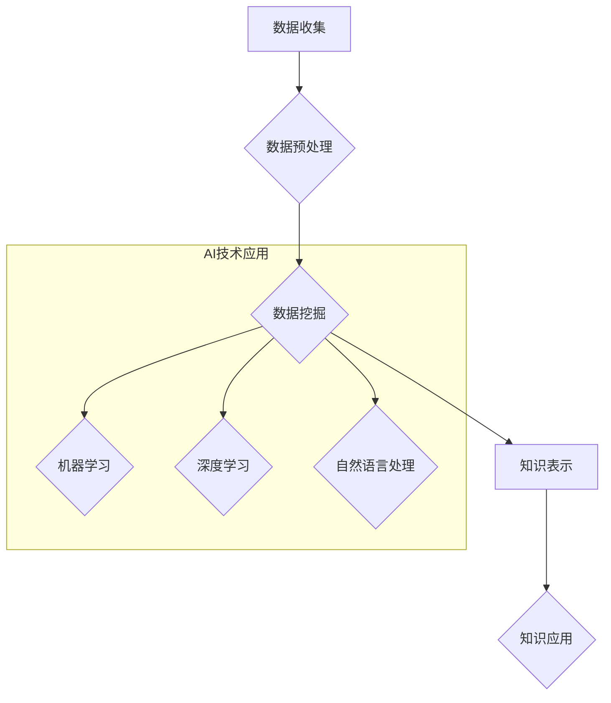

                 

## 利用AI技术提升知识发现引擎效率

> 关键词：知识发现引擎、人工智能、机器学习、深度学习、自然语言处理、数据挖掘、推荐系统

## 1. 背景介绍

知识是人类社会进步的基石，而知识发现引擎（Knowledge Discovery Engine，KDE）作为一种能够从海量数据中自动提取有价值知识的系统，在各个领域都发挥着越来越重要的作用。传统的KDE主要依赖于规则和统计方法，其效率和准确性受到一定的限制。随着人工智能（Artificial Intelligence，AI）技术的快速发展，特别是机器学习（Machine Learning，ML）和深度学习（Deep Learning，DL）的突破，AI技术为提升KDE效率提供了新的机遇。

近年来，AI技术在KDE领域取得了显著进展，例如：

* **自然语言处理（Natural Language Processing，NLP）**技术可以帮助KDE更好地理解和处理文本数据，提取更丰富的语义信息。
* **机器学习算法**可以自动学习数据中的模式和关系，提高KDE对知识的发现精度和效率。
* **深度学习模型**能够处理更复杂的数据结构，例如图数据和多模态数据，为KDE的知识发现能力带来新的突破。

## 2. 核心概念与联系

### 2.1  知识发现引擎（KDE）

KDE是一种能够从数据中自动发现隐藏的模式、趋势和知识的系统。它通常包括以下几个步骤：

1. **数据收集:** 从各种数据源收集相关数据。
2. **数据预处理:** 对收集到的数据进行清洗、转换和格式化。
3. **数据挖掘:** 使用各种算法和技术从数据中挖掘出有价值的知识。
4. **知识表示:** 将挖掘出的知识以可理解的形式表示出来，例如图表、报告或知识图谱。
5. **知识应用:** 将发现的知识应用到实际问题中，例如决策支持、预测分析和个性化推荐。

### 2.2  人工智能（AI）

AI是指模拟人类智能行为的计算机系统。它包括以下几个关键方面：

* **机器学习（ML）:** 使计算机能够从数据中学习，并根据学习到的知识进行预测或决策。
* **深度学习（DL）:** 一种更高级的机器学习方法，使用多层神经网络来模拟人类大脑的学习过程。
* **自然语言处理（NLP）:** 使计算机能够理解和处理人类语言。

### 2.3  AI技术与KDE的结合

AI技术可以显著提升KDE的效率和准确性。例如：

* **使用机器学习算法**可以自动学习数据中的模式和关系，提高KDE对知识的发现精度和效率。
* **使用深度学习模型**可以处理更复杂的数据结构，例如图数据和多模态数据，为KDE的知识发现能力带来新的突破。
* **使用自然语言处理技术**可以帮助KDE更好地理解和处理文本数据，提取更丰富的语义信息。

**Mermaid 流程图**



## 3. 核心算法原理 & 具体操作步骤

### 3.1  算法原理概述

在AI技术辅助下，KDE可以采用多种算法进行知识发现，例如：

* **关联规则挖掘算法:** 发现数据中频繁出现的项集之间的关联关系，例如市场营销中的关联商品推荐。
* **分类算法:** 将数据划分为不同的类别，例如垃圾邮件过滤和客户画像分析。
* **聚类算法:** 将数据按照相似性进行分组，例如用户群分析和市场细分。
* **异常检测算法:** 识别数据中的异常值，例如欺诈检测和设备故障诊断。

### 3.2  算法步骤详解

以关联规则挖掘算法为例，其具体步骤如下：

1. **构建频繁项集:** 统计数据中频繁出现的项集，例如购买商品的组合。
2. **生成关联规则:** 根据频繁项集之间的关系，生成关联规则，例如“购买牛奶的人也经常购买面包”。
3. **评估关联规则:** 使用支持度、置信度和提升度等指标评估关联规则的质量。
4. **筛选关联规则:** 根据评估结果，筛选出满足特定条件的关联规则。

### 3.3  算法优缺点

不同的算法具有不同的优缺点，需要根据具体应用场景选择合适的算法。例如：

* **关联规则挖掘算法:** 优点是能够发现数据中隐藏的关联关系，缺点是计算复杂度较高，难以处理海量数据。
* **分类算法:** 优点是能够将数据准确地分类，缺点是需要大量的 labeled 数据进行训练。
* **聚类算法:** 优点是能够发现数据中的自然聚类结构，缺点是聚类结果难以解释。

### 3.4  算法应用领域

AI技术辅助的KDE算法广泛应用于各个领域，例如：

* **商业领域:** 市场营销、客户关系管理、产品推荐等。
* **医疗领域:** 疾病诊断、药物研发、患者画像分析等。
* **金融领域:** 风险管理、欺诈检测、投资决策等。
* **教育领域:** 个性化学习、学生行为分析、教学资源推荐等。

## 4. 数学模型和公式 & 详细讲解 & 举例说明

### 4.1  数学模型构建

在KDE中，可以使用数学模型来描述知识发现过程中的各种关系和模式。例如，可以使用概率模型来描述数据中的关联规则，可以使用统计模型来描述数据中的聚类结构。

### 4.2  公式推导过程

以关联规则挖掘为例，可以使用以下公式来计算关联规则的支持度和置信度：

* **支持度:**  支持度 = (购买牛奶和面包的人数) / (总购买人数)
* **置信度:**  置信度 = (购买面包的人数 / 购买牛奶的人数)

### 4.3  案例分析与讲解

假设我们有一份超市销售数据的记录，其中包含了顾客购买的商品信息。我们可以使用关联规则挖掘算法来发现顾客购买商品的关联关系。例如，我们发现“购买牛奶的人也经常购买面包”的关联规则的支持度为0.3，置信度为0.7。这意味着，在购买牛奶的人群中，有70%的人也购买了面包，并且这个关联关系在整个数据集中比较常见。

## 5. 项目实践：代码实例和详细解释说明

### 5.1  开发环境搭建

为了实现AI技术辅助的KDE，我们需要搭建一个合适的开发环境。常用的开发环境包括：

* **Python:**  Python是一种流行的编程语言，拥有丰富的机器学习和深度学习库，例如Scikit-learn、TensorFlow和PyTorch。
* **Jupyter Notebook:** Jupyter Notebook是一种交互式编程环境，方便进行代码编写、调试和可视化。
* **云计算平台:** 云计算平台，例如AWS、Azure和GCP，可以提供强大的计算资源和存储空间，方便处理海量数据。

### 5.2  源代码详细实现

以下是一个使用Python和Scikit-learn库实现关联规则挖掘的简单代码示例：

```python
from sklearn.feature_extraction.text import TfidfVectorizer
from mlxtend.frequent_patterns import apriori, association_rules

# 数据准备
data = [
    "牛奶，面包，鸡蛋",
    "牛奶，面包",
    "面包，鸡蛋",
    "牛奶，鸡蛋",
    "牛奶，面包，牛奶"
]

# 使用TF-IDF向量化
vectorizer = TfidfVectorizer()
tfidf_matrix = vectorizer.fit_transform(data)

# 使用Apriori算法挖掘频繁项集
frequent_itemsets = apriori(tfidf_matrix, min_support=0.3, use_colnames=True)

# 使用association_rules算法生成关联规则
rules = association_rules(frequent_itemsets, metric="confidence", min_threshold=0.7)

# 打印关联规则
print(rules)
```

### 5.3  代码解读与分析

* **数据准备:**  首先，我们需要准备一个包含商品信息的文本数据。
* **TF-IDF向量化:**  使用TF-IDF向量化技术将文本数据转换为数值矩阵，方便进行关联规则挖掘。
* **Apriori算法:**  Apriori算法是一种经典的频繁项集挖掘算法，可以用来发现数据中频繁出现的项集。
* **association_rules算法:**  association_rules算法可以根据频繁项集生成关联规则，并使用置信度等指标评估规则的质量。

### 5.4  运行结果展示

运行上述代码后，会输出一些关联规则，例如“购买牛奶的人也经常购买面包”。这些规则可以帮助我们了解顾客购买商品的关联关系，并进行相应的营销策略。

## 6. 实际应用场景

### 6.1  电商推荐系统

AI技术辅助的KDE可以用于构建更精准的电商推荐系统。例如，可以根据用户的购买历史、浏览记录和兴趣偏好，推荐相关的商品。

### 6.2  医疗诊断辅助系统

AI技术辅助的KDE可以用于构建医疗诊断辅助系统。例如，可以根据患者的症状、病史和检查结果，推荐可能的诊断结果。

### 6.3  金融风险管理

AI技术辅助的KDE可以用于金融风险管理。例如，可以根据交易记录、客户信息和市场数据，识别潜在的欺诈行为和风险投资。

### 6.4  未来应用展望

随着AI技术的不断发展，AI技术辅助的KDE将有更广泛的应用场景，例如：

* **个性化教育:** 根据学生的学习进度和兴趣偏好，提供个性化的学习内容和建议。
* **智能城市管理:** 分析城市数据，预测交通流量、空气质量等，提高城市管理效率。
* **科学研究:** 帮助科学家发现新的科学规律和知识。

## 7. 工具和资源推荐

### 7.1  学习资源推荐

* **在线课程:** Coursera、edX、Udacity等平台提供丰富的AI和KDE相关课程。
* **书籍:** 《Python机器学习》、《深度学习》等书籍可以帮助你深入了解AI和KDE相关知识。
* **博客和论坛:**  Kaggle、Towards Data Science等平台上有许多AI和KDE相关的博客和论坛，可以帮助你学习和交流。

### 7.2  开发工具推荐

* **Python:**  Python是一种流行的编程语言，拥有丰富的机器学习和深度学习库。
* **Scikit-learn:**  Scikit-learn是一个开源的机器学习库，提供各种算法和工具。
* **TensorFlow:**  TensorFlow是一个开源的深度学习框架，可以用于构建复杂的深度学习模型。
* **PyTorch:**  PyTorch是一个开源的深度学习框架，以其灵活性和易用性而闻名。

### 7.3  相关论文推荐

* **"Apriori: Bringing the future of data mining to market"**
* **"Association Rule Mining: Methodological Advances and Applications"**
* **"Deep Learning for Knowledge Discovery"**

## 8. 总结：未来发展趋势与挑战

### 8.1  研究成果总结

AI技术辅助的KDE已经取得了显著的成果，在各个领域都有广泛的应用。

### 8.2  未来发展趋势

未来，AI技术辅助的KDE将朝着以下几个方向发展：

* **更强大的AI模型:**  随着深度学习技术的不断发展，将会有更强大的AI模型用于KDE，能够处理更复杂的数据和发现更深层次的知识。
* **更个性化的知识发现:**  KDE将更加注重用户的个性化需求，提供更精准和个性化的知识发现服务。
* **跨领域知识发现:**  KDE将更加注重跨领域知识的发现和融合，帮助用户从不同领域的数据中发现新的知识和洞察。

### 8.3  面临的挑战

AI技术辅助的KDE也面临着一些挑战：

* **数据质量问题:**  KDE的准确性和有效性依赖于数据质量，而现实世界的数据往往存在噪声、缺失和不一致等问题。
* **算法解释性问题:**  一些AI模型的决策过程难以解释，这使得KDE的结果难以被用户理解和信任。
* **伦理问题:**  AI技术辅助的KDE可能会带来一些伦理问题，例如数据隐私和算法偏见。

### 8.4  研究展望

未来，我们需要继续研究如何解决这些挑战，并推动AI技术辅助的KDE朝着更智能、更安全、更可解释的方向发展。


## 9. 附录：常见问题与解答

### 9.1  Q1:  AI技术辅助的KDE与传统KDE相比有什么优势？

**A1:**  AI技术辅助的KDE相比传统KDE具有以下优势：

* **更高的效率:**  AI算法可以自动学习数据中的模式和关系，提高KDE对知识的发现效率。
* **更高的准确性:**  AI算法可以处理更复杂的数据，并发现更深层次的知识，提高KDE的知识发现准确性。
* **更强的个性化:**  AI技术可以根据用户的需求和偏好，提供更个性化的知识发现服务。

### 9.2  Q2:  AI技术辅助的KDE有哪些应用场景？

**A2:**  AI技术辅助的KDE广泛应用于各个领域，例如：

* **电商推荐系统**
* **医疗诊断辅助系统**
* **金融风险管理**
* **个性化教育**
* **智能城市管理**

### 9.3  Q3:  如何学习AI技术辅助的KDE？

**A3:**  你可以通过以下方式学习AI技术辅助的KDE：

* **在线课程:**  Coursera、edX、Udacity等平台提供丰富的AI和KDE相关课程。
* **书籍:**  《Python机器学习》、《深度学习》等书籍可以帮助你深入了解AI和KDE相关知识。
* **博客和论坛:**  Kaggle、Towards Data Science等平台上有许多AI和KDE相关的博客和论坛，可以帮助你学习和交流。


作者：禅与计算机程序设计艺术 / Zen and the Art of Computer Programming 
<end_of_turn>

