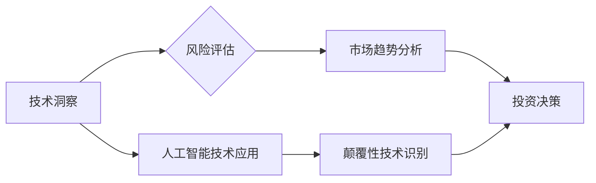

                 

## 利用技术洞察进行天使投资

> 关键词：天使投资, 技术洞察, 风险评估, 市场趋势, 颠覆性技术,  人工智能,  数据分析,  投资策略

## 1. 背景介绍

天使投资作为早期创业阶段的重要融资方式，扮演着连接创新者与资本的重要桥梁。然而，天使投资也充满了风险和挑战。如何在纷繁复杂的市场环境中，精准识别具有潜力的投资机会，并有效降低投资风险，是天使投资人面临的重大课题。

近年来，随着科技发展日新月异，技术创新成为推动经济增长的关键驱动力。越来越多的颠覆性技术涌现，为创业者提供了新的机遇，也为天使投资带来了新的挑战和机遇。如何利用技术洞察力，识别具有未来潜力的技术项目，并进行科学的风险评估，成为天使投资人成功的关键。

## 2. 核心概念与联系

**2.1  技术洞察**

技术洞察是指对新兴技术发展趋势、市场需求和商业模式的深入理解和预测能力。它不仅需要对技术本身的了解，更需要对市场、用户和商业生态的洞察。

**2.2  天使投资**

天使投资是指个人或机构以较低的估值和风险回报，为早期创业公司提供资金支持。天使投资人通常对投资项目具有较高的风险承受能力，并愿意为创业公司提供不仅仅是资金，还包括经验、资源和人脉等方面的支持。

**2.3  风险评估**

风险评估是指对投资项目潜在风险的识别、分析和评估。风险评估是天使投资决策的重要环节，可以帮助投资人识别潜在的风险，并采取相应的措施降低风险。

**2.4  市场趋势**

市场趋势是指市场需求、竞争格局、政策环境等方面的变化趋势。了解市场趋势可以帮助天使投资人识别具有市场潜力的投资机会。

**2.5  颠覆性技术**

颠覆性技术是指能够彻底改变现有市场格局的技术。颠覆性技术往往具有巨大的市场潜力，但也存在着较高的风险。

**2.6  人工智能**

人工智能 (AI) 是一种模拟人类智能的计算机科学领域。人工智能技术在各个领域都有着广泛的应用，例如图像识别、自然语言处理、机器学习等。

**Mermaid 流程图**



## 3. 核心算法原理 & 具体操作步骤

**3.1  算法原理概述**

在利用技术洞察进行天使投资的过程中，可以采用多种算法和模型来辅助决策。例如，可以使用机器学习算法对历史投资数据进行分析，识别成功的投资模式和风险因素；可以使用自然语言处理算法对创业公司的商业计划书和公开信息进行分析，评估其商业潜力和风险；可以使用数据挖掘算法对市场数据进行分析，识别潜在的市场机会和竞争格局。

**3.2  算法步骤详解**

1. **数据收集:** 收集相关数据，包括历史投资数据、创业公司信息、市场数据等。
2. **数据预处理:** 对收集到的数据进行清洗、转换和格式化，使其适合算法模型的训练和应用。
3. **模型选择:** 根据投资目标和数据特点，选择合适的算法模型，例如机器学习算法、自然语言处理算法、数据挖掘算法等。
4. **模型训练:** 使用训练数据对选定的算法模型进行训练，使其能够学习到数据中的规律和模式。
5. **模型评估:** 使用测试数据对训练好的模型进行评估，评估其预测准确率和泛化能力。
6. **模型应用:** 将训练好的模型应用于实际投资决策中，例如识别具有投资潜力的项目、评估投资风险等。

**3.3  算法优缺点**

* **优点:** 
    * 可以提高投资决策的效率和准确性。
    * 可以帮助投资人识别潜在的投资机会和风险。
    * 可以降低投资风险。
* **缺点:** 
    * 需要大量的训练数据。
    * 模型的准确性依赖于数据的质量和算法模型的选择。
    * 算法模型的解释性和可解释性较差。

**3.4  算法应用领域**

* **投资风险评估:** 评估创业公司的财务状况、市场竞争力、管理团队等方面的风险。
* **投资机会识别:** 识别具有市场潜力的创业项目，例如新兴技术、颠覆性创新等。
* **投资组合优化:** 建立投资组合，分散投资风险，提高投资回报率。

## 4. 数学模型和公式 & 详细讲解 & 举例说明

**4.1  数学模型构建**

在利用技术洞察进行天使投资的过程中，可以构建数学模型来量化投资风险和回报。例如，可以使用风险价值 (VaR) 模型来评估投资组合的风险，可以使用期望收益率 (ROI) 模型来评估投资回报率。

**4.2  公式推导过程**

* **风险价值 (VaR) 模型:**

VaR =  - *σ* * Z* * √T*

其中:

* *σ* 是投资组合的标准差
* *Z* 是置信水平对应的标准正态分布变量
* *T* 是投资期限

* **期望收益率 (ROI) 模型:**

ROI = (最终收益 - 初始投资) / 初始投资 * 100%

**4.3  案例分析与讲解**

假设一个天使投资人计划投资 100 万美元于一个创业公司，该公司的风险价值为 50 万美元，置信水平为 95%。根据 VaR 模型，该投资组合在 95% 的置信水平下，最大可能损失为 50 万美元。

假设该创业公司在 3 年后上市，最终收益为 200 万美元。根据 ROI 模型，该投资的期望收益率为：

ROI = (200 万美元 - 100 万美元) / 100 万美元 * 100% = 100%

## 5. 项目实践：代码实例和详细解释说明

**5.1  开发环境搭建**

* Python 3.x
* Jupyter Notebook
* NumPy
* Pandas
* Scikit-learn

**5.2  源代码详细实现**

```python
import pandas as pd
from sklearn.model_selection import train_test_split
from sklearn.linear_model import LogisticRegression
from sklearn.metrics import accuracy_score

# 加载数据
data = pd.read_csv('investment_data.csv')

# 划分训练集和测试集
X = data.drop('success', axis=1)
y = data['success']
X_train, X_test, y_train, y_test = train_test_split(X, y, test_size=0.2, random_state=42)

# 训练模型
model = LogisticRegression()
model.fit(X_train, y_train)

# 预测结果
y_pred = model.predict(X_test)

# 计算准确率
accuracy = accuracy_score(y_test, y_pred)
print('模型准确率:', accuracy)
```

**5.3  代码解读与分析**

* 该代码示例使用 LogisticRegression 模型对投资数据进行训练，并预测投资项目的成功概率。
* 数据集包含创业公司的各种特征，例如财务状况、市场竞争力、管理团队等。
* 模型训练过程包括划分训练集和测试集、训练模型、评估模型性能等步骤。
* 代码最后计算了模型的准确率，评估了模型的预测能力。

**5.4  运行结果展示**

运行结果会显示模型的准确率，例如 85% 或 90%。

## 6. 实际应用场景

**6.1  人工智能技术应用**

人工智能技术可以应用于各个环节，例如：

* **数据分析:** 利用机器学习算法对海量数据进行分析，识别投资机会和风险因素。
* **投资决策支持:** 建立智能投资平台，为投资人提供个性化的投资建议。
* **风险管理:** 利用人工智能技术进行风险评估和监控，降低投资风险。

**6.2  颠覆性技术识别**

天使投资人可以通过关注新兴技术发展趋势，识别具有颠覆性潜力的技术项目。例如，区块链技术、量子计算、基因编辑等技术都具有巨大的市场潜力，但也存在着较高的风险。

**6.3  市场趋势分析**

通过分析市场数据和用户需求，可以识别潜在的市场机会和竞争格局。例如，可以分析用户行为数据、市场调研报告、行业新闻等信息，了解市场趋势和用户需求。

**6.4  未来应用展望**

随着人工智能技术的发展，天使投资将更加依赖于技术洞察。未来，人工智能技术将能够更加精准地识别投资机会和风险，帮助天使投资人做出更明智的投资决策。

## 7. 工具和资源推荐

**7.1  学习资源推荐**

* **书籍:**
    * 《天使投资》
    * 《创业投资实战》
    * 《人工智能导论》
* **在线课程:**
    * Coursera: 机器学习
    * edX: 数据科学
    * Udacity: 深度学习

**7.2  开发工具推荐**

* **Python:** 
    * Jupyter Notebook
    * TensorFlow
    * PyTorch
* **数据分析工具:**
    * Tableau
    * Power BI

**7.3  相关论文推荐**

* 《人工智能在金融领域的应用》
* 《机器学习在投资决策中的应用》
* 《数据分析在创业投资中的应用》

## 8. 总结：未来发展趋势与挑战

**8.1  研究成果总结**

利用技术洞察进行天使投资是一个新兴的研究领域，近年来取得了一些重要进展。例如，人工智能技术在投资决策支持、风险评估、市场趋势分析等方面发挥了重要作用。

**8.2  未来发展趋势**

* **人工智能技术更加成熟:** 未来，人工智能技术将更加成熟，能够提供更加精准的投资建议和风险评估。
* **数据分析更加深入:** 数据分析技术将更加深入，能够挖掘出更多有价值的投资信息。
* **投资决策更加个性化:** 投资决策将更加个性化，能够满足不同投资人的需求。

**8.3  面临的挑战**

* **数据质量问题:** 投资数据往往存在着不完整、不准确、不一致等问题，需要进行有效的数据清洗和处理。
* **算法模型的解释性:** 许多人工智能算法模型的解释性较差，难以理解模型的决策逻辑。
* **伦理问题:** 利用人工智能技术进行投资决策可能会引发伦理问题，例如算法偏见、数据隐私等。

**8.4  研究展望**

未来，需要进一步研究如何提高数据质量、增强算法模型的解释性、解决伦理问题，以及如何将人工智能技术更好地应用于天使投资领域。


## 9. 附录：常见问题与解答

**9.1  如何评估人工智能技术的投资潜力？**

评估人工智能技术的投资潜力需要考虑以下因素:

* **技术成熟度:** 技术是否已经成熟，能够应用于实际场景？
* **市场需求:** 技术是否能够满足市场需求，是否有足够的市场空间？
* **竞争格局:** 技术的竞争格局如何，是否有强大的竞争对手？
* **团队实力:** 团队的技术实力、商业经验和执行能力如何？

**9.2  如何降低利用人工智能技术进行投资决策的风险？**

* **数据质量控制:** 确保投资数据质量，进行有效的数据清洗和处理。
* **模型选择和评估:** 选择合适的算法模型，并进行充分的模型评估和验证。
* **风险管理机制:** 建立完善的风险管理机制，对投资风险进行监控和控制。
* **人工监督:** 保持人工监督，避免过度依赖人工智能技术。

**9.3  人工智能技术对天使投资的影响是什么？**

人工智能技术对天使投资的影响是多方面的:

* **提高投资效率:** 自动化投资决策流程，提高投资效率。
* **降低投资风险:** 利用人工智能技术进行风险评估，降低投资风险。
* **发现新机会:** 挖掘出更多有价值的投资机会。
* **改变投资模式:** 推动投资模式的创新和变革。


作者：禅与计算机程序设计艺术 / Zen and the Art of Computer Programming 
<end_of_turn>

