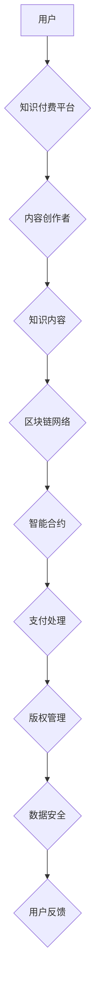

                 

## 区块链技术在知识付费中的创新应用

> 关键词：区块链、知识付费、去中心化、智能合约、数据安全、版权保护、信任机制

## 1. 背景介绍

知识付费作为一种新型的商业模式，近年来发展迅速，其核心在于将知识和技能转化为有价值的商品，并通过付费的方式进行交易。然而，传统的知识付费模式存在着诸多问题，例如：

* **信任缺失**:  知识付费平台和内容创作者之间缺乏信任，导致用户难以确定内容质量和创作者真实性。
* **版权保护难**:  知识产权的保护机制不完善，容易出现内容盗版和侵权现象。
* **交易成本高**:  传统的支付方式手续费高，且交易流程复杂。
* **数据安全隐患**:  用户数据安全难以保障，平台可能存在数据泄露和滥用风险。

区块链技术作为一种去中心化、透明、安全可靠的分布式账本技术，为解决上述问题提供了新的解决方案。

## 2. 核心概念与联系

**2.1 区块链技术概述**

区块链是一种分布式、去中心化的数据存储和共享技术。其核心特点包括：

* **去中心化**: 数据存储在多个节点上，不存在单一中心控制，提高了系统的安全性与抗攻击性。
* **透明公开**: 所有交易记录都记录在区块链上，任何人都可以查看，确保交易的透明度和可追溯性。
* **不可篡改**:  区块链上的数据经过加密和哈希算法处理，一旦写入区块链，就不可修改，保证了数据的完整性和安全性。

**2.2 知识付费与区块链的结合**

区块链技术可以应用于知识付费各个环节，构建一个更加安全、透明、高效的知识付费生态系统。

**2.3 架构图**



## 3. 核心算法原理 & 具体操作步骤

**3.1 算法原理概述**

区块链技术的核心算法包括：

* **哈希算法**: 用于生成数据不可逆的唯一标识，确保数据的完整性和不可篡改性。
* **加密算法**: 用于保护数据隐私和安全，防止数据被非法访问和篡改。
* **共识机制**: 用于验证交易的合法性和有效性，确保区块链的安全性与一致性。

**3.2 算法步骤详解**

1. **用户发起交易**: 用户通过知识付费平台发起支付请求，并选择购买的知识内容。
2. **平台验证交易**: 平台验证用户的身份和支付信息，并生成交易记录。
3. **交易打包**: 平台将多个交易记录打包成一个区块。
4. **区块验证**: 节点通过共识机制验证区块的合法性和有效性。
5. **区块添加**: 验证通过的区块被添加到区块链中，并与之前的区块链接形成一个不可篡改的链条。
6. **支付完成**: 用户支付成功，并获得知识内容的访问权限。

**3.3 算法优缺点**

* **优点**:  去中心化、透明、安全、不可篡改。
* **缺点**:  交易速度相对较慢、存储成本较高。

**3.4 算法应用领域**

区块链技术在知识付费领域具有广泛的应用前景，例如：

* **内容版权保护**:  利用区块链技术记录知识内容的版权信息，防止盗版和侵权。
* **知识分发**:  通过智能合约自动执行知识分发和支付流程，提高效率和透明度。
* **知识社区建设**:  构建去中心化的知识社区，促进知识共享和交流。

## 4. 数学模型和公式 & 详细讲解 & 举例说明

**4.1 数学模型构建**

区块链网络可以抽象为一个图模型，其中节点代表参与网络的计算机，边代表节点之间的连接。

* **节点**:  每个节点都存储一份完整的区块链数据副本。
* **边**:  节点之间通过网络连接进行数据交换和验证。

**4.2 公式推导过程**

* **哈希函数**:  H(x) = y，其中x为输入数据，y为哈希值。
* **共识机制**:  通过投票机制或其他算法，达成对区块链数据的共识。

**4.3 案例分析与讲解**

假设Alice想要购买Bob发布的知识内容，交易过程如下：

1. Alice通过平台发起支付请求，并发送交易数据到区块链网络。
2. 节点验证交易数据，并通过哈希函数生成交易哈希值。
3. 节点通过共识机制投票确认交易的合法性。
4. 交易被打包成区块，并添加到区块链中。
5. Alice支付成功，并获得知识内容的访问权限。

## 5. 项目实践：代码实例和详细解释说明

**5.1 开发环境搭建**

* 安装Go语言环境
* 安装区块链开发工具，例如Hyperledger Fabric

**5.2 源代码详细实现**

```go
// 知识内容合约
contract KnowledgeContract {
    // 内容标题
    string title;
    // 内容描述
    string description;
    // 内容价格
    uint price;
    // 购买者地址
    address[] buyers;

    // 购买知识内容
    function buyKnowledge() public payable {
        require(msg.value == price, "支付金额不正确");
        buyers.push(msg.sender);
    }
}
```

**5.3 代码解读与分析**

* `contract KnowledgeContract` 定义了一个智能合约，用于管理知识内容的购买和销售。
* `title`, `description`, `price` 为合约变量，存储知识内容的相关信息。
* `buyers` 为一个地址数组，记录购买知识内容的用户地址。
* `buyKnowledge()` 函数定义了购买知识内容的操作，需要用户支付相应的金额。

**5.4 运行结果展示**

通过部署智能合约到区块链网络，用户可以通过平台接口调用合约函数购买知识内容。

## 6. 实际应用场景

**6.1 在线课程平台**

* 利用区块链技术记录课程内容的版权信息，防止盗版和侵权。
* 通过智能合约自动执行课程购买和授课流程，提高效率和透明度。

**6.2 在线文档分享平台**

* 利用区块链技术记录文档的访问记录和版权信息，保障作者权益。
* 通过智能合约实现文档付费订阅和分发，提高平台收入。

**6.3 知识社区平台**

* 利用区块链技术构建去中心化的知识社区，促进知识共享和交流。
* 通过智能合约实现知识贡献和奖励机制，激励用户参与社区建设。

**6.4 未来应用展望**

区块链技术在知识付费领域的应用前景广阔，未来可能出现以下应用场景：

* **个性化知识推荐**:  利用区块链技术记录用户的学习行为和偏好，提供个性化的知识推荐。
* **知识资产评估**:  利用区块链技术对知识资产进行评估和交易，促进知识流动和价值创造。
* **跨境知识付费**:  利用区块链技术解决跨境支付和版权保护问题，促进全球知识共享。

## 7. 工具和资源推荐

**7.1 学习资源推荐**

* **区块链技术入门书籍**: 《区块链：从原理到实践》
* **区块链技术在线课程**: Coursera、edX

**7.2 开发工具推荐**

* **Hyperledger Fabric**:  开源区块链平台
* **Ethereum**:  去中心化应用平台

**7.3 相关论文推荐**

* **Blockchain Technology for Knowledge Sharing and Monetization**:  https://arxiv.org/abs/1809.04397

## 8. 总结：未来发展趋势与挑战

**8.1 研究成果总结**

区块链技术为知识付费模式带来了新的机遇，可以解决传统模式中的信任缺失、版权保护难、交易成本高和数据安全隐患等问题。

**8.2 未来发展趋势**

* **去中心化知识付费平台**:  构建去中心化的知识付费平台，打破平台垄断，促进知识自由流通。
* **知识资产数字化**:  将知识资产数字化，并通过区块链技术进行管理和交易，促进知识价值的释放。
* **人工智能与区块链的融合**:  将人工智能技术与区块链技术结合，实现智能知识推荐、个性化学习和知识资产评估等功能。

**8.3 面临的挑战**

* **技术成熟度**:  区块链技术还处于发展初期，需要进一步完善和优化。
* **用户接受度**:  用户对区块链技术的了解和接受度还比较低，需要加强宣传和教育。
* **监管政策**:  区块链技术的应用需要相应的法律法规和监管政策支持。

**8.4 研究展望**

未来，区块链技术在知识付费领域的应用将更加广泛和深入，将为知识生产者和消费者带来更多价值。


## 9. 附录：常见问题与解答

**9.1  区块链技术是否真的安全可靠？**

区块链技术基于密码学原理，具有去中心化、透明、不可篡改等特性，安全性较高。

**9.2  区块链技术是否适用于所有类型的知识付费？**

区块链技术可以应用于多种类型的知识付费，但具体应用场景需要根据实际情况进行评估。

**9.3  区块链技术会取代传统的知识付费模式吗？**

区块链技术将与传统的知识付费模式共同发展，并最终形成一个更加完善的知识付费生态系统。


作者：禅与计算机程序设计艺术 / Zen and the Art of Computer Programming 
<end_of_turn>

