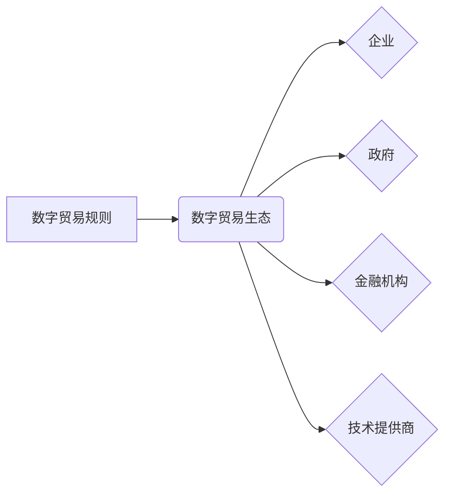

                 

## 2050年的全球贸易：从数字贸易规则到数字贸易生态的贸易规则重构

> 关键词：数字贸易规则、数字贸易生态、区块链、人工智能、物联网、数据安全、跨境贸易、智能合约

### 1. 背景介绍

21世纪的全球化进程加速了跨境贸易的发展，贸易规则也随之不断演变。然而，传统贸易规则体系面临着诸多挑战：

* **效率低下：** 繁琐的纸质流程、冗长的清关环节、信息不对称等问题导致贸易效率低下。
* **成本高昂：** 贸易环节繁多，手续复杂，给企业带来了沉重的成本负担。
* **缺乏透明度：** 贸易信息分散，难以追踪，容易出现欺诈和舞弊行为。
* **监管难度：** 跨境贸易涉及多个国家和地区，监管难度大，难以有效防范风险。

随着数字技术的飞速发展，特别是区块链、人工智能、物联网等技术的突破，数字贸易规则和数字贸易生态正在逐渐形成，为解决传统贸易规则体系的痛点提供了新的思路和解决方案。

### 2. 核心概念与联系

**2.1 数字贸易规则**

数字贸易规则是指在数字经济环境下，以数字技术为基础，规范数字贸易行为的规则体系。它涵盖了数字贸易的各个环节，包括：

* **数字身份认证：** 建立统一的数字身份认证体系，确保交易主体真实可靠。
* **数字合同：** 利用智能合约技术，实现贸易合同的自动化执行，提高交易效率和安全性。
* **数字支付：** 建立安全可靠的数字支付系统，简化交易流程，降低交易成本。
* **数字物流：** 利用物联网技术，实现货物全程可追溯，提高物流效率和透明度。
* **数据安全：** 建立完善的数据安全机制，保护数字贸易中的敏感信息。

**2.2 数字贸易生态**

数字贸易生态是指以数字贸易规则为基础，由企业、政府、金融机构、技术提供商等多方参与，形成的互联互通、协同发展的贸易体系。

**2.3 核心概念关系图**



### 3. 核心算法原理 & 具体操作步骤

**3.1 算法原理概述**

数字贸易规则的实施需要依赖于一系列先进的算法，例如：

* **身份认证算法：** 用于验证交易主体的身份信息，确保交易的真实性和可靠性。常见的算法包括：密码学算法、生物识别算法、行为识别算法等。
* **智能合约算法：** 用于自动执行贸易合同，确保交易的公平性和可执行性。常见的算法包括：状态机算法、图灵完备算法、密码学算法等。
* **数据安全算法：** 用于保护数字贸易中的敏感信息，防止数据泄露和篡改。常见的算法包括：加密算法、哈希算法、数字签名算法等。

**3.2 算法步骤详解**

以智能合约算法为例，其具体操作步骤如下：

1. **定义合约条款：** 交易双方根据实际需求，在智能合约平台上定义交易条款，包括交易对象、价格、支付方式、履行时间等。
2. **部署合约：** 交易双方将定义好的合约条款部署到智能合约平台上，生成一个唯一的合约地址。
3. **触发合约执行：** 当交易条件满足时，例如货物交付、资金支付等，交易双方可以通过智能合约平台触发合约执行。
4. **自动执行合约：** 智能合约平台根据合约条款自动执行交易流程，例如自动释放资金、自动更新交易状态等。
5. **记录交易数据：** 智能合约平台将交易数据记录在区块链上，确保交易的不可篡改性和透明度。

**3.3 算法优缺点**

**优点：**

* **提高效率：** 自动化执行交易流程，减少人工干预，提高交易效率。
* **降低成本：** 减少中间环节，降低交易成本。
* **提高安全性：** 利用区块链技术，确保交易数据安全可靠。
* **提高透明度：** 将交易数据记录在区块链上，提高交易透明度。

**缺点：**

* **技术门槛高：** 开发和部署智能合约需要一定的技术门槛。
* **法律风险：** 智能合约的法律效力尚待明确，存在一定的法律风险。
* **可扩展性问题：** 现有的智能合约平台在可扩展性方面存在一定的挑战。

**3.4 算法应用领域**

数字贸易规则和算法的应用领域非常广泛，例如：

* **跨境电商：** 简化跨境电商交易流程，降低交易成本，提高交易效率。
* **供应链金融：** 利用智能合约技术，实现供应链金融的自动化和智能化。
* **知识产权保护：** 利用区块链技术，记录和保护知识产权信息，防止知识产权侵权。
* **数字资产交易：** 建立安全可靠的数字资产交易平台，促进数字资产的流通和交易。

### 4. 数学模型和公式 & 详细讲解 & 举例说明

**4.1 数学模型构建**

数字贸易规则的构建可以基于以下数学模型：

* **博弈论模型：** 用于分析交易双方之间的博弈关系，制定最优的交易策略。
* **网络模型：** 用于描述数字贸易生态中的节点和连接关系，分析交易网络的结构和功能。
* **概率模型：** 用于分析交易风险和不确定性，制定相应的风险管理策略。

**4.2 公式推导过程**

以博弈论模型为例，假设有两个交易主体A和B，他们分别拥有资源X和Y，想要进行交易。

* **效用函数：** 每个交易主体都有一个效用函数，用来衡量其交易收益。例如，A的效用函数为：U_A(x,y) = a*x + b*y，其中a和b是A对资源X和Y的偏好系数。
* **策略空间：** 每个交易主体都有一个策略空间，即可以选择的交易策略。例如，A可以选择接受交易、拒绝交易，B也可以选择接受交易、拒绝交易。
* **纳什均衡：** 纳什均衡是指一个状态，在该状态下，每个交易主体都无法通过单方面改变策略来提高自己的效用。

**4.3 案例分析与讲解**

假设A对资源X的偏好系数a=2，对资源Y的偏好系数b=1，B对资源X的偏好系数a=1，对资源Y的偏好系数b=2。

通过分析A和B的效用函数和策略空间，可以推导出纳什均衡策略。例如，如果A选择接受交易，B选择拒绝交易，则A的效用为U_A(x,0) = 2x，B的效用为U_B(0,y) = 2y。如果A选择拒绝交易，B选择接受交易，则A的效用为U_A(0,0) = 0，B的效用为U_B(0,0) = 0。

因此，纳什均衡策略是A接受交易，B拒绝交易。

### 5. 项目实践：代码实例和详细解释说明

**5.1 开发环境搭建**

数字贸易规则的开发环境通常包括：

* **区块链平台：** 例如Ethereum、Hyperledger Fabric等。
* **智能合约开发工具：** 例如Truffle、Remix等。
* **编程语言：** 例如Solidity、Go等。

**5.2 源代码详细实现**

以一个简单的数字贸易合同为例，其源代码实现如下：

```solidity
pragma solidity ^0.8.0;

contract TradeContract {

    address public buyer;
    address public seller;
    uint public price;
    bool public isPaid;

    constructor(address _buyer, address _seller, uint _price) {
        buyer = _buyer;
        seller = _seller;
        price = _price;
    }

    function pay() public payable {
        require(msg.sender == buyer, "Only buyer can pay");
        require(!isPaid, "Payment already received");
        isPaid = true;
        payable(seller).transfer(price);
    }
}
```

**5.3 代码解读与分析**

* **pragma solidity ^0.8.0;**：指定合约的Solidity版本。
* **contract TradeContract { ... }**：定义一个名为TradeContract的智能合约。
* **address public buyer;**：定义一个名为buyer的地址变量，用于存储买方的地址。
* **address public seller;**：定义一个名为seller的地址变量，用于存储卖方的地址。
* **uint public price;**：定义一个名为price的uint变量，用于存储交易价格。
* **bool public isPaid;**：定义一个名为isPaid的bool变量，用于标记是否已支付。
* **constructor(address _buyer, address _seller, uint _price) { ... }**：合约的构造函数，用于初始化合约变量。
* **function pay() public payable { ... }**：定义一个名为pay的函数，用于买方支付交易价格。

**5.4 运行结果展示**

当买方调用pay函数支付交易价格时，智能合约会自动将资金转给卖方，并标记交易已支付。

### 6. 实际应用场景

数字贸易规则和数字贸易生态的应用场景非常广泛，例如：

* **跨境电商平台：** 利用数字贸易规则，简化跨境电商交易流程，降低交易成本，提高交易效率。
* **供应链金融平台：** 利用数字贸易规则，实现供应链金融的自动化和智能化，降低融资成本，提高融资效率。
* **知识产权保护平台：** 利用数字贸易规则，记录和保护知识产权信息，防止知识产权侵权。
* **数字资产交易平台：** 利用数字贸易规则，建立安全可靠的数字资产交易平台，促进数字资产的流通和交易。

**6.4 未来应用展望**

随着数字技术的不断发展，数字贸易规则和数字贸易生态将更加完善和成熟，其应用场景也将更加广泛。例如：

* **数字身份认证：** 利用区块链技术，建立统一的数字身份认证体系，方便跨境贸易和数据共享。
* **数字合同：** 利用智能合约技术，实现贸易合同的自动化执行，提高交易效率和安全性。
* **数字支付：** 利用区块链技术，建立安全可靠的数字支付系统，降低交易成本和风险。
* **数字物流：** 利用物联网技术，实现货物全程可追溯，提高物流效率和透明度。

### 7. 工具和资源推荐

**7.1 学习资源推荐**

* **区块链技术入门书籍：** 《区块链革命》、《Mastering Bitcoin》
* **智能合约开发教程：** Truffle官方文档、Remix官方文档
* **数字贸易规则研究论文：** 相关学术期刊和会议论文

**7.2 开发工具推荐**

* **区块链平台：** Ethereum、Hyperledger Fabric
* **智能合约开发工具：** Truffle、Remix
* **编程语言：** Solidity、Go

**7.3 相关论文推荐**

* **数字贸易规则的构建与应用**
* **区块链技术在数字贸易中的应用**
* **智能合约在数字贸易中的应用**

### 8. 总结：未来发展趋势与挑战

**8.1 研究成果总结**

数字贸易规则和数字贸易生态的构建和发展，为解决传统贸易规则体系的痛点提供了新的思路和解决方案。数字贸易规则的实施，可以提高贸易效率、降低交易成本、提高交易安全性、提高交易透明度等。

**8.2 未来发展趋势**

未来，数字贸易规则和数字贸易生态将朝着以下方向发展：

* **更加完善的规则体系：** 随着数字贸易的不断发展，数字贸易规则体系将更加完善和规范。
* **更加广泛的应用场景：** 数字贸易规则将应用于越来越多的领域，例如供应链管理、知识产权保护、数字资产交易等。
* **更加智能化的交易流程：** 利用人工智能技术，数字贸易交易流程将更加智能化和自动化。

**8.3 面临的挑战**

数字贸易规则和数字贸易生态的实施也面临着一些挑战：

* **技术挑战：** 数字贸易规则的实施需要依赖于先进的数字技术，例如区块链技术、人工智能技术等。
* **法律挑战：** 数字贸易规则的法律效力尚待明确，需要制定相应的法律法规。
* **监管挑战：** 数字贸易生态的监管难度大，需要建立有效的监管机制。

**8.4 研究展望**

未来，我们需要继续深入研究数字贸易规则和数字贸易生态，解决其面临的挑战，推动数字贸易的健康发展。

### 9. 附录：常见问题与解答

**9.1 如何确保数字贸易规则的安全性？**

数字贸易规则的安全性主要依赖于区块链技术的应用。区块链技术具有不可篡改、透明、安全等特点，可以有效防止数据泄露和篡改。

**9.2 如何解决数字贸易规则的法律问题？**

数字贸易规则的法律问题需要通过制定相应的法律法规来解决。例如，可以制定关于数字合同的法律法规，明确数字合同的效力。

**9.3 如何监管数字贸易生态？**

数字贸易生态的监管需要建立有效的监管机制，例如：

* **建立数字贸易监管机构：** 专门负责监管数字贸易生态的运行。
* **制定数字贸易监管规则：** 明确数字贸易生态的监管范围、监管对象、监管方式等。
* **加强信息共享：** 政府、企业、技术提供商等多方加强信息共享，共同监管数字贸易生态。


作者：禅与计算机程序设计艺术 / Zen and the Art of Computer Programming 
<end_of_turn>

