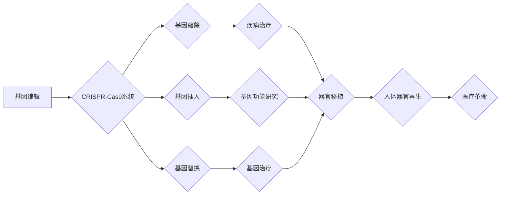

                 

## 2050年的生物技术：从基因编辑到人体器官再生的医学革命

> 关键词：基因编辑、CRISPR、人体器官再生、3D生物打印、干细胞、纳米技术、生物信息学、合成生物学、医疗革命

### 1. 背景介绍

21世纪初，生物技术领域迎来了前所未有的发展机遇。基因组测序技术的飞速进步、CRISPR基因编辑技术的突破以及人工智能和机器学习的蓬勃发展，为我们开启了探索生命奥秘和改造人类健康的全新篇章。

2050年，生物技术将彻底改变医疗保健的格局，从疾病的预防和治疗到人类寿命的延长，生物技术将扮演着越来越重要的角色。

### 2. 核心概念与联系

**2.1 基因编辑**

基因编辑技术是指能够精确修改生物基因组的技术。其中，CRISPR-Cas9系统作为一种革命性的基因编辑工具，凭借其高效、精准、可编程的特点，迅速成为研究和应用的热点。CRISPR-Cas9系统由两个主要部分组成：

* **CRISPR:** 是一种细菌免疫系统，能够识别和切割入侵的病毒DNA。
* **Cas9:** 是一种核酸酶，能够根据CRISPR的指导，切割目标DNA序列。

通过设计特定的CRISPR RNA（crRNA）序列，可以引导Cas9蛋白切割目标基因，从而实现基因敲除、基因插入或基因替换等功能。

**2.2 人体器官再生**

人体器官再生是指利用生物技术手段，在体外构建完整的、功能性的人体器官。这将为器官移植提供了一种全新的解决方案，解决器官短缺问题，并减少移植排斥反应的风险。

**2.3 3D生物打印**

3D生物打印技术利用生物材料，通过逐层打印的方式，构建三维结构。在器官再生领域，3D生物打印技术可以用于构建器官支架，并通过细胞培养和组织工程技术，在支架上生长出功能性的人体组织和器官。

**2.4 干细胞**

干细胞是一种具有自我更新和分化潜能的细胞。干细胞可以分化为各种类型的细胞，具有巨大的治疗潜力。在器官再生领域，干细胞可以作为构建器官的原料细胞，并通过诱导分化，形成所需的组织和器官。

**2.5  纳米技术**

纳米技术是指在纳米尺度（1-100纳米）上对材料进行操控和加工的技术。纳米技术可以用于构建纳米级生物材料，并通过纳米材料的独特性质，提高器官再生的效率和安全性。

**2.6  生物信息学**

生物信息学是利用计算机科学和统计学方法，分析和处理生物学数据。生物信息学可以用于分析基因组序列、蛋白质结构和生物网络，为器官再生提供重要的理论基础和技术支持。

**2.7  合成生物学**

合成生物学是指利用工程学原理，设计和构建新的生物系统。合成生物学可以用于设计新的生物材料，构建人工细胞，并开发新的生物治疗方法。

**2.8  人工智能和机器学习**

人工智能和机器学习可以用于分析生物数据，预测疾病风险，优化器官再生过程，并开发新的生物治疗方法。

**Mermaid 流程图**



### 3. 核心算法原理 & 具体操作步骤

**3.1 算法原理概述**

CRISPR-Cas9基因编辑系统的工作原理基于细菌的免疫系统。细菌利用CRISPR序列存储病毒DNA片段的信息，并通过Cas9蛋白切割入侵的病毒DNA。科学家们利用这一机制，设计特定的crRNA序列，引导Cas9蛋白切割目标基因，从而实现基因编辑。

**3.2 算法步骤详解**

1. **设计crRNA序列:** 根据目标基因序列，设计特定的crRNA序列，使其与目标基因序列互补配对。
2. **构建Cas9蛋白和crRNA复合物:** 将Cas9蛋白与crRNA序列结合，形成Cas9-crRNA复合物。
3. **导入细胞:** 将Cas9-crRNA复合物导入目标细胞。
4. **切割目标基因:** Cas9蛋白识别并切割目标基因序列。
5. **修复基因:** 细胞自身的DNA修复机制会修复切割后的基因，从而实现基因敲除、插入或替换。

**3.3 算法优缺点**

**优点:**

* **高效:** CRISPR-Cas9系统能够高效地切割目标基因。
* **精准:** CRISPR-Cas9系统能够精确地切割目标基因序列。
* **可编程:** 通过设计不同的crRNA序列，可以实现对不同基因的编辑。

**缺点:**

* **脱靶效应:** Cas9蛋白可能会切割非目标基因序列，导致脱靶效应。
* **免疫反应:** Cas9蛋白可能会引发免疫反应。
* **伦理问题:** 基因编辑技术可能引发伦理问题，例如基因改造的安全性、公平性和可控性。

**3.4 算法应用领域**

* **疾病治疗:** 基因编辑技术可以用于治疗遗传性疾病、癌症和传染病。
* **农业改良:** 基因编辑技术可以用于改良农作物，提高产量、抗病性和耐旱性。
* **生物能源:** 基因编辑技术可以用于开发新的生物能源，例如生物燃料和生物质能源。

### 4. 数学模型和公式 & 详细讲解 & 举例说明

**4.1 数学模型构建**

在器官再生领域，数学模型可以用于模拟器官的生长和发育过程，预测器官的结构和功能，并优化器官再生的工艺参数。

例如，可以使用有限元分析方法模拟器官的机械应力分布，预测器官的结构稳定性。可以使用反应扩散方程模拟细胞的生长和迁移，预测器官的形态和尺寸。

**4.2 公式推导过程**

有限元分析方法的基本原理是将复杂结构分割成多个简单的单元，并对每个单元进行分析。每个单元的应力、位移和变形可以通过单元的几何形状、材料特性和边界条件来计算。

反应扩散方程描述了物质在空间和时间上的扩散和反应过程。

**4.3 案例分析与讲解**

可以使用数学模型来预测3D生物打印器官的生长和发育过程。例如，可以建立一个反应扩散方程模型，模拟细胞在生物打印支架上的生长和迁移。通过调整模型参数，可以优化生物打印工艺，提高器官的生长效率和功能性。

### 5. 项目实践：代码实例和详细解释说明

**5.1 开发环境搭建**

* 操作系统：Linux或Windows
* 编程语言：Python
* 软件包：NumPy、SciPy、Matplotlib、Biopython

**5.2 源代码详细实现**

```python
# 导入必要的库
import numpy as np
from scipy.integrate import odeint

# 定义反应扩散方程
def model(y, t, D, r, K):
    # y: 细胞浓度
    # t: 时间
    # D: 扩散系数
    # r: 生长率
    # K: 饱和度常数
    dydt = D * np.gradient(y, axis=0)**2 + r * y * (1 - y / K)
    return dydt

# 设置模型参数
D = 0.1  # 扩散系数
r = 0.5  # 生长率
K = 1.0  # 饱和度常数

# 设置初始条件
y0 = np.zeros(100)
y0[50] = 1.0  # 初始细胞浓度

# 设置时间范围
t = np.linspace(0, 10, 100)

# 求解反应扩散方程
solution = odeint(model, y0, t, args=(D, r, K))

# 绘制细胞浓度随时间的变化曲线
import matplotlib.pyplot as plt
plt.plot(t, solution[:, 50])
plt.xlabel('时间')
plt.ylabel('细胞浓度')
plt.title('细胞浓度随时间的变化')
plt.show()
```

**5.3 代码解读与分析**

这段代码实现了反应扩散方程的数值解，模拟了细胞在空间上的扩散和生长过程。

* `model()` 函数定义了反应扩散方程，其中 `y` 表示细胞浓度， `t` 表示时间， `D` 表示扩散系数， `r` 表示生长率， `K` 表示饱和度常数。
* `odeint()` 函数用于求解常微分方程组，它接受模型函数、初始条件、时间范围以及模型参数作为输入。
* `plt.plot()` 函数用于绘制细胞浓度随时间的变化曲线。

**5.4 运行结果展示**

运行这段代码后，会生成一个细胞浓度随时间的变化曲线。曲线显示，细胞浓度随着时间的推移逐渐增加，并最终达到一个稳定状态。

### 6. 实际应用场景

**6.1 基因治疗**

CRISPR-Cas9基因编辑技术可以用于治疗遗传性疾病，例如囊性纤维化、镰状细胞贫血和血友病。通过编辑患者的基因，可以修复缺陷基因，从而治愈疾病。

**6.2 癌症治疗**

CRISPR-Cas9基因编辑技术可以用于增强免疫细胞的杀伤能力，从而提高癌症治疗的疗效。

**6.3 传染病治疗**

CRISPR-Cas9基因编辑技术可以用于开发新的抗病毒药物和疫苗。

**6.4 未来应用展望**

未来，生物技术将继续推动医疗保健的进步，例如：

* **个性化医疗:** 基于基因组信息，为每个患者提供个性化的治疗方案。
* **器官移植:** 人工合成器官，解决器官短缺问题。
* **疾病预防:** 通过基因编辑技术，预防遗传性疾病的发生。
* **寿命延长:** 通过干细胞和再生医学技术，延长人类寿命。

### 7. 工具和资源推荐

**7.1 学习资源推荐**

* **书籍:**
    * 《CRISPR：基因编辑的革命》
    * 《合成生物学：设计和构建生命》
* **在线课程:**
    * Coursera: 生物信息学
    * edX: 基因编辑
* **网站:**
    * CRISPR Therapeutics
    * Broad Institute

**7.2 开发工具推荐**

* **基因编辑软件:**
    * Benchling
    * SnapGene
* **生物信息学软件:**
    * Biopython
    * Galaxy

**7.3 相关论文推荐**

* **CRISPR-Cas9基因编辑技术的发现和应用:**
    * Doudna JA, Charpentier E. Genome editing. The new frontier of genome engineering with CRISPR-Cas9. Science. 2014;346(6213):1258096.
* **CRISPR-Cas9基因编辑技术在癌症治疗中的应用:**
    * Stadtfeld M, Hochedlinger K. Induced pluripotent stem cells - finding the path to regenerative medicine. N Engl J Med. 2010;363(16):1640-1642.
* **3D生物打印器官再生的进展:**
    * Murphy SV, Atala A. 3D bioprinting of tissues and organs. Nat Biotechnol. 2014;32(8):773-785.

### 8. 总结：未来发展趋势与挑战

**8.1 研究成果总结**

2050年，生物技术将取得巨大的进步，基因编辑、器官再生、3D生物打印、干细胞和纳米技术等领域将取得突破性进展。这些技术将彻底改变医疗保健的格局，为人类健康带来新的希望。

**8.2 未来发展趋势**

* **精准医疗:** 基于基因组信息，为每个患者提供个性化的治疗方案。
* **器官移植革命:** 人工合成器官，解决器官短缺问题。
* **疾病预防:** 通过基因编辑技术，预防遗传性疾病的发生。
* **寿命延长:** 通过干细胞和再生医学技术，延长人类寿命。

**8.3 面临的挑战**

* **伦理问题:** 基因编辑技术可能引发伦理问题，例如基因改造的安全性、公平性和可控性。
* **技术挑战:** 许多生物技术领域仍然面临着技术挑战，例如器官再生的复杂性和成本。
* **社会接受度:** 一些生物技术应用可能面临社会接受度的挑战。

**8.4 研究展望**

未来，生物技术研究将继续探索生命奥秘，开发新的生物技术应用，为人类健康和福祉做出更大的贡献。

### 9. 附录：常见问题与解答

**9.1  CRISPR-Cas9基因编辑技术是否安全？**

CRISPR-Cas9基因编辑技术是一种强大的工具，但也存在一些安全风险。例如，Cas9蛋白可能会切割非目标基因序列，导致脱靶效应。此外，基因编辑技术可能引发免疫反应。

**9.2  基因编辑技术是否会改变人类的基因组？**

基因编辑技术可以改变人类的基因组，但这需要经过严格的伦理审查和监管。

**9.3  器官再生技术是否可以解决器官短缺问题？**

器官再生技术有潜力解决器官短缺问题，但目前还处于早期阶段，需要进一步的研究和开发。

**9.4  生物技术将如何改变我们的生活？**

生物技术将深刻地改变我们的生活，例如：

* **医疗保健:** 提供更精准、更有效的治疗方案。
* **农业:** 提高农作物的产量和质量。
* **环境保护:** 开发新的生物技术，用于环境修复和污染控制。


作者：禅与计算机程序设计艺术 / Zen and the Art of Computer Programming 
<end_of_turn>

