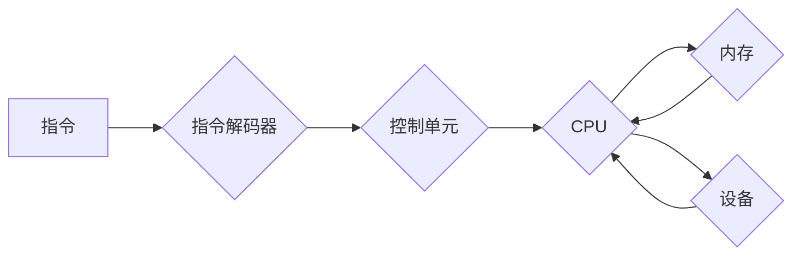

                 

## 执行器控制：在设备上执行操作

> 关键词：执行器控制、设备驱动、操作系统、进程管理、系统调用、中断处理、硬件抽象

### 1. 背景介绍

在现代计算机系统中，执行器控制是连接软件世界和硬件世界的关键桥梁。它负责将软件指令翻译成硬件可以理解的指令，并协调硬件资源的分配和使用。理解执行器控制的原理对于深入掌握计算机系统架构、操作系统设计和软件开发至关重要。

传统的计算机体系结构将执行器控制视为一个独立的模块，负责处理指令和数据流。然而，随着现代硬件的复杂化和软件的异构化，执行器控制面临着新的挑战。例如，多核处理器、虚拟化技术和云计算环境都对执行器控制提出了更高的要求。

### 2. 核心概念与联系

#### 2.1  执行器控制的概念

执行器控制是指计算机系统中将软件指令翻译成硬件指令并执行的操作过程。它涉及到以下几个关键概念：

* **指令集架构 (ISA)：** 指令集架构定义了计算机可以执行的指令集，以及指令的格式和操作方式。
* **程序计数器 (PC)：** 程序计数器存储着正在执行的指令的地址。
* **指令解码器：** 指令解码器负责将指令从机器码解码成操作码和操作数。
* **控制单元 (CU)：** 控制单元根据指令的操作码控制硬件资源的分配和使用。
* **数据总线：** 数据总线用于传输数据和指令。
* **地址总线：** 地址总线用于传输内存地址。
* **设备驱动程序：** 设备驱动程序负责与硬件设备进行交互。

#### 2.2  执行器控制的架构

执行器控制的架构通常由以下几个部分组成：

* **CPU (中央处理器)：** CPU是执行器控制的核心部件，负责执行指令和处理数据。
* **内存管理单元 (MMU)：** MMU负责管理内存空间，并提供虚拟内存支持。
* **中断控制器 (PIC)：** PIC负责处理硬件中断请求。
* **设备控制器 (DMA)：** DMA负责管理设备数据传输。

**Mermaid 流程图**



### 3. 核心算法原理 & 具体操作步骤

#### 3.1  算法原理概述

执行器控制的核心算法是**指令周期**，它将指令执行过程分解成多个步骤，每个步骤对应一个时钟周期。指令周期通常包括以下几个阶段：

* **获取指令 (Fetch)：** 从内存中读取下一条指令。
* **解码指令 (Decode)：** 解码指令的操作码和操作数。
* **执行指令 (Execute)：** 根据指令的操作码执行相应的操作。
* **存储结果 (Store)：** 将执行结果存储到内存或寄存器中。

#### 3.2  算法步骤详解

1. **获取指令:** CPU从程序计数器中读取下一条指令的地址，并通过地址总线访问内存，从该地址读取指令。
2. **解码指令:** 指令解码器将指令从机器码解码成操作码和操作数。操作码指示CPU执行的操作类型，操作数是指令需要操作的数据。
3. **执行指令:** 根据操作码，CPU执行相应的操作。例如，如果操作码是加法指令，CPU将执行两个操作数的加法运算。
4. **存储结果:** 执行结果存储到内存或寄存器中。

#### 3.3  算法优缺点

* **优点:** 指令周期算法简单易懂，易于实现。
* **缺点:** 指令周期算法的执行效率较低，因为每个指令都需要经历完整的四个阶段。

#### 3.4  算法应用领域

指令周期算法是现代计算机系统中执行器控制的基础算法，广泛应用于各种处理器和操作系统中。

### 4. 数学模型和公式 & 详细讲解 & 举例说明

#### 4.1  数学模型构建

执行器控制的数学模型可以描述指令执行的时钟周期数和资源使用情况。

* **指令执行时间 (Instruction Execution Time)：** 指令执行所需的时间，通常以时钟周期为单位。
* **指令周期数 (Instruction Cycle Count)：** 指令执行所需的时钟周期数。
* **资源使用率 (Resource Utilization)：** 指令执行过程中使用的资源比例。

#### 4.2  公式推导过程

指令执行时间可以根据指令类型和处理器架构进行计算。例如，加法指令的执行时间通常为1个时钟周期，而乘法指令的执行时间可能为多个时钟周期。

```latex
Instruction Execution Time = Instruction Cycle Count * Clock Cycle Time
```

#### 4.3  案例分析与讲解

假设一个处理器执行加法指令需要1个时钟周期，则加法指令的执行时间为1个时钟周期。如果处理器的工作频率为1GHz，则每个时钟周期的时间为1纳秒。因此，加法指令的执行时间为1纳秒。

### 5. 项目实践：代码实例和详细解释说明

#### 5.1  开发环境搭建

本项目使用Linux操作系统和GCC编译器进行开发。

#### 5.2  源代码详细实现

```c
#include <stdio.h>

int main() {
  int a = 10;
  int b = 5;
  int c = a + b;
  printf("a + b = %d\n", c);
  return 0;
}
```

#### 5.3  代码解读与分析

这段代码演示了简单的加法运算。

* `#include <stdio.h>`: 包含标准输入输出库。
* `int main()`: 主函数，程序执行的入口点。
* `int a = 10;`: 定义一个整数变量a，并初始化为10。
* `int b = 5;`: 定义一个整数变量b，并初始化为5。
* `int c = a + b;`: 计算a和b的和，并将结果存储到变量c中。
* `printf("a + b = %d\n", c);`: 打印结果。

#### 5.4  运行结果展示

```
a + b = 15
```

### 6. 实际应用场景

执行器控制在各种实际应用场景中发挥着重要作用，例如：

* **操作系统内核:** 操作系统内核负责管理系统资源，并提供应用程序使用的接口。执行器控制是操作系统内核的核心部分，负责调度进程、管理内存和处理中断。
* **应用程序开发:** 应用程序开发人员需要了解执行器控制的原理，才能编写高效的程序。例如，程序员可以利用指令级并行和分支预测等技术提高程序的执行效率。
* **硬件设计:** 硬件设计人员需要了解执行器控制的原理，才能设计出高效、可靠的处理器和设备。

### 6.4  未来应用展望

随着计算机技术的不断发展，执行器控制将面临新的挑战和机遇。例如，

* **异构计算:** 异构计算是指使用不同类型的处理器和设备进行计算。执行器控制需要支持不同类型的处理器和设备，并协调它们的资源使用。
* **人工智能:** 人工智能算法通常需要大量的计算资源。执行器控制需要优化人工智能算法的执行效率，并支持人工智能硬件的开发。
* **量子计算:** 量子计算是一种新兴的计算模式，它利用量子力学原理进行计算。执行器控制需要支持量子计算的开发和应用。

### 7. 工具和资源推荐

#### 7.1  学习资源推荐

* **《计算机系统：架构与实现》:**  经典的计算机系统架构教材，深入讲解了执行器控制的原理和实现。
* **《深入理解计算机系统》:**  另一本优秀的计算机系统架构教材，提供了更详细的硬件和软件体系结构介绍。
* **《操作系统导论》:**  介绍了操作系统设计和实现，包括执行器控制在操作系统中的应用。

#### 7.2  开发工具推荐

* **GCC (GNU Compiler Collection)：**  开源的编译器工具链，支持多种编程语言。
* **QEMU：**  开源的虚拟机软件，可以模拟各种处理器架构。
* **GDB (GNU Debugger)：**  开源的调试器，可以帮助程序员调试程序。

#### 7.3  相关论文推荐

* **The Architecture of Modern Processors:**  介绍了现代处理器架构的最新发展趋势。
* **Virtualization Techniques for Modern Processors:**  介绍了虚拟化技术在现代处理器中的应用。
* **Hardware Support for Artificial Intelligence:**  介绍了硬件对人工智能算法执行效率的优化。

### 8. 总结：未来发展趋势与挑战

#### 8.1  研究成果总结

执行器控制是计算机系统中至关重要的部分，它连接了软件和硬件世界。通过深入理解执行器控制的原理和实现，我们可以更好地设计、开发和优化计算机系统。

#### 8.2  未来发展趋势

未来，执行器控制将朝着以下几个方向发展：

* **异构计算支持:** 支持不同类型的处理器和设备进行计算。
* **人工智能加速:** 优化人工智能算法的执行效率，并支持人工智能硬件的开发。
* **量子计算支持:** 支持量子计算的开发和应用。

#### 8.3  面临的挑战

执行器控制的发展也面临着一些挑战：

* **复杂性增加:** 随着硬件和软件的复杂化，执行器控制的实现也变得更加复杂。
* **功耗问题:** 高性能的执行器控制往往需要消耗大量的电力。
* **安全性问题:** 执行器控制是系统安全的重要环节，需要保证其安全性。

#### 8.4  研究展望

未来，我们需要继续深入研究执行器控制的原理和实现，并开发出更先进、更高效、更安全的执行器控制技术。


### 9. 附录：常见问题与解答

#### 9.1  常见问题

* **什么是指令周期？** 指令周期是指指令执行所需的时钟周期数。
* **什么是指令执行时间？** 指令执行时间是指指令执行所需的时间，通常以时钟周期为单位。
* **如何提高程序的执行效率？** 可以利用指令级并行、分支预测等技术提高程序的执行效率。

#### 9.2  解答

* **指令周期:** 指令周期是指令执行过程被分解成多个步骤，每个步骤对应一个时钟周期。
* **指令执行时间:** 指令执行时间是指令执行所需的总时间，可以根据指令类型和处理器架构进行计算。
* **提高程序执行效率:** 可以通过优化代码结构、利用指令级并行、分支预测等技术来提高程序的执行效率。


作者：禅与计算机程序设计艺术 / Zen and the Art of Computer Programming 
<end_of_turn>

