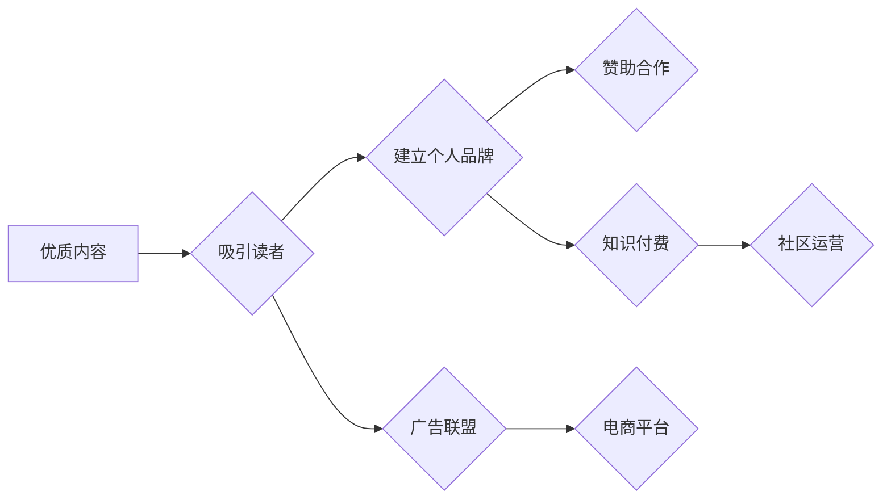

                 

## 技术博客变现：策略与方法

> 关键词：技术博客、变现策略、内容营销、广告联盟、赞助合作、知识付费、电商平台、社区运营、个人品牌

## 1. 背景介绍

在互联网时代，技术博客已成为技术人员展示专业技能、分享知识经验、建立个人品牌的重要平台。然而，仅仅拥有优质内容并不能保证博客的成功。如何将技术博客变现，获得经济回报，是许多技术博主面临的挑战。

随着互联网的发展，技术博客变现的方式也日益多样化。从传统的广告联盟到知识付费、电商平台等新兴模式，技术博主可以根据自身情况选择合适的变现策略。本文将深入探讨技术博客变现的各种策略和方法，帮助技术博主实现博客价值，获得经济收益。

## 2. 核心概念与联系

**2.1 技术博客变现的核心概念**

技术博客变现的核心概念是将博客内容转化为经济价值。这可以通过多种方式实现，例如：

* **广告联盟:** 博主在博客上嵌入广告，通过广告点击或展示获得收益。
* **赞助合作:** 博主与企业或品牌合作，撰写推广内容或进行产品测评，获得赞助费用。
* **知识付费:** 博主将自己的技术知识和经验打包成付费课程、电子书或会员服务，向读者提供价值。
* **电商平台:** 博主在博客上开设店铺，销售与技术相关的产品或服务。
* **社区运营:** 博主建立技术社区，通过会员订阅、付费服务或赞助合作获得收益。

**2.2 技术博客变现的联系**

技术博客变现的各个策略之间存在着相互联系和协同作用。例如，通过优质内容吸引读者，可以提高广告联盟的收益；建立个人品牌可以获得更多赞助合作机会；知识付费可以为社区运营提供内容支持。

**2.3 变现策略架构**



## 3. 核心算法原理 & 具体操作步骤

**3.1 算法原理概述**

技术博客变现的核心算法原理是内容营销和用户运营。

* **内容营销:** 通过创作优质、有价值的技术内容，吸引目标用户，建立信任关系，最终实现变现目标。
* **用户运营:** 通过分析用户行为数据，了解用户需求，提供个性化服务，提高用户粘性，促进变现。

**3.2 算法步骤详解**

1. **目标用户定位:** 确定目标用户群体，了解他们的兴趣、需求和阅读习惯。
2. **内容规划:** 根据目标用户需求，规划优质、有价值的技术内容，包括文章、视频、音频等多种形式。
3. **内容创作:** 创作高质量、原创的技术内容，并进行优化，提高搜索引擎排名和用户阅读体验。
4. **内容推广:** 通过社交媒体、邮件营销等渠道推广博客内容，扩大影响力。
5. **用户互动:** 与用户进行互动，回复评论、回答问题，建立良好的用户关系。
6. **数据分析:** 分析用户行为数据，了解用户阅读习惯、偏好和反馈，不断优化内容和运营策略。

**3.3 算法优缺点**

* **优点:** 

    * 能够建立长期稳定的用户群体。
    * 能够提升个人品牌价值。
    * 能够实现持续的变现收益。

* **缺点:** 

    * 需要投入大量时间和精力进行内容创作和运营。
    * 需要不断学习和更新技术知识，才能创作出有价值的内容。
    * 需要具备一定的营销和推广能力，才能扩大博客影响力。

**3.4 算法应用领域**

技术博客变现算法广泛应用于以下领域:

* **软件开发:** 分享开发经验、技术技巧、工具推荐等。
* **数据科学:** 分享数据分析方法、机器学习算法、数据可视化等。
* **人工智能:** 分享人工智能技术、应用案例、研究成果等。
* **网络安全:** 分享网络安全知识、漏洞分析、安全工具等。

## 4. 数学模型和公式 & 详细讲解 & 举例说明

**4.1 数学模型构建**

技术博客变现可以看作是一个用户增长和收入模型。我们可以用以下数学模型来描述：

* **用户增长模型:**  用户数 =  初始用户数 * (增长率)^时间

* **收入模型:**  收入 =  用户数 * 平均消费金额

其中，增长率和平均消费金额是影响博客变现的关键因素。

**4.2 公式推导过程**

* **增长率:** 增长率可以根据用户注册率、活跃度、留存率等指标计算。

* **平均消费金额:** 平均消费金额可以根据不同变现模式的收入数据进行计算。

**4.3 案例分析与讲解**

假设一个技术博客的初始用户数为 1000 人，增长率为 10%，平均消费金额为 10 元。

* **用户增长:** 

    * 第一年: 1000 * (1.1)^1 = 1100 人
    * 第二年: 1100 * (1.1)^1 = 1210 人
    * 第三年: 1210 * (1.1)^1 = 1331 人

* **收入:**

    * 第一年: 1100 * 10 = 11000 元
    * 第二年: 1210 * 10 = 12100 元
    * 第三年: 1331 * 10 = 13310 元

从案例分析可以看出，用户增长和平均消费金额对博客变现的影响非常大。

## 5. 项目实践：代码实例和详细解释说明

**5.1 开发环境搭建**

技术博客的开发环境搭建可以根据个人需求选择不同的平台和工具。常见的平台包括：

* **WordPress:** 开源内容管理系统，易于使用，功能丰富。
* **Ghost:** 轻量级博客平台，专注于写作体验。
* **Hexo:** 基于 Node.js 的静态博客生成器，速度快，部署方便。

**5.2 源代码详细实现**

以下是一个使用 Hexo 搭建技术博客的简单代码示例：

```
# _config.yml
title: 我的技术博客
description: 分享我的技术经验和见解
theme: hexo-theme-landscape

# _posts/2023-10-26-技术博客变现.md
---
title: 技术博客变现：策略与方法
date: 2023-10-26 10:00:00
categories: 技术博客
tags: 变现策略, 内容营销
---

## 技术博客变现：策略与方法

...
```

**5.3 代码解读与分析**

* `_config.yml` 文件配置了博客的基本信息，包括标题、描述、主题等。
* `_posts` 目录存放博客文章文件，每个文件以 Markdown 格式编写。

**5.4 运行结果展示**

使用 Hexo 命令行工具生成静态网站，然后将网站文件上传到服务器，即可访问博客。

## 6. 实际应用场景

技术博客变现的实际应用场景非常广泛，例如：

* **个人品牌建设:** 技术博主可以通过博客建立个人品牌，提升知名度和影响力，获得更多工作机会或合作机会。
* **知识分享:** 技术博主可以通过博客分享自己的技术知识和经验，帮助他人学习和成长，获得社会认可。
* **商业推广:** 企业或品牌可以通过赞助技术博客，推广产品或服务，扩大市场影响力。

**6.4 未来应用展望**

随着人工智能、区块链等技术的不断发展，技术博客变现的模式和方式也将不断创新。例如：

* **人工智能辅助内容创作:** 利用人工智能技术自动生成技术内容，提高创作效率。
* **区块链技术保障知识产权:** 利用区块链技术记录和保护技术内容的版权，防止盗版和侵权。
* **虚拟现实技术打造沉浸式体验:** 利用虚拟现实技术打造沉浸式的技术博客体验，增强用户互动和参与度。

## 7. 工具和资源推荐

**7.1 学习资源推荐**

* **书籍:** 《博客营销》、《内容营销》、《技术写作》
* **网站:**  
    *  **博客平台:** WordPress, Ghost, Hexo
    *  **内容创作工具:** Grammarly, Hemingway Editor
    *  **SEO优化工具:** Google Search Console, Ahrefs
    *  **数据分析工具:** Google Analytics

**7.2 开发工具推荐**

* **代码编辑器:** Visual Studio Code, Sublime Text
* **版本控制系统:** Git, GitHub
* **服务器:** AWS, Azure, Google Cloud

**7.3 相关论文推荐**

* **内容营销:**  
    *  "Content Marketing: A Review and Research Agenda"
    *  "The Impact of Content Marketing on Brand Awareness and Customer Engagement"
* **技术博客变现:**  
    *  "Monetizing Technical Blogs: A Case Study"
    *  "The Economics of Technical Blogging"

## 8. 总结：未来发展趋势与挑战

**8.1 研究成果总结**

技术博客变现是一个不断发展和演变的领域。通过内容营销、用户运营、技术创新等手段，技术博主可以实现博客价值，获得经济收益。

**8.2 未来发展趋势**

未来，技术博客变现将朝着以下趋势发展:

* **个性化定制:** 博主将根据用户需求提供个性化的内容和服务。
* **社区化运营:** 博主将建立技术社区，促进用户互动和协作。
* **跨平台融合:** 博客内容将跨平台传播，覆盖更多用户群体。

**8.3 面临的挑战**

技术博客变现也面临着一些挑战:

* **内容竞争激烈:** 技术领域内容竞争激烈，博主需要不断创作优质、有价值的内容。
* **用户注意力分散:** 用户注意力分散，博主需要找到吸引用户眼球的方式。
* **变现模式创新:** 传统的变现模式面临挑战，博主需要探索新的变现模式。

**8.4 研究展望**

未来，研究者将继续探索技术博客变现的最佳实践，开发更有效的变现策略和工具，帮助技术博主实现博客价值。

## 9. 附录：常见问题与解答

**9.1 如何提高博客流量?**

* **搜索引擎优化 (SEO):** 优化博客内容和结构，提高搜索引擎排名。
* **社交媒体推广:** 在社交媒体平台分享博客文章，吸引用户关注。
* **邮件营销:** 收集用户邮箱地址，定期发送博客更新和推广信息。

**9.2 如何选择合适的变现模式?**

* **根据自身情况:** 考虑博客内容、用户群体、时间精力等因素。
* **多渠道尝试:** 尝试不同的变现模式，找到最适合自己的方式。
* **持续优化:** 定期分析变现效果，不断优化策略。


作者：禅与计算机程序设计艺术 / Zen and the Art of Computer Programming 
<end_of_turn>

