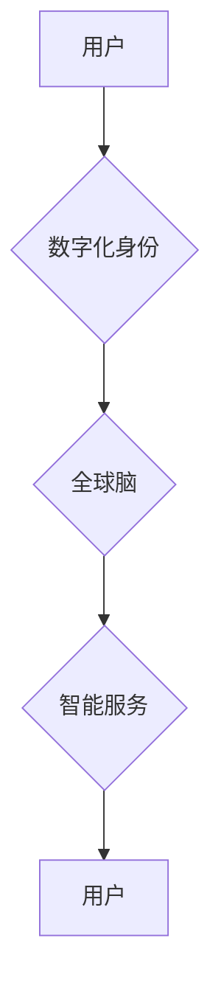

                 

##  数字化身份与全球脑：重塑人类社会关系

> 关键词：数字化身份、全球脑、人工智能、区块链、去中心化、社会关系、未来趋势

### 1. 背景介绍

人类社会正处于数字化转型和智能化升级的浪潮中。互联网、移动互联网、大数据、人工智能等技术的飞速发展，深刻地改变着人们的生活方式、工作模式和社会关系。其中，数字化身份作为数字时代的重要组成部分，正在逐渐成为连接虚拟世界和现实世界的关键桥梁。

数字化身份是指在数字环境中，个人或组织通过唯一的标识符来表示自身，并拥有相应的权利和义务。它可以包含个人信息、身份验证、信用记录、资产持有等多方面内容。随着数字经济的蓬勃发展，数字化身份的应用场景日益广泛，涵盖金融、医疗、教育、社交等各个领域。

然而，现有的数字化身份体系存在着诸多问题，例如：

* **中心化控制：** 许多数字化身份由大型平台或机构控制，存在数据安全和隐私泄露的风险。
* **身份碎片化：** 用户需要在不同的平台和应用中创建多个账户，导致身份信息分散和管理不便。
* **可信度不足：** 缺乏统一的标准和机制，导致不同平台的数字化身份难以互认和互通。

为了解决这些问题，全球脑的概念应运而生。全球脑是一种分布式、去中心化的智能网络，旨在通过连接人类大脑和人工智能，构建一个更加智能、高效、协作的社会。

### 2. 核心概念与联系

**2.1 数字化身份**

数字化身份是个人或组织在数字环境中的唯一标识，包含个人信息、身份验证、信用记录、资产持有等多方面内容。

**2.2 全球脑**

全球脑是一种分布式、去中心化的智能网络，旨在连接人类大脑和人工智能，构建一个更加智能、高效、协作的社会。

**2.3 联系**

数字化身份是全球脑的重要组成部分，它为全球脑的构建提供了基础。通过将数字化身份与全球脑相结合，可以实现以下目标：

* **构建统一的数字身份体系：** 全球脑可以提供一个统一的平台，让用户在不同的应用和场景中使用同一个数字化身份。
* **提升身份安全性和隐私保护：** 全球脑的去中心化架构可以有效降低数据安全和隐私泄露的风险。
* **赋能数字经济发展：** 全球脑可以促进数字身份的互认和互通，为数字经济的发展提供基础设施支持。

**2.4 流程图**



### 3. 核心算法原理 & 具体操作步骤

**3.1 算法原理概述**

全球脑的构建需要依赖于多种先进的算法，例如：

* **机器学习算法：** 用于分析和处理海量数据，识别模式和趋势，并进行预测和决策。
* **深度学习算法：** 用于模拟人类大脑神经网络，实现更复杂的智能处理能力。
* **自然语言处理算法：** 用于理解和生成人类语言，实现人机交互和信息传递。
* **区块链技术：** 用于构建去中心化的数据存储和管理系统，确保数据安全和透明度。

**3.2 算法步骤详解**

1. **数据采集和预处理：** 从各种来源收集数据，并进行清洗、转换和格式化，以便于后续算法处理。
2. **特征提取和选择：** 从原始数据中提取关键特征，并进行选择和筛选，以提高算法的效率和准确性。
3. **模型训练和评估：** 使用机器学习算法对数据进行训练，并评估模型的性能，不断调整参数以优化模型效果。
4. **模型部署和应用：** 将训练好的模型部署到实际应用场景中，并进行监控和维护。

**3.3 算法优缺点**

* **优点：**

    * 能够处理海量数据，发现隐藏的模式和趋势。
    * 能够实现自动化决策和智能化服务。
    * 能够提高效率和准确性，降低成本。

* **缺点：**

    * 需要大量的训练数据和计算资源。
    * 算法模型的解释性和可解释性较差。
    * 存在算法偏差和公平性问题。

**3.4 算法应用领域**

* **医疗保健：** 疾病诊断、药物研发、个性化治疗。
* **金融服务：** 风险评估、欺诈检测、投资决策。
* **教育培训：** 个性化学习、智能辅导、在线教育。
* **交通运输：** 智能驾驶、交通管理、物流优化。

### 4. 数学模型和公式 & 详细讲解 & 举例说明

**4.1 数学模型构建**

全球脑的构建可以抽象为一个复杂的网络模型，其中节点代表个体（人类或人工智能），边代表连接关系。

* **节点：** 可以表示人类大脑、人工智能系统、传感器、设备等。
* **边：** 可以表示信息传递、知识共享、协作合作等关系。

**4.2 公式推导过程**

* **节点之间的连接强度：** 可以用权重来表示，权重越大，连接强度越强。
* **信息传递速度：** 可以用传播延迟来表示，延迟越短，信息传递速度越快。
* **网络拓扑结构：** 可以用图论中的概念来描述，例如树形结构、星形结构、小世界网络等。

**4.3 案例分析与讲解**

例如，在医疗保健领域，全球脑可以构建一个连接医生、患者、医院、科研机构的网络。

* **节点：** 医生、患者、医院、科研机构等。
* **边：** 医生与患者之间的诊断和治疗关系、医院与科研机构之间的研究合作关系、患者与患者之间的信息交流关系等。

通过分析网络拓扑结构和节点之间的连接强度，可以发现潜在的疾病传播模式、医疗资源分配问题、科研合作机会等。

### 5. 项目实践：代码实例和详细解释说明

**5.1 开发环境搭建**

* **操作系统：** Linux 或 macOS
* **编程语言：** Python
* **框架：** TensorFlow 或 PyTorch
* **工具：** Git、Docker

**5.2 源代码详细实现**

```python
# 导入必要的库
import tensorflow as tf

# 定义模型结构
model = tf.keras.models.Sequential([
    tf.keras.layers.Dense(128, activation='relu', input_shape=(10,)),
    tf.keras.layers.Dense(64, activation='relu'),
    tf.keras.layers.Dense(10, activation='softmax')
])

# 编译模型
model.compile(optimizer='adam',
              loss='sparse_categorical_crossentropy',
              metrics=['accuracy'])

# 训练模型
model.fit(x_train, y_train, epochs=10)

# 评估模型
loss, accuracy = model.evaluate(x_test, y_test)
print('Loss:', loss)
print('Accuracy:', accuracy)
```

**5.3 代码解读与分析**

* **模型结构：** 该代码定义了一个简单的多层感知机模型，包含三个全连接层和一个softmax输出层。
* **模型编译：** 使用Adam优化器、交叉熵损失函数和准确率指标对模型进行编译。
* **模型训练：** 使用训练数据对模型进行训练，训练10个 epochs。
* **模型评估：** 使用测试数据对模型进行评估，打印损失和准确率。

**5.4 运行结果展示**

训练完成后，可以将模型保存并部署到实际应用场景中。

### 6. 实际应用场景

**6.1 医疗保健**

* **疾病诊断：** 利用全球脑分析患者的医疗影像、基因信息、生活习惯等数据，辅助医生进行疾病诊断。
* **药物研发：** 利用全球脑模拟人体生理机制，加速药物研发和临床试验。
* **个性化治疗：** 根据患者的个体特征，制定个性化的治疗方案。

**6.2 教育培训**

* **个性化学习：** 根据学生的学习进度和能力，提供个性化的学习内容和教学方式。
* **智能辅导：** 利用全球脑提供智能化的学习辅导和答疑服务。
* **在线教育：** 利用全球脑构建更加沉浸式和交互式的在线教育平台。

**6.3 金融服务**

* **风险评估：** 利用全球脑分析客户的信用记录、交易行为等数据，评估客户的风险等级。
* **欺诈检测：** 利用全球脑识别异常交易行为，预防金融欺诈。
* **投资决策：** 利用全球脑分析市场数据和投资趋势，辅助投资者进行投资决策。

**6.4 未来应用展望**

随着人工智能技术的不断发展，全球脑的应用场景将更加广泛，例如：

* **智能城市：** 利用全球脑优化城市交通、能源管理、环境监测等方面。
* **智能制造：** 利用全球脑实现智能生产、质量控制、供应链管理等。
* **人机融合：** 利用全球脑实现人机协作，提升人类生产力和创造力。

### 7. 工具和资源推荐

**7.1 学习资源推荐**

* **书籍：**

    * 《人工智能：一种现代方法》
    * 《深度学习》
    * 《机器学习实战》

* **在线课程：**

    * Coursera
    * edX
    * Udacity

**7.2 开发工具推荐**

* **编程语言：** Python
* **框架：** TensorFlow、PyTorch
* **工具：** Git、Docker

**7.3 相关论文推荐**

* **《全球脑：一个新的计算范式》**
* **《人工智能的伦理挑战》**
* **《数字身份的未来》**

### 8. 总结：未来发展趋势与挑战

**8.1 研究成果总结**

全球脑的概念和技术正在快速发展，为构建更加智能、高效、协作的社会提供了新的思路和方法。

**8.2 未来发展趋势**

* **更强大的计算能力：** 量子计算、神经形态计算等新兴技术将推动全球脑的计算能力不断提升。
* **更丰富的连接方式：** 5G、物联网等技术将使全球脑与更多设备和传感器连接，获取更丰富的数据和信息。
* **更智能的算法：** 深度学习、强化学习等算法将使全球脑具备更强的智能处理能力。

**8.3 面临的挑战**

* **数据安全和隐私保护：** 全球脑需要处理海量数据，如何确保数据安全和隐私保护是一个重大挑战。
* **算法偏见和公平性：** 算法模型的训练数据可能存在偏见，导致算法输出结果不公平。
* **伦理和社会影响：** 全球脑的应用可能会带来伦理和社会问题，需要进行深入的思考和讨论。

**8.4 研究展望**

未来，全球脑的研究将更加注重以下方面：

* **构建更加安全、可靠、可信的全球脑平台。**
* **开发更加公平、透明、可解释的算法模型。**
* **探索全球脑的伦理和社会影响，制定相应的规范和政策。**


### 9. 附录：常见问题与解答

**9.1 如何确保全球脑的数据安全和隐私保护？**

* 使用加密技术保护数据传输和存储。
* 采用去中心化的架构，分散数据存储，降低单点故障风险。
* 建立完善的数据访问控制机制，确保数据只被授权用户访问。

**9.2 如何解决全球脑算法的偏见和公平性问题？**

* 使用更加多元化的训练数据，减少算法模型的偏见。
* 开发更加公平、透明、可解释的算法模型。
* 建立机制，定期评估算法模型的公平性，并进行调整。

**9.3 全球脑的应用可能会带来哪些伦理和社会问题？**

* **就业问题：** 全球脑的自动化能力可能会导致部分工作岗位被取代。
* **隐私问题：** 全球脑收集和分析大量个人数据，可能会侵犯个人隐私。
* **控制问题：** 全球脑的强大能力可能会被滥用，导致社会控制和权力集中。


作者：禅与计算机程序设计艺术 / Zen and the Art of Computer Programming 
<end_of_turn>

