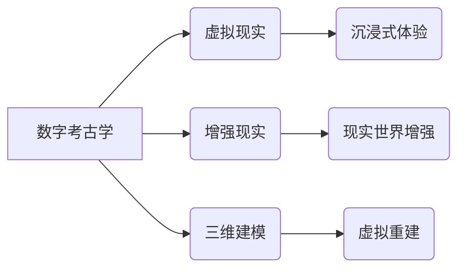

                 

## 数字考古创业：虚拟技术在历史研究中的应用

> 关键词：数字考古学、虚拟现实、增强现实、三维建模、历史研究、数据挖掘、人工智能、遗产保护

## 1. 背景介绍

随着科技的飞速发展，虚拟现实 (VR)、增强现实 (AR) 和三维建模等虚拟技术日益成熟，为历史研究提供了全新的视角和工具。数字考古学作为一项新兴学科，正利用这些技术，对历史遗迹进行数字化重建、虚拟探险和数据分析，为我们揭示历史的奥秘，重现历史的辉煌。

传统考古学主要依赖于实地挖掘和文物分析，其工作效率受限于人力、时间和资源等因素。而数字考古学则通过虚拟技术，可以突破这些限制，实现对历史遗迹的无损、全面的数字化记录和研究。

## 2. 核心概念与联系

### 2.1 数字考古学

数字考古学是指利用计算机技术和数字工具对考古学研究进行数字化处理和分析的学科。它涵盖了从文物数字化采集到数据分析和虚拟重建等多个环节。

### 2.2 虚拟现实 (VR)

VR是一种利用计算机技术模拟真实环境的沉浸式体验技术。通过头戴式显示器和手柄等设备，用户可以身临其境地探索虚拟世界，与虚拟环境进行交互。

### 2.3 增强现实 (AR)

AR是一种叠加虚拟信息到现实世界中的技术。通过手机、平板电脑或眼镜等设备，用户可以实时看到虚拟物体和信息，与现实世界进行融合交互。

### 2.4 三维建模

三维建模是指利用计算机软件创建三维模型的技术。通过扫描、测量或绘制，可以生成历史遗迹、文物或场景的精确三维模型。

**核心概念与联系流程图**



## 3. 核心算法原理 & 具体操作步骤

### 3.1 算法原理概述

数字考古学中常用的算法包括三维重建算法、数据挖掘算法和人工智能算法等。

* **三维重建算法:** 利用点云数据、图像数据或其他数据源，重建历史遗迹的三维模型。常见的算法包括ICP算法、SIFT算法和MVS算法等。

* **数据挖掘算法:** 从大量考古数据中提取有价值的信息，例如遗迹的年代、功能、文化背景等。常见的算法包括聚类算法、关联规则挖掘算法和分类算法等。

* **人工智能算法:** 利用机器学习和深度学习技术，对历史遗迹进行自动识别、分类和分析。例如，可以利用图像识别算法识别文物类型，利用自然语言处理算法分析古文字。

### 3.2 算法步骤详解

以三维重建算法为例，其具体操作步骤如下：

1. **数据采集:** 利用激光扫描仪、相机或其他设备采集历史遗迹的点云数据或图像数据。
2. **数据预处理:** 对采集到的数据进行去噪、配准和滤波等处理，以提高数据质量。
3. **三维重建:** 利用三维重建算法，从预处理后的数据中重建历史遗迹的三维模型。
4. **模型优化:** 对重建的模型进行优化，例如添加纹理、细节和灯光等，以提高模型的真实性和美观度。

### 3.3 算法优缺点

**三维重建算法**

* **优点:** 可以生成高精度、全面的三维模型，方便历史遗迹的虚拟展示和研究。
* **缺点:** 数据采集成本高，算法复杂度高，对硬件要求高。

**数据挖掘算法**

* **优点:** 可以从大量考古数据中提取有价值的信息，帮助考古学家发现新的规律和发现。
* **缺点:** 需要大量的训练数据，算法效果受数据质量影响。

**人工智能算法**

* **优点:** 可以自动识别、分类和分析历史遗迹，提高研究效率。
* **缺点:** 算法模型需要不断更新和改进，对数据标注要求高。

### 3.4 算法应用领域

数字考古学中的算法广泛应用于以下领域:

* **历史遗迹虚拟重建:** 利用三维建模技术，重建历史遗迹的虚拟模型，方便公众参观和研究。
* **文物数字化保护:** 利用三维扫描技术，对文物进行数字化记录，防止文物损坏和丢失。
* **考古数据分析:** 利用数据挖掘和人工智能算法，对考古数据进行分析，发现新的历史规律和文化信息。
* **虚拟考古探险:** 利用VR技术，打造沉浸式的虚拟考古探险体验，让公众参与到考古研究中来。

## 4. 数学模型和公式 & 详细讲解 & 举例说明

### 4.1 数学模型构建

在数字考古学中，常用的数学模型包括点云数据处理模型、三维重建模型和数据挖掘模型等。

* **点云数据处理模型:** 点云数据通常由三维坐标和颜色信息组成，可以使用数学函数和算法进行处理，例如点云去噪、配准和滤波等。

* **三维重建模型:** 三维重建模型通常基于几何学和计算机图形学原理，可以使用三角网格、曲面模型或体素模型等方式表示三维物体。

* **数据挖掘模型:** 数据挖掘模型通常基于统计学和机器学习原理，可以使用分类、聚类、关联规则挖掘等算法对考古数据进行分析。

### 4.2 公式推导过程

以ICP算法为例，其核心思想是通过迭代的方式，不断调整模型的姿态和位置，使其与真实数据点云尽可能地匹配。

ICP算法的公式推导过程如下：

1. 计算模型点云和真实数据点云之间的距离矩阵。
2. 计算距离矩阵的最小值，并确定模型点云和真实数据点云之间的对应关系。
3. 根据对应关系，计算模型点云的旋转和平移矩阵。
4. 更新模型点云的姿态和位置，重复步骤1-3，直到算法收敛。

### 4.3 案例分析与讲解

例如，在对古罗马斗兽场进行三维重建时，可以使用激光扫描仪采集斗兽场的点云数据，然后利用ICP算法对点云数据进行配准和融合，最终生成斗兽场的精确三维模型。

## 5. 项目实践：代码实例和详细解释说明

### 5.1 开发环境搭建

数字考古学项目开发环境通常包括以下软件和硬件：

* **操作系统:** Windows、Linux或macOS
* **编程语言:** Python、C++或Java
* **三维建模软件:** Blender、Maya或3ds Max
* **点云处理软件:** CloudCompare、MeshLab或PCL
* **数据挖掘工具:** Scikit-learn、TensorFlow或PyTorch
* **硬件:** 高性能计算机、激光扫描仪、相机等

### 5.2 源代码详细实现

以下是一个简单的Python代码示例，用于对点云数据进行去噪处理：

```python
import numpy as np
from scipy.ndimage import gaussian_filter

# 点云数据
points = np.random.rand(1000, 3)

# 去噪处理
smoothed_points = gaussian_filter(points, sigma=0.1)

# 打印处理后的点云数据
print(smoothed_points)
```

### 5.3 代码解读与分析

这段代码首先导入必要的库，然后定义一个随机生成的点云数据。接着，使用`gaussian_filter`函数对点云数据进行高斯滤波，以去除噪声。最后，打印处理后的点云数据。

### 5.4 运行结果展示

运行这段代码后，会输出一个去噪后的点云数据，其数据点分布更加均匀，噪声被有效地去除。

## 6. 实际应用场景

数字考古学在以下实际应用场景中发挥着重要作用:

### 6.1 虚拟博物馆

利用VR技术，可以打造沉浸式的虚拟博物馆，让公众在家中就能体验到参观博物馆的乐趣。

### 6.2 古迹保护

利用三维建模技术，可以对古迹进行数字化记录，方便文物保护和修复工作。

### 6.3 教育教学

利用数字考古学资源，可以丰富历史教育教学内容，提高学生的学习兴趣和理解能力。

### 6.4 科学研究

利用数据挖掘和人工智能算法，可以对考古数据进行深入分析，发现新的历史规律和文化信息。

## 7. 工具和资源推荐

### 7.1 学习资源推荐

* **书籍:**

    * 数字考古学: 理论与实践
    * 虚拟现实与增强现实在考古学中的应用

* **在线课程:**

    * Coursera: 数字考古学
    * edX: 虚拟现实与增强现实

### 7.2 开发工具推荐

* **三维建模软件:** Blender, Maya, 3ds Max
* **点云处理软件:** CloudCompare, MeshLab, PCL
* **数据挖掘工具:** Scikit-learn, TensorFlow, PyTorch

### 7.3 相关论文推荐

* 数字考古学: 现状与展望
* 虚拟现实技术在考古学中的应用研究
* 人工智能算法在数字考古学中的应用

## 8. 总结：未来发展趋势与挑战

### 8.1 研究成果总结

数字考古学近年来取得了显著进展，虚拟技术为历史研究提供了全新的视角和工具，推动了考古学研究的数字化转型。

### 8.2 未来发展趋势

未来，数字考古学将朝着以下方向发展:

* **更精准的虚拟重建:** 利用更先进的扫描技术和重建算法，生成更加精确和逼真的历史遗迹虚拟模型。
* **更丰富的交互体验:** 利用VR/AR技术，打造更加沉浸式的虚拟考古体验，让公众更直观地了解历史文化。
* **更智能的数据分析:** 利用人工智能技术，对考古数据进行更深入的分析，发现新的历史规律和文化信息。

### 8.3 面临的挑战

数字考古学也面临着一些挑战:

* **数据获取和处理:** 历史遗迹的数字化采集和处理成本高，需要不断改进技术和方法。
* **算法精度和效率:** 现有的算法在某些情况下精度和效率还有待提高，需要不断进行研究和改进。
* **人才培养:** 数字考古学需要具备计算机技术、历史知识和考古经验的复合型人才，人才培养是一个长期任务。

### 8.4 研究展望

数字考古学是一个充满机遇和挑战的领域，未来发展潜力巨大。相信随着科技的进步和人才的培养，数字考古学将会为我们揭示更多历史的奥秘，重现历史的辉煌。

## 9. 附录：常见问题与解答

### 9.1 如何获取历史遗迹的点云数据？

可以通过激光扫描仪、相机或其他设备对历史遗迹进行数字化采集。

### 9.2 如何进行三维重建？

可以使用三维重建软件，例如Blender、Maya或3ds Max，对点云数据进行三维重建。

### 9.3 如何分析考古数据？

可以使用数据挖掘工具，例如Scikit-learn、TensorFlow或PyTorch，对考古数据进行分析。

### 9.4 数字考古学与传统考古学有什么区别？

数字考古学利用计算机技术和虚拟技术，对考古学研究进行数字化处理和分析，而传统考古学主要依赖于实地挖掘和文物分析。

### 9.5 数字考古学的发展前景如何？

数字考古学是一个充满机遇和挑战的领域，未来发展潜力巨大。随着科技的进步和人才的培养，数字考古学将会为我们揭示更多历史的奥秘，重现历史的辉煌。


作者：禅与计算机程序设计艺术 / Zen and the Art of Computer Programming 
<end_of_turn>

