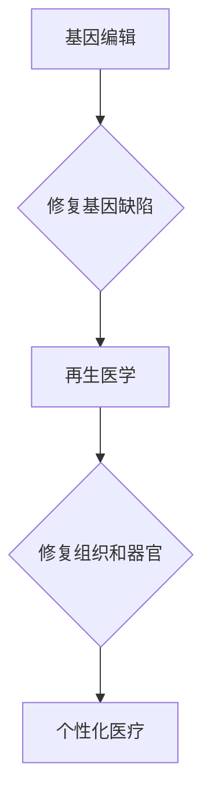

                 

## 未来的个性化医疗：2050年的基因编辑治疗与再生医学

> 关键词：基因编辑、CRISPR-Cas9、再生医学、个性化医疗、人工智能、生物信息学、纳米技术

### 1. 背景介绍

医疗保健领域正在经历一场前所未有的变革，人工智能、生物信息学和纳米技术等新兴技术正在重塑医疗服务的未来。其中，基因编辑和再生医学作为两大革命性技术，将共同推动个性化医疗的蓬勃发展。

基因编辑技术，特别是CRISPR-Cas9系统，赋予我们精准修改基因的能力，为治疗遗传性疾病打开了新的大门。再生医学则致力于利用干细胞和生物材料修复或替代受损组织和器官，为器官移植和慢性疾病治疗提供了新的希望。

2050年，基因编辑和再生医学将进一步融合，形成一个强大的个性化医疗体系。患者的基因信息将被全面解读，医生将能够根据患者的个体差异，设计定制化的治疗方案，实现疾病的精准预防、诊断和治疗。

### 2. 核心概念与联系

**2.1 基因编辑**

基因编辑是指利用人工手段对生物体的基因组进行精确修改的技术。CRISPR-Cas9系统是一种革命性的基因编辑工具，它利用细菌自身的免疫系统机制，可以识别并切割特定的DNA序列，从而实现基因的插入、删除或替换。

**2.2 再生医学**

再生医学是指利用生物材料、细胞和基因工程技术，修复或替代受损组织和器官的医学领域。干细胞是再生医学的核心，它们具有自我更新和分化成多种细胞类型的特性，可以用于修复各种组织和器官。

**2.3 个性化医疗**

个性化医疗是指根据患者的个体差异，提供定制化的医疗服务，包括诊断、治疗和预防。基因信息、生活方式、环境因素等多种因素都会影响个体的健康状况，个性化医疗的目标是利用这些信息，为每个患者提供最有效的治疗方案。

**2.4 核心概念联系**

基因编辑和再生医学的融合将为个性化医疗提供强大的技术支撑。

* 基因编辑可以用于修复导致疾病的基因缺陷，例如囊性纤维化、镰状细胞贫血等。
* 再生医学可以利用基因编辑技术改造干细胞，使其能够分化成特定类型的细胞，用于修复受损组织和器官。
* 个性化医疗可以利用基因信息和患者的临床数据，为每个患者设计定制化的治疗方案，提高治疗效果并降低副作用。

**Mermaid 流程图**



### 3. 核心算法原理 & 具体操作步骤

**3.1 算法原理概述**

CRISPR-Cas9系统是一种基于细菌免疫系统的基因编辑技术。它由两个主要部分组成：

* **CRISPR:** 是一种重复序列DNA，可以存储来自病毒的短DNA片段，称为“间隔序列”。
* **Cas9:** 是一种核酸酶，可以根据CRISPR序列的指导，切割特定的DNA序列。

CRISPR-Cas9系统的工作原理如下：

1. 设计一个与目标基因序列互补的CRISPR RNA (crRNA)。
2. 将crRNA与Cas9蛋白复合形成复合物。
3. 复合物进入细胞核，识别并结合目标基因序列。
4. Cas9蛋白切割目标基因序列。
5. 细胞的天然DNA修复机制会修复切割的DNA断裂，从而实现基因的插入、删除或替换。

**3.2 算法步骤详解**

1. **目标基因选择:** 首先需要确定需要编辑的目标基因。
2. **crRNA设计:** 设计一个与目标基因序列互补的crRNA序列。
3. **Cas9蛋白表达:** 将Cas9蛋白表达载体转入细胞。
4. **crRNA与Cas9蛋白复合:** 将crRNA与Cas9蛋白复合形成复合物。
5. **复合物递送:** 将复合物递送至目标细胞。
6. **基因编辑:** 复合物进入细胞核，识别并结合目标基因序列，Cas9蛋白切割目标基因序列。
7. **DNA修复:** 细胞的天然DNA修复机制会修复切割的DNA断裂，从而实现基因的插入、删除或替换。
8. **检测结果:** 检测基因编辑的效率和准确性。

**3.3 算法优缺点**

**优点:**

* 高效精准: CRISPR-Cas9系统可以高效地识别和切割特定的DNA序列，实现基因的精准编辑。
* 易于操作: CRISPR-Cas9系统操作简单，成本相对较低。
* 应用广泛: CRISPR-Cas9系统可以应用于多种生物模型，包括细菌、酵母、哺乳动物等。

**缺点:**

* 潜在的脱靶效应: CRISPR-Cas9系统可能切割非目标DNA序列，导致脱靶效应。
* 复杂性: 基因编辑技术仍然存在一些复杂性，例如如何有效地递送复合物到目标细胞。
* 伦理问题: 基因编辑技术涉及伦理问题，例如基因编辑的安全性、公平性和可控性。

**3.4 算法应用领域**

* **遗传性疾病治疗:** CRISPR-Cas9系统可以用于修复导致遗传性疾病的基因缺陷，例如囊性纤维化、镰状细胞贫血等。
* **癌症治疗:** CRISPR-Cas9系统可以用于编辑免疫细胞，使其能够更有效地识别和杀伤癌细胞。
* **农业生物技术:** CRISPR-Cas9系统可以用于编辑农作物基因，提高产量、抗病性等。
* **生物制造:** CRISPR-Cas9系统可以用于编辑微生物基因，使其能够产生新的生物材料或药物。

### 4. 数学模型和公式 & 详细讲解 & 举例说明

**4.1 数学模型构建**

基因编辑的效率可以被数学模型所描述，其中一个常用的模型是基于概率的模型。

假设CRISPR-Cas9系统切割目标基因的概率为p，则基因编辑的效率可以表示为：

```latex
效率 = p * (1 - 误码率)
```

其中，误码率是指DNA修复过程中发生错误的概率。

**4.2 公式推导过程**

该公式的推导过程如下：

1. 首先，CRISPR-Cas9系统需要成功识别并结合目标基因序列，这个概率为p。
2. 然后，Cas9蛋白需要成功切割目标基因序列，这个概率为1。
3. 最后，细胞的DNA修复机制需要成功修复切割的DNA断裂，并且修复过程中不发生错误，这个概率为(1 - 误码率)。

因此，基因编辑的效率可以表示为p * (1 - 误码率)。

**4.3 案例分析与讲解**

例如，假设CRISPR-Cas9系统切割目标基因的概率为0.9，DNA修复过程中发生错误的概率为0.01，则基因编辑的效率为：

```latex
效率 = 0.9 * (1 - 0.01) = 0.891
```

这意味着，使用CRISPR-Cas9系统编辑目标基因的成功率为89.1%。

### 5. 项目实践：代码实例和详细解释说明

**5.1 开发环境搭建**

* 操作系统: Ubuntu 20.04 LTS
* 编程语言: Python 3.8
* 软件包: Biopython, CRISPResso2, Pandas, NumPy

**5.2 源代码详细实现**

```python
# 使用Biopython读取基因序列
from Bio import SeqIO

# 读取目标基因序列
sequence = SeqIO.read("target_gene.fasta", "fasta")

# 使用CRISPResso2预测切割位点
from CRISPResso2 import CRISPResso2

# 初始化CRISPResso2对象
crispresso = CRISPResso2()

# 预测切割位点
results = crispresso.predict(sequence.seq, guide_sequence="AGGAGGAGG")

# 打印切割位点信息
print(results)

# 使用Pandas分析切割位点信息
import pandas as pd

# 将结果转换为Pandas DataFrame
df = pd.DataFrame(results)

# 分析切割位点的分布
print(df.groupby("guide_sequence")["score"].mean())

```

**5.3 代码解读与分析**

* 该代码首先使用Biopython库读取目标基因序列。
* 然后使用CRISPResso2库预测切割位点。CRISPResso2是一个用于预测CRISPR-Cas9系统切割位点的工具，它可以考虑多种因素，例如基因序列、PAM序列、脱靶效应等。
* 最后，使用Pandas库分析切割位点信息，例如切割位点的分布、切割效率等。

**5.4 运行结果展示**

运行该代码后，将输出目标基因序列中所有可能的切割位点及其对应的切割效率。

### 6. 实际应用场景

**6.1 遗传性疾病治疗**

CRISPR-Cas9系统可以用于治疗多种遗传性疾病，例如囊性纤维化、镰状细胞贫血、亨廷顿舞蹈症等。

* **囊性纤维化:** CRISPR-Cas9系统可以用于修复导致囊性纤维化基因缺陷的突变，从而恢复肺部功能。
* **镰状细胞贫血:** CRISPR-Cas9系统可以用于修复导致镰状细胞贫血基因缺陷的突变，从而恢复红细胞的正常形状和功能。
* **亨廷顿舞蹈症:** CRISPR-Cas9系统可以用于沉默导致亨廷顿舞蹈症的基因，从而减缓疾病的进展。

**6.2 癌症治疗**

CRISPR-Cas9系统可以用于编辑免疫细胞，使其能够更有效地识别和杀伤癌细胞。

* **CAR-T细胞疗法:** CRISPR-Cas9系统可以用于编辑T细胞，使其表达抗癌受体（CAR），从而增强T细胞对癌细胞的杀伤能力。
* **免疫检查点抑制剂:** CRISPR-Cas9系统可以用于编辑免疫细胞，使其能够抵抗癌细胞的免疫逃逸机制，从而提高免疫检查点抑制剂的疗效。

**6.3 其他应用场景**

* **农业生物技术:** CRISPR-Cas9系统可以用于编辑农作物基因，提高产量、抗病性、耐旱性等。
* **生物制造:** CRISPR-Cas9系统可以用于编辑微生物基因，使其能够产生新的生物材料或药物。
* **疾病模型构建:** CRISPR-Cas9系统可以用于构建动物模型，用于研究疾病的机制和治疗方法。

**6.4 未来应用展望**

未来，基因编辑和再生医学将进一步融合，为个性化医疗提供更强大的技术支撑。例如，

* 基于患者基因信息的定制化干细胞治疗
* 基于基因编辑的器官移植
* 基于人工智能的基因编辑药物开发

### 7. 工具和资源推荐

**7.1 学习资源推荐**

* **CRISPR-Cas9基因编辑技术入门指南:** https://www.nature.com/articles/nrd.2016.23
* **CRISPResso2工具介绍:** https://crispresso.pinellolab.org/
* **再生医学在线课程:** https://www.coursera.org/specializations/regenerative-medicine

**7.2 开发工具推荐**

* **Biopython:** https://biopython.org/
* **CRISPResso2:** https://crispresso.pinellolab.org/
* **Pandas:** https://pandas.pydata.org/
* **NumPy:** https://numpy.org/

**7.3 相关论文推荐**

* **A Programmable Dual-RNA-Guided DNA Endonuclease in Adaptive Bacterial Immunity:** https://www.science.org/doi/10.1126/science.1240959
* **CRISPR-Cas9: A Versatile Tool for Genome Engineering:** https://www.cell.com/cell/fulltext/S0092-8674(15)00581-X
* **Regenerative Medicine: From Bench to Bedside:** https://www.ncbi.nlm.nih.gov/pmc/articles/PMC5475733/

### 8. 总结：未来发展趋势与挑战

**8.1 研究成果总结**

近年来，基因编辑和再生医学取得了长足的进步，为个性化医疗的发展提供了强大的技术支撑。CRISPR-Cas9系统已经成为基因编辑领域最常用的工具，它可以高效地识别和切割特定的DNA序列，实现基因的精准编辑。再生医学也取得了重大进展，干细胞的应用范围不断扩大，新的生物材料和组织工程技术不断涌现。

**8.2 未来发展趋势**

未来，基因编辑和再生医学将继续朝着以下方向发展：

* **提高基因编辑的效率和精准度:** 研究人员将继续开发新的基因编辑工具，提高基因编辑的效率和精准度，减少脱靶效应。
* **开发新的再生医学技术:** 研究人员将继续开发新的干细胞技术、生物材料技术和组织工程技术，用于修复和替代受损组织和器官。
* **实现个性化医疗:** 基于基因信息和患者的临床数据，开发个性化的治疗方案，提高治疗效果并降低副作用。

**8.3 面临的挑战**

基因编辑和再生医学也面临着一些挑战：

* **伦理问题:** 基因编辑技术涉及伦理问题，例如基因编辑的安全性、公平性和可控性。
* **技术挑战:** 基因编辑和再生医学技术仍然存在一些挑战，例如如何有效地递送基因编辑工具到目标细胞，如何构建复杂的人工器官等。
* **监管问题:** 基因编辑和再生医学技术的应用需要严格的监管，以确保其安全性和有效性。

**8.4 研究展望**

尽管面临着挑战，但基因编辑和再生医学仍然是未来医疗保健领域最重要的研究方向之一。随着技术的不断进步，基因编辑和再生医学将为人类健康带来革命性的改变。

### 9. 附录：常见问题与解答

**9.1 基因编辑技术安全吗？**

基因编辑技术仍然处于发展阶段，其安全性需要进一步研究和评估。目前，基因编辑技术主要用于体外细胞编辑，尚未广泛应用于人体。

**9.2 基因编辑技术是否会改变人类基因组？**

基因编辑技术可以改变人类基因组，但这种改变需要经过严格的伦理审查和监管。

**9.3 基因编辑技术是否可以治愈所有疾病？**

基因编辑技术可以治疗一些遗传性疾病，但目前还无法治愈所有疾病。

**9.4 基因编辑技术是否会造成新的疾病？**

基因编辑技术可能会造成新的疾病，但这种风险需要经过严格的评估和控制。

**9.5 基因编辑技术是否会加剧社会不平等？**

基因编辑技术可能会加剧社会不平等，因为只有富裕的人才能负担得起基因编辑的费用。


作者：禅与计算机程序设计艺术 / Zen and the Art of Computer Programming<end_of_turn>

