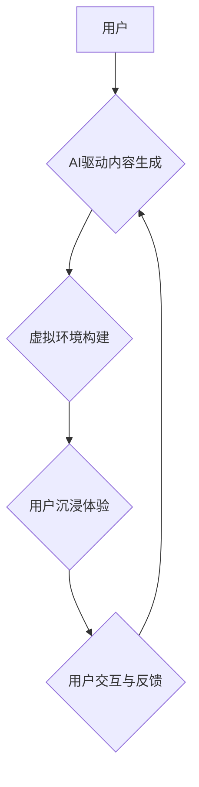

                 

## 沉浸式工作：AI重构的职场体验

> 关键词：人工智能、沉浸式体验、虚拟现实、增强现实、协作工作、远程办公、工作流程优化、未来职场

### 1. 背景介绍

随着人工智能技术的飞速发展，我们正站在一个全新的时代之门槛。AI正在深刻地改变着我们的生活方式，也正在重塑着工作模式。传统的办公环境和工作流程将面临前所未有的挑战和机遇。其中，沉浸式工作体验将成为未来职场发展的重要趋势。

沉浸式工作是指利用虚拟现实（VR）、增强现实（AR）等技术，创造出一个逼真的虚拟环境，让用户能够身临其境地体验工作内容。这种体验不仅能够提高工作效率和沉浸感，还能打破时空限制，促进跨地域协作。

### 2. 核心概念与联系

**2.1 沉浸式工作核心概念**

* **虚拟现实（VR）：** 通过头戴式设备，创造出一个完全虚拟的、沉浸式的环境，用户可以身临其境地体验虚拟世界。
* **增强现实（AR）：** 在现实世界中叠加虚拟信息，例如图像、视频、文字等，增强用户的现实世界感知。
* **混合现实（MR）：** 将VR和AR技术结合，创造出一个虚拟和现实世界相互融合的环境。

**2.2 沉浸式工作与AI的联系**

AI技术为沉浸式工作提供了强大的技术支撑：

* **内容生成：** AI可以生成逼真的虚拟场景、人物、物体等，为沉浸式工作环境提供丰富的视觉内容。
* **交互体验：** AI可以理解用户的自然语言指令，并提供相应的交互体验，例如虚拟助手、智能聊天机器人等。
* **个性化定制：** AI可以根据用户的个人喜好和工作需求，定制个性化的沉浸式工作环境。

**2.3 沉浸式工作流程图**



### 3. 核心算法原理 & 具体操作步骤

**3.1 算法原理概述**

沉浸式工作体验的核心算法主要包括：

* **3D建模和渲染算法：** 用于构建逼真的虚拟场景和物体。
* **计算机视觉算法：** 用于识别和理解用户的动作和意图。
* **自然语言处理算法：** 用于处理用户的语音和文本指令。
* **机器学习算法：** 用于个性化定制沉浸式工作环境。

**3.2 算法步骤详解**

1. **场景构建：** 利用3D建模软件，根据用户的需求构建虚拟场景，包括建筑物、家具、人物等。
2. **内容生成：** 利用AI算法生成虚拟场景中的物体、人物、声音等内容。
3. **渲染和显示：** 利用图形渲染引擎，将虚拟场景渲染成图像，并通过VR/AR设备显示给用户。
4. **用户交互：** 利用传感器和手势识别技术，识别用户的动作和意图，并进行相应的交互操作。
5. **反馈和优化：** 收集用户的反馈信息，并利用机器学习算法优化虚拟场景和交互体验。

**3.3 算法优缺点**

* **优点：** 沉浸感强，交互体验丰富，可以打破时空限制，促进跨地域协作。
* **缺点：** 技术门槛高，成本较高，需要解决用户晕动症等问题。

**3.4 算法应用领域**

* **远程办公：** 虚拟会议室、远程协作平台。
* **教育培训：** 沉浸式教学场景、虚拟实验室。
* **游戏娱乐：** 虚拟现实游戏、增强现实游戏。
* **医疗保健：** 虚拟手术模拟、远程医疗诊断。

### 4. 数学模型和公式 & 详细讲解 & 举例说明

**4.1 数学模型构建**

沉浸式工作体验的数学模型主要包括：

* **3D空间坐标系模型：** 用于描述虚拟场景中的物体位置和方向。
* **光线追踪模型：** 用于模拟光线在虚拟场景中的传播和反射，实现逼真的光影效果。
* **用户行为模型：** 用于预测用户的动作和意图，实现自然流畅的交互体验。

**4.2 公式推导过程**

* **3D空间坐标系模型：**

    * 物体位置可以用三维坐标 (x, y, z) 表示。
    * 物体方向可以用旋转矩阵表示。

* **光线追踪模型：**

    * 光线传播可以用微分方程描述。
    * 物体反射可以用漫反射和镜面反射模型描述。

* **用户行为模型：**

    * 可以使用马尔科夫链模型或深度学习模型预测用户的行为。

**4.3 案例分析与讲解**

例如，在虚拟会议室场景中，可以使用3D空间坐标系模型来描述每个参与者的位置，并使用光线追踪模型来模拟灯光效果，使虚拟会议室更加逼真。

### 5. 项目实践：代码实例和详细解释说明

**5.1 开发环境搭建**

* **操作系统：** Windows/macOS/Linux
* **编程语言：** Python
* **开发工具：** Unity/Unreal Engine
* **VR/AR设备：** Oculus Rift/HTC Vive/ARKit/ARCore

**5.2 源代码详细实现**

```python
# 虚拟场景构建
import unity

# 创建虚拟会议室场景
scene = unity.create_scene("meeting_room")

# 添加虚拟人物
character = unity.create_character("user1")
character.position = (0, 0, 0)

# 添加虚拟桌椅
table = unity.create_object("table")
table.position = (2, 0, 0)
chair = unity.create_object("chair")
chair.position = (2, 0, -2)

# 添加虚拟灯光
light = unity.create_light("directional_light")
light.direction = (0, -1, 0)

# 用户交互
def on_user_input(input_text):
    if input_text == "hello":
        character.say("hello")

# 运行场景
unity.run_scene(scene)
```

**5.3 代码解读与分析**

这段代码演示了如何使用Unity引擎构建一个简单的虚拟会议室场景。

* `unity.create_scene()` 函数用于创建虚拟场景。
* `unity.create_character()` 函数用于创建虚拟人物。
* `unity.create_object()` 函数用于创建虚拟物体。
* `unity.create_light()` 函数用于创建虚拟灯光。
* `on_user_input()` 函数用于处理用户的输入指令。

**5.4 运行结果展示**

运行这段代码后，用户可以进入虚拟会议室场景，看到虚拟人物、桌椅和灯光。用户可以通过输入指令与虚拟人物进行交互。

### 6. 实际应用场景

**6.1 远程办公**

沉浸式工作可以帮助远程办公人员克服时空限制，提高工作效率和协作效率。例如，虚拟会议室可以模拟真实的会议场景，让远程团队成员能够面对面交流，共享文档和演示文稿。

**6.2 教育培训**

沉浸式工作可以为教育培训提供更加生动的和交互式的学习体验。例如，虚拟实验室可以模拟真实的实验环境，让学生能够进行虚拟实验，学习科学知识。

**6.3 游戏娱乐**

沉浸式工作可以为游戏娱乐提供更加逼真的和沉浸式的体验。例如，虚拟现实游戏可以让人们身临其境地体验游戏世界，增强游戏的趣味性和参与度。

**6.4 未来应用展望**

随着人工智能技术的不断发展，沉浸式工作将应用于更多领域，例如医疗保健、设计创作、建筑施工等。未来，沉浸式工作将成为一种更加普遍的办公方式，改变我们的工作方式和生活方式。

### 7. 工具和资源推荐

**7.1 学习资源推荐**

* **书籍：** 《虚拟现实技术原理与应用》、《增强现实技术原理与应用》
* **在线课程：** Coursera、edX、Udacity 等平台提供有关VR/AR技术的在线课程。
* **社区论坛：** Unity、Unreal Engine 等平台都有相关的社区论坛，可以获取技术支持和交流经验。

**7.2 开发工具推荐**

* **Unity：** 一款流行的跨平台游戏引擎，也可以用于开发VR/AR应用。
* **Unreal Engine：** 另一款强大的游戏引擎，拥有逼真的图形渲染能力。
* **A-Frame：** 基于Web技术的VR开发框架，易于学习和使用。

**7.3 相关论文推荐**

* **《Immersive Virtual Environments: A Review》**
* **《Augmented Reality: A Survey》**
* **《Deep Learning for Virtual Reality》**

### 8. 总结：未来发展趋势与挑战

**8.1 研究成果总结**

沉浸式工作技术已经取得了显著的进展，为我们提供了全新的工作体验和协作方式。

**8.2 未来发展趋势**

* **更逼真的虚拟体验：** 随着人工智能和图形渲染技术的进步，虚拟场景将更加逼真，用户体验将更加沉浸。
* **更智能的交互体验：** AI技术将赋予虚拟环境更智能的交互能力，例如自然语言理解、情感识别等。
* **更广泛的应用场景：** 沉浸式工作将应用于更多领域，例如医疗保健、教育培训、设计创作等。

**8.3 面临的挑战**

* **技术难题：** 构建逼真的虚拟环境、实现流畅的交互体验仍然面临技术挑战。
* **成本问题：** VR/AR设备和开发成本较高，限制了其普及。
* **伦理问题：** 沉浸式工作可能会带来一些伦理问题，例如隐私保护、虚拟现实成瘾等。

**8.4 研究展望**

未来，我们需要继续研究和探索沉浸式工作技术，解决技术难题，降低成本，并关注伦理问题，推动沉浸式工作技术健康发展。

### 9. 附录：常见问题与解答

**9.1 如何选择合适的VR/AR设备？**

选择VR/AR设备需要考虑用户的需求、预算和使用场景。例如，对于游戏玩家来说，可以选择高性能的VR头显；对于教育培训场景，可以选择更轻便的AR眼镜。

**9.2 如何克服VR/AR设备带来的晕动症？**

VR/AR设备带来的晕动症是由于视觉和身体运动不一致造成的。可以使用一些缓解晕动症的方法，例如：

* 选择合适的设备和设置
* 逐渐适应虚拟环境
* 休息和避免长时间使用

**9.3 沉浸式工作会取代传统工作吗？**

沉浸式工作是一种新的工作方式，它可以提高工作效率和协作效率，但它不会完全取代传统工作。未来，传统工作和沉浸式工作将共同存在，并相互补充。


作者：禅与计算机程序设计艺术 / Zen and the Art of Computer Programming 
<end_of_turn>

