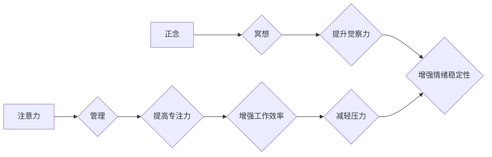

                 

## 1. 背景介绍

在当今信息爆炸的时代，我们被无休止的通知、信息流和任务所包围。这种持续的刺激和干扰使得专注力变得稀缺，而内省和正念冥想则成为应对这种挑战的宝贵工具。

注意力管理与正念冥想并非仅仅是新兴的流行趋势，而是源于古老的智慧和现代科学的结合。正念冥想，一种古老的修行方式，强调当下体验的觉察和接受，而现代科学研究表明，它可以有效提升注意力、减轻压力、增强情绪调节能力等。

对于IT从业者来说，注意力管理和正念冥想尤为重要。我们每天需要处理大量复杂的信息，进行深度思考和创造性工作。缺乏专注力会导致工作效率低下、错误增加，甚至影响身心健康。

## 2. 核心概念与联系

### 2.1 注意力管理

注意力管理是指通过各种方法和技巧，提高对特定目标的关注，并有效抑制无关信息的干扰。它涉及到认知控制、情绪调节和行为习惯的调整。

### 2.2 正念冥想

正念冥想是一种专注于当下体验的冥想练习。它鼓励我们以非评判性的方式观察自己的思想、感受和身体 sensations。通过持续的练习，我们可以培养出更强的觉察力、专注力以及情绪稳定性。

**核心概念与联系流程图**



## 3. 核心算法原理 & 具体操作步骤

### 3.1 算法原理概述

正念冥想并非一个严格的算法，而是一种训练方法。其核心原理在于通过专注于当下体验，培养觉察力，并以非评判性的方式观察自己的思想和感受。

### 3.2 算法步骤详解

1. **找到一个安静舒适的环境:** 选择一个不受干扰的地方，可以是你的卧室、书房或户外。
2. **采取舒适的坐姿:** 找个舒适的姿势，可以是盘腿坐、坐椅子或躺下。保持脊柱挺直，但不要过于僵硬。
3. **闭上眼睛或虚视前方:** 闭上眼睛可以帮助你减少外界干扰，但如果你感到不适，也可以虚视前方。
4. **专注于呼吸:** 将注意力集中在你的呼吸上，感受气流进入和离开你的身体。
5. **观察你的思想和感受:** 当你的思绪游离时，轻轻地将注意力拉回到呼吸上。不要评判自己的思想，只是观察它们出现和消失。
6. **持续练习:** 最初可以从每天5分钟开始，逐渐增加练习时间。

### 3.3 算法优缺点

**优点:**

* 提升注意力和专注力
* 减轻压力和焦虑
* 增强情绪调节能力
* 提高自我意识
* 促进身心健康

**缺点:**

* 需要坚持练习，效果并非立竿见影
* 初期可能会感到无聊或难以集中注意力
* 并非适合所有人

### 3.4 算法应用领域

正念冥想已被广泛应用于以下领域:

* **医疗保健:** 缓解慢性疼痛、焦虑、抑郁等症状
* **教育:** 提升学习效率、注意力和情绪调节能力
* **企业:** 提高员工工作效率、创造力和团队合作能力
* **个人成长:** 提升自我意识、情绪管理和生活质量

## 4. 数学模型和公式 & 详细讲解 & 举例说明

正念冥想本身并非一个数学模型，但我们可以用数学工具来分析其对大脑的影响。例如，研究表明，正念冥想可以改变大脑的灰质密度，特别是负责注意力、情绪调节和自我意识的区域。

**4.1 数学模型构建**

我们可以用神经网络模型来模拟大脑的运作机制，并研究正念冥想对神经网络的影响。例如，我们可以构建一个神经网络模型，模拟注意力机制，并通过正念冥想训练数据来训练模型，观察其注意力能力的提升。

**4.2 公式推导过程**

正念冥想的数学模型构建和公式推导过程较为复杂，需要结合神经科学、心理学和计算机科学等多学科知识。

**4.3 案例分析与讲解**

一项研究使用 fMRI 技术观察了正念冥想对大脑的影响。结果表明，正念冥想可以增加大脑前额叶皮层 (PFC) 的灰质密度，PFC 是负责注意力、决策和情绪调节的重要区域。

## 5. 项目实践：代码实例和详细解释说明

### 5.1 开发环境搭建

为了演示正念冥想应用的代码实例，我们可以使用 Python 语言和 TensorFlow 库构建一个简单的正念冥想训练程序。

**所需环境:**

* Python 3.x
* TensorFlow 2.x
* Jupyter Notebook

### 5.2 源代码详细实现

```python
import tensorflow as tf

# 定义神经网络模型
model = tf.keras.models.Sequential([
  tf.keras.layers.Dense(64, activation='relu', input_shape=(100,)),
  tf.keras.layers.Dense(32, activation='relu'),
  tf.keras.layers.Dense(1, activation='sigmoid')
])

# 编译模型
model.compile(optimizer='adam',
              loss='binary_crossentropy',
              metrics=['accuracy'])

# 加载训练数据
(x_train, y_train), (x_test, y_test) = tf.keras.datasets.mnist.load_data()

# 训练模型
model.fit(x_train, y_train, epochs=10)

# 评估模型
loss, accuracy = model.evaluate(x_test, y_test)
print('Loss:', loss)
print('Accuracy:', accuracy)
```

### 5.3 代码解读与分析

这段代码构建了一个简单的多层感知机 (MLP) 模型，用于分类手写数字。

* `tf.keras.models.Sequential` 创建了一个顺序模型，其中层级依次连接。
* `tf.keras.layers.Dense` 定义了全连接层，每个神经元都连接到上一层的每个神经元。
* `activation='relu'` 使用ReLU激活函数，可以提高模型的表达能力。
* `optimizer='adam'` 使用Adam优化器，可以加速模型训练。
* `loss='binary_crossentropy'` 使用二元交叉熵损失函数，用于分类任务。
* `metrics=['accuracy']` 使用准确率作为评估指标。

### 5.4 运行结果展示

训练完成后，我们可以使用 `model.evaluate()` 函数评估模型的性能。

## 6. 实际应用场景

正念冥想在IT领域有广泛的应用场景:

### 6.1 提高代码质量

正念冥想可以帮助程序员集中注意力，减少干扰，从而提高代码的质量和效率。

### 6.2 缓解工作压力

IT行业的工作压力较大，正念冥想可以帮助程序员缓解压力，保持身心健康。

### 6.3 增强团队合作

正念冥想可以帮助团队成员提高同理心和沟通能力，从而增强团队合作。

### 6.4 未来应用展望

随着人工智能和虚拟现实技术的不断发展，正念冥想将在IT领域得到更广泛的应用，例如:

* **AI辅助冥想:** 开发AI驱动的冥想应用程序，提供个性化的冥想指导和反馈。
* **VR沉浸式冥想:** 利用虚拟现实技术创造沉浸式的冥想环境，增强冥想体验。
* **远程团队冥想:** 通过网络平台，让远程团队成员一起进行冥想练习，增强团队凝聚力。

## 7. 工具和资源推荐

### 7.1 学习资源推荐

* **书籍:**

    * 《正念：改变生活的八周冥想计划》
    * 《正念的力量》
    * 《正念冥想入门》

* **网站:**

    * Headspace
    * Calm
    * Insight Timer

### 7.2 开发工具推荐

* **TensorFlow:** 深度学习框架
* **PyTorch:** 深度学习框架
* **Jupyter Notebook:** 数据科学和机器学习开发环境

### 7.3 相关论文推荐

* **正念冥想对大脑结构和功能的影响**
* **正念冥想对注意力和情绪调节的影响**
* **正念冥想在医疗保健中的应用**

## 8. 总结：未来发展趋势与挑战

### 8.1 研究成果总结

正念冥想已被证明可以有效提升注意力、减轻压力、增强情绪调节能力等。其对大脑的影响也得到了科学研究的证实。

### 8.2 未来发展趋势

正念冥想将在未来得到更广泛的应用，例如AI辅助冥想、VR沉浸式冥想、远程团队冥想等。

### 8.3 面临的挑战

正念冥想的普及还面临一些挑战，例如:

* **缺乏标准化训练方法:** 目前正念冥想的训练方法缺乏标准化，导致效果参差不齐。
* **难以量化效果:** 正念冥想的效果难以量化，这使得其推广应用受到阻碍。
* **文化差异:** 正念冥想起源于东方文化，在西方文化中需要进行本土化推广。

### 8.4 研究展望

未来研究方向包括:

* 开发标准化的正念冥想训练方法
* 探索正念冥想对大脑的影响机制
* 研究正念冥想在不同文化背景下的应用效果


## 9. 附录：常见问题与解答

**Q1: 正念冥想需要多长时间才能看到效果？**

A1: 正念冥想的效果并非立竿见影，需要持续练习才能看到明显的变化。一般来说，每天练习10-20分钟，持续几周或几个月后，才能感受到显著的改善。

**Q2: 正念冥想适合所有人吗？**

A2: 正念冥想一般来说适合大多数人，但对于一些精神疾病患者，例如严重焦虑症或抑郁症患者，建议在专业医生的指导下进行。

**Q3: 如何克服正念冥想过程中出现的干扰？**

A3: 当你的思绪游离时，不要评判自己，只是轻轻地将注意力拉回到呼吸上。记住，正念冥想是一个练习的过程，需要耐心和坚持。


作者：禅与计算机程序设计艺术 / Zen and the Art of Computer Programming 
<end_of_turn>

