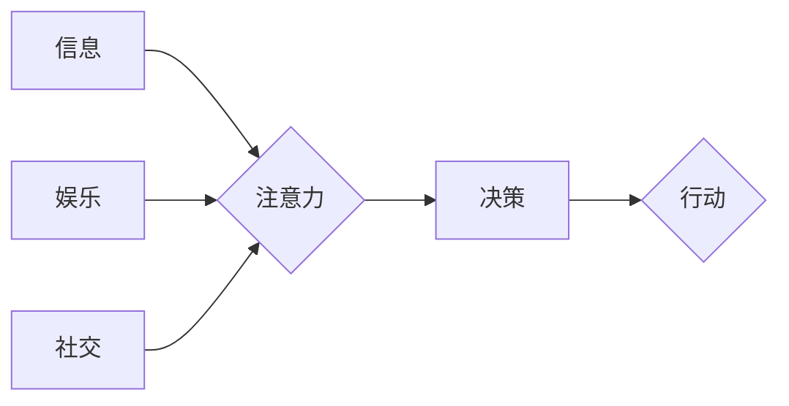
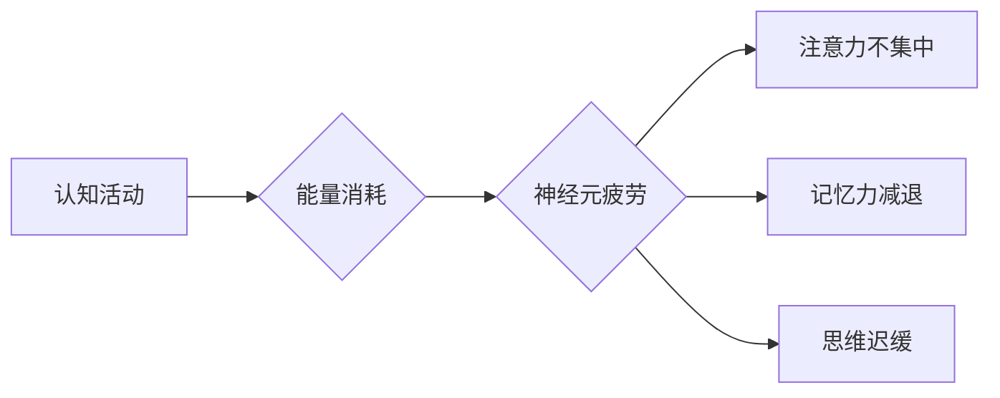

                 

## 注意力经济与脑力疲劳：如何在持续刺激中保持头脑健康

> 关键词：注意力经济、脑力疲劳、认知能力、深度工作、数字减负、专注力训练、心理健康

### 1. 背景介绍

在当今信息爆炸的时代，我们被来自各个方向的数字刺激所包围。手机、电脑、社交媒体，无处不在地提醒着我们，争夺着我们的注意力。这种持续的刺激，如同洪水般涌入我们的大脑，导致我们难以集中精力，思考深度问题，最终陷入“脑力疲劳”的泥潭。

“注意力经济”一词，最早由美国作家和经济学家Herbert Simon提出，指的是在信息过载的时代，注意力成为一种稀缺资源，而能够有效获取和利用注意力的人，能够在竞争中获得优势。然而，过度刺激和碎片化信息流，正在侵蚀我们的注意力，让我们难以专注于重要的事情。

脑力疲劳，是指长时间处于高强度认知活动状态后，大脑功能下降，出现注意力不集中、记忆力减退、思维迟缓等症状。它不仅影响我们的工作效率和学习效果，还会损害我们的心理健康，导致焦虑、抑郁等问题。

### 2. 核心概念与联系

#### 2.1 注意力经济模型

注意力经济模型可以理解为一个资源分配模型，其中注意力是稀缺资源，而信息、娱乐、社交等都是竞争者，争夺着我们的注意力。

**Mermaid 流程图：**



#### 2.2 脑力疲劳机制

脑力疲劳的机制与大脑的能量消耗和神经元疲劳有关。长时间的认知活动会消耗大脑大量的能量，导致神经元疲劳，影响信息处理能力。

**Mermaid 流程图：**



### 3. 核心算法原理 & 具体操作步骤

#### 3.1 算法原理概述

针对注意力经济和脑力疲劳问题，我们可以采用一些算法和技术手段来提高注意力集中度，缓解脑力疲劳。例如：

* **Pomodoro Technique:**  番茄工作法是一种时间管理技巧，将工作时间分成25分钟的间隔，中间休息5分钟，循环往复。
* **Deep Work:** 深度工作是指专注于一项重要任务，排除所有干扰，沉浸式地进行工作。
* **Mindfulness Meditation:**  正念冥想是一种放松技巧，通过专注于呼吸和身体感受，训练注意力和专注力。

#### 3.2 算法步骤详解

**番茄工作法:**

1. 选择一项任务。
2. 设置番茄钟计时25分钟。
3. 全神贯注地完成任务，直到番茄钟响。
4. 休息5分钟，放松身心。
5. 重复步骤2-4，完成4个番茄钟后，休息20-30分钟。

**深度工作:**

1. 确定一项重要任务。
2. 选择一个安静的环境，排除所有干扰。
3. 将手机、电脑等电子设备关闭或静音。
4. 全神贯注地完成任务，直到完成为止。

**正念冥想:**

1. 找个安静的地方，舒适地坐或躺下。
2. 将注意力集中在呼吸上，感受呼吸的起伏。
3. 当思绪飘散时，轻轻地将注意力拉回呼吸上。
4. 持续练习，每次10-20分钟。

#### 3.3 算法优缺点

**番茄工作法:**

* **优点:** 简单易行，提高效率，避免过度疲劳。
* **缺点:**  难以适用于所有类型任务，需要严格执行。

**深度工作:**

* **优点:**  提高专注力，完成高质量工作，获得成就感。
* **缺点:**  需要较长的准备时间，难以适应碎片化工作环境。

**正念冥想:**

* **优点:**  缓解压力，提高情绪稳定性，增强注意力。
* **缺点:**  需要长期坚持，效果可能需要一段时间才能显现。

#### 3.4 算法应用领域

这些算法和技术可以应用于各个领域，例如：

* **学习:**  提高学习效率，专注于重要知识点。
* **工作:**  提高工作效率，完成高质量任务。
* **生活:**  缓解压力，提高生活质量。

### 4. 数学模型和公式 & 详细讲解 & 举例说明

#### 4.1 数学模型构建

我们可以用一个简单的数学模型来描述注意力经济：

**注意力 = 信息价值 / 干扰程度**

其中：

* **注意力:** 指的是我们对某一信息或任务的关注程度。
* **信息价值:** 指的是该信息或任务对我们来说的价值或重要性。
* **干扰程度:** 指的是来自外部环境或内部思绪的干扰程度。

#### 4.2 公式推导过程

这个模型可以解释为什么我们更容易被一些信息吸引，而忽略其他信息。当信息价值高，干扰程度低时，我们的注意力就会集中在该信息上。反之，当信息价值低，干扰程度高时，我们的注意力就会分散。

#### 4.3 案例分析与讲解

例如，当你阅读一篇重要的学术论文时，你可能会集中注意力，仔细阅读每个句子。因为该论文的信息价值很高，而干扰程度相对较低。

但是，当你浏览社交媒体时，你可能会被各种信息吸引，注意力难以集中。因为社交媒体上的信息价值参差不齐，干扰程度很高。

### 5. 项目实践：代码实例和详细解释说明

#### 5.1 开发环境搭建

为了更好地理解注意力经济和脑力疲劳问题，我们可以开发一个简单的项目来模拟注意力分配过程。

开发环境：Python 3.x

所需库：

* `time`：用于计时

#### 5.2 源代码详细实现

```python
import time

def simulate_attention(task_value, distraction_level):
    """
    模拟注意力分配过程

    Args:
        task_value: 任务价值
        distraction_level: 干扰程度

    Returns:
        注意力集中时间
    """
    attention_time = task_value / distraction_level
    print(f"注意力集中时间: {attention_time} 秒")
    time.sleep(attention_time)
    print("注意力分散")

# 示例用法
task_value = 10  # 任务价值
distraction_level = 2  # 干扰程度
simulate_attention(task_value, distraction_level)
```

#### 5.3 代码解读与分析

这段代码模拟了注意力分配过程，其中 `task_value` 和 `distraction_level` 分别代表任务价值和干扰程度。

`simulate_attention()` 函数计算了注意力集中时间，并模拟了注意力集中和分散的过程。

#### 5.4 运行结果展示

运行这段代码，会输出以下结果：

```
注意力集中时间: 5.0 秒
注意力分散
```

这表明，在任务价值为10，干扰程度为2的情况下，注意力集中时间为5秒。

### 6. 实际应用场景

#### 6.1 工作场景

在工作场景中，我们可以利用注意力经济的原理，提高工作效率和专注力。例如：

* **制定工作计划:**  将工作任务分解成小的、可管理的单元，并优先处理重要任务。
* **消除干扰:**  关闭手机通知、屏蔽社交媒体，创造一个安静的工作环境。
* **利用番茄工作法:**  将工作时间分成25分钟的间隔，中间休息5分钟，提高专注力。

#### 6.2 学习场景

在学习场景中，我们可以利用注意力经济的原理，提高学习效率和记忆力。例如：

* **选择合适的学习环境:**  选择一个安静、舒适、没有干扰的环境进行学习。
* **制定学习计划:**  将学习内容分解成小的、可管理的单元，并制定合理的学习时间表。
* **利用深度工作:**  选择一个重要知识点，集中精力进行深入学习，直到理解透彻。

#### 6.3 生活场景

在生活场景中，我们可以利用注意力经济的原理，缓解压力，提高生活质量。例如：

* **练习正念冥想:**  通过专注于呼吸和身体感受，训练注意力和专注力，缓解压力。
* **减少电子设备使用时间:**  限制使用手机、电脑等电子设备的时间，避免过度刺激。
* **享受自然:**  花时间在户外活动，感受大自然的宁静，放松身心。

#### 6.4 未来应用展望

随着人工智能技术的不断发展，注意力经济和脑力疲劳问题将得到更深入的研究和解决。未来，我们可以期待以下应用：

* **个性化注意力训练:**  根据用户的注意力特点，定制个性化的注意力训练方案。
* **智能干扰过滤:**  利用人工智能技术，过滤掉不必要的干扰，帮助用户集中注意力。
* **脑机接口:**  通过脑机接口技术，直接控制注意力，提高工作效率和学习效果。

### 7. 工具和资源推荐

#### 7.1 学习资源推荐

* **书籍:**
    * 《注意力经济》 Herbert Simon
    * 《深度工作》 Cal Newport
    * 《正念》 Jon Kabat-Zinn
* **网站:**
    * **Mindfulness.org:** https://www.mindful.org/
    * **Focus@Will:** https://www.focusatwill.com/

#### 7.2 开发工具推荐

* **Python:** https://www.python.org/
* **Jupyter Notebook:** https://jupyter.org/

#### 7.3 相关论文推荐

* **The Attention Economy: A Theoretical Framework**
* **Deep Work: Rules for Focused Success in a Distracted World**
* **Mindfulness Meditation and Attention**

### 8. 总结：未来发展趋势与挑战

#### 8.1 研究成果总结

注意力经济和脑力疲劳问题的研究取得了显著进展，我们已经对这些问题有了更深入的理解，并开发了一些有效的解决方案。

#### 8.2 未来发展趋势

未来，注意力经济和脑力疲劳问题的研究将继续深入，重点关注以下几个方面：

* **人工智能技术的应用:**  利用人工智能技术，开发更智能、更个性化的注意力训练工具和干扰过滤系统。
* **脑机接口技术的探索:**  通过脑机接口技术，直接控制注意力，提高工作效率和学习效果。
* **跨学科研究:**  将注意力经济和脑力疲劳问题与心理学、神经科学、社会学等学科进行交叉研究，探索更全面的解决方案。

#### 8.3 面临的挑战

尽管取得了进展，但注意力经济和脑力疲劳问题仍然面临一些挑战：

* **数据获取和隐私保护:**  收集用户注意力数据需要考虑隐私保护问题。
* **算法的准确性和有效性:**  注意力训练算法的准确性和有效性还需要进一步提高。
* **社会影响:**  注意力经济和脑力疲劳问题可能对社会产生一些负面影响，需要进行深入研究和探讨。

#### 8.4 研究展望

未来，我们需要继续加强对注意力经济和脑力疲劳问题的研究，开发更有效的解决方案，帮助人们在信息爆炸的时代保持头脑健康，提高生活质量。

### 9. 附录：常见问题与解答

**Q1: 如何提高注意力集中度？**

**A1:**  可以通过以下方法提高注意力集中度：

* 制定工作计划，优先处理重要任务。
* 消除干扰，创造一个安静的工作环境。
* 利用番茄工作法，将工作时间分成25分钟的间隔，中间休息5分钟。
* 练习正念冥想，训练注意力和专注力。

**Q2: 如何缓解脑力疲劳？**

**A2:**  可以通过以下方法缓解脑力疲劳：

* 休息和睡眠充足。
* 保持健康饮食，摄入足够的营养。
* 进行适度的运动，放松身心。
* 避免过度使用电子设备。

**Q3: 注意力经济和脑力疲劳问题会对社会产生什么影响？**

**A3:**  注意力经济和脑力疲劳问题可能会对社会产生以下影响：

* 降低工作效率和学习效果。
* 导致心理健康问题，如焦虑和抑郁。
* 加剧社会分化，形成注意力资源的“富人”和“穷人”。


作者：禅与计算机程序设计艺术 / Zen and the Art of Computer Programming 
<end_of_turn>

