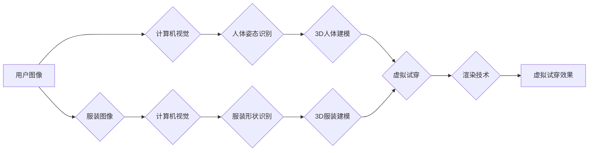

                 

## 深度学习在虚拟试衣技术中的创新应用

> 关键词：深度学习、虚拟试衣、计算机视觉、人像生成、风格迁移、推荐系统

## 1. 背景介绍

虚拟试衣技术，顾名思义，是指利用计算机技术模拟用户穿着特定服装的虚拟体验。近年来，随着人工智能技术的飞速发展，特别是深度学习技术的突破，虚拟试衣技术迎来了前所未有的发展机遇。传统的虚拟试衣技术主要依赖于2D图像处理和简单的3D建模，效果较为粗糙，难以满足用户对逼真体验的需求。而深度学习算法能够自动学习图像特征和人体结构，从而实现更精准、更逼真的虚拟试衣效果。

虚拟试衣技术在服装零售、时尚设计、个人消费等领域具有广泛的应用前景。它可以帮助用户在购买服装前进行虚拟试穿，减少试衣过程中的时间和成本，提高购物体验。同时，虚拟试衣技术还可以为服装设计师提供更直观的服装设计和展示平台，加速服装研发和推广。

## 2. 核心概念与联系

虚拟试衣技术的核心是将用户图像与服装图像进行融合，生成逼真的虚拟试穿效果。这需要结合多个核心概念和技术，包括：

* **计算机视觉:** 用于识别和理解图像信息，例如人体姿态、服装形状等。
* **3D建模:** 用于构建虚拟人体模型和服装模型，为虚拟试穿提供基础几何结构。
* **深度学习:** 用于学习图像特征和人体结构，实现更精准的虚拟试穿效果。
* **渲染技术:** 用于将虚拟人体模型和服装模型渲染成逼真的图像，呈现虚拟试穿效果。

**核心概念与联系流程图:**



## 3. 核心算法原理 & 具体操作步骤

### 3.1  算法原理概述

深度学习在虚拟试衣技术中的应用主要集中在以下几个方面：

* **人体姿态识别:** 利用深度学习模型识别用户图像中的人体姿态，例如头部、肩膀、肘部、手腕等关键点的位置。
* **人体建模:** 根据人体姿态信息，构建虚拟人体模型，并根据用户身高、体重等信息进行调整。
* **服装形状识别:** 利用深度学习模型识别服装图像中的形状特征，例如衣袖长度、领口形状、裙摆长度等。
* **服装风格迁移:** 利用深度学习模型将不同风格的服装图像进行风格迁移，例如将一件休闲服装风格迁移成正式服装风格。

### 3.2  算法步骤详解

以人体姿态识别为例，详细说明深度学习算法在虚拟试衣技术中的具体操作步骤：

1. **数据准备:** 收集大量包含人体姿态标注的图像数据，并进行数据预处理，例如图像裁剪、尺寸调整等。
2. **模型选择:** 选择合适的深度学习模型，例如人体姿态识别常用的PoseNet模型。
3. **模型训练:** 利用准备好的数据对模型进行训练，训练过程中模型会学习人体姿态特征，并预测人体关键点的位置。
4. **模型评估:** 利用测试数据评估模型的性能，例如准确率、召回率等指标。
5. **模型部署:** 将训练好的模型部署到虚拟试衣系统中，用于实时识别用户图像中的人体姿态。

### 3.3  算法优缺点

**优点:**

* **精度高:** 深度学习算法能够学习复杂的图像特征，实现更精准的人体姿态识别和服装形状识别。
* **自动化程度高:** 深度学习模型可以自动学习和优化，无需人工干预。
* **可扩展性强:** 深度学习模型可以根据需要进行调整和扩展，适应不同的应用场景。

**缺点:**

* **数据依赖性强:** 深度学习模型需要大量的数据进行训练，数据质量直接影响模型性能。
* **计算资源消耗大:** 深度学习模型训练和部署需要大量的计算资源。
* **可解释性差:** 深度学习模型的决策过程较为复杂，难以解释模型的决策结果。

### 3.4  算法应用领域

深度学习算法在虚拟试衣技术中的应用不仅限于人体姿态识别和服装形状识别，还可以应用于以下领域：

* **虚拟试衣效果优化:** 利用深度学习算法对虚拟试穿效果进行优化，例如调整服装贴合度、模拟服装材质等。
* **个性化推荐:** 利用深度学习算法分析用户的喜好和体型特征，推荐更适合用户的服装。
* **虚拟试衣场景构建:** 利用深度学习算法构建逼真的虚拟试衣场景，例如模拟不同光线、背景等环境。

## 4. 数学模型和公式 & 详细讲解 & 举例说明

### 4.1  数学模型构建

在虚拟试衣技术中，常用的数学模型包括：

* **人体模型:** 可以使用3D点云、三角网格等方式表示人体模型，并使用数学公式描述人体各部位的形状和尺寸。
* **服装模型:** 可以使用3D曲面、纹理贴图等方式表示服装模型，并使用数学公式描述服装的形状、颜色、材质等属性。
* **姿态估计模型:** 可以使用深度学习模型，例如CNN、RNN等，将图像数据映射到人体关键点的位置，并使用数学公式描述人体姿态的特征。

### 4.2  公式推导过程

以人体姿态估计为例，常用的公式推导过程包括：

* **特征提取:** 使用CNN模型提取图像特征，例如卷积层、池化层等，将图像数据转换为特征向量。
* **姿态回归:** 使用RNN模型对特征向量进行处理，预测人体关键点的位置，例如使用线性回归、多层感知机等模型。
* **损失函数:** 使用均方误差、交叉熵等损失函数衡量模型预测结果与真实标注之间的差异。
* **优化算法:** 使用梯度下降、Adam等优化算法更新模型参数，最小化损失函数值。

### 4.3  案例分析与讲解

例如，可以使用OpenPose模型进行人体姿态估计，该模型使用CNN和RNN网络结构，能够准确识别人体关键点的位置。

## 5. 项目实践：代码实例和详细解释说明

### 5.1  开发环境搭建

虚拟试衣技术项目开发环境搭建需要以下软件和工具：

* **操作系统:** Windows、macOS、Linux等
* **编程语言:** Python、C++等
* **深度学习框架:** TensorFlow、PyTorch等
* **图像处理库:** OpenCV、Pillow等
* **3D建模软件:** Blender、Maya等

### 5.2  源代码详细实现

以下是一个使用TensorFlow框架实现人体姿态识别的简单代码示例：

```python
import tensorflow as tf

# 定义模型结构
model = tf.keras.models.Sequential([
    tf.keras.layers.Conv2D(32, (3, 3), activation='relu', input_shape=(224, 224, 3)),
    tf.keras.layers.MaxPooling2D((2, 2)),
    tf.keras.layers.Conv2D(64, (3, 3), activation='relu'),
    tf.keras.layers.MaxPooling2D((2, 2)),
    tf.keras.layers.Flatten(),
    tf.keras.layers.Dense(128, activation='relu'),
    tf.keras.layers.Dense(17, activation='linear')
])

# 编译模型
model.compile(optimizer='adam', loss='mse')

# 训练模型
model.fit(train_data, train_labels, epochs=10)

# 预测人体姿态
predictions = model.predict(test_data)
```

### 5.3  代码解读与分析

* 代码首先定义了一个简单的CNN模型，用于提取图像特征。
* 模型的输出层使用线性激活函数，输出17个关键点的位置。
* 模型使用Adam优化器和均方误差损失函数进行训练。
* 训练完成后，可以使用模型预测新的图像中的人体姿态。

### 5.4  运行结果展示

运行代码后，可以得到预测的人体关键点的位置，并将其绘制在图像上，展示虚拟试衣效果。

## 6. 实际应用场景

虚拟试衣技术在服装零售、时尚设计、个人消费等领域具有广泛的应用场景：

### 6.1  服装零售

* **线上购物体验提升:** 虚拟试衣可以帮助用户在电商平台上进行虚拟试穿，提高购物体验，减少退货率。
* **个性化推荐:** 虚拟试衣可以根据用户的体型特征和喜好，推荐更适合的服装，提高销售转化率。
* **库存管理优化:** 虚拟试衣可以帮助服装零售商模拟不同服装的搭配效果，优化库存管理，减少库存积压。

### 6.2  时尚设计

* **服装设计与展示:** 虚拟试衣可以帮助设计师快速创建和展示服装设计，加速服装研发和推广。
* **虚拟时装秀:** 虚拟试衣可以用于举办虚拟时装秀，展示最新的服装设计，吸引更多关注。
* **风格迁移与创新:** 虚拟试衣可以利用深度学习算法进行服装风格迁移，激发设计师的创意灵感，探索新的服装风格。

### 6.3  个人消费

* **个性化穿搭:** 虚拟试衣可以帮助用户尝试不同的服装搭配，找到更适合自己的风格。
* **虚拟形象定制:** 虚拟试衣可以用于创建虚拟形象，例如游戏角色、虚拟偶像等，满足用户的个性化需求。
* **社交互动:** 虚拟试衣可以作为社交平台上的互动功能，用户可以分享自己的虚拟试穿效果，与朋友互动。

### 6.4  未来应用展望

随着人工智能技术的不断发展，虚拟试衣技术将迎来更广泛的应用场景和更丰富的功能：

* **更逼真的虚拟试穿效果:** 利用更先进的渲染技术和3D建模技术，实现更逼真的虚拟试穿效果，例如模拟服装材质、光线、阴影等细节。
* **更个性化的虚拟试衣体验:** 利用深度学习算法分析用户的体型特征、喜好、生活习惯等信息，提供更个性化的虚拟试衣体验，例如推荐更适合用户的服装搭配、虚拟试穿场景等。
* **虚拟试衣与增强现实技术的融合:** 将虚拟试衣技术与增强现实技术融合，实现更沉浸式的虚拟试穿体验，例如用户可以通过手机摄像头看到自己穿着虚拟服装的效果。

## 7. 工具和资源推荐

### 7.1  学习资源推荐

* **书籍:**
    * 《深度学习》 - Ian Goodfellow, Yoshua Bengio, Aaron Courville
    * 《计算机视觉:算法与应用》 - Richard Szeliski
* **在线课程:**
    * Coursera: 深度学习 Specialization
    * Udacity: 计算机视觉 Nanodegree
* **博客和论坛:**
    * TensorFlow Blog
    * PyTorch Blog
    * Kaggle

### 7.2  开发工具推荐

* **深度学习框架:** TensorFlow, PyTorch, Keras
* **图像处理库:** OpenCV, Pillow
* **3D建模软件:** Blender, Maya
* **云计算平台:** AWS, Azure, Google Cloud

### 7.3  相关论文推荐

* **人体姿态估计:**
    * OpenPose: Realtime Multi-Person 2D Pose Estimation Using Part Affinity Fields
    * DeeperCut: A Deeper Cut for Real-Time Human Pose Estimation
* **虚拟试衣:**
    * Virtual Try-On with Deep Learning: A Survey
    * Style Transfer for Virtual Try-On: A Survey

## 8. 总结：未来发展趋势与挑战

### 8.1  研究成果总结

深度学习技术在虚拟试衣技术中的应用取得了显著成果，例如人体姿态识别、服装形状识别、虚拟试穿效果优化等方面都取得了突破。

### 8.2  未来发展趋势

* **更逼真的虚拟试穿效果:** 利用更先进的渲染技术和3D建模技术，实现更逼真的虚拟试穿效果，例如模拟服装材质、光线、阴影等细节。
* **更个性化的虚拟试衣体验:** 利用深度学习算法分析用户的体型特征、喜好、生活习惯等信息，提供更个性化的虚拟试衣体验，例如推荐更适合用户的服装搭配、虚拟试穿场景等。
* **虚拟试衣与增强现实技术的融合:** 将虚拟试衣技术与增强现实技术融合，实现更沉浸式的虚拟试穿体验，例如用户可以通过手机摄像头看到自己穿着虚拟服装的效果。

### 8.3  面临的挑战

* **数据获取和标注:** 深度学习模型需要大量的数据进行训练，获取高质量的人体姿态标注数据仍然是一个挑战。
* **计算资源消耗:** 深度学习模型训练和部署需要大量的计算资源，成本较高。
* **可解释性差:** 深度学习模型的决策过程较为复杂，难以解释模型的决策结果，这可能会影响用户的信任度。

### 8.4  研究展望

未来，虚拟试衣技术将继续朝着更逼真、更个性化、更智能的方向发展，并与其他技术融合，例如增强现实、虚拟现实、人工智能等，为用户提供更丰富的购物体验和更便捷的服装选择方式。

## 9. 附录：常见问题与解答

**Q1: 虚拟试衣技术需要哪些硬件设备？**

A1: 虚拟试衣技术主要需要摄像头、计算机、网络连接等设备。

**Q2: 虚拟试衣技术是否会泄露用户的隐私信息？**

A2: 虚拟试衣技术在设计和开发过程中需要充分考虑用户隐私保护问题，例如数据加密、匿名化处理等措施，确保用户隐私安全。

**Q3: 虚拟试衣技术是否会取代传统的试衣体验？**

A3: 虚拟试衣技术和传统的试衣体验各有优缺点，两者可以相互补充，共同满足用户的不同需求。


作者：禅与计算机程序设计艺术 / Zen and the Art of Computer Programming 
<end_of_turn>

