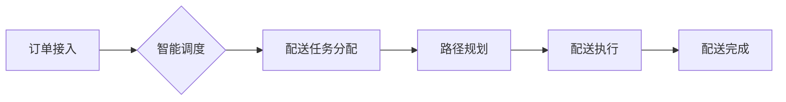

                 

## 电商即时配送中的智能调度与路径优化

> 关键词：智能调度、路径优化、电商配送、算法模型、机器学习、大数据分析、物流效率、配送成本

## 1. 背景介绍

随着电商行业的蓬勃发展，消费者对商品配送速度和效率的需求日益提高。即时配送作为一种新型的配送模式，以其快速、便捷的特点，逐渐成为电商行业发展的重要趋势。然而，即时配送的实现面临着诸多挑战，其中智能调度和路径优化是关键环节。

传统配送模式往往依赖人工调度和经验判断，效率低下，成本高昂。随着大数据、人工智能等技术的快速发展，智能调度和路径优化技术逐渐成为解决即时配送难题的有效手段。

## 2. 核心概念与联系

### 2.1 智能调度

智能调度是指利用人工智能算法，对配送任务进行智能分配，优化配送资源配置，提高配送效率和服务质量。

### 2.2 路径优化

路径优化是指在满足配送需求的前提下，寻找最优的配送路线，以最小化配送时间、距离和成本。

**核心概念架构**



## 3. 核心算法原理 & 具体操作步骤

### 3.1 算法原理概述

智能调度和路径优化算法通常基于以下核心原理：

* **图论算法:** 将配送网络抽象为图模型，利用 Dijkstra 算法、A* 算法等路径规划算法，寻找最优配送路线。
* **机器学习算法:** 利用历史配送数据，训练机器学习模型，预测配送需求、优化配送资源配置。
* **启发式算法:** 基于经验和启发式规则，快速寻找近似最优的配送方案。

### 3.2 算法步骤详解

**路径优化算法步骤:**

1. **构建图模型:** 将配送网络抽象为图模型，节点代表配送地点，边代表配送路径。
2. **定义目标函数:** 根据配送需求，定义目标函数，例如最小化配送时间、距离或成本。
3. **选择算法:** 根据实际情况选择合适的路径规划算法，例如 Dijkstra 算法、A* 算法等。
4. **执行算法:** 利用选定的算法，在图模型上寻找最优配送路线。
5. **输出结果:** 输出最优配送路线，并进行配送执行。

**智能调度算法步骤:**

1. **订单接入:** 收集订单信息，包括配送地址、配送时间要求等。
2. **任务分配:** 根据订单信息、配送员位置、配送能力等因素，将订单分配给合适的配送员。
3. **路径规划:** 为每个配送员规划最优配送路线。
4. **调度优化:** 动态调整配送任务分配和路径规划，以应对突发事件和配送需求变化。

### 3.3 算法优缺点

**路径优化算法:**

* **优点:** 能够找到最优或近似最优的配送路线，提高配送效率。
* **缺点:** 计算复杂度高，对于大规模配送网络，计算时间可能较长。

**智能调度算法:**

* **优点:** 可以根据实时情况动态调整配送任务分配和路径规划，提高配送效率和服务质量。
* **缺点:** 需要大量的历史数据进行训练，算法模型的准确性依赖于数据质量。

### 3.4 算法应用领域

智能调度和路径优化算法广泛应用于以下领域:

* **电商配送:** 优化配送路线，提高配送效率和服务质量。
* **快餐配送:** 缩短配送时间，提高客户满意度。
* **出租车调度:** 优化车辆调度，提高车辆利用率。
* **物流运输:** 优化运输路线，降低运输成本。

## 4. 数学模型和公式 & 详细讲解 & 举例说明

### 4.1 数学模型构建

**路径优化模型:**

假设配送网络包含 N 个节点，每个节点代表一个配送地点。节点 i 到节点 j 之间的距离为 d<sub>ij</sub>。目标是找到从起点 s 到终点 t 的最短路径。

**数学模型:**

```
min ∑_{i=1}^{N-1} d_{ij}
```

**约束条件:**

* 路径必须连接所有节点。
* 路径必须从起点 s 开始，结束于终点 t。

**智能调度模型:**

假设有 M 个配送员和 N 个订单。配送员 i 的配送能力为 c<sub>i</sub>，订单 j 的配送时间要求为 t<sub>j</sub>。目标是将订单分配给合适的配送员，以满足所有订单的配送时间要求。

**数学模型:**

```
min ∑_{i=1}^{M} ∑_{j=1}^{N} d_{ij} * x_{ij}
```

**约束条件:**

* 每个订单只能被分配给一个配送员。
* 每个配送员的配送任务量不能超过其配送能力。
* 每个订单的配送时间必须满足其时间要求。

### 4.2 公式推导过程

**Dijkstra 算法:**

Dijkstra 算法是一种常用的路径规划算法，其核心思想是逐步扩展最短路径，直到找到目标节点。

**算法步骤:**

1. 初始化所有节点的距离为无穷大，起点节点的距离为 0。
2. 选择距离起点最近的节点，将其标记为已访问节点。
3. 更新所有与已访问节点相连的节点的距离，如果新的距离小于当前距离，则更新距离。
4. 重复步骤 2 和 3，直到目标节点被标记为已访问节点。

**公式推导:**

Dijkstra 算法的核心公式是更新节点距离的公式:

```
distance[v] = min(distance[v], distance[u] + weight(u, v))
```

其中:

* distance[v] 是节点 v 的距离。
* distance[u] 是节点 u 的距离。
* weight(u, v) 是节点 u 到节点 v 的权重。

### 4.3 案例分析与讲解

**路径优化案例:**

假设有三个配送地点 A、B、C，A 到 B 的距离为 5，A 到 C 的距离为 3，B 到 C 的距离为 2。

使用 Dijkstra 算法，可以找到从 A 到 C 的最短路径为 A -> C，距离为 3。

**智能调度案例:**

假设有 2 个配送员和 3 个订单，配送员 1 的配送能力为 2，配送员 2 的配送能力为 1。订单 1 的配送时间要求为 1 小时，订单 2 的配送时间要求为 2 小时，订单 3 的配送时间要求为 3 小时。

可以使用智能调度算法，将订单分配给合适的配送员，例如：

* 配送员 1 分配订单 1 和 2。
* 配送员 2 分配订单 3。

## 5. 项目实践：代码实例和详细解释说明

### 5.1 开发环境搭建

* 操作系统: Ubuntu 20.04
* 编程语言: Python 3.8
* 库依赖:

```
pip install networkx
pip install matplotlib
```

### 5.2 源代码详细实现

```python
import networkx as nx
import matplotlib.pyplot as plt

# 创建图模型
graph = nx.Graph()
graph.add_edge('A', 'B', weight=5)
graph.add_edge('A', 'C', weight=3)
graph.add_edge('B', 'C', weight=2)

# 使用 Dijkstra 算法寻找最短路径
shortest_path = nx.dijkstra_path(graph, source='A', target='C')

# 打印最短路径
print(f"最短路径: {shortest_path}")

# 绘制图模型
nx.draw(graph, with_labels=True, node_color='skyblue', node_size=500, font_size=10, font_weight='bold')
plt.show()
```

### 5.3 代码解读与分析

* 使用 `networkx` 库创建图模型，并添加节点和边的关系。
* 使用 `nx.dijkstra_path()` 函数寻找从节点 A 到节点 C 的最短路径。
* 打印最短路径。
* 使用 `matplotlib` 库绘制图模型，并标注节点和边。

### 5.4 运行结果展示

运行代码后，将输出最短路径为 `['A', 'C']`，并绘制出图模型，显示从 A 到 C 的最短路径。

## 6. 实际应用场景

### 6.1 电商配送

电商平台可以利用智能调度和路径优化算法，优化配送路线，提高配送效率和服务质量。例如，京东、阿里巴巴等电商平台都已将智能调度和路径优化技术应用于其配送系统中。

### 6.2 快餐配送

快餐店可以利用智能调度和路径优化算法，缩短配送时间，提高客户满意度。例如，美团、饿了么等外卖平台都已将智能调度和路径优化技术应用于其配送系统中。

### 6.3 出租车调度

出租车公司可以利用智能调度和路径优化算法，优化车辆调度，提高车辆利用率。例如，滴滴出行、Uber 等打车平台都已将智能调度和路径优化技术应用于其调度系统中。

### 6.4 未来应用展望

随着人工智能、大数据等技术的不断发展，智能调度和路径优化技术将应用于更多领域，例如：

* **无人配送:** 利用无人驾驶技术和智能调度算法，实现无人配送服务。
* **城市物流:** 利用智能调度和路径优化算法，优化城市物流配送网络，提高物流效率。
* **医疗配送:** 利用智能调度和路径优化算法，提高医疗物资的配送效率，保障医疗服务的及时性。

## 7. 工具和资源推荐

### 7.1 学习资源推荐

* **书籍:**

    * 《算法导论》
    * 《图论及其应用》
    * 《机器学习》

* **在线课程:**

    * Coursera: 数据结构与算法
    * edX: 机器学习
    * Udacity: 深度学习

### 7.2 开发工具推荐

* **Python:** 广泛应用于数据科学、机器学习等领域，拥有丰富的库和工具。
* **networkx:** 用于构建和分析图模型的 Python 库。
* **matplotlib:** 用于绘制图形和图表 Python 库。

### 7.3 相关论文推荐

* **Dijkstra's Algorithm:** https://en.wikipedia.org/wiki/Dijkstra%27s_algorithm
* **Vehicle Routing Problem:** https://en.wikipedia.org/wiki/Vehicle_routing_problem
* **Heuristic Algorithms for Vehicle Routing Problem:** https://www.researchgate.net/publication/228984310_Heuristic_Algorithms_for_Vehicle_Routing_Problem

## 8. 总结：未来发展趋势与挑战

### 8.1 研究成果总结

智能调度和路径优化技术在电商配送、快餐配送、出租车调度等领域取得了显著成果，提高了配送效率和服务质量。

### 8.2 未来发展趋势

* **人工智能技术的融合:** 将深度学习、强化学习等人工智能技术与智能调度和路径优化算法相结合，提高算法的智能化水平。
* **大数据分析的应用:** 利用大数据分析技术，预测配送需求、优化配送资源配置。
* **无人配送的推广:** 利用无人驾驶技术和智能调度算法，实现无人配送服务。

### 8.3 面临的挑战

* **数据质量问题:** 智能调度和路径优化算法的准确性依赖于数据质量，如何获取高质量的配送数据是一个挑战。
* **算法复杂度问题:** 对于大规模配送网络，算法的计算复杂度较高，需要开发更高效的算法。
* **安全性和可靠性问题:** 无人配送需要解决安全性和可靠性问题，确保配送过程安全可靠。

### 8.4 研究展望

未来，智能调度和路径优化技术将继续发展，在更多领域发挥重要作用。研究者将继续探索新的算法、技术和应用场景，推动智能配送的创新发展。

## 9. 附录：常见问题与解答

**Q1: Dijkstra 算法的适用场景有哪些？**

**A1:** Dijkstra 算法适用于寻找无向图或有向图中两点之间的最短路径，特别适用于求解单源最短路径问题。

**Q2: 智能调度算法如何处理突发事件？**

**A2:** 智能调度算法通常采用动态调整和实时监控的方式处理突发事件，例如订单量突然增加、配送员出现故障等情况。

**Q3: 如何评估智能调度和路径优化算法的性能？**

**A3:** 可以通过以下指标评估算法的性能：

* 配送效率: 配送时间、配送成本等。
* 服务质量: 客户满意度、订单准时率等。


作者：禅与计算机程序设计艺术 / Zen and the Art of Computer Programming<end_of_turn>

