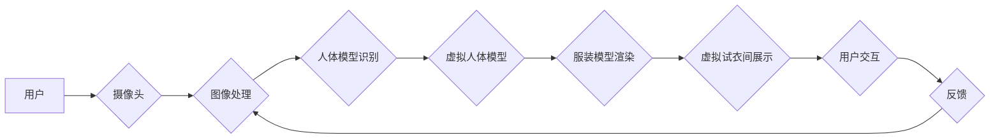

                 

## 电商平台中的虚拟试衣间技术应用

> 关键词：虚拟试衣间、3D建模、计算机视觉、深度学习、人机交互、电商平台、增强现实

## 1. 背景介绍

随着电商平台的蓬勃发展，消费者对线上购物体验的需求日益提高。传统的电商购物模式存在着试衣不便、退货率高等问题，严重影响着消费者购物体验和商家运营效率。虚拟试衣间技术应运而生，旨在通过虚拟现实（VR）、增强现实（AR）等技术，模拟真实的试衣体验，为消费者提供更便捷、更直观的购物方式。

虚拟试衣间技术能够有效解决传统电商平台的痛点，为消费者带来以下优势：

* **更真实的试衣体验:** 通过3D建模和计算机视觉技术，虚拟试衣间可以精准地模拟服装在人体上的效果，让消费者更直观地了解服装的版型、颜色、质感等信息。
* **提高购物效率:** 消费者无需前往实体店试衣，可以在家中轻松试穿各种服装，节省时间和精力。
* **降低退货率:** 虚拟试衣间可以帮助消费者更准确地选择合适的服装，从而降低退货率，提高商家运营效率。
* **增强购物乐趣:** 虚拟试衣间可以为消费者提供更有趣、更互动性的购物体验，提升购物乐趣。

## 2. 核心概念与联系

虚拟试衣间技术的核心概念包括3D建模、计算机视觉、人机交互、深度学习等。

**2.1 核心概念原理**

* **3D建模:**  利用3D建模技术构建虚拟人体模型，并根据服装设计图纸生成虚拟服装模型。
* **计算机视觉:**  利用计算机视觉技术对用户的实时图像进行识别和分析，提取用户的体型信息，并将其与虚拟人体模型进行匹配。
* **人机交互:**  通过手势识别、语音识别等技术，实现用户与虚拟试衣间的交互，方便用户选择服装、调整角度、查看效果等。
* **深度学习:**  利用深度学习算法对服装图像进行识别和分类，实现服装风格、颜色、材质等信息的自动提取。

**2.2 架构图**



## 3. 核心算法原理 & 具体操作步骤

### 3.1 算法原理概述

虚拟试衣间技术的核心算法主要包括人体模型识别、服装模型渲染、人机交互等。

* **人体模型识别:** 利用计算机视觉技术，从用户的实时图像中提取人体关键点信息，并将其映射到虚拟人体模型上。常用的算法包括深度学习算法、特征点匹配算法等。
* **服装模型渲染:** 将虚拟服装模型与虚拟人体模型进行融合，并根据用户的体型信息进行调整，使其贴合人体轮廓。常用的渲染技术包括3D建模、纹理贴图、光照模拟等。
* **人机交互:** 通过手势识别、语音识别等技术，实现用户与虚拟试衣间的交互，方便用户选择服装、调整角度、查看效果等。

### 3.2 算法步骤详解

**3.2.1 人体模型识别算法步骤:**

1. **图像预处理:** 对用户的实时图像进行预处理，例如调整亮度、对比度、去除噪声等。
2. **人体关键点检测:** 利用深度学习算法或特征点匹配算法，从预处理后的图像中检测出人体关键点信息，例如头部、肩膀、肘部、手腕、躯干、膝盖、脚踝等。
3. **人体模型构建:** 将检测到的关键点信息映射到虚拟人体模型上，构建出虚拟的人体模型。

**3.2.2 服装模型渲染算法步骤:**

1. **服装模型加载:** 加载虚拟服装模型，并根据用户的体型信息进行调整。
2. **纹理贴图:** 将服装的纹理贴图应用到虚拟服装模型上，使其具有真实的质感。
3. **光照模拟:** 模拟光照效果，使虚拟服装模型更加逼真。
4. **渲染输出:** 将渲染后的虚拟服装模型与虚拟人体模型进行融合，输出最终的虚拟试衣间效果。

**3.2.3 人机交互算法步骤:**

1. **手势识别:** 利用深度学习算法或其他手势识别技术，识别用户的动作指令，例如选择服装、调整角度、放大缩小等。
2. **语音识别:** 利用语音识别技术，识别用户的语音指令，例如询问服装尺寸、颜色等信息。
3. **交互反馈:** 根据用户的指令，及时反馈虚拟试衣间效果，例如更换服装、调整角度、显示尺寸信息等。

### 3.3 算法优缺点

**优点:**

* **真实性高:** 利用3D建模和计算机视觉技术，可以模拟真实的试衣体验。
* **交互性强:** 通过手势识别、语音识别等技术，实现用户与虚拟试衣间的交互，提高用户体验。
* **可定制性强:** 可以根据用户的体型信息、服装风格等进行个性化定制。

**缺点:**

* **技术复杂:** 需要整合多种技术，例如3D建模、计算机视觉、人机交互等，技术难度较高。
* **硬件要求高:** 需要配备高性能的硬件设备，例如高分辨率摄像头、强大的GPU等。
* **数据量大:** 需要大量的服装图像数据和人体模型数据进行训练，数据获取和处理成本较高。

### 3.4 算法应用领域

虚拟试衣间技术不仅应用于电商平台，还可应用于以下领域：

* **服装设计:** 设计师可以使用虚拟试衣间来快速预览服装效果，并进行修改和调整。
* **服装零售:** 服装零售商可以使用虚拟试衣间来提高店内体验，并减少退货率。
* **虚拟时尚:** 虚拟时尚平台可以使用虚拟试衣间来展示虚拟服装，并与用户进行互动。

## 4. 数学模型和公式 & 详细讲解 & 举例说明

### 4.1 数学模型构建

虚拟试衣间技术中，常用的数学模型包括人体模型、服装模型、光照模型等。

* **人体模型:** 人体模型通常采用3D点云或三角网格表示，每个点或三角形都有其坐标信息。人体模型的构建需要考虑人体骨骼结构、肌肉分布、脂肪厚度等因素。

* **服装模型:** 服装模型通常采用3D建模软件创建，并使用纹理贴图来模拟服装的质感和颜色。服装模型的构建需要考虑服装的版型、剪裁、褶皱等细节。

* **光照模型:** 光照模型用于模拟光线与物体之间的相互作用，从而产生真实的阴影、反射和折射效果。常用的光照模型包括 Phong 模型、Blinn-Phong 模型、Cook-Torrance 模型等。

### 4.2 公式推导过程

**4.2.1 人体关键点检测公式:**

常用的人体关键点检测算法基于深度学习，例如YOLOv5、Faster R-CNN等。这些算法通过训练大量的标注数据，学习到人体关键点检测的特征映射关系。

**4.2.2 服装模型渲染公式:**

服装模型渲染涉及到多个公式，例如纹理映射公式、光照计算公式、阴影生成公式等。这些公式根据光线追踪原理和材质特性，计算出每个像素点的颜色值。

### 4.3 案例分析与讲解

**4.3.1 案例:**

假设用户上传了一张穿着T恤的照片，虚拟试衣间需要将T恤虚拟化，并将其应用到用户的虚拟人体模型上。

**4.3.2 解释:**

1. 首先，计算机视觉算法检测出用户的关键点信息，例如头部、肩膀、肘部、手腕等。
2. 然后，将这些关键点信息映射到虚拟人体模型上，构建出用户的虚拟人体模型。
3. 接着，将T恤的3D模型加载到虚拟试衣间中，并根据用户的体型信息进行调整。
4. 最后，利用光照模型和纹理贴图技术，将T恤虚拟化，并将其应用到用户的虚拟人体模型上，呈现出用户穿着T恤的效果。

## 5. 项目实践：代码实例和详细解释说明

### 5.1 开发环境搭建

虚拟试衣间项目的开发环境需要包含以下软件：

* **操作系统:** Windows、macOS、Linux等
* **编程语言:** Python、C++等
* **3D建模软件:** Blender、Maya、3ds Max等
* **计算机视觉库:** OpenCV、TensorFlow、PyTorch等
* **人机交互库:** Leap Motion、OpenNI等

### 5.2 源代码详细实现

由于篇幅限制，这里只提供部分代码示例，具体实现细节请参考相关开源项目或技术文档。

**5.2.1 人体关键点检测代码示例 (Python, OpenCV):**

```python
import cv2

# 加载人体关键点检测模型
net = cv2.dnn.readNet("yolov5s.weights", "yolov5s.cfg")

# 读取图像
image = cv2.imread("user_image.jpg")

# 获取图像尺寸
height, width, _ = image.shape

# 创建blob
blob = cv2.dnn.blobFromImage(image, 1/255, (416, 416), (0, 0, 0), True, crop=False)

# 将blob输入模型
net.setInput(blob)
output_layers_names = net.getUnconnectedOutLayersNames()
outputs = net.forward(output_layers_names)

# 后处理输出结果
# ...

# 绘制关键点
# ...
```

**5.2.2 服装模型渲染代码示例 (Python, Blender):**

```python
import bpy

# 加载服装模型
bpy.ops.import_scene.obj(filepath="clothing_model.obj")

# 获取虚拟人体模型
human_model = bpy.data.objects["human_model"]

# 将服装模型应用到虚拟人体模型
# ...

# 渲染图像
# ...
```

### 5.3 代码解读与分析

以上代码示例仅展示了虚拟试衣间技术的部分实现细节。实际开发过程中，需要根据具体需求进行更深入的代码设计和实现。

### 5.4 运行结果展示

虚拟试衣间技术的运行结果是一个逼真的虚拟试衣体验，用户可以实时看到自己穿着不同服装的效果，并进行调整和选择。

## 6. 实际应用场景

虚拟试衣间技术在电商平台的应用场景非常广泛，例如：

* **服装电商:** 虚拟试衣间可以帮助用户更直观地了解服装的版型、颜色、质感等信息，提高购物决策的准确性，从而降低退货率，提高商家运营效率。
* **化妆品电商:** 虚拟试衣间可以帮助用户尝试不同的化妆品效果，例如口红、眼影、粉底等，提高用户体验，促进销售。
* **珠宝首饰电商:** 虚拟试衣间可以帮助用户尝试不同的珠宝首饰效果，例如项链、耳环、戒指等，提高用户体验，促进销售。

### 6.4 未来应用展望

未来，虚拟试衣间技术将朝着以下方向发展：

* **更逼真的虚拟体验:** 利用更先进的3D建模、计算机视觉、人机交互技术，打造更逼真的虚拟试衣体验，例如支持多角度旋转、放大缩小、材质变化等操作。
* **个性化定制:** 利用用户数据和人工智能技术，实现个性化服装推荐和定制，例如根据用户的体型、喜好、风格等信息，推荐合适的服装，并提供定制服务。
* **跨平台应用:** 将虚拟试衣间技术应用于更多平台，例如移动端、VR/AR设备等，提供更便捷、更沉浸式的购物体验。

## 7. 工具和资源推荐

### 7.1 学习资源推荐

* **书籍:**
    * 《3D Graphics Programming with DirectX 12》
    * 《Computer Vision: Algorithms and Applications》
    * 《Deep Learning》
* **在线课程:**
    * Coursera: 3D Graphics, Computer Vision, Deep Learning
    * Udacity: Artificial Intelligence, Computer Vision Nanodegree
    * edX: Introduction to Computer Vision, Deep Learning

### 7.2 开发工具推荐

* **3D建模软件:** Blender, Maya, 3ds Max
* **计算机视觉库:** OpenCV, TensorFlow, PyTorch
* **人机交互库:** Leap Motion, OpenNI
* **游戏引擎:** Unity, Unreal Engine

### 7.3 相关论文推荐

* **3D人体建模:**
    * "Deep Body Shape Reconstruction from a Single Image"
    * "Learning 3D Human Pose from 2D Images"
* **服装虚拟试穿:**
    * "Virtual Try-On for Clothing using Deep Learning"
    * "Real-Time Virtual Try-On for Clothing with Deep Learning"
* **人机交互:**
    * "A Survey of Hand Gesture Recognition Methods"
    * "Virtual Reality and Augmented Reality for Human-Computer Interaction"

## 8. 总结：未来发展趋势与挑战

### 8.1 研究成果总结

虚拟试衣间技术近年来取得了显著进展，从最初的基于2D图像的试穿效果，发展到如今基于3D建模和深度学习的逼真虚拟试穿体验。

### 8.2 未来发展趋势

未来，虚拟试衣间技术将朝着以下方向发展：

* **更逼真的虚拟体验:** 利用更先进的3D建模、计算机视觉、人机交互技术，打造更逼真的虚拟试衣体验，例如支持多角度旋转、放大缩小、材质变化等操作。
* **个性化定制:** 利用用户数据和人工智能技术，实现个性化服装推荐和定制，例如根据用户的体型、喜好、风格等信息，推荐合适的服装，并提供定制服务。
* **跨平台应用:** 将虚拟试衣间技术应用于更多平台，例如移动端、VR/AR设备等，提供更便捷、更沉浸式的购物体验。

### 8.3 面临的挑战

虚拟试衣间技术的发展也面临着一些挑战：

* **技术复杂性:** 虚拟试衣间技术需要整合多种技术，例如3D建模、计算机视觉、人机交互等，技术难度较高。
* **硬件要求高:** 需要配备高性能的硬件设备，例如高分辨率摄像头、强大的GPU等。
* **数据量大:** 需要大量的服装图像数据和人体模型数据进行训练，数据获取和处理成本较高。

### 8.4 研究展望

未来，虚拟试衣间技术将继续发展，并应用于更多领域，例如服装设计、虚拟时尚、医疗保健等。


## 9. 附录：常见问题与解答

**9.1 Q: 虚拟试衣间技术是否可以完美地模拟真实的试衣体验？**

**A:** 目前，虚拟试衣间技术还无法完全模拟真实的试衣体验，例如无法完全还原服装的质感、 drape 等细节。但随着技术的不断发展，虚拟试衣间技术将越来越逼真。

**9.2 Q: 虚拟试衣间技术需要哪些硬件设备？**

**A:** 虚拟试衣间技术需要配备高性能的硬件设备，例如高分辨率摄像头、强大的GPU等。具体硬件要求取决于具体的应用场景和技术方案。

**9.3 Q: 虚拟试衣间技术如何保护用户的隐私？**

**A:** 虚拟试衣间技术需要妥善处理用户的隐私信息，例如避免将用户的图像数据用于其他用途，并采取必要的安全措施保护用户的隐私。


作者：禅与计算机程序设计艺术 / Zen and the Art of Computer Programming<end_of_turn>

