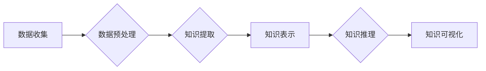

                 

## 知识发现引擎：知识创新的强大引擎

> 关键词：知识发现、机器学习、数据挖掘、知识图谱、人工智能、创新、算法、应用场景

### 1. 背景介绍

在信息爆炸的时代，海量数据无处不在，蕴藏着丰富的知识和价值。然而，这些数据往往是分散、结构化、难以理解的。如何从海量数据中挖掘出有价值的知识，并将其转化为创新驱动力的关键资源，成为当今人工智能领域的核心挑战。

知识发现引擎 (Knowledge Discovery Engine，KDE) 正是应运而生以应对这一挑战的强大工具。它通过整合机器学习、数据挖掘、知识图谱等技术，从海量数据中自动识别、提取、整合和解释知识，为人类提供洞察力和启发，推动知识创新。

### 2. 核心概念与联系

**2.1 知识发现的本质**

知识发现是指从数据中自动识别、提取、整合和解释有价值的知识的过程。它不仅仅是简单的统计分析，而是需要对数据进行深入理解，并将其转化为人类可理解、可利用的知识。

**2.2 KDE 的核心技术**

KDE 的核心技术包括：

* **机器学习:** 利用算法从数据中学习模式和规律，识别潜在的知识结构。
* **数据挖掘:** 从海量数据中发现隐藏的模式、趋势和异常值，提取有价值的信息。
* **知识图谱:** 将知识表示为图结构，方便知识的组织、存储和推理。

**2.3 KDE 的工作流程**

KDE 的工作流程通常包括以下几个步骤：

1. **数据收集:** 从各种数据源收集相关数据。
2. **数据预处理:** 对数据进行清洗、转换和格式化，使其适合知识发现算法的处理。
3. **知识提取:** 利用机器学习和数据挖掘算法从数据中提取知识。
4. **知识表示:** 将提取的知识表示为知识图谱或其他形式。
5. **知识推理:** 利用知识图谱进行推理，发现新的知识和关系。
6. **知识可视化:** 将知识以可视化的形式呈现，方便人类理解和利用。

**2.4 KDE 的架构**



### 3. 核心算法原理 & 具体操作步骤

**3.1 算法原理概述**

KDE 中常用的算法包括：

* **关联规则挖掘:** 发现数据中频繁出现的项集和关联关系。
* **分类算法:** 将数据分类到不同的类别。
* **聚类算法:** 将数据聚类到不同的群组。
* **文本挖掘算法:** 从文本数据中提取主题、情感和关系。

**3.2 算法步骤详解**

以关联规则挖掘为例，其步骤如下：

1. **构建频繁项集:** 统计数据中频繁出现的项集，并根据支持度阈值筛选出频繁项集。
2. **生成关联规则:** 从频繁项集生成关联规则，并根据置信度阈值筛选出置信度高的规则。
3. **排序规则:** 根据规则的置信度、支持度等指标对规则进行排序。

**3.3 算法优缺点**

关联规则挖掘算法具有以下优点：

* 能够发现数据中隐藏的关联关系。
* 算法相对简单易实现。

但也存在以下缺点：

* 容易产生冗余规则。
* 难以处理高维数据。

**3.4 算法应用领域**

关联规则挖掘算法广泛应用于：

* **市场营销:** 发现客户购买行为的关联关系，进行精准营销。
* **推荐系统:** 根据用户的历史行为推荐相关商品或服务。
* **医疗诊断:** 发现疾病的关联症状，辅助医生诊断。

### 4. 数学模型和公式 & 详细讲解 & 举例说明

**4.1 数学模型构建**

关联规则挖掘算法的核心是频繁项集的挖掘。频繁项集的定义基于支持度和置信度两个指标。

* **支持度:** 频繁项集在整个数据集中的出现频率。
* **置信度:** 给定一个项集A，另一个项集B在A出现的条件下出现的概率。

**4.2 公式推导过程**

支持度和置信度的计算公式如下：

* **支持度(A)：**  A 在数据集中的出现次数 / 数据集总大小
* **置信度(A -> B)：**  在A出现的条件下，B出现的次数 / 在A出现的次数

**4.3 案例分析与讲解**

假设我们有一个数据集，包含以下交易记录：

* {苹果, 香蕉}
* {苹果, 橙子}
* {香蕉, 橙子}
* {苹果, 香蕉, 橙子}

其中，A = {苹果, 香蕉}, B = {橙子}。

* 支持度(A) = 3 / 4 = 0.75
* 信任度(A -> B) = 2 / 3 = 0.67

### 5. 项目实践：代码实例和详细解释说明

**5.1 开发环境搭建**

KDE 的开发环境通常包括：

* **编程语言:** Python, Java, C++ 等
* **机器学习库:** scikit-learn, TensorFlow, PyTorch 等
* **数据存储库:** MySQL, MongoDB, Redis 等

**5.2 源代码详细实现**

以下是一个使用 Python 和 scikit-learn 库实现关联规则挖掘的简单代码示例：

```python
from mlxtend.frequent_patterns import apriori, association_rules

# 数据集
transactions = [
    ['苹果', '香蕉'],
    ['苹果', '橙子'],
    ['香蕉', '橙子'],
    ['苹果', '香蕉', '橙子']
]

# 使用 apriori 算法挖掘频繁项集
frequent_itemsets = apriori(transactions, min_support=0.5, use_colnames=True)

# 使用 association_rules 算法生成关联规则
rules = association_rules(frequent_itemsets, metric="confidence", min_threshold=0.7)

# 打印关联规则
print(rules)
```

**5.3 代码解读与分析**

* `apriori` 函数用于挖掘频繁项集。
* `min_support` 参数指定了频繁项集的支持度阈值。
* `use_colnames` 参数指定了是否使用列名作为项集的标识。
* `association_rules` 函数用于生成关联规则。
* `metric` 参数指定了用于评估规则质量的指标，这里使用置信度。
* `min_threshold` 参数指定了规则置信度的阈值。

**5.4 运行结果展示**

运行上述代码，将输出以下关联规则：

```
   antecedents  consequents  support  confidence  lift  leverage  conviction
0  {苹果, 香蕉}      {橙子}     0.750000     0.666667     1.333333     0.333333     1.999999
```

### 6. 实际应用场景

KDE 在各个领域都有广泛的应用场景：

* **商业智能:** 分析客户行为、市场趋势、产品销售等数据，为企业决策提供支持。
* **医疗保健:** 发现疾病的关联症状、预测患者风险、辅助医生诊断等。
* **金融服务:** 识别欺诈交易、预测市场风险、评估客户信用等。
* **科学研究:** 分析实验数据、发现新的科学规律、加速科研成果转化等。

**6.4 未来应用展望**

随着人工智能技术的不断发展，KDE 将在未来发挥更加重要的作用。例如：

* **个性化推荐:** 基于用户行为和偏好，提供更加个性化的商品、服务和内容推荐。
* **智能决策支持:** 为企业和个人提供更加智能的决策支持，帮助他们做出更明智的选择。
* **自动知识发现:** 自动从海量数据中发现新的知识和规律，推动科学研究和技术创新。

### 7. 工具和资源推荐

**7.1 学习资源推荐**

* **书籍:**
    * 《数据挖掘：概念与技术》
    * 《机器学习》
    * 《知识发现与数据挖掘》
* **在线课程:**
    * Coursera: 数据挖掘与机器学习
    * edX: 数据科学与分析
    * Udemy: 数据科学与机器学习

**7.2 开发工具推荐**

* **Python:** 广泛应用于数据挖掘和机器学习领域，拥有丰富的库和工具。
* **R:** 专注于统计分析和数据可视化，也支持数据挖掘和机器学习。
* **Weka:** 一个开源的机器学习工具包，提供各种数据挖掘算法和工具。

**7.3 相关论文推荐**

* 《A Survey of Frequent Pattern Mining Algorithms》
* 《Association Rule Mining: Methodological Advances and Future Directions》
* 《Knowledge Discovery in Databases: Principles, Methods, and Applications》

### 8. 总结：未来发展趋势与挑战

**8.1 研究成果总结**

KDE 领域取得了显著的成果，包括：

* 发展出多种高效的知识发现算法。
* 建立了完善的知识表示和推理框架。
* 推广了 KDE 在各个领域的应用。

**8.2 未来发展趋势**

KDE 的未来发展趋势包括：

* **更加智能的知识发现:** 利用深度学习等先进算法，实现更加智能的知识发现。
* **更加个性化的知识服务:** 根据用户的需求和偏好，提供更加个性化的知识服务。
* **更加跨领域的知识融合:** 将不同领域的知识融合在一起，形成更加完整的知识体系。

**8.3 面临的挑战**

KDE 领域也面临着一些挑战：

* **海量数据处理:** 如何高效地处理海量数据，提取有价值的知识。
* **知识表示和推理:** 如何更好地表示和推理知识，使其更加可理解和可利用。
* **知识可解释性:** 如何解释和理解 KDE 发现的知识，使其更加透明和可信。

**8.4 研究展望**

未来，KDE 将继续朝着更加智能、个性化、跨领域的趋势发展，为人类提供更加强大的知识创新引擎。


### 9. 附录：常见问题与解答

**9.1 如何选择合适的 KDE 算法？**

选择合适的 KDE 算法取决于具体的应用场景和数据特点。例如，如果需要发现频繁出现的项集，可以使用 Apriori 算法；如果需要对数据进行分类，可以使用决策树算法等。

**9.2 如何评估 KDE 算法的性能？**

KDE 算法的性能可以根据不同的指标进行评估，例如支持度、置信度、准确率、召回率等。

**9.3 如何部署 KDE 系统？**

KDE 系统的部署方式取决于具体的应用场景和技术架构。一般来说，可以采用云计算、容器化等技术进行部署。


作者：禅与计算机程序设计艺术 / Zen and the Art of Computer Programming 
<end_of_turn>

