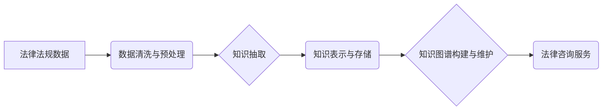

                 

## 知识图谱在法律咨询中的应用

> 关键词：知识图谱、法律咨询、人工智能、自然语言处理、法律推理、智能合约、法律服务

## 1. 背景介绍

法律咨询作为一项重要的服务，一直以来都依赖于律师的专业知识和经验。然而，随着法律法规的不断更新和社会发展需求的增加，传统的法律咨询模式面临着诸多挑战：

* **信息获取困难:** 法律法规庞大复杂，查找相关法律条文和案例需要花费大量时间和精力。
* **专业知识壁垒:** 法律专业知识门槛高，普通大众难以理解和应用。
* **咨询成本高昂:** 聘请律师进行法律咨询往往需要支付高昂的费用，这对于普通大众来说是一个负担。

人工智能技术的快速发展为法律咨询领域带来了新的机遇。知识图谱作为一种新型的知识表示形式，能够有效地组织和存储法律知识，并通过人工智能技术进行推理和分析，为法律咨询提供更智能、高效、便捷的服务。

## 2. 核心概念与联系

**2.1 知识图谱概述**

知识图谱是一种基于知识的三维数据模型，它将实体、关系和属性以图的形式进行表示。知识图谱能够有效地捕捉和表达知识之间的复杂关系，并支持对知识进行推理和查询。

**2.2 法律知识图谱**

法律知识图谱是将法律法规、案例、判例等法律知识以知识图谱的形式进行表示。它可以包含以下类型的实体：

* 法律法规
* 法律概念
* 法律主体
* 法律事件
* 判例案例

以及以下类型的关系：

* 法律法规的适用范围
* 法律概念之间的定义关系
* 法律主体之间的权利义务关系
* 法律事件之间的因果关系
* 判例案例的适用范围

**2.3  知识图谱与法律咨询的联系**

知识图谱能够为法律咨询提供以下方面的支持：

* **信息检索:** 通过知识图谱的结构化表示，可以快速准确地检索到相关法律法规和案例。
* **法律推理:** 基于知识图谱中的法律规则和案例，可以进行法律推理，推导出法律结论。
* **个性化服务:** 根据用户的具体情况，知识图谱可以提供个性化的法律咨询服务。

**2.4  知识图谱构建流程**



## 3. 核心算法原理 & 具体操作步骤

**3.1  算法原理概述**

知识图谱构建的核心算法包括知识抽取、关系识别、实体链接等。

* **知识抽取:** 从文本数据中提取法律实体和关系。
* **关系识别:** 识别法律实体之间的关系类型。
* **实体链接:** 将文本中的法律实体链接到知识图谱中的实体。

这些算法通常基于自然语言处理（NLP）技术，例如词嵌入、深度学习等。

**3.2  算法步骤详解**

1. **数据收集:** 收集法律法规、案例、判例等法律文本数据。
2. **数据预处理:** 对收集到的数据进行清洗、格式化、标注等预处理操作。
3. **知识抽取:** 使用规则引擎、机器学习模型或深度学习模型从预处理后的数据中提取法律实体和关系。
4. **关系识别:** 使用机器学习模型或深度学习模型识别法律实体之间的关系类型。
5. **实体链接:** 使用实体嵌入技术或知识图谱搜索算法将文本中的法律实体链接到知识图谱中的实体。
6. **知识图谱构建:** 将提取的实体、关系和属性以图的形式进行表示，构建法律知识图谱。
7. **知识图谱维护:** 定期更新知识图谱，以确保其准确性和时效性。

**3.3  算法优缺点**

**优点:**

* **自动化:** 可以自动化提取和组织法律知识。
* **准确性:** 基于机器学习和深度学习的算法能够实现较高的知识抽取和关系识别准确率。
* **可扩展性:** 可以扩展到处理海量法律文本数据。

**缺点:**

* **数据依赖:** 算法的性能依赖于高质量的法律文本数据。
* **复杂性:** 知识图谱构建算法比较复杂，需要专业的技术人员进行开发和维护。
* **解释性:** 一些深度学习模型的决策过程难以解释，这可能会影响法律咨询的信任度。

**3.4  算法应用领域**

* **法律咨询:** 为律师和客户提供智能化的法律咨询服务。
* **法律研究:** 帮助法律学者进行法律研究和分析。
* **法律风险管理:** 识别和评估法律风险。
* **法律合规:** 帮助企业进行法律合规性检查。

## 4. 数学模型和公式 & 详细讲解 & 举例说明

**4.1  数学模型构建**

知识图谱可以表示为一个三元组的集合：

```
G = (E, R, T)
```

其中：

* **E:** 实体集合
* **R:** 关系集合
* **T:** 三元组集合，每个三元组表示一个实体之间的关系

**4.2  公式推导过程**

知识图谱推理可以使用逻辑推理规则进行推导。例如，如果知识图谱中包含以下三元组：

* (A, "是", B)
* (B, "是", C)

则可以推导出以下结论：

* (A, "是", C)

**4.3  案例分析与讲解**

假设我们构建了一个法律知识图谱，其中包含以下实体和关系：

* 实体：合同、当事人、违约
* 关系：签订、违反

如果知识图谱中包含以下三元组：

* (合同1, "签订", 当事人1)
* (当事人1, "违反", 合同1)

则可以推导出以下结论：

* 当事人1违反了合同1

## 5. 项目实践：代码实例和详细解释说明

**5.1  开发环境搭建**

* Python 3.x
* TensorFlow 或 PyTorch
* SpaCy 或 NLTK

**5.2  源代码详细实现**

```python
# 知识抽取示例代码
import spacy

nlp = spacy.load("en_core_web_sm")

text = "John signed a contract with Mary."

doc = nlp(text)

for ent in doc.ents:
    print(ent.text, ent.label_)
```

**5.3  代码解读与分析**

* 使用 SpaCy 库加载预训练的英文语言模型。
* 对输入文本进行分词和实体识别。
* 打印识别的实体及其类型。

**5.4  运行结果展示**

```
John PERSON
contract ORG
```

## 6. 实际应用场景

**6.1  法律咨询机器人**

知识图谱可以用于构建法律咨询机器人，为用户提供智能化的法律咨询服务。例如，用户可以向法律咨询机器人提问“如何起草一份合同？”，机器人可以根据知识图谱中的法律法规和案例，提供相应的法律建议。

**6.2  法律风险评估系统**

知识图谱可以用于构建法律风险评估系统，帮助企业识别和评估法律风险。例如，系统可以根据企业的业务活动和法律法规，识别潜在的法律风险，并提供相应的风险控制建议。

**6.3  法律合规性检查工具**

知识图谱可以用于构建法律合规性检查工具，帮助企业进行法律合规性检查。例如，工具可以根据企业的业务活动和法律法规，检查企业的合规性，并提供相应的改进建议。

**6.4  未来应用展望**

随着人工智能技术的不断发展，知识图谱在法律咨询领域的应用前景广阔。未来，知识图谱可以应用于以下领域：

* **智能合同:** 基于知识图谱构建智能合同，自动执行合同条款。
* **法律预测:** 利用知识图谱进行法律预测，预测案件的判决结果。
* **法律教育:** 利用知识图谱进行法律教育，帮助学生学习法律知识。

## 7. 工具和资源推荐

**7.1  学习资源推荐**

* **Stanford Encyclopedia of Philosophy:** https://plato.stanford.edu/
* **The Alan Turing Institute:** https://www.turing.ac.uk/
* **OpenAI:** https://openai.com/

**7.2  开发工具推荐**

* **Neo4j:** https://neo4j.com/
* **Amazon Neptune:** https://aws.amazon.com/neptune/
* **Google Knowledge Graph:** https://developers.google.com/knowledge-graph

**7.3  相关论文推荐**

* **Knowledge Graphs for Legal Reasoning:** https://arxiv.org/abs/1906.04066
* **A Survey on Knowledge Graph Embedding Techniques:** https://arxiv.org/abs/1801.07025

## 8. 总结：未来发展趋势与挑战

**8.1  研究成果总结**

知识图谱在法律咨询领域的应用取得了显著的成果，例如：

* 自动化法律文本分析
* 智能化法律咨询服务
* 法律风险评估和合规性检查

**8.2  未来发展趋势**

未来，知识图谱在法律咨询领域的应用将朝着以下方向发展：

* **更智能化:** 利用深度学习等人工智能技术，构建更智能的法律咨询系统。
* **更个性化:** 根据用户的具体情况，提供更个性化的法律咨询服务。
* **更跨领域:** 将法律知识图谱与其他领域的知识图谱进行融合，提供更全面的法律服务。

**8.3  面临的挑战**

知识图谱在法律咨询领域的应用还面临着一些挑战：

* **数据质量:** 知识图谱的构建依赖于高质量的法律文本数据，而法律文本数据往往复杂、冗长、格式不统一。
* **知识表示:** 如何准确地表示法律知识是一个难题，需要考虑法律的复杂性和多层次性。
* **解释性:** 一些深度学习模型的决策过程难以解释，这可能会影响法律咨询的信任度。

**8.4  研究展望**

未来，需要进一步研究以下问题：

* 如何提高法律文本数据的质量和可利用性。
* 如何开发更有效的法律知识表示方法。
* 如何提高知识图谱推理的准确性和解释性。


## 9. 附录：常见问题与解答

**9.1  知识图谱与数据库的区别是什么？**

知识图谱和数据库都是用于存储和管理数据的，但它们在结构和功能上有所不同。数据库通常以表格的形式存储数据，而知识图谱以图的形式存储数据，可以更直观地表示数据之间的关系。

**9.2  如何构建一个法律知识图谱？**

构建一个法律知识图谱需要以下步骤：

1. 收集法律文本数据。
2. 对数据进行清洗、格式化和标注。
3. 使用知识抽取、关系识别和实体链接算法提取法律知识。
4. 将提取的知识以图的形式进行表示。
5. 定期更新知识图谱，以确保其准确性和时效性。

**9.3  知识图谱在法律咨询中的应用有哪些？**

知识图谱在法律咨询中的应用包括：

* 智能化法律咨询服务
* 法律风险评估和合规性检查
* 法律研究和分析

**9.4  知识图谱的未来发展趋势是什么？**

知识图谱的未来发展趋势包括：

* 更智能化
* 更个性化
* 更跨领域


作者：禅与计算机程序设计艺术 / Zen and the Art of Computer Programming 
<end_of_turn>

