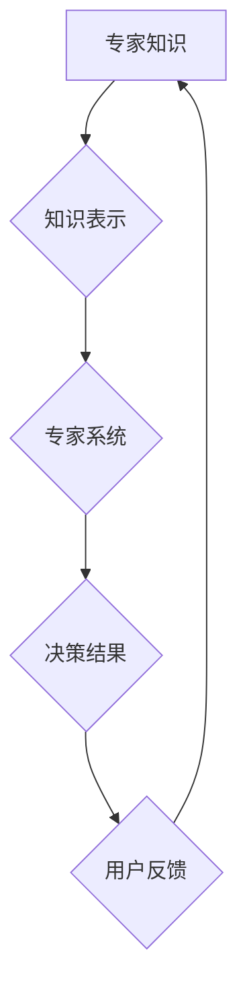

                 

## 知识的诅咒：专家为何难以简化解释

> 关键词：知识诅咒、专家系统、知识表示、解释性AI、可解释性、复杂系统、沟通障碍

## 1. 背景介绍

在当今数据爆炸的时代，人工智能（AI）技术飞速发展，专家系统作为AI领域的重要分支，在各个领域发挥着越来越重要的作用。然而，专家系统也面临着一些挑战，其中之一就是“知识的诅咒”。

“知识的诅咒”指的是专家在将自己的专业知识转化为可供计算机理解和使用的形式时，往往会遇到困难。专家对某一领域有着深入的理解和经验，但他们难以将这些复杂的概念和推理过程简化成清晰、简洁的规则和模型，以便计算机能够理解和应用。

这种现象在许多领域都存在，例如医学诊断、法律判决、金融分析等。专家往往能够根据丰富的经验和直觉做出准确的判断，但他们难以将这些判断过程清晰地表达出来，让其他人或计算机理解。

## 2. 核心概念与联系

**2.1 知识表示**

知识表示是将人类知识转化为计算机可理解的形式。它涉及到如何将概念、关系、规则等知识元素抽象化、符号化，并构建一个知识图谱或知识库。

**2.2 专家系统**

专家系统是一种利用人工智能技术模拟人类专家决策过程的软件系统。它通常包含以下几个核心组件：

* **知识库:** 存储专家知识的数据库。
* **推理引擎:** 根据知识库中的规则和事实进行推理，得出结论。
* **用户界面:** 与用户交互，获取输入和展示输出。

**2.3 知识的诅咒**

知识的诅咒是指专家难以将自己的专业知识简化成计算机可理解的形式，导致专家系统难以实现预期效果。

**2.4 沟通障碍**

知识的诅咒本质上是一种沟通障碍。专家和计算机之间存在着认知和表达方式的差异，导致知识的传递和理解存在困难。

**Mermaid 流程图**



## 3. 核心算法原理 & 具体操作步骤

**3.1 算法原理概述**

专家系统通常采用规则ベースの推理或案例ベースの推理两种算法。

* **规则ベース的推理:** 将专家知识表示为一系列的“如果-那么”规则，推理引擎根据这些规则和输入事实进行逻辑推理，得出结论。
* **案例ベースの推理:** 将专家知识存储为一系列的案例，推理引擎根据输入情况与已有的案例进行匹配，并根据相似案例的结论进行推理。

**3.2 算法步骤详解**

**规则ベースの推理:**

1. 获取用户输入的症状或问题。
2. 将用户输入转换为可供计算机理解的形式。
3. 将用户输入与知识库中的规则进行匹配。
4. 根据匹配的规则进行逻辑推理，得出结论。
5. 将推理结果展示给用户。

**案例ベースの推理:**

1. 获取用户输入的症状或问题。
2. 将用户输入转换为可供计算机理解的形式。
3. 将用户输入与知识库中的案例进行匹配。
4. 根据相似案例的结论进行推理，得出结论。
5. 将推理结果展示给用户。

**3.3 算法优缺点**

**规则ベースの推理:**

* **优点:** 能够处理复杂逻辑关系，推理过程透明可解释。
* **缺点:** 建立规则库需要大量的时间和精力，规则难以表达所有可能的场景。

**案例ベースの推理:**

* **优点:** 能够处理模糊和不确定的知识，更容易学习和更新。
* **缺点:** 难以解释推理过程，对案例库的质量要求较高。

**3.4 算法应用领域**

* 医学诊断
* 法律判决
* 金融分析
* 制造业
* 教育

## 4. 数学模型和公式 & 详细讲解 & 举例说明

**4.1 数学模型构建**

专家系统中的知识可以表示为图论模型，其中节点代表概念，边代表关系。例如，在医学诊断领域，节点可以代表疾病、症状、检查结果等，边可以代表“导致”、“表现为”等关系。

**4.2 公式推导过程**

可以使用图论算法，例如深度优先搜索或广度优先搜索，来进行推理。例如，如果用户输入了某个症状，可以从该症状节点出发，沿着关系边进行搜索，找到与该症状相关的疾病节点。

**4.3 案例分析与讲解**

假设有一个专家系统用于诊断感冒。知识库中包含以下规则：

* 如果患者有发烧，则可能患感冒。
* 如果患者有咳嗽，则可能患感冒。
* 如果患者有鼻塞，则可能患感冒。

如果用户输入了“患者有发烧和咳嗽”，则专家系统可以根据上述规则进行推理，得出结论“患者可能患感冒”。

## 5. 项目实践：代码实例和详细解释说明

**5.1 开发环境搭建**

可以使用 Python 语言和相关库，例如 `networkx` 和 `graphviz`，来开发专家系统。

**5.2 源代码详细实现**

```python
import networkx as nx

# 建立知识图谱
graph = nx.Graph()
graph.add_node("发烧")
graph.add_node("咳嗽")
graph.add_node("鼻塞")
graph.add_node("感冒")
graph.add_edge("发烧", "感冒")
graph.add_edge("咳嗽", "感冒")
graph.add_edge("鼻塞", "感冒")

# 获取用户输入
symptoms = input("请输入患者的症状：").split(",")

# 进行推理
for symptom in symptoms:
    if graph.has_edge(symptom, "感冒"):
        print(f"患者可能患感冒")
```

**5.3 代码解读与分析**

代码首先建立了一个知识图谱，其中节点代表症状和疾病，边代表“导致”关系。然后，根据用户输入的症状，代码遍历知识图谱，找到与症状相关的疾病节点，并输出结论。

**5.4 运行结果展示**

如果用户输入“发烧,咳嗽”，则程序输出“患者可能患感冒”。

## 6. 实际应用场景

专家系统在各个领域都有广泛的应用场景，例如：

* **医疗诊断:** 帮助医生诊断疾病，推荐治疗方案。
* **法律判决:** 辅助法官进行法律分析，做出更准确的判决。
* **金融分析:** 帮助金融分析师进行风险评估，做出投资决策。
* **制造业:** 帮助工程师进行故障诊断，优化生产流程。
* **教育:** 帮助学生学习知识，提供个性化辅导。

**6.4 未来应用展望**

随着人工智能技术的不断发展，专家系统将更加智能化、自动化，在更多领域发挥重要作用。例如，未来专家系统可能能够：

* 自动学习和更新知识库。
* 进行更复杂的推理和决策。
* 与人类进行更自然的交互。

## 7. 工具和资源推荐

**7.1 学习资源推荐**

* **书籍:**
    * 《人工智能：现代方法》
    * 《专家系统》
* **在线课程:**
    * Coursera 上的“人工智能”课程
    * edX 上的“机器学习”课程

**7.2 开发工具推荐**

* **Python:** 一种流行的编程语言，广泛用于人工智能开发。
* **TensorFlow:** 一种开源的机器学习框架。
* **PyTorch:** 另一种开源的机器学习框架。

**7.3 相关论文推荐**

* **《专家系统》**
* **《人工智能：一种现代方法》**

## 8. 总结：未来发展趋势与挑战

**8.1 研究成果总结**

专家系统在解决复杂问题、提高效率方面取得了显著成果，但仍然面临一些挑战。

**8.2 未来发展趋势**

未来专家系统将更加智能化、自动化，能够更好地理解和处理人类语言，并与人类进行更自然的交互。

**8.3 面临的挑战**

* **知识表示:** 如何将人类知识更有效地表示为计算机可理解的形式。
* **推理能力:** 如何提高专家系统的推理能力，使其能够处理更复杂的问题。
* **可解释性:** 如何使专家系统的推理过程更加透明可解释，以便人类能够理解和信任其决策。

**8.4 研究展望**

未来研究将集中在解决上述挑战，开发更智能、更可靠、更可解释的专家系统。

## 9. 附录：常见问题与解答

**常见问题:**

* **专家系统与机器学习有什么区别？**

**解答:** 专家系统基于规则，而机器学习基于数据。专家系统需要专家明确定义规则，而机器学习算法可以从数据中自动学习规则。

* **如何构建一个专家系统？**

**解答:** 构建一个专家系统需要以下步骤：

1. 确定专家系统的目标和范围。
2. 收集和分析专家知识。
3. 建立知识表示模型。
4. 开发推理引擎。
5. 测试和评估专家系统。


作者：禅与计算机程序设计艺术 / Zen and the Art of Computer Programming<end_of_turn>

