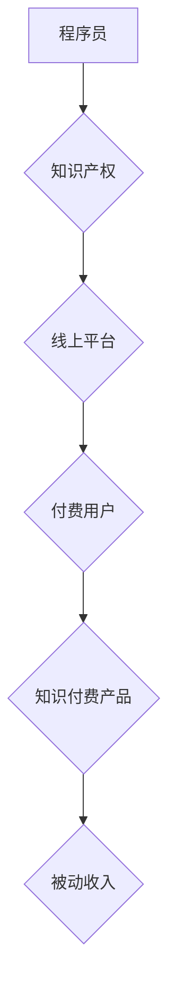

                 

## 程序员如何利用知识付费实现被动收入的途径

> 关键词：知识付费、程序员、被动收入、在线课程、电子书、技术博客、开源项目、社区运营

## 1. 背景介绍

在当今数字时代，知识是至关重要的生产要素。程序员作为掌握技术技能的专业人才，拥有丰富的知识储备和实践经验。知识付费模式的兴起为程序员提供了新的途径，可以将他们的知识和技能转化为可持续的被动收入。

知识付费是指通过线上平台或线下活动，将知识、技能、经验等资源以付费的方式提供给有需求的用户。这种模式的优势在于：

* **低成本运营:** 相比传统出版模式，知识付费的成本更低，无需印刷、物流等环节。
* **高效传播:** 在线平台可以快速将知识传播给全球用户，不受地域限制。
* **持续收入:** 一旦课程或内容发布，可以持续获得收益，实现被动收入。

## 2. 核心概念与联系

知识付费的核心概念是将知识和技能转化为有价值的产品或服务，并通过线上平台或线下活动进行销售。程序员可以通过以下方式将他们的知识和技能进行知识付费：

* **在线课程:**  录制视频课程，教授编程语言、框架、工具等技术知识。
* **电子书:**  撰写技术书籍，分享编程经验、最佳实践、项目案例等。
* **技术博客:**  定期发布技术文章，分享编程技巧、行业趋势、工具评测等。
* **开源项目:**  开发开源软件，并提供付费支持服务，例如代码定制、bug修复、技术咨询等。
* **社区运营:**  建立技术社区，提供技术交流、学习资源、项目合作等服务，并通过会员制度或赞助获得收入。

**知识付费模式架构**



## 3. 核心算法原理 & 具体操作步骤

### 3.1  算法原理概述

知识付费的成功关键在于提供有价值、实用、易懂的知识产品。程序员需要根据目标用户的需求，选择合适的知识领域和教学方式，并采用有效的算法和技术手段进行知识组织、呈现和传播。

### 3.2  算法步骤详解

1. **需求分析:**  明确目标用户的需求，例如编程语言、框架、工具、项目经验等。
2. **内容策划:**  根据需求分析结果，策划知识产品的内容框架、章节结构、学习路径等。
3. **知识产权保护:**  对知识产品进行版权登记或其他形式的知识产权保护，防止知识盗版。
4. **内容制作:**  录制视频课程、撰写电子书、编写技术博客文章等，并进行后期剪辑、排版、润色等工作。
5. **平台选择:**  选择合适的线上平台进行知识产品发布，例如 Udemy、Coursera、Skillshare、博客平台等。
6. **营销推广:**  通过社交媒体、技术论坛、邮件营销等方式进行知识产品推广，吸引目标用户。
7. **用户反馈:**  收集用户反馈，不断改进知识产品的内容和形式，提升用户体验。

### 3.3  算法优缺点

**优点:**

* **高效:**  知识付费模式可以快速将知识传播给全球用户。
* **可持续:**  知识产品可以重复销售，实现被动收入。
* **灵活:**  程序员可以根据自己的时间和精力安排知识产品创作和推广。

**缺点:**

* **竞争激烈:**  知识付费市场竞争激烈，需要不断提升知识产品的质量和竞争力。
* **用户粘性:**  用户对知识产品的付费意愿和粘性需要不断维护。
* **平台依赖:**  知识付费平台的规则和政策可能会影响知识产品的收益。

### 3.4  算法应用领域

知识付费模式广泛应用于编程领域，例如：

* **编程语言学习:**  教授 Python、Java、C++、JavaScript 等编程语言的语法、基础知识和应用案例。
* **框架和工具学习:**  讲解 React、Vue、Angular、Spring Boot 等框架和工具的使用方法和最佳实践。
* **项目开发经验分享:**  分享大型项目开发的经验教训、技术架构设计、代码优化等。
* **技术面试辅导:**  提供技术面试技巧、常见面试题解答、模拟面试等服务。

## 4. 数学模型和公式 & 详细讲解 & 举例说明

知识付费模式的收益可以看作是一个数学模型，其中涉及到用户数量、付费率、单价等因素。

### 4.1  数学模型构建

假设：

*  **U:** 用户数量
*  **P:** 付费率
*  **S:** 单价

则知识付费模式的总收益可以表示为：

**收益 = U * P * S**

### 4.2  公式推导过程

该公式的推导过程如下：

*  **U * P:**  表示付费用户数量。
*  **U * P * S:**  表示付费用户数量乘以单价，即总收益。

### 4.3  案例分析与讲解

例如，假设一个在线课程有 1000 名用户，付费率为 10%，单价为 100 元，则总收益为：

**收益 = 1000 * 0.1 * 100 = 10000 元**

## 5. 项目实践：代码实例和详细解释说明

### 5.1  开发环境搭建

程序员可以利用各种开发工具和平台进行知识付费项目实践，例如：

* **视频录制工具:** OBS Studio、Camtasia、ScreenFlow
* **编辑器:** VS Code、Sublime Text、Atom
* **在线平台:** Udemy、Coursera、Skillshare、Teachable

### 5.2  源代码详细实现

以下是一个简单的技术博客文章代码实例，使用 Python 语言编写：

```python
def hello_world():
  print("Hello, world!")

hello_world()
```

**代码解读与分析:**

*  `def hello_world():`  定义了一个名为 `hello_world` 的函数。
*  `print("Hello, world!")`  在函数体内打印 "Hello, world!" 字符串。
*  `hello_world()`  调用 `hello_world` 函数，执行函数内的代码。

### 5.3  代码解读与分析

程序员需要根据知识产品的类型和目标用户，选择合适的编程语言、框架和工具进行代码实现。

### 5.4  运行结果展示

运行上述代码，将输出以下结果：

```
Hello, world!
```

## 6. 实际应用场景

知识付费模式在程序员领域有着广泛的应用场景：

* **个人品牌建设:**  程序员可以通过知识付费平台发布自己的技术文章、视频课程等，提升个人品牌知名度和影响力。
* **副业收入:**  程序员可以利用业余时间创作知识产品，获得额外的被动收入。
* **技术社区运营:**  程序员可以建立技术社区，提供技术交流、学习资源、项目合作等服务，并通过会员制度或赞助获得收入。

### 6.4  未来应用展望

随着互联网技术的不断发展，知识付费模式将更加成熟和完善。未来，程序员可以利用人工智能、虚拟现实等新技术，开发更加创新和互动性的知识产品，满足用户日益增长的学习需求。

## 7. 工具和资源推荐

### 7.1  学习资源推荐

* **Coursera:** https://www.coursera.org/
* **Udemy:** https://www.udemy.com/
* **Skillshare:** https://www.skillshare.com/
* **GitHub:** https://github.com/

### 7.2  开发工具推荐

* **OBS Studio:** https://obsproject.com/
* **VS Code:** https://code.visualstudio.com/
* **Sublime Text:** https://www.sublimetext.com/

### 7.3  相关论文推荐

* **The Economics of Online Education**
* **The Impact of Online Learning on Student Outcomes**

## 8. 总结：未来发展趋势与挑战

### 8.1  研究成果总结

知识付费模式为程序员提供了新的途径，可以将他们的知识和技能转化为可持续的被动收入。

### 8.2  未来发展趋势

未来，知识付费模式将更加成熟和完善，程序员可以利用新技术开发更加创新和互动性的知识产品。

### 8.3  面临的挑战

知识付费市场竞争激烈，程序员需要不断提升知识产品的质量和竞争力。

### 8.4  研究展望

未来研究可以关注知识付费模式的个性化定制、用户体验优化、知识产权保护等方面。

## 9. 附录：常见问题与解答

**常见问题:**

*  如何选择合适的知识付费平台？
*  如何制作高质量的知识产品？
*  如何进行知识产品推广？

**解答:**

*  选择合适的知识付费平台需要考虑平台的受众群体、收费模式、服务功能等因素。
*  制作高质量的知识产品需要注重内容的实用性、易懂性和趣味性。
*  知识产品推广需要利用多种渠道，例如社交媒体、技术论坛、邮件营销等。


作者：禅与计算机程序设计艺术 / Zen and the Art of Computer Programming 
<end_of_turn>

