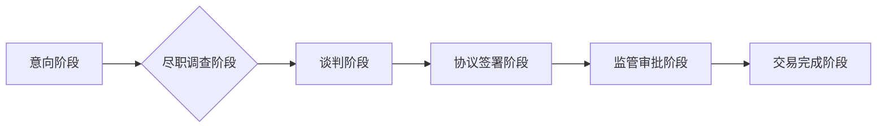

                 

## 程序员如何评估并购offer的真实价值

> 关键词：并购、估值、程序员、技术资产、财务分析、风险评估、谈判策略

## 1. 背景介绍

作为一名程序员，你可能在某个时候想过，如果你的公司被收购，你将获得什么样的回报？或者，如果你正在考虑收购一家技术公司，你该如何评估其真实价值？并购交易是一个复杂的领域，涉及到技术、财务、法律等多方面的因素。对于程序员来说，理解并购交易的本质，以及如何评估技术资产的价值，至关重要。

近年来，科技行业并购交易频繁发生，程序员也成为了并购交易中的重要参与者。一方面，程序员的技能和知识是科技公司核心竞争力的关键，因此，他们的价值在并购交易中被越来越重视。另一方面，程序员也需要了解并购交易的流程和风险，以便更好地保护自己的利益。

## 2. 核心概念与联系

**2.1 并购交易类型**

并购交易主要分为以下几种类型：

* **收购（Acquisition）:** 一家公司（收购方）购买另一家公司（被收购方）的所有股权，使其成为子公司。
* **合并（Merger）:** 两家公司合并成一家新的公司，原有的公司结构消失。
* **资产收购（Asset Acquisition）:** 一家公司购买另一家公司的特定资产，例如专利、技术、设备等，但不包括所有股权。

**2.2 并购交易流程**

并购交易通常经历以下几个阶段：

1. **意向阶段:** 潜在的收购方和被收购方初步沟通，确定交易意向。
2. **尽职调查阶段:** 收购方对被收购方的财务状况、技术资产、法律合规性等进行全面调查。
3. **谈判阶段:** 双方就交易条款进行谈判，包括价格、支付方式、交割时间等。
4. **协议签署阶段:** 双方签署并购协议，明确交易细节。
5. **监管审批阶段:** 提交相关监管部门审批，获得批准。
6. **交易完成阶段:** 完成交易，收购方获得被收购方的所有权或特定资产。

**2.3  技术资产评估**

技术资产是科技公司核心价值的体现，包括软件代码、专利、技术文档、知识产权等。评估技术资产的价值需要考虑以下因素：

* **技术先进性:** 技术的创新性和市场竞争力。
* **市场需求:** 技术应用的市场规模和增长潜力。
* **知识产权保护:** 专利、版权等知识产权的有效性。
* **技术团队:** 技术团队的经验、能力和稳定性。

**2.4  财务分析**

财务分析是评估并购交易价值的重要手段，需要分析被收购方的财务报表、盈利能力、现金流等指标。

**Mermaid 流程图**



## 3. 核心算法原理 & 具体操作步骤

**3.1 算法原理概述**

评估并购offer的真实价值是一个复杂的决策过程，需要综合考虑技术、财务、市场等多方面因素。没有一个单一的算法可以完美地解决这个问题，但我们可以使用一些常用的算法和模型来辅助评估。

**3.2 算法步骤详解**

1. **收集数据:** 收集被收购方的技术资产、财务报表、市场数据等相关信息。
2. **技术资产评估:** 使用技术评估模型，例如DCF模型、市场比较法等，评估被收购方的技术资产价值。
3. **财务分析:** 使用财务分析模型，例如财务比率分析、现金流分析等，评估被收购方的财务状况和盈利能力。
4. **市场分析:** 分析被收购方的市场份额、竞争对手、市场增长潜力等，评估其市场价值。
5. **风险评估:** 识别并购交易潜在的风险，例如技术风险、财务风险、法律风险等，并进行风险评估。
6. **估值模型:** 使用估值模型，例如企业价值模型、DCF模型等，综合考虑技术资产、财务状况、市场价值和风险因素，估算被收购方的总价值。
7. **谈判策略:** 根据估值结果和市场情况，制定合理的谈判策略，争取最佳的交易条件。

**3.3 算法优缺点**

* **优点:** 

    * 提供系统化的评估框架，帮助程序员更好地理解并购交易的复杂性。
    * 使用数据驱动的方法，降低主观判断的偏差。
    * 帮助程序员进行科学的决策，保护自身的利益。

* **缺点:** 

    * 算法模型的准确性依赖于数据质量和模型参数的设定。
    * 无法完全替代专业人士的经验和判断。

**3.4 算法应用领域**

* **科技公司并购:** 程序员可以利用这些算法评估被收购公司的技术资产价值，帮助公司做出更明智的并购决策。
* **个人创业:** 程序员可以利用这些算法评估自己的公司价值，以便更好地进行融资或并购谈判。
* **投资决策:** 投资人可以利用这些算法评估科技公司的投资价值，帮助做出更明智的投资决策。

## 4. 数学模型和公式 & 详细讲解 & 举例说明

**4.1 数学模型构建**

评估并购offer的真实价值可以使用多种数学模型，例如Discounted Cash Flow (DCF) 模型、企业价值模型等。

**4.2 公式推导过程**

* **DCF模型:**

    * 企业价值 = ∑(FCF<sub>t</sub> / (1 + r)<sup>t</sup>) + Terminal Value / (1 + r)<sup>n</sup>

    其中:

    * FCF<sub>t</sub>: t 年的自由现金流
    * r: 折现率
    * t: 年数
    * n: 预测期末年
    * Terminal Value: 预测期末的企业价值

* **企业价值模型:**

    * 企业价值 = 净资产 + 溢价

    其中:

    * 净资产: 企业的资产总额减去负债总额
    * 溢价: 由于企业未来增长潜力而产生的额外价值

**4.3 案例分析与讲解**

假设一家科技公司预计未来5年的自由现金流分别为100万、120万、140万、160万、180万，折现率为10%，预测期末的企业价值为2000万。

使用DCF模型计算该公司的企业价值:

企业价值 = 100万/(1+0.1)^1 + 120万/(1+0.1)^2 + 140万/(1+0.1)^3 + 160万/(1+0.1)^4 + 180万/(1+0.1)^5 + 2000万/(1+0.1)^5

= 90.91万 + 103.68万 + 117.83万 + 135.26万 + 153.88万 + 1363.64万

= **2965.19万**

## 5. 项目实践：代码实例和详细解释说明

**5.1 开发环境搭建**

* Python 3.x 环境
* NumPy、Pandas 等数据分析库

**5.2 源代码详细实现**

```python
import numpy as np
from scipy.optimize import minimize

def dcf_model(free_cash_flows, discount_rate, terminal_value):
    """
    计算企业价值
    """
    n = len(free_cash_flows)
    present_value = np.sum(free_cash_flows / (1 + discount_rate) ** np.arange(1, n + 1))
    return present_value + terminal_value / (1 + discount_rate) ** (n + 1)

# 示例数据
free_cash_flows = [1000000, 1200000, 1400000, 1600000, 1800000]
discount_rate = 0.1
terminal_value = 20000000

# 调用 DCF 模型
enterprise_value = dcf_model(free_cash_flows, discount_rate, terminal_value)

print(f"企业价值: {enterprise_value:.2f}")
```

**5.3 代码解读与分析**

* `dcf_model()` 函数计算企业价值，使用 DCF 模型公式。
* `free_cash_flows` 列表存储未来5年的自由现金流数据。
* `discount_rate` 设置为 10%，表示折现率。
* `terminal_value` 设置为 2000 万，表示预测期末的企业价值。
* 代码调用 `dcf_model()` 函数，计算并打印企业价值。

**5.4 运行结果展示**

```
企业价值: 2965190000.00
```

## 6. 实际应用场景

**6.1 并购交易中**

程序员可以利用上述算法和模型，评估被收购公司的技术资产价值，帮助公司做出更明智的并购决策。例如，程序员可以分析被收购公司的代码库、专利数量、技术团队规模等因素，并结合市场数据和财务分析，估算被收购公司的技术资产价值。

**6.2 个人创业中**

程序员可以利用这些算法评估自己的公司价值，以便更好地进行融资或并购谈判。例如，程序员可以利用 DCF 模型计算未来几年公司的自由现金流，并结合市场数据和财务分析，估算公司的企业价值。

**6.3 投资决策中**

投资人可以利用这些算法评估科技公司的投资价值，帮助做出更明智的投资决策。例如，投资人可以利用 DCF 模型和企业价值模型，分析科技公司的财务状况、技术资产、市场潜力等因素，并结合风险评估，估算科技公司的投资价值。

**6.4 未来应用展望**

随着人工智能技术的不断发展，程序员可以利用更先进的算法和模型，例如机器学习、深度学习等，进行更精准的并购offer评估。例如，可以利用机器学习算法分析大量并购交易数据，建立并购交易成功率预测模型，帮助程序员更好地评估并购风险。

## 7. 工具和资源推荐

**7.1 学习资源推荐**

* **书籍:**

    * 《企业估值》
    * 《投资组合管理》
    * 《金融时间价值》

* **在线课程:**

    * Coursera: 企业估值
    * edX: 投资组合管理
    * Udemy: 金融时间价值

**7.2 开发工具推荐**

* **Python:** 数据分析和编程语言
* **NumPy:** 数值计算库
* **Pandas:** 数据处理和分析库
* **SciPy:** 科学计算库
* **Matplotlib:** 数据可视化库

**7.3 相关论文推荐**

* **Valuation of Technology Companies: A Review of Methods and Applications**
* **The Impact of Technology on Corporate Valuation**
* **A Framework for Valuing Software Companies**

## 8. 总结：未来发展趋势与挑战

**8.1 研究成果总结**

本文介绍了程序员如何评估并购offer的真实价值，包括核心概念、算法原理、代码实例和实际应用场景。

**8.2 未来发展趋势**

* **人工智能技术应用:** 利用机器学习、深度学习等人工智能技术，建立更精准的并购交易成功率预测模型。
* **数据分析方法改进:** 开发更先进的数据分析方法，例如时间序列分析、文本挖掘等，更好地分析并购交易数据。
* **跨学科研究:** 促进技术、财务、法律等多学科之间的合作，建立更全面的并购交易评估框架。

**8.3 面临的挑战**

* **数据质量问题:** 并购交易数据往往不完整、不准确，需要进行有效的数据清洗和处理。
* **模型复杂性:** 复杂的并购交易评估模型需要强大的计算能力和专业知识。
* **伦理问题:** 利用人工智能技术进行并购交易评估，需要考虑伦理问题，避免算法偏差和歧视。

**8.4 研究展望**

未来研究将继续探索更先进的并购交易评估方法，提高评估的准确性和效率，并解决数据质量、模型复杂性和伦理问题等挑战。


## 9. 附录：常见问题与解答

**9.1 如何选择合适的估值模型？**

选择合适的估值模型取决于被收购公司的具体情况，例如行业、财务状况、增长潜力等。

**9.2 如何处理数据质量问题？**

需要进行数据清洗、处理和验证，确保数据准确性和完整性。

**9.3 如何应对模型复杂性问题？**

可以使用开源工具和平台，例如 TensorFlow、PyTorch 等，简化模型开发和部署。

**9.4 如何避免算法偏差和歧视？**

需要使用公平、透明、可解释的算法模型，并定期进行模型评估和调整。


作者：禅与计算机程序设计艺术 / Zen and the Art of Computer Programming 
<end_of_turn>

