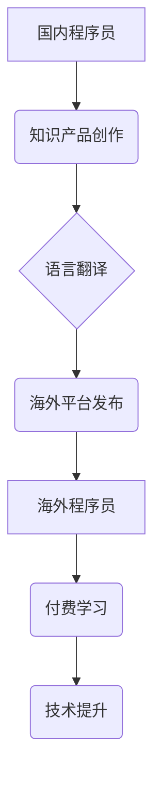

                 

## 程序员如何进行知识付费的国际化

> 关键词：知识付费、程序员、国际化、海外市场、内容创作、营销策略、平台选择

### 1. 背景介绍

随着互联网的发展和全球化趋势的加速，知识付费市场蓬勃发展，程序员作为技术人才，也逐渐成为知识付费的参与者和受益者。国内知识付费市场已初具规模，但程序员知识付费的国际化发展才刚刚起步。

**1.1 程序员知识付费现状**

国内程序员知识付费市场主要以在线课程、书籍、博客、视频教程等形式存在，内容涵盖编程语言、软件开发、算法设计、架构设计等多个领域。一些优秀的程序员通过知识付费获得了丰厚的回报，也帮助了更多人提升技术水平。

**1.2 国际化发展机遇**

全球技术人才需求不断增长，程序员知识付费的国际化发展机遇巨大。海外市场对高质量的编程技术知识有强烈需求，而国内程序员拥有丰富的技术经验和创作能力，可以为海外市场提供优质的知识产品。

**1.3 国际化发展挑战**

程序员知识付费的国际化发展也面临着一些挑战，例如语言障碍、文化差异、市场竞争激烈等。

### 2. 核心概念与联系

**2.1 知识付费的核心概念**

知识付费是指以知识、技能、经验等为核心内容，通过付费的方式向用户提供学习、提升和服务的商业模式。

**2.2 程序员知识付费的国际化**

程序员知识付费的国际化是指将国内程序员的知识产品和服务拓展到海外市场，以满足海外程序员的学习需求。

**2.3 国际化发展架构**



### 3. 核心算法原理 & 具体操作步骤

**3.1 算法原理概述**

程序员知识付费的国际化发展需要遵循一定的算法原理，例如：

* **内容本地化:** 将知识产品内容翻译成目标语言，并根据目标市场的文化背景进行调整。
* **营销精准化:** 通过数据分析和市场调研，精准定位目标用户群体，制定有效的营销策略。
* **平台选择:** 选择合适的海外平台发布知识产品，并根据平台规则进行运营。

**3.2 算法步骤详解**

1. **市场调研:** 对目标海外市场进行深入调研，了解当地程序员的学习需求、付费意愿、文化背景等。
2. **内容创作:** 根据市场调研结果，创作高质量的知识产品，并进行语言翻译和文化本地化。
3. **平台选择:** 选择合适的海外平台发布知识产品，例如 Udemy、Coursera、Skillshare 等。
4. **营销推广:** 通过多种营销渠道，例如社交媒体、搜索引擎优化、付费广告等，推广知识产品。
5. **用户运营:** 提供优质的用户服务，及时解决用户问题，建立良好的用户关系。

**3.3 算法优缺点**

* **优点:** 可以有效提高知识产品的海外市场竞争力，扩大知识付费的影响范围。
* **缺点:** 需要投入较多的时间和资源进行市场调研、内容创作、平台运营等工作。

**3.4 算法应用领域**

程序员知识付费的国际化算法可以应用于各种编程技术领域，例如：

* **前端开发:** HTML、CSS、JavaScript 等。
* **后端开发:** Python、Java、PHP 等。
* **移动开发:** Android、iOS 等。
* **数据科学:** Python、R 等。

### 4. 数学模型和公式 & 详细讲解 & 举例说明

**4.1 数学模型构建**

程序员知识付费的国际化发展可以构建一个数学模型，例如：

* **市场规模:**  M = P * C * R
    * P: 目标海外市场程序员数量
    * C: 程序员对知识付费的意愿
    * R: 平均付费金额

* **竞争强度:** K = N / M
    * N: 目标海外市场知识付费平台数量

**4.2 公式推导过程**

* 市场规模公式推导: 
    * 假设目标海外市场有 P 个程序员，其中 C% 的程序员愿意付费学习，平均每个程序员愿意付费 R 美元，则市场规模 M 为 P * C * R。
* 竞争强度公式推导:
    * 竞争强度 K 是平台数量 N 与市场规模 M 的比值，反映了目标海外市场知识付费平台的竞争程度。

**4.3 案例分析与讲解**

假设目标海外市场有 100 万程序员，其中 20% 的程序员愿意付费学习，平均每个程序员愿意付费 10 美元，则市场规模为 100 万 * 0.2 * 10 = 200 万美元。如果目标海外市场有 10 个知识付费平台，则竞争强度为 10 / 200 万 = 0.005，表示竞争相对较低。

### 5. 项目实践：代码实例和详细解释说明

**5.1 开发环境搭建**

* 操作系统: Windows/macOS/Linux
* 编程语言: Python
* 开发工具: VS Code/PyCharm
* 框架: Flask/Django

**5.2 源代码详细实现**

```python
from flask import Flask, render_template

app = Flask(__name__)

@app.route('/')
def index():
    return render_template('index.html')

if __name__ == '__main__':
    app.run(debug=True)
```

**5.3 代码解读与分析**

* 该代码实现了一个简单的Flask web应用，用于展示知识付费平台的首页。
* `app = Flask(__name__)` 创建了一个Flask应用实例。
* `@app.route('/')` 定义了首页路由，当访问根路径 '/' 时，会执行 `index()` 函数。
* `index()` 函数渲染 `index.html` 模板文件，展示首页内容。

**5.4 运行结果展示**

运行该代码后，在浏览器中访问 `http://127.0.0.1:5000/`，即可看到知识付费平台的首页。

### 6. 实际应用场景

**6.1 海外市场拓展**

程序员知识付费平台可以将平台拓展到海外市场，例如美国、欧洲、东南亚等，为海外程序员提供优质的编程技术知识服务。

**6.2 语言支持**

知识付费平台可以支持多种语言，例如英语、西班牙语、日语等，方便不同国家和地区的程序员学习。

**6.3 内容多样化**

知识付费平台可以提供多种类型的知识产品，例如在线课程、书籍、视频教程、直播课程等，满足不同程序员的学习需求。

**6.4 未来应用展望**

未来，程序员知识付费的国际化发展将更加深入，例如：

* **人工智能技术应用:** 利用人工智能技术，为程序员提供个性化的学习推荐和学习路径。
* **虚拟现实技术应用:** 利用虚拟现实技术，打造沉浸式的编程学习体验。
* **区块链技术应用:** 利用区块链技术，保障知识产权和交易安全。

### 7. 工具和资源推荐

**7.1 学习资源推荐**

* **Coursera:** https://www.coursera.org/
* **Udemy:** https://www.udemy.com/
* **Skillshare:** https://www.skillshare.com/

**7.2 开发工具推荐**

* **VS Code:** https://code.visualstudio.com/
* **PyCharm:** https://www.jetbrains.com/pycharm/

**7.3 相关论文推荐**

* **The Economics of Online Education**
* **The Future of Work: How Technology Will Transform the Workplace**

### 8. 总结：未来发展趋势与挑战

**8.1 研究成果总结**

程序员知识付费的国际化发展具有巨大的潜力，但同时也面临着一些挑战。通过深入研究市场需求、优化内容创作、选择合适的平台和营销策略，可以有效推动程序员知识付费的国际化发展。

**8.2 未来发展趋势**

未来，程序员知识付费的国际化发展将更加智能化、个性化和多元化。人工智能技术、虚拟现实技术和区块链技术将为程序员知识付费带来新的机遇和挑战。

**8.3 面临的挑战**

* **语言障碍:** 不同国家和地区的语言差异，需要进行有效的翻译和文化本地化。
* **文化差异:** 不同国家和地区的文化背景差异，需要进行相应的文化适应。
* **市场竞争:** 海外市场竞争激烈，需要不断创新和提升产品质量。

**8.4 研究展望**

未来研究可以关注以下几个方面：

* **人工智能技术在程序员知识付费中的应用研究**
* **虚拟现实技术在程序员知识付费中的应用研究**
* **区块链技术在程序员知识付费中的应用研究**
* **程序员知识付费的国际化发展模式研究**

### 9. 附录：常见问题与解答

**9.1 如何进行知识付费平台的国际化推广？**

* **目标市场调研:** 深入了解目标海外市场的程序员群体、学习需求、付费意愿等。
* **内容本地化:** 将知识产品内容翻译成目标语言，并根据目标市场的文化背景进行调整。
* **平台选择:** 选择合适的海外平台发布知识产品，并根据平台规则进行运营。
* **营销推广:** 通过多种营销渠道，例如社交媒体、搜索引擎优化、付费广告等，推广知识产品。

**9.2 如何保障知识产权？**

* **知识产权登记:** 将知识产品进行知识产权登记，获得法律保护。
* **版权声明:** 在知识产品中添加版权声明，明确知识产权归属。
* **技术防范:** 利用技术手段，例如加密、水印等，防止知识产品被盗版。


作者：禅与计算机程序设计艺术 / Zen and the Art of Computer Programming 
<end_of_turn>

