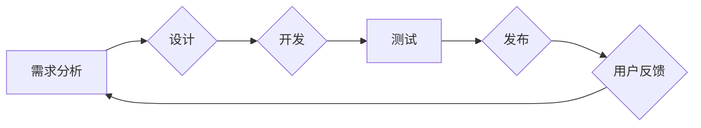

                 

## 管理者的思维敏捷度训练

> 关键词：敏捷思维、管理者、技术决策、团队协作、迭代开发、适应性、创新

### 1. 背景介绍

在当今瞬息万变的科技时代，传统的管理模式已难以适应快速发展的市场需求和技术迭代。敏捷思维，作为一种强调灵活、迭代和协作的管理理念，逐渐成为企业应对挑战、实现持续创新的关键。对于IT领域的管理者而言，敏捷思维的训练尤为重要，因为它直接关系到团队效率、项目成功率和企业竞争力。

传统的管理模式往往以计划为主导，强调预先制定详细的计划并严格执行。然而，在科技领域，变化无常，技术迭代速度快，市场需求也时刻在演变。这种僵化的管理模式难以适应这种动态环境，容易导致项目落后于时代，无法满足用户需求。

敏捷思维则强调灵活性和适应性。它倡导以迭代的方式进行开发，不断收集用户反馈，并根据反馈进行调整和改进。这种方式能够帮助团队快速响应市场变化，不断优化产品，提高用户满意度。

### 2. 核心概念与联系

敏捷思维的核心概念包括：

* **迭代开发:** 将项目分解成多个小的迭代周期，每个周期都包含需求分析、设计、开发、测试和发布等环节。
* **用户反馈:** 持续收集用户反馈，并将其融入到开发过程中，确保产品能够满足用户需求。
* **团队协作:** 强调团队成员之间的协作和沟通，共同完成项目目标。
* **持续改进:** 持续反思和改进开发流程，提高团队效率和产品质量。

**Mermaid 流程图:**

### 3. 核心算法原理 & 具体操作步骤

敏捷思维本身不是一种算法，而是一种管理理念和方法论。它通过一系列的实践和工具来帮助团队提高效率和适应性。

**3.1 算法原理概述**

敏捷思维的核心原理是基于以下几个方面：

* **快速响应变化:** 敏捷思维强调快速响应市场变化和用户需求，通过迭代开发和持续改进的方式，不断优化产品。
* **团队协作:** 敏捷思维强调团队成员之间的协作和沟通，共同完成项目目标。
* **透明度和可视化:** 敏捷思维强调项目进度和状态的透明度和可视化，以便团队成员能够及时了解项目进展和潜在问题。

**3.2 算法步骤详解**

敏捷思维的具体操作步骤通常包括以下几个阶段：

* **项目启动:** 团队成员共同确定项目目标、范围和优先级。
* **需求分析:** 团队收集用户需求，并将其转化为可实现的功能点。
* **迭代规划:** 将项目分解成多个小的迭代周期，每个周期都包含明确的需求、目标和时间范围。
* **开发和测试:** 团队成员按照迭代计划进行开发和测试，并定期进行代码审查和测试演示。
* **用户反馈和迭代:** 团队收集用户反馈，并根据反馈进行产品调整和改进。
* **项目发布:** 完成所有迭代后，团队将产品发布到市场。

**3.3 算法优缺点**

**优点:**

* 能够快速响应市场变化和用户需求。
* 提高团队协作和沟通效率。
* 能够降低项目风险，提高项目成功率。

**缺点:**

* 需要团队成员具备较高的沟通和协作能力。
* 需要团队能够快速适应变化，并做出灵活的决策。
* 需要投入更多的资源和时间进行迭代开发和测试。

**3.4 算法应用领域**

敏捷思维广泛应用于软件开发、产品设计、项目管理等领域。

### 4. 数学模型和公式 & 详细讲解 & 举例说明

敏捷思维本身并不依赖于特定的数学模型和公式。然而，一些数学模型和统计方法可以帮助团队更好地理解和管理敏捷开发过程。

**4.1 数学模型构建**

例如，可以使用**Burn-down chart**来追踪项目进度和剩余工作量。Burn-down chart是一个图表，显示项目剩余工作量随时间的变化趋势。

**4.2 公式推导过程**

Burn-down chart的构建过程并不需要复杂的数学公式，主要依赖于团队成员对项目任务的估算和实际完成情况的记录。

**4.3 案例分析与讲解**

假设一个团队正在开发一个软件项目，项目总任务量为100个工作单元。团队成员根据任务复杂度进行估算，并将其分配到不同的迭代周期中。

在每个迭代周期结束时，团队会记录完成的工作量，并将剩余工作量更新到Burn-down chart中。通过观察Burn-down chart的趋势，团队可以了解项目进展情况，并及时调整开发计划。

### 5. 项目实践：代码实例和详细解释说明

敏捷开发实践通常使用一些特定的工具和框架，例如Scrum、Kanban等。

**5.1 开发环境搭建**

具体开发环境搭建取决于所选用的敏捷开发框架和项目需求。

**5.2 源代码详细实现**

源代码实现取决于具体的项目需求和技术选择。

**5.3 代码解读与分析**

代码解读和分析需要根据具体的代码结构和功能进行。

**5.4 运行结果展示**

运行结果展示需要根据项目的具体功能和预期效果进行。

### 6. 实际应用场景

敏捷思维在IT领域广泛应用于以下场景：

* **软件开发:** 敏捷开发方法论，如Scrum和Kanban，被广泛应用于软件开发项目中，帮助团队提高开发效率和产品质量。
* **产品设计:** 敏捷思维可以帮助产品设计团队快速响应用户反馈，并不断迭代改进产品设计。
* **项目管理:** 敏捷项目管理方法可以帮助项目经理更好地管理项目进度、风险和资源。

**6.4 未来应用展望**

随着科技发展和市场需求的变化，敏捷思维将继续演进和发展，并应用于更多领域。例如，在人工智能、云计算等领域，敏捷思维将帮助团队更快地开发和部署创新技术。

### 7. 工具和资源推荐

**7.1 学习资源推荐**

* **书籍:** 《敏捷软件开发》
* **网站:** Scrum Alliance, Agile Manifesto

**7.2 开发工具推荐**

* **项目管理工具:** Jira, Trello
* **代码版本控制工具:** Git, GitHub

**7.3 相关论文推荐**

* **The Agile Manifesto**
* **Scrum: A Pocket Guide**

### 8. 总结：未来发展趋势与挑战

**8.1 研究成果总结**

敏捷思维已经成为一种成熟的管理理念和方法论，并在IT领域取得了显著的成功。

**8.2 未来发展趋势**

未来，敏捷思维将继续演进和发展，并应用于更多领域。

**8.3 面临的挑战**

敏捷思维的实施需要团队成员具备一定的技能和意识，因此，如何提高团队成员的敏捷思维能力是一个重要的挑战。

**8.4 研究展望**

未来研究可以关注敏捷思维在不同领域和行业的应用，以及如何更好地将敏捷思维与其他管理理念和方法相结合。

### 9. 附录：常见问题与解答

**常见问题:**

* **敏捷思维适合所有类型的项目吗？**

**解答:** 敏捷思维更适合于需求变化频繁、迭代开发模式的项目。

* **如何才能有效地实施敏捷思维？**

**解答:** 需要团队成员具备一定的技能和意识，并选择合适的敏捷开发框架和工具。

* **敏捷思维的实施会带来哪些挑战？**

**解答:** 需要团队成员适应新的工作方式，并克服一些传统的管理模式带来的阻碍。

作者：禅与计算机程序设计艺术 / Zen and the Art of Computer Programming 
<end_of_turn>

