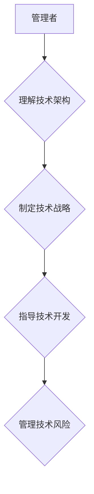

                 

## 经典著作:管理者构筑知识体系

> 关键词：知识体系、管理者、技术架构、决策支持、学习路径、持续进化、实践经验

## 1. 背景介绍

在当今瞬息万变的科技时代，管理者面临着前所未有的挑战。信息爆炸、技术迭代加速、市场竞争激烈，都要求管理者具备更强的洞察力、决策能力和适应能力。而构建完善的知识体系，则是管理者提升自身能力、应对挑战的关键。

传统的管理知识体系往往侧重于管理学理论、组织行为学等宏观层面的知识，缺乏对技术发展趋势、新兴技术应用等微观层面的深入理解。这使得管理者在面对技术驱动变革时，难以准确把握方向，做出有效的决策。

## 2. 核心概念与联系

**2.1 知识体系的构建**

知识体系的构建是一个系统性的过程，需要从以下几个方面入手：

* **明确目标:**  管理者需要明确构建知识体系的目的是什么，是为了更好地理解技术发展趋势，还是为了提升自身决策能力，还是为了更好地指导团队工作？
* **确定范围:**  知识体系的范围应该涵盖哪些领域？是只关注本行业的技术发展，还是需要了解更广泛的科技领域？
* **选择资源:**  如何获取高质量的知识资源？可以参考行业报告、学术论文、技术博客、专家访谈等多种渠道。
* **进行结构化:**  将获取到的知识进行分类、整理、归纳，构建一个逻辑清晰、层次分明、易于理解的知识体系。

**2.2 管理者与技术架构的联系**

技术架构是企业数字化转型的重要基础，它决定了企业的技术能力、业务效率和竞争力。管理者需要对技术架构有深入的理解，才能更好地制定技术战略、指导技术开发和管理技术风险。

**Mermaid 流程图**

## 3. 核心算法原理 & 具体操作步骤

**3.1 算法原理概述**

算法是解决特定问题的步骤或规则，是计算机程序的核心。管理者需要了解一些常用的算法原理，例如排序算法、搜索算法、数据结构等，以便更好地理解技术方案、评估技术方案的优劣和指导技术开发。

**3.2 算法步骤详解**

以排序算法为例，常见的排序算法包括冒泡排序、插入排序、快速排序等。每个算法都有其独特的步骤和逻辑，管理者需要了解这些步骤和逻辑，才能理解算法的原理和优缺点。

**3.3 算法优缺点**

不同的算法具有不同的时间复杂度、空间复杂度和稳定性等特点。管理者需要根据实际需求选择合适的算法，并了解算法的优缺点，以便做出更合理的决策。

**3.4 算法应用领域**

算法广泛应用于各个领域，例如搜索引擎、推荐系统、图像识别、自然语言处理等。管理者需要了解算法在不同领域的应用，以便更好地理解技术发展趋势和把握市场机会。

## 4. 数学模型和公式 & 详细讲解 & 举例说明

**4.1 数学模型构建**

数学模型是抽象化现实世界问题的工具，可以帮助管理者进行定量分析和预测。例如，可以使用数学模型来预测市场需求、评估投资风险、优化资源配置等。

**4.2 公式推导过程**

在构建数学模型时，需要根据实际问题，选择合适的数学公式和变量，并进行推导和验证。例如，可以使用线性回归模型来预测市场需求，公式如下：

$$y = a + bx$$

其中，y表示市场需求，x表示相关因素，a和b是模型参数。

**4.3 案例分析与讲解**

可以使用实际案例来分析和讲解数学模型的应用。例如，可以使用线性回归模型来预测某个产品的销量，并根据预测结果进行库存管理和营销策略调整。

## 5. 项目实践：代码实例和详细解释说明

**5.1 开发环境搭建**

管理者需要了解基本的编程语言和开发工具，以便进行项目实践。例如，可以使用Python语言和Jupyter Notebook环境进行数据分析和模型构建。

**5.2 源代码详细实现**

可以使用代码实例来展示算法的实现过程。例如，可以使用Python语言实现冒泡排序算法，并进行代码解读和分析。

**5.3 代码解读与分析**

需要对代码进行详细解读和分析，解释代码的逻辑、算法步骤和时间复杂度等。

**5.4 运行结果展示**

需要展示代码的运行结果，并进行分析和解释。例如，可以展示冒泡排序算法对不同数据序列的排序效果。

## 6. 实际应用场景

**6.1 技术决策支持**

管理者可以利用构建的知识体系，对技术方案进行评估和选择，做出更明智的技术决策。

**6.2 团队技术指导**

管理者可以将知识体系传递给团队成员，提升团队的技术能力和协作效率。

**6.3 持续学习与进化**

管理者需要不断学习新的技术知识，更新和完善自己的知识体系，才能适应科技发展带来的挑战和机遇。

**6.4 未来应用展望**

随着人工智能、大数据等技术的快速发展，管理者需要更加深入地理解这些技术，并将其应用于管理实践中，才能更好地应对未来挑战。

## 7. 工具和资源推荐

**7.1 学习资源推荐**

* **书籍:** 《计算机程序设计艺术》、《算法导论》、《深入理解计算机系统》等
* **在线课程:** Coursera、edX、Udacity等平台提供丰富的计算机科学课程
* **技术博客:** Hacker News、Medium、GitHub等平台上有许多优秀的技术博客

**7.2 开发工具推荐**

* **编程语言:** Python、Java、C++等
* **开发环境:** Jupyter Notebook、VS Code、Eclipse等
* **数据库:** MySQL、MongoDB、PostgreSQL等

**7.3 相关论文推荐**

* **人工智能:** 《深度学习》、《强化学习原理与算法》
* **大数据:** 《大数据技术与应用》、《分布式计算》

## 8. 总结：未来发展趋势与挑战

**8.1 研究成果总结**

构建管理者知识体系是一个持续探索和完善的过程，需要不断积累实践经验、学习新技术、更新知识结构。

**8.2 未来发展趋势**

未来，管理者知识体系将更加注重人工智能、大数据、云计算等新兴技术的应用，并更加注重跨学科融合和个性化定制。

**8.3 面临的挑战**

管理者知识体系的构建面临着信息爆炸、技术迭代加速、知识更新速度快等挑战，需要管理者不断学习和适应。

**8.4 研究展望**

未来，需要更加深入地研究管理者知识体系的构建方法、评估标准和应用场景，并探索如何利用人工智能等技术，帮助管理者更有效地构建和管理自己的知识体系。

## 9. 附录：常见问题与解答

**9.1 如何选择合适的知识资源？**

选择知识资源时，需要考虑资源的权威性、可靠性、时效性和相关性。可以参考行业报告、学术论文、专家访谈等多种渠道。

**9.2 如何进行知识体系的结构化？**

可以根据知识的类别、层次、关联性等进行结构化，构建一个逻辑清晰、层次分明、易于理解的知识体系。

**9.3 如何保持知识体系的持续更新？**

需要定期回顾和更新知识体系，关注新技术发展趋势、学习新知识、吸收新经验。

作者：禅与计算机程序设计艺术 / Zen and the Art of Computer Programming 
<end_of_turn>

