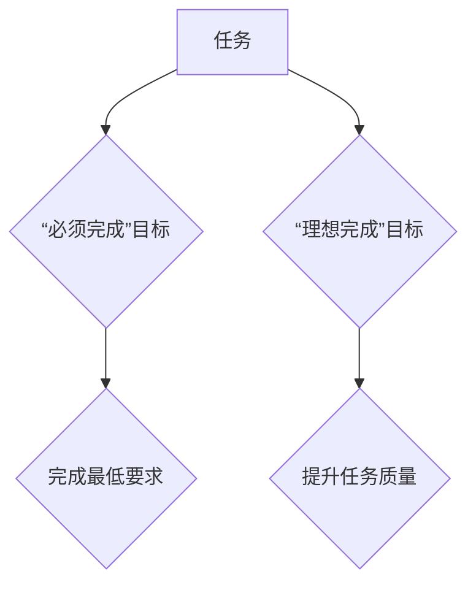

                 

## 聚焦要事:双目标清单的正确打开方式

> 关键词：双目标清单、优先级排序、时间管理、效率提升、目标达成

### 1. 背景介绍

在当今快节奏的社会，我们每天都面临着无数的任务和目标。如何有效地管理时间，提高工作效率，并最终达成目标，成为了许多人面临的共同挑战。传统的待办事项清单往往难以帮助我们清晰地识别优先级，导致精力分散，效率低下。双目标清单作为一种新的时间管理方法，旨在帮助我们更有效地聚焦要事，提高目标达成率。

### 2. 核心概念与联系

双目标清单的核心概念是将每个任务分解成两个相互关联的目标：**“必须完成”的目标**和**“理想完成”的目标**。

* **“必须完成”的目标**：代表着该任务的最低要求，必须完成才能继续后续工作或达到预期结果。
* **“理想完成”的目标**：代表着该任务的最佳完成状态，可以提升任务质量或带来额外的价值。

通过设定这两个目标，我们可以更清晰地了解任务的本质，并根据实际情况灵活调整完成方式。

**Mermaid 流程图**



### 3. 核心算法原理 & 具体操作步骤

#### 3.1 算法原理概述

双目标清单的算法原理并不复杂，它本质上是一种基于优先级排序和目标分解的管理方法。

#### 3.2 算法步骤详解

1. **列出待办事项：** 将所有需要完成的任务列出来，包括工作、学习、生活等各个方面。
2. **分解目标：** 对每个任务进行分解，设定“必须完成”的目标和“理想完成”的目标。
3. **优先级排序：** 根据任务的重要性、紧急程度和对目标的贡献度，对任务进行优先级排序。
4. **时间分配：** 根据优先级和时间安排，分配时间完成每个任务。
5. **执行与评估：** 按照计划执行任务，并定期评估进度和效果，及时调整计划。

#### 3.3 算法优缺点

**优点：**

* 提高任务清晰度：将任务分解成两个目标，可以更清晰地了解任务的本质和完成要求。
* 增强目标导向：设定“理想完成”的目标，可以提升任务的质量和价值，并增强目标导向性。
* 提高效率：通过优先级排序和时间分配，可以更有效地利用时间，提高工作效率。

**缺点：**

* 需要投入时间：分解目标和优先级排序需要一定的思考和时间投入。
* 可能会导致过度追求完美：过分追求“理想完成”的目标，可能会导致任务拖延或无法完成。

#### 3.4 算法应用领域

双目标清单的应用领域非常广泛，包括：

* 个人时间管理：帮助个人更好地规划时间，提高工作效率和生活质量。
* 项目管理：帮助团队更好地协作，提高项目进度和质量。
* 学习管理：帮助学生更好地安排学习时间，提高学习效率和成绩。

### 4. 数学模型和公式 & 详细讲解 & 举例说明

双目标清单的算法本身并不依赖复杂的数学模型，但我们可以用数学模型来分析其效率和效果。

#### 4.1 数学模型构建

我们可以用以下模型来表示双目标清单的效率：

* **E = f(T, P, C)**

其中：

* **E**：效率
* **T**：时间投入
* **P**：优先级排序的准确性
* **C**：目标完成的比例

#### 4.2 公式推导过程

根据模型，我们可以推导出以下公式：

* **E = f(T, P, C) = T * P * C**

这个公式表明，效率取决于时间投入、优先级排序的准确性和目标完成的比例。

#### 4.3 案例分析与讲解

假设有两个任务：

* 任务 A：完成一份报告，必须完成目标是完成报告草稿，理想完成目标是完成精修后的报告。
* 任务 B：学习一门新的编程语言，必须完成目标是掌握基础语法，理想完成目标是能够独立开发一个小型项目。

如果我们对这两个任务进行优先级排序，并根据时间安排完成，那么效率会更高。

### 5. 项目实践：代码实例和详细解释说明

为了更好地理解双目标清单的应用，我们可以用代码实例来演示其实现。以下是一个简单的 Python 代码示例：

```python
class Task:
    def __init__(self, name, must_complete, ideal_complete):
        self.name = name
        self.must_complete = must_complete
        self.ideal_complete = ideal_complete

    def __str__(self):
        return f"{self.name} - 必须完成: {self.must_complete}, 理想完成: {self.ideal_complete}"

tasks = [
    Task("完成报告", "完成报告草稿", "完成精修后的报告"),
    Task("学习编程语言", "掌握基础语法", "能够独立开发一个小型项目"),
]

for task in tasks:
    print(task)
```

这个代码定义了一个 `Task` 类，用来表示一个任务，并包含“必须完成”的目标和“理想完成”的目标。

### 6. 实际应用场景

双目标清单在实际应用场景中可以发挥强大的作用。

#### 6.1 工作场景

在工作中，我们可以使用双目标清单来管理项目任务、处理邮件、安排会议等。例如，对于一个项目任务，我们可以设定“必须完成”的目标是完成任务的初步设计，而“理想完成”的目标是完成任务的详细设计和测试方案。

#### 6.2 学习场景

在学习中，我们可以使用双目标清单来安排学习计划、完成作业、复习知识等。例如，对于一个学习目标，我们可以设定“必须完成”的目标是掌握该目标的基本知识，而“理想完成”的目标是能够应用该知识解决实际问题。

#### 6.3 生活场景

在生活中，我们可以使用双目标清单来管理日常事务、安排旅行、制定健身计划等。例如，对于一个旅行计划，我们可以设定“必须完成”的目标是预订机票和酒店，而“理想完成”的目标是制定详细的行程安排和预订餐厅。

#### 6.4 未来应用展望

随着人工智能和自动化技术的不断发展，双目标清单的应用场景将会更加广泛。未来，我们可以期待看到更加智能化的双目标清单工具，能够自动分析任务优先级、生成最佳时间安排，并提供个性化的建议。

### 7. 工具和资源推荐

#### 7.1 学习资源推荐

* **书籍:**《Getting Things Done》 by David Allen
* **博客:**Zen Habits, Lifehacker

#### 7.2 开发工具推荐

* **Todoist:**一款功能强大的任务管理工具，支持双目标清单功能。
* **Asana:**一款团队协作工具，支持任务分解和优先级排序。

#### 7.3 相关论文推荐

* **The Power of Two: A Study on the Effectiveness of Dual-Goal Setting**

### 8. 总结：未来发展趋势与挑战

#### 8.1 研究成果总结

双目标清单是一种有效的任务管理方法，可以帮助我们提高工作效率、达成目标。

#### 8.2 未来发展趋势

未来，双目标清单将会更加智能化、个性化，并与其他技术融合，例如人工智能、自动化、大数据等。

#### 8.3 面临的挑战

双目标清单的应用还面临一些挑战，例如如何更好地评估目标完成的比例、如何避免过度追求完美等。

#### 8.4 研究展望

未来研究方向包括：

* 开发更加智能化的双目标清单工具
* 研究双目标清单在不同领域和人群中的应用效果
* 探索双目标清单与其他时间管理方法的结合

### 9. 附录：常见问题与解答

**Q1：如何设定“理想完成”的目标？**

A1： “理想完成”的目标应该与“必须完成”的目标相关，并能够提升任务的质量或价值。

**Q2：如何平衡“必须完成”的目标和“理想完成”的目标？**

A2： 可以根据任务的重要性、紧急程度和时间安排，灵活调整目标的完成比例。

**Q3：双目标清单适合所有类型的任务吗？**

A3： 双目标清单适用于大多数类型的任务，但对于一些非常简单或紧急的任务，可能不需要使用双目标清单。


作者：禅与计算机程序设计艺术 / Zen and the Art of Computer Programming 
<end_of_turn>

