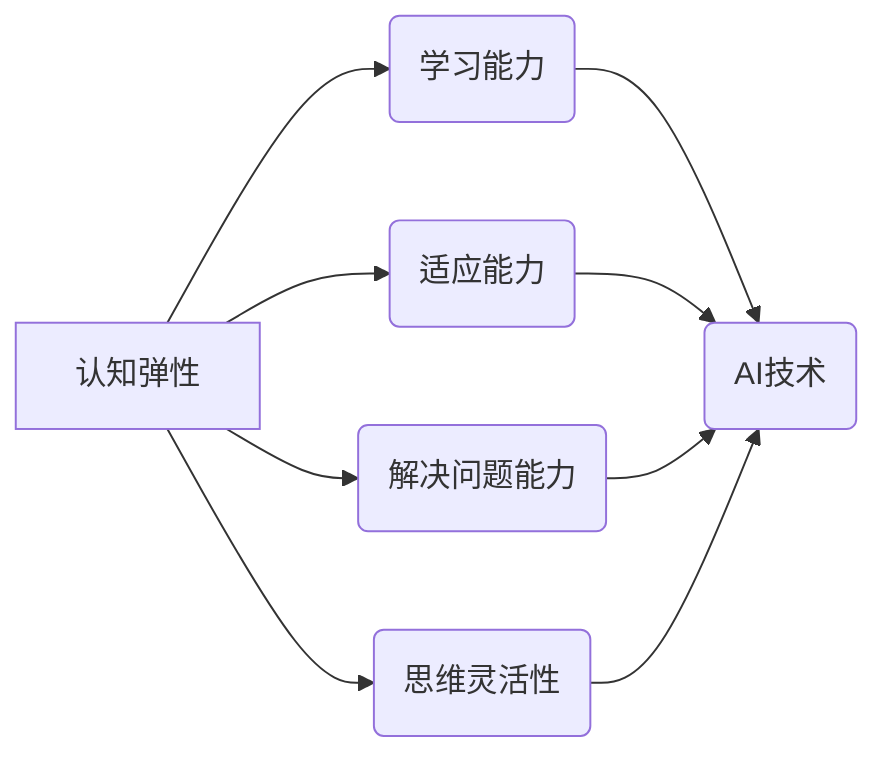

                 

## 认知弹性训练：AI时代的思维适应力培养

> 关键词：认知弹性、AI、机器学习、深度学习、思维适应力、学习方法、未来趋势

### 1. 背景介绍

人工智能（AI）的快速发展正在深刻地改变着我们的世界。从自动驾驶汽车到个性化医疗，AI技术正在各个领域展现出强大的应用潜力。然而，这种飞速的技术进步也给人类带来了新的挑战，其中之一就是思维适应力。

随着AI技术的日益成熟，人类面临着越来越多的需要快速学习和适应新知识和技能的场景。传统的学习方法可能难以跟上AI发展速度，因此培养认知弹性，即适应新知识和环境的能力，变得尤为重要。

认知弹性训练旨在帮助人们提高学习能力、解决问题的能力和适应变化的能力，从而在AI时代更好地生存和发展。

### 2. 核心概念与联系

**2.1 认知弹性**

认知弹性是指个体在面对新的信息、挑战或环境变化时，能够灵活调整思维模式、学习新知识、改变行为模式的能力。它是一个多维度的概念，包括以下几个方面：

* **学习能力:** 快速吸收和理解新信息的能力。
* **适应能力:** 适应新的环境和挑战的能力。
* **解决问题的能力:** 运用已有知识和技能解决新问题的能力。
* **思维灵活性:** 能够从不同的角度思考问题，跳出固有思维模式的能力。

**2.2 AI与认知弹性**

AI技术的进步正在改变着人类的工作方式、生活方式和学习方式。AI可以帮助我们自动化重复性任务，解放出更多时间和精力去学习和思考。同时，AI也带来了新的挑战，例如：

* **技术更新速度快:** AI技术发展迅速，需要不断学习新的知识和技能。
* **工作岗位变化:** AI自动化可能会导致一些工作岗位消失，需要适应新的职业需求。
* **信息爆炸:** AI时代信息量巨大，需要提高筛选和处理信息的能力。

为了应对这些挑战，培养认知弹性变得更加重要。

**2.3 认知弹性训练**

认知弹性训练旨在通过特定的方法和练习，帮助人们提高认知弹性。这些方法包括：

* **元认知训练:** 提高自我意识，了解自己的学习方式和思维模式。
* **思维训练:** 练习跳出固有思维模式，从不同的角度思考问题。
* **学习策略训练:** 学习有效的学习方法和技巧，提高学习效率。
* **环境刺激:** 创造新的学习环境，挑战自己的舒适区。

**2.4 核心概念关系图**



### 3. 核心算法原理 & 具体操作步骤

**3.1 算法原理概述**

认知弹性训练的核心算法原理是基于神经科学和认知心理学的研究成果，旨在通过模拟大脑学习和适应的过程，帮助人们提高认知能力。

这些算法通常包括以下几个步骤：

* **数据收集:** 收集用户的学习行为数据，例如学习时间、学习内容、学习效率等。
* **模型训练:** 利用机器学习算法，训练一个能够预测用户学习能力和适应能力的模型。
* **个性化推荐:** 根据用户的学习数据和模型预测，推荐个性化的学习内容和训练计划。
* **反馈和调整:** 收集用户的反馈信息，不断调整模型和训练计划，提高训练效果。

**3.2 算法步骤详解**

1. **数据采集:** 使用传感器、日志记录等方式收集用户的学习行为数据。
2. **数据预处理:** 对收集到的数据进行清洗、转换和特征提取，以便于模型训练。
3. **模型选择:** 选择合适的机器学习算法，例如深度神经网络、支持向量机等，用于训练模型。
4. **模型训练:** 利用训练数据，训练模型，使其能够预测用户的学习能力和适应能力。
5. **模型评估:** 使用测试数据评估模型的性能，例如准确率、召回率等。
6. **个性化推荐:** 根据用户的学习数据和模型预测，推荐个性化的学习内容和训练计划。
7. **反馈和调整:** 收集用户的反馈信息，例如学习效果、满意度等，并根据反馈信息调整模型和训练计划。

**3.3 算法优缺点**

**优点:**

* **个性化:** 可以根据用户的学习数据和需求，提供个性化的学习方案。
* **高效:** 可以帮助用户更高效地学习和掌握新知识。
* **可持续:** 可以不断根据用户的反馈信息进行调整，提高训练效果。

**缺点:**

* **数据依赖:** 需要大量的用户学习行为数据才能训练出有效的模型。
* **算法复杂:** 训练和评估模型需要一定的技术难度。
* **伦理问题:** 需要考虑数据隐私和算法公平性等伦理问题。

**3.4 算法应用领域**

* **教育:** 个性化学习、智能辅导、学习评估等。
* **企业培训:** 员工技能提升、知识管理、人才培养等。
* **个人成长:** 提升学习能力、解决问题能力、适应能力等。

### 4. 数学模型和公式 & 详细讲解 & 举例说明

**4.1 数学模型构建**

认知弹性训练的数学模型通常基于神经网络架构，例如多层感知机（MLP）或卷积神经网络（CNN）。这些模型可以学习用户学习行为数据中的复杂模式，并预测用户的学习能力和适应能力。

**4.2 公式推导过程**

神经网络的训练过程基于梯度下降算法，其目标是找到模型参数，使得模型预测结果与实际结果之间的误差最小化。

损失函数通常用于衡量模型预测结果与实际结果之间的误差。常见的损失函数包括均方误差（MSE）和交叉熵损失（Cross-Entropy Loss）。

梯度下降算法通过计算损失函数对模型参数的梯度，并根据梯度方向更新模型参数，从而逐步降低损失函数的值。

**4.3 案例分析与讲解**

假设我们有一个训练模型预测用户学习编程能力的案例。

* **输入数据:** 用户的学习时间、学习内容、学习效率等。
* **输出数据:** 用户的编程能力水平。

我们可以使用一个多层感知机模型，其输入层接收用户学习行为数据，隐藏层进行特征提取和学习，输出层预测用户编程能力水平。

通过训练数据，模型会学习到用户学习行为数据与编程能力水平之间的关系，并能够预测新用户的编程能力水平。

### 5. 项目实践：代码实例和详细解释说明

**5.1 开发环境搭建**

* Python 3.x
* TensorFlow 或 PyTorch 深度学习框架
* Jupyter Notebook 或 VS Code 开发环境

**5.2 源代码详细实现**

```python
import tensorflow as tf

# 定义模型结构
model = tf.keras.models.Sequential([
    tf.keras.layers.Dense(64, activation='relu', input_shape=(input_dim,)),
    tf.keras.layers.Dense(32, activation='relu'),
    tf.keras.layers.Dense(1)
])

# 编译模型
model.compile(optimizer='adam', loss='mse')

# 训练模型
model.fit(X_train, y_train, epochs=10)

# 评估模型
loss, accuracy = model.evaluate(X_test, y_test)
print('Loss:', loss)
print('Accuracy:', accuracy)
```

**5.3 代码解读与分析**

* 代码首先定义了一个多层感知机模型，包含输入层、隐藏层和输出层。
* 隐藏层使用ReLU激活函数，输出层使用线性激活函数。
* 模型使用Adam优化器和均方误差损失函数进行训练。
* 训练过程使用训练数据进行迭代训练，直到达到预设的 epochs 数。
* 训练完成后，使用测试数据评估模型的性能。

**5.4 运行结果展示**

训练完成后，可以查看模型的损失值和准确率，评估模型的训练效果。

### 6. 实际应用场景

**6.1 教育领域**

* 个性化学习平台: 根据学生的学习进度和能力，推荐个性化的学习内容和练习题。
* 智能辅导系统: 提供实时反馈和指导，帮助学生解决学习难题。
* 学习评估系统: 通过分析学生的学习行为数据，评估学生的学习能力和掌握程度。

**6.2 企业培训领域**

* 员工技能提升: 根据员工的岗位需求和职业发展目标，提供个性化的培训方案。
* 知识管理系统: 建立知识库，并通过AI技术帮助员工快速查找和理解相关知识。
* 人才培养计划: 通过分析员工的学习能力和潜力，制定个性化的职业发展计划。

**6.3 个人成长领域**

* 学习方法训练: 通过AI技术，帮助用户找到适合自己的学习方法和技巧。
* 思维训练工具: 提供各种思维训练游戏和练习，帮助用户提高思维灵活性。
* 适应能力提升: 通过模拟不同的场景和挑战，帮助用户提高适应能力。

**6.4 未来应用展望**

随着AI技术的不断发展，认知弹性训练将有更广泛的应用场景。

* **沉浸式学习:** 利用虚拟现实和增强现实技术，创造更加沉浸式的学习环境。
* **脑机接口:** 通过脑机接口技术，直接读取用户的脑电信号，实现更精准的认知弹性训练。
* **个性化医疗:** 利用认知弹性训练技术，帮助患者提高认知功能，改善生活质量。


### 7. 工具和资源推荐

**7.1 学习资源推荐**

* **书籍:**
    * 《深度学习》 - Ian Goodfellow, Yoshua Bengio, Aaron Courville
    * 《机器学习》 - Tom Mitchell
* **在线课程:**
    * Coursera: 深度学习 Specialization
    * edX: Artificial Intelligence
* **开源项目:**
    * TensorFlow: https://www.tensorflow.org/
    * PyTorch: https://pytorch.org/

**7.2 开发工具推荐**

* **Python:** https://www.python.org/
* **Jupyter Notebook:** https://jupyter.org/
* **VS Code:** https://code.visualstudio.com/

**7.3 相关论文推荐**

* **《Attention Is All You Need》:** https://arxiv.org/abs/1706.03762
* **《BERT: Pre-training of Deep Bidirectional Transformers for Language Understanding》:** https://arxiv.org/abs/1810.04805

### 8. 总结：未来发展趋势与挑战

**8.1 研究成果总结**

认知弹性训练的研究取得了显著进展，已经开发出多种有效的算法和工具，并在教育、企业培训和个人成长等领域取得了应用成功。

**8.2 未来发展趋势**

* **更精准的个性化训练:** 利用更先进的AI算法和数据分析技术，实现更精准的个性化训练。
* **更沉浸式的学习体验:** 利用虚拟现实和增强现实技术，创造更沉浸式的学习体验。
* **脑机接口的应用:** 利用脑机接口技术，实现更直接的认知弹性训练。

**8.3 面临的挑战**

* **数据隐私和安全:** 认知弹性训练需要收集大量的用户学习行为数据，需要解决数据隐私和安全问题。
* **算法公平性:** 确保算法公平公正，避免对特定群体造成歧视。
* **伦理问题:** 需要考虑认知弹性训练带来的伦理问题，例如对人类自主性的影响。

**8.4 研究展望**

未来，认知弹性训练的研究将继续深入，探索更有效的训练方法和应用场景，帮助人们更好地适应AI时代带来的挑战和机遇。

### 9. 附录：常见问题与解答

**9.1 如何提高认知弹性？**

* **保持好奇心:** 积极探索新知识和新事物。
* **挑战自我:** 尝试新的学习方法和挑战性的任务。
* **培养批判性思维:** 质疑现有观点，从不同的角度思考问题。
* **保持学习习惯:** 持续学习，不断更新知识和技能。

**9.2 认知弹性训练的安全性？**

认知弹性训练的安全性取决于具体的训练方法和工具。选择正规的平台和工具，并注意保护个人数据隐私。

**9.3 认知弹性训练对每个人都有用吗？**

认知弹性训练可以帮助大多数人提高学习能力和适应能力，但效果因人而异。


作者：禅与计算机程序设计艺术 / Zen and the Art of Computer Programming 
<end_of_turn>

